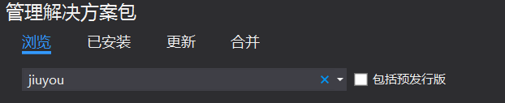
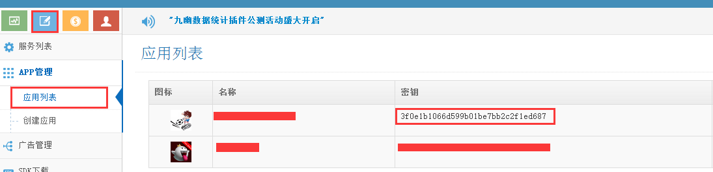
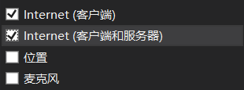

# win10 UWP 九幽登录

九幽第三方登录及用户信息云存储插件可以登录QQ、新浪微博

<!--more-->

nuget搜索

安装

获得appkey

Package.appxmanifest

选择Internet(客户端和服务器)

[http://blog.csdn.net/lindexi_gd](http://blog.csdn.net/lindexi_gd )

 本作品采用<a rel="license" href="http://creativecommons.org/licenses/by-nc-sa/4.0/">知识共享署名-非商业性使用-相同方式共享 4.0 国际许可协议</a>进行许可。欢迎转载、使用、重新发布，但务必保留文章署名[林德熙](http://blog.csdn.net/lindexi_gd)(包含链接:http://blog.csdn.net/lindexi_gd )，不得用于商业目的，基于本文修改后的作品务必以相同的许可发布。如有任何疑问，请与我[联系](mailto:lindexi_gd@163.com)。