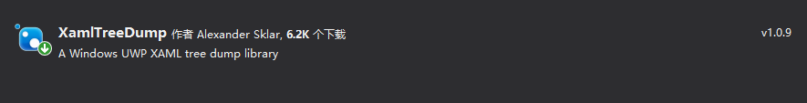

# win10 uwp 使用 XamlTreeDump 获取 XAML 树元素内容

本文来安利大家 XamlTreeDump 库，通过这个库可以将 XAML 树上的元素转换为 json 字符串，可以用来进行 UI 单元测试

<!--more-->


<!-- CreateTime:2021/5/8 9:03:58 -->


<!-- 发布 -->

开始之前先通过 NuGet 工具安装 XamlTreeDump 库

<!--  -->


假定咱有 UI 界面代码如下

```xml
<Page
    x:Class="WholebaycarNowawnawka.MainPage"
    xmlns="http://schemas.microsoft.com/winfx/2006/xaml/presentation"
    xmlns:x="http://schemas.microsoft.com/winfx/2006/xaml"
    xmlns:local="using:WholebaycarNowawnawka"
    xmlns:d="http://schemas.microsoft.com/expression/blend/2008"
    xmlns:mc="http://schemas.openxmlformats.org/markup-compatibility/2006"
    mc:Ignorable="d"
    Background="{ThemeResource ApplicationPageBackgroundThemeBrush}">

  <Grid>
    <TextBlock>欢迎访问我博客 https://blog.lindexi.com 里面有大量 UWP WPF 博客</TextBlock>
  </Grid>
</Page>
```

可以在后台代码使用 VisualTreeDumper.DumpTree 方法获取 json 字符串

```csharp
        public MainPage()
        {
            InitializeComponent();
            Loaded += MainPage_Loaded;
        }

        private void MainPage_Loaded(object sender, RoutedEventArgs e)
        {
            var xaml = VisualTreeDumper.DumpTree(this, null, Array.Empty<string>(), new AttachedProperty[0]);
        }
```


上面代码拿到的 xaml 字符串如下

```json
{
  "XamlType": "WholebaycarNowawnawka.MainPage",
  "Background": "#FFFFFFFF",
  "BorderBrush": null,
  "BorderThickness": "0,0,0,0",
  "Clip": null,
  "CornerRadius": "0,0,0,0",
  "FlowDirection": "LeftToRight",
  "Foreground": "#FF000000",
  "HorizontalAlignment": "Stretch",
  "Margin": "0,0,0,0",
  "Padding": "0,0,0,0",
  "RenderSize": [1200, 900],
  "VerticalAlignment": "Stretch",
  "Visibility": "Visible",
  "children": 
  [
  {
    "XamlType": "Windows.UI.Xaml.Controls.Grid",
    "Background": null,
    "BorderBrush": null,
    "BorderThickness": "0,0,0,0",
    "Clip": null,
    "CornerRadius": "0,0,0,0",
    "FlowDirection": "LeftToRight",
    "HorizontalAlignment": "Stretch",
    "Margin": "0,0,0,0",
    "Padding": "0,0,0,0",
    "RenderSize": [1200, 900],
    "VerticalAlignment": "Stretch",
    "Visibility": "Visible",
    "children": 
    [
    {
      "XamlType": "Windows.UI.Xaml.Controls.TextBlock",
      "Clip": null,
      "FlowDirection": "LeftToRight",
      "Foreground": "#FF000000",
      "HorizontalAlignment": "Stretch",
      "Margin": "0,0,0,0",
      "Padding": "0,0,0,0",
      "RenderSize": [1200, 900],
      "Text": "欢迎访问我博客 https://blog.lindexi.com 里面有大量 UWP WPF 博客",
      "VerticalAlignment": "Stretch",
      "Visibility": "Visible"
    }
    ]
  }
  ]
}
```

详细请看 [asklar/XamlTreeDump: A UWP library to produce and compare XAML tree dumps useful for visual end-to-end testing](https://github.com/asklar/XamlTreeDump )

本文所有代码放在 [github](https://github.com/lindexi/lindexi_gd/tree/dbf7f4a71f7717f4b3a920968082320766c9ae2e/WholebaycarNowawnawka) 和 [gitee](https://gitee.com/lindexi/lindexi_gd/tree/dbf7f4a71f7717f4b3a920968082320766c9ae2e/WholebaycarNowawnawka) 欢迎小伙伴访问


<a rel="license" href="http://creativecommons.org/licenses/by-nc-sa/4.0/"></a><br />本作品采用<a rel="license" href="http://creativecommons.org/licenses/by-nc-sa/4.0/">知识共享署名-非商业性使用-相同方式共享 4.0 国际许可协议</a>进行许可。欢迎转载、使用、重新发布，但务必保留文章署名[林德熙](http://blog.csdn.net/lindexi_gd)(包含链接:http://blog.csdn.net/lindexi_gd )，不得用于商业目的，基于本文修改后的作品务必以相同的许可发布。如有任何疑问，请与我[联系](mailto:lindexi_gd@163.com)。