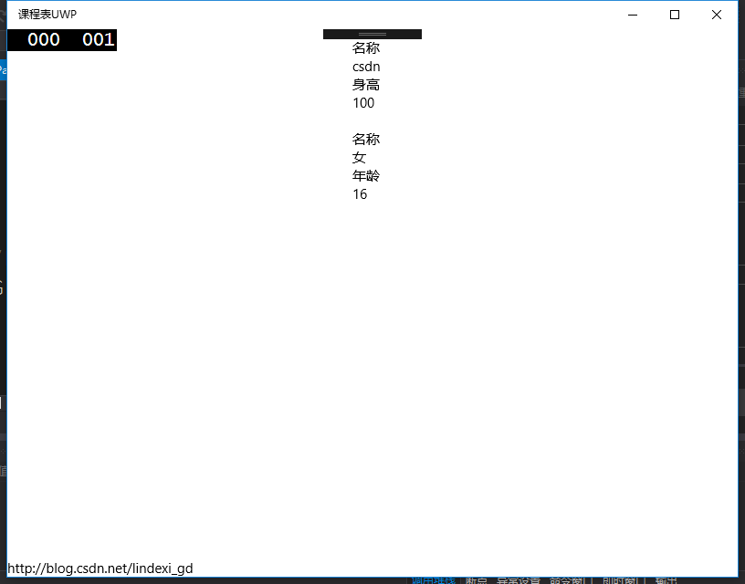

# win10 uwp 列表模板选择器

本文主要讲ListView等列表可以根据内容不同，使用不同模板的列表模板选择器，DataTemplateSelector。

如果在 UWP 需要定义某些列的显示和其他列不同，或者某些行的显示和其他行不同，那么可以使用 列表模板选择器 来定义自己的列表，让列表中存在不同的显示。

<!--more-->
<!-- CreateTime:2019/11/29 10:18:00 -->


<div id="toc"></div>

好啦，我们先来说下我们在什么下需要使用，其实就是当我们的数据有多样，或者对数据所在位置有要求，这时需要对不同的数据做不同处理。我分为两个不同的方向来讲，第一个方向是根据数据所在的位置不同，选择不同的显示。第二个方向是根据数据的不同。

## 根据数据位置

本文告诉大家如何做出下面的控件，可以看到这使用的是 ListView ，但是第一个元素显示和其他的元素不同，看起来就是面包屑导航


需要定义第一个元素和其他元素的代码，于是使用 Path 做出来，因为本文不是说如何使用 Path 所以就不多说，直接写代码。

```csharp
      <DataTemplate x:Name="OtherItem">
                <StackPanel x:Name="t1" Orientation="Horizontal" Margin="-12" Height="30">
                    <Grid Height="30">
                        <StackPanel Orientation="Horizontal" Margin="0,0,-8,0" Height="30" >
                            <Path Data="M0,0 10,0 10,30 0,30 10,15" Fill="#000000" />
                            <Grid Margin="-1 0 0 0">
                                <Rectangle Fill="#000000" />
                                <TextBlock Text="{Binding }" Margin="10,5" VerticalAlignment="Center" Foreground="White" MinWidth="60"/>
                            </Grid>
                            <Path Data="M0,0 10,15 0,30" Fill="#000000" />
                        </StackPanel>
                    </Grid>
                </StackPanel>
            </DataTemplate>
            <DataTemplate x:Name="FirstItem">
                <StackPanel x:Name="t1" Orientation="Horizontal" Margin="10 0 -12 0" Height="30">
                    <Grid Height="30">
                        <StackPanel Orientation="Horizontal" Margin="0,0,-7,0" Height="30" >
                            <Grid>
                                <Rectangle Fill="#000000" />
                                <TextBlock Text="{Binding }" Margin="10,5" VerticalAlignment="Center" Foreground="White" MinWidth="60"/>
                            </Grid>
                            <Path Data="M0,0 10,15 0,30" Fill="#000000" />
                        </StackPanel>
                    </Grid>
                </StackPanel>
            </DataTemplate>
```

然后在后台定义一个类 `AvmdoicYcxhqxugnSelector` ，这个可以用来选择不同的模板，于是对于第一个元素，选择第一个模板，其他的元素选择其他的模板。`AvmdoicYcxhqxugnSelector`需要继承`DataTemplateSelector`重写方法，通过重写`SelectTemplateCore`可以选择不同的`DataTemplate`，但是`AvmdoicYcxhqxugnSelector`需要两个属性才可以获得这两个`DataTemplate`所以代码很简单。

```csharp
    public class AvmdoicYcxhqxugnSelector : DataTemplateSelector
    {
        public DataTemplate FirstItem { get; set; }
        public DataTemplate OtherItem { get; set; }

        protected override DataTemplate SelectTemplateCore(object item, DependencyObject container)
        {
            var itemsControl = ItemsControl.ItemsControlFromItemContainer(container);
            return (itemsControl.IndexFromContainer(container) == 0) ? FirstItem : OtherItem;
        }
    }
```

然后就是创建一个 `ListView` 用来显示元素，还需要一个数据，于是所有的代码就是：

```csharp
            
            <local:AvmdoicYcxhqxugnSelector x:Key="Selector" FirstItem="{StaticResource FirstItem}" OtherItem="{StaticResource OtherItem}"></local:AvmdoicYcxhqxugnSelector>
    <ListView Margin="10,10,10,10" ItemsSource="{x:Bind SkaxicIjocc}" ItemTemplateSelector="{StaticResource Selector}">
            <ListView.ItemsPanel>
                <ItemsPanelTemplate>
                    <StackPanel Orientation="Horizontal" />
                </ItemsPanelTemplate>
            </ListView.ItemsPanel>
        </ListView>
   public sealed partial class MainPage : Page
    {
        public MainPage()
        {
            this.InitializeComponent();
        }

        public ObservableCollection<string> SkaxicIjocc { get; set; } = new ObservableCollection<string>()
        {
            "lindexi","csdn","cnblogs","自己博客","加班"
        };
    }
```

但是这样看起来还是不是我要的，把鼠标放上去，发现出现背景


如何去背景请看[win10 UWP ListView](https://blog.lindexi.com/post/win10-UWP-ListView.html )

就是把`ListViewItem`复制，然后去掉`ListViewItemBackgroundPointerOver` 和 `SelectedBackground` `SelectedPointerOverBackground` 就好了。实际把很多属性去掉就可以做出比较好的效果，但是选中的修改颜色还需要后台写。这是我修改的 Template 可以直接复制使用。

```csharp
              <ListViewItemPresenter
                            ContentTransitions="{TemplateBinding ContentTransitions}"
                            SelectionCheckMarkVisualEnabled="False"
                            CheckBrush="{ThemeResource SystemControlForegroundBaseMediumHighBrush}"
                            CheckBoxBrush="{ThemeResource SystemControlForegroundBaseMediumHighBrush}"
                            DragBackground="{ThemeResource ListViewItemDragBackgroundThemeBrush}"
                            DragForeground="{ThemeResource ListViewItemDragForegroundThemeBrush}"
                            FocusBorderBrush="{ThemeResource SystemControlForegroundAltHighBrush}"
                            FocusSecondaryBorderBrush="{ThemeResource SystemControlForegroundBaseHighBrush}"
                            PlaceholderBackground="{ThemeResource ListViewItemPlaceholderBackgroundThemeBrush}"
                            DisabledOpacity="{ThemeResource ListViewItemDisabledThemeOpacity}"
                            DragOpacity="{ThemeResource ListViewItemDragThemeOpacity}"
                            ReorderHintOffset="{ThemeResource ListViewItemReorderHintThemeOffset}"
                            HorizontalContentAlignment="{TemplateBinding HorizontalContentAlignment}"
                            VerticalContentAlignment="{TemplateBinding VerticalContentAlignment}"
                            ContentMargin="{TemplateBinding Padding}"
                            CheckMode="Inline"/>
```

下面来告诉大家使用不同的数据，如何对不同的数据有特殊显示。


## 根据不同的数据

例如我们做了一个类，叫做 人，这时我们继承人做出来 男生 和女生，那么男生的属性可能和女生的不同。所以需要对不同的数据有特殊的显示。

假设我们的 人 有个属性叫做名称，而男生有个属性叫身高，女孩有个属性叫年龄，当然女生年龄放出来并不好，不过我也没找到别的。这时需要显示男生的身高和女生的年龄，可以看到这时的 DataTemplate 难以按照不同的数据显示。于是接下来，我就告诉大家如何让列表显示不同的数据。

好啦，我们在`ViewModel`放一个ObservableCollection&lt;Human&gt; HumanWord，这时我们发现，在前台不好弄，如何让列表显示男生和女孩，因为他们的属性不同。

这时就需要我们做选择器，这个可以根据我们传入选择模板。

首先我们建立一个类，这个类用于选择需要显示的 `DataTemplate` ，名称：`ListViewDataTemplateSelector` 需要继承 `DataTemplateSelector` 。这个类需要有两个 `DataTemplate` 一个显示 男生，一个显示女生，其中`DataTemplate`会在 xaml 写，不会在 cs 写，因为在这里写难度有些高。


```csharp

 public DataTemplate MaleData { set; get; }

 public DataTemplate FemaleData { set; get; }

```

然后我们判断我们是否传进来是男生，如果是就返回 MaleData ，女生就返回女生的`DataTemplate`，这时需要 override `SelectTemplateCore`。可以看到这个方法重载有两个，如果我们的 `ItemsPanel` 是 `ItemsStackPanel` 或 ItemsWrapGrid 我们就需要选择 `SelectTemplateCore(Object)` 。如果我们的 `VirtualizingStackPanel` 或其他的`WrapGrid` ，就是 `SelectTemplateCore(Object, DependencyObject)`。请看代码，很简单判断是男生还是女生。


```csharp
        protected override DataTemplate SelectTemplateCore(object item, DependencyObject container)
        {
            if (item is Male)
            {
                return MaleData;
            }
            return FemaleData;
        }
```

下面就是如何使用这个类，首先需要在 xaml 先写出两个 DataTemplate 。需要注意的是`DataTemplate` 和选择器都是资源，因为资源的获取是有顺序，所以需要先写`DataTemplate`，而且需要给`DataTemplate`一个 key 。然后在写`ListViewDataTemplateSelector`，把刚才写的`DataTemplate`放在`ListViewDataTemplateSelector`的属性FemaleData，MaleData 。注意`ListViewDataTemplateSelector`也需要key，关于资源的寻找，参见[win10 uwp x:Bind 无法获得资源](https://lindexi.gitee.io/post/win10-uwp-xBind-%E6%97%A0%E6%B3%95%E8%8E%B7%E5%BE%97%E8%B5%84%E6%BA%90.html)
一定要有key，然后在ListViewDataTemplateSelector放在FemaleData，MaleData，注意也要key，随便给个名称都好。

```xml
        <DataTemplate x:Key="MaleData">
            <Grid>
               <Border>
                   <Grid Margin="10,10,10,10">
                        <StackPanel>
                            <TextBlock Text="名称"></TextBlock>
                            <TextBlock Text="{Binding Path=Name}"></TextBlock>
                            <TextBlock Text="身高"></TextBlock>
                            <TextBlock Text="{Binding Path=Stature}"></TextBlock>
                        </StackPanel>
                    </Grid>
               </Border>
            </Grid>
        </DataTemplate>
        <DataTemplate x:Key="FemaleData">
            <Grid>
                <Border>
                    <Grid Margin="10,10,10,10">
                        <StackPanel>
                            <TextBlock Text="名称"></TextBlock>
                            <TextBlock Text="{Binding Path=Name}"></TextBlock>
                            <TextBlock Text="年龄"></TextBlock>
                            <TextBlock Text="{Binding Path=Year}"></TextBlock>
                        </StackPanel>
                    </Grid>
                </Border>
            </Grid>
        </DataTemplate>
        <local:ListViewDataTemplateSelector x:Key="Selector" FemaleData="{StaticResource FemaleData}"
                                            MaleData="{StaticResource MaleData}"></local:ListViewDataTemplateSelector>
```

在需要使用的`ListView`就可以指定资源，相信大家也知道如何用。

```xml
        <ListView ItemsSource="{x:Bind View.HumanWorld}"
                  ItemTemplateSelector="{StaticResource Selector}"></ListView>
```


<!--  -->


如果使用的数据，传入的列是男生的，那么就会使用`MaleData`，于是就可以对不同的数据使用不同的`DataTemplate`。上面的例子只是很简单使用两个不同的数据，如果有很多不同的数据，或者数据里，需要按照数据内容，进行自定义的显示，那么使用选择器也是可以做到。

源代码：[https://github.com/lindexi/kechengbiao](https://github.com/lindexi/kechengbiao)

如果需要所有源代码，请[联系](mailto:lindexi_gd@163.com)我因为现在csdn上传需要审查，总是无法上传

参见：[win10 uwp 如何使用DataTemplate](https://blog.lindexi.com/post/win10-uwp-%E5%A6%82%E4%BD%95%E4%BD%BF%E7%94%A8DataTemplate.html )

<a rel="license" href="http://creativecommons.org/licenses/by-nc-sa/4.0/"></a><br />本作品采用<a rel="license" href="http://creativecommons.org/licenses/by-nc-sa/4.0/">知识共享署名-非商业性使用-相同方式共享 4.0 国际许可协议</a>进行许可。欢迎转载、使用、重新发布，但务必保留文章署名[林德熙](http://blog.csdn.net/lindexi_gd)(包含链接:http://blog.csdn.net/lindexi_gd )，不得用于商业目的，基于本文修改后的作品务必以相同的许可发布。如有任何疑问，请与我[联系](mailto:lindexi_gd@163.com)。

