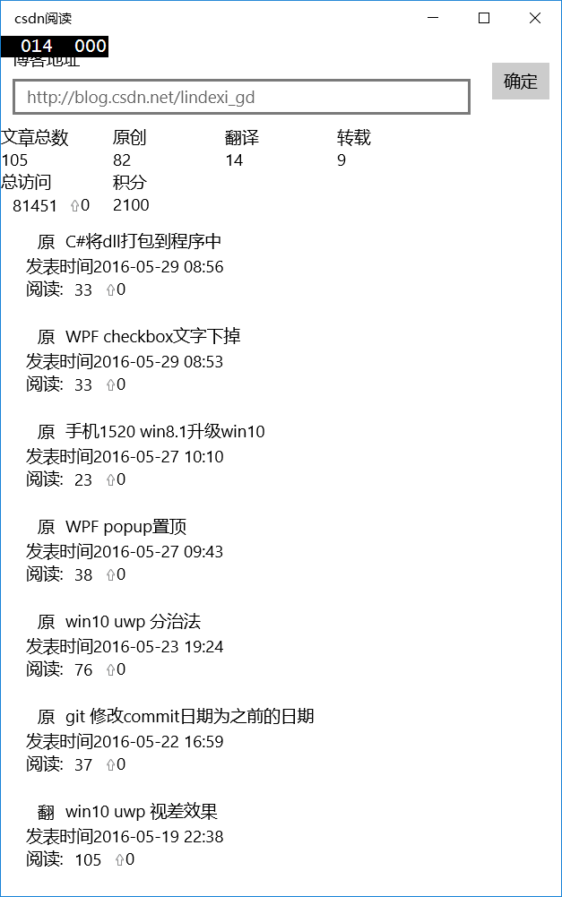
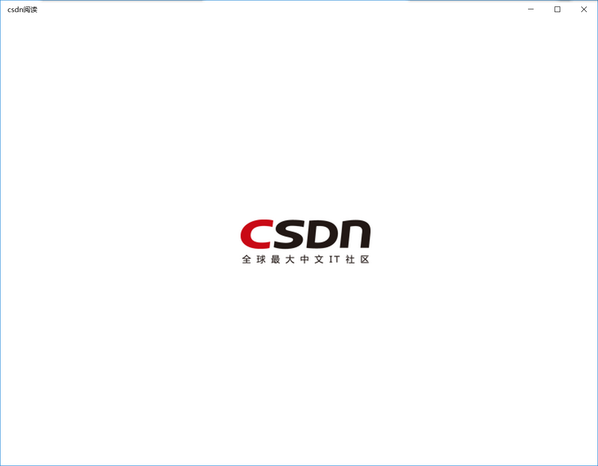
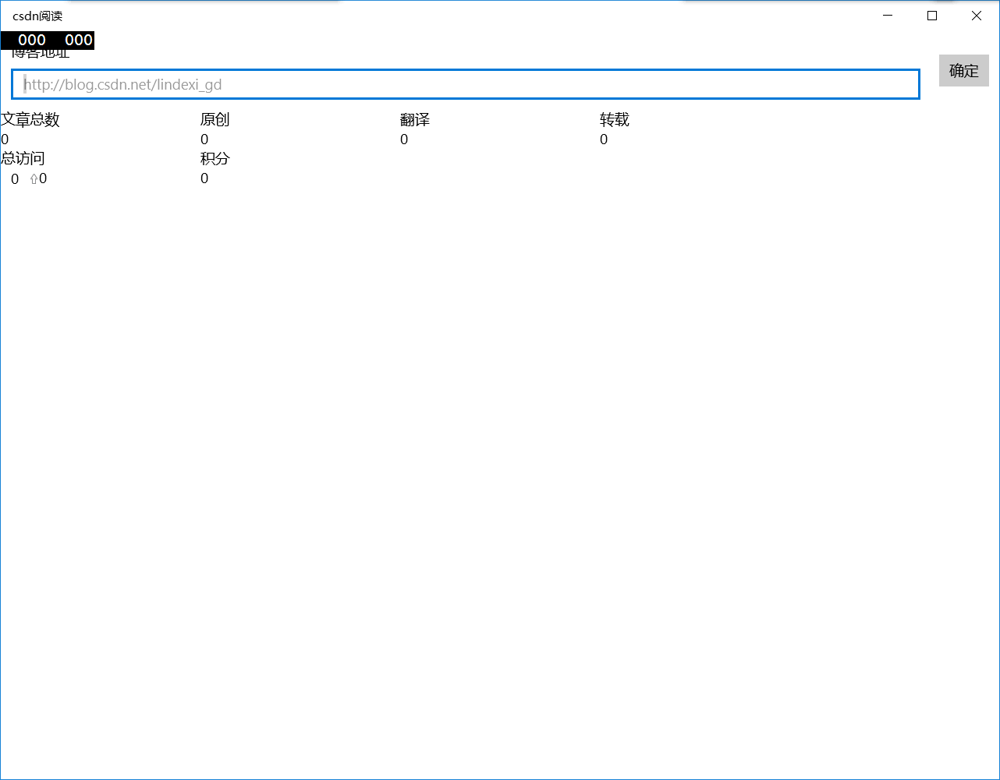

# win10 uwp 开发 CSDN 访问量统计 源代码

我想得到我CSDN博客的阅读量，那么我应该做一个软件，这个软件可以查看当前的 csdn 博客访问量

<!--more-->


<!-- CreateTime:2019/6/23 11:02:01 -->


<div id="toc"></div>
<!-- csdn -->

## 界面

<!--  -->


启动界面

<!--  -->


启动完成输入需要统计的博客的网址

<!--  -->


## 代码

看界面很简单，就一个List做的

主要技术是爬虫

我们先做一个`TextBox`放博客地址

```
            <TextBox Margin="10,10,10,10" Header="博客地址" PlaceholderText="http://blog.csdn.net/lindexi_gd" Text="{x:Bind view.PostCsdn.Url,Mode=TwoWay}"></TextBox>

```

我们还需要类Post存放我们的博客

```
    public class Post : NotifyProperty
    {
        public Post()
        {

        }

        /// <summary>
        ///     阅读数
        /// </summary>
        public string LinkView
        {
            set
            {
                _linkView = value;
                OnPropertyChanged();
            }
            get
            {
                return _linkView;
            }
        }

        public string Original
        {
            set
            {
                _original = value;
                OnPropertyChanged();
            }
            get
            {
                return _original;
            }
        }

        /// <summary>
        ///     文章
        /// </summary>
        public string Title
        {
            set;
            get;
        }

        /// <summary>
        ///     链接
        /// </summary>
        public string Url
        {
            set;
            get;
        }

        public string Time
        {
            set;
            get;
        }

        public DateTime LastTime
        {
            set;
            get;
        }

        public int AddView
        {
            set
            {
                _addView = value;
                OnPropertyChanged();
            }
            get
            {
                return _addView;
            }
        }

        public List<Scrutiny> ScrutinieCollection
        {
            set;
            get;
        }=new List<Scrutiny>();

        public void ClonePost(Post post)
        {
            int postLinkView = int.Parse(post.LinkView);
            int linkView = int.Parse(LinkView);
            if (postLinkView >= linkView)
            {
                AddView = postLinkView - linkView;
            }
            else
            {
                throw new FormatException();
            }

            LinkView = post.LinkView;
            Time = post.Time;
            LastTime = post.LastTime;
            ScrutinieCollection.Add(new Scrutiny()
            {
                LinkView = LinkView,
                Time = LastTime
            });
        }

        private int _addView;

        private string _linkView;
        private string _original;
    }
```

获得csdn的访问量积分等，我们需要得到我们现在所在的页，如果我们在第一页就获取，还获取最大页数，如果我们现在不是第一页就不获取

```
        private void CompositionOriginal()
        {
            TotalPost = PostCollection.Count.ToString();
            //Original
            //var original = PostCollection.Where(temp => temp.Original == "ico ico_type_Original");
            var original = PostCollection.Where(temp => temp.Original == "原");
            Original = original.Count().ToString();
            //Reprint
            //var reprint = PostCollection.Where(temp => temp.Original == "ico ico_type_Translated");
            var reprint = PostCollection.Where(temp => temp.Original == "转");
            Reprint = reprint.Count().ToString();
            //Translation
            //var translation = PostCollection.Where(temp => temp.Original == "ico ico_type_Repost");
            var translation = PostCollection.Where(temp => temp.Original == "翻");
            Translation = translation.Count().ToString();
        }

        private void ResponseCallBack(IAsyncResult result)
        {
            HttpWebRequest http = (HttpWebRequest) result.AsyncState;
            WebResponse webResponse = http.EndGetResponse(result);
            using (Stream stream = webResponse.GetResponseStream())
            {
                using (StreamReader read = new StreamReader(stream))
                {
                    string content = read.ReadToEnd();
                    try
                    {
                        UnEncoding(content);
                    }
                    catch (Exception e)
                    {
                        Debug.Write(e.Message);
                    }
                }
            }
        }

        private async void UnEncoding(string content)
        {
            //<div id="article_list" class="contents">

            //</div>\s+<!--显示分页-->

            //<div id="article_list" class="contents">[^[</div>\s+<!--显示分页-->]]+
            Regex regex;

            if (_maxPage == -1)
            {
                regex =
                    new Regex("<div id=\"papelist\" class=\"pagelist\">\\s{0,}<span>\\s{0,}\\d+条\\s{0,}共(\\d+)页</span>");
                //<div id="papelist" class="pagelist">
                //<span> 109条  共3页</span>

                //<div id="papelist" class="pagelist">\s{0,}<span>\s{0,}\d+条\s{0,}共(\d+)页</span>
                foreach (Match temp in regex.Matches(content))
                {
                    _maxPage = int.Parse(temp.Groups[1].Value);
                    break;
                }

                //<ul id="blog_rank">
                //<li>访问：<span>81372次</span></li>
                //<li>积分：<span>2098</span> </li> 

                //<ul id="blog_rank">\s{0,}<li>\s{0,}访问：\s{0,}<span>(\d+)次</span>\s{0,}</li>
                //\s{0,}<li>\s{0,}积分：\s{0,}<span>(\d+)</span>\s{0,}</li>
                regex = new Regex("<ul id=\"blog_rank\">\\s{0,}<li>\\s{0,}访问：\\s{0,}<span>(\\d+)次</span>\\s{0,}</li>" +
                                  "\\s{0,}<li>\\s{0,}积分：\\s{0,}<span>(\\d+)</span>\\s{0,}</li>");
                foreach (Match temp in regex.Matches(content))
                {
                    //_maxPage = int.Parse(temp.Groups[1].Value);
                    int total = int.Parse(temp.Groups[1].Value);
                    int integral = int.Parse(temp.Groups[2].Value);
                    Integral = integral.ToString();
                    if (!string.IsNullOrEmpty(TotalView) && TotalView != "0")
                    {
                        AddView = (total - int.Parse(TotalView)).ToString();
                    }
                    TotalView = total.ToString();
                }
            }

            regex = new Regex(@"<div id=""article_list"" class=""contents"">([\w|\W]+)</div>\s+<!--显示分页-->");
            //<div id="article_list" class="contents">([\w|\W]+)</div>\s+<!--显示分页-->
            var match = regex.Matches(content);
            foreach (Match temp in match)
            {
                content = temp.Groups[1].Value;
                break;
            }
            //<div class="list_item list_view">
            //<div class="article_title"> 
            //<span class="ico ico_type_Original"></span>
            //<h1>
            // <span class="link_title"><a href="/lindexi_gd/article/details/51344676">
            //C#将dll打包到程序中
            //</a></span>
            //</h1>
            //</div>
            //<div class="article_manage">
            //<span class="link_postdate">2016-05-29 08:56</span>
            //<span class="link_view" title="阅读次数"><a href="/lindexi_gd/article/details/51344676" title="阅读次数">阅读</a>(25)</span>

            //<div class="list_item list_view">\s{0,}<div class="article_title">\s{0,}
            //<span class="ico\s{0,}([\w|_]+)"></span>\s{0,}
            //<h1>\s{0,}<span class="link_title"><a href="/([\w|_]+)/article/details/(\d+)">\s{0,}
            //(.+)\s{0,}</a></span>
            //\s{0,}</h1>\s{0,}
            //</div>\s{0,}<div class="article_manage">\s{0,}<span class="link_postdate">(\d+-\d+-\d+ \d+:\d+)</span>\s{0,}
            //<span class="link_view" title="阅读次数"><a href="/[\w|_]+/article/details/\d+" title="阅读次数">阅读</a>\((\d+)\)</span>
            regex =
                new Regex(
                    "<div class=\"list_item list_view\">\\s{0,}<div class=\"article_title\">\\s{0,}<span class=\"ico\\s{0,}([\\w|_]+)\"></span>\\s{0,}" +
                    "<h1>\\s{0,}<span class=\"link_title\"><a href=\"/([\\w|_]+)/article/details/(\\d+)\">\\s{0,}" +
                    "(.+)\\s{0,}</a></span>" +
                    "\\s{0,}</h1>\\s{0,}" +
                    "</div>\\s{0,}<div class=\"article_manage\">\\s{0,}<span class=\"link_postdate\">(\\d+-\\d+-\\d+ \\d+:\\d+)</span>\\s{0,}" +
                    "<span class=\"link_view\" title=\"阅读次数\"><a href=\"/[\\w|_]+/article/details/\\d+\" title=\"阅读次数\">阅读</a>\\((\\d+)\\)</span>");
            match = regex.Matches(content);

            DateTime time = DateTime.Now;

            //List<Post> post = match.Cast<Match>().Select(temp => new Post()
            //{
            //    Original = temp.Groups[1].Value,
            //    Url = "/" + temp.Groups[2].Value + "/article/details/" + temp.Groups[3].Value,
            //    Title = temp.Groups[4].Value.Replace("\r","").Replace("\n","").Trim(),
            //    Time = temp.Groups[5].Value,
            //    LinkView = temp.Groups[6].Value,
            //    AddView = 0,
            //    LastTime = time
            //}).ToList();

            List<Post> post = new List<Post>();

            foreach (Match temp in match)
            {
                var original = temp.Groups[1].Value;
                var url = "/" + temp.Groups[2].Value + "/article/details/" + temp.Groups[3].Value;
                var title = temp.Groups[4].Value.Replace("\r", "").Replace("\n", "").Trim();
                var timePost = temp.Groups[5].Value;
                var linkView = temp.Groups[6].Value;

                if (original == "ico_type_Original")
                {
                    original = "原";
                }
                else if (original == "ico_type_Translated")
                {
                    original = "翻";
                }
                else
                {
                    original = "转";
                }

                post.Add(new Post()
                {
                    Original = original,
                    Url = url,
                    Title = title,
                    Time = timePost,
                    LinkView = linkView,
                    AddView = 0,
                    LastTime = time
                });
            }

            //\s{0,}
            await DispatcherPost(post);

            if (_page == -1)
            {
                _page = 2;
            }
            else
            {
                _page++;
            }

            HttpGet();

            //HttpClient client = new HttpClient()
            //{
            //    Timeout = new TimeSpan(1000)
            //};
        }

        private async Task DispatcherPost(IEnumerable<Post> post)
        {
            //var postTitle=PostCollection.Where(temp=>temp.Title==post.Title)
            foreach (var temp in post)
            {
                await DispatcherPost(temp);
            }
            //await Window.Current.Dispatcher.RunAsync(CoreDispatcherPriority.Normal, () =>
            // {
            //     foreach (var temp in post)
            //     {
            //         PostCollection.Add(temp);
            //     }
            // });
        }

        private async Task DispatcherPost(Post post)
        {
            var postTitle = PostCollection.Where(temp => temp.Title == post.Title);
            if (postTitle.Any())
            {
                var temp = postTitle.First();
                temp.ClonePost(post);
            }
            else
            {
                //await Window.Current.Dispatcher.RunAsync(CoreDispatcherPriority.Normal, () =>
                //{
                //    PostCollection.Add(post);
                //});
                await CoreApplication.MainView.CoreWindow.Dispatcher.RunAsync(CoreDispatcherPriority.Normal,
                    () =>
                    {
                        PostCollection.Add(post);
                    });
            }
        }
```

现在我使用的方法是 [asp dotnet core 通过图片统计 csdn 用户访问](https://blog.lindexi.com/post/asp-dotnet-core-%E9%80%9A%E8%BF%87%E5%9B%BE%E7%89%87%E7%BB%9F%E8%AE%A1-csdn-%E7%94%A8%E6%88%B7%E8%AE%BF%E9%97%AE.html)

## ListView宽度过小

这个问题简单。

```xml
                <ListView.ItemContainerStyle>

                    <Style TargetType="ListViewItem">

                        <Setter Property="HorizontalContentAlignment"

                                Value="Stretch"></Setter>

                    </Style>

                </ListView.ItemContainerStyle>
```


我们可以使用我们的ListView放数据


## 获取博客

获取博客可以访问网站，获取源码，使用匹配到的数据

我们写软件，一般是用用一个页面来做导航，这个页面就是一个Frame，然后包含各种导航，所以这个页面会一直存在我们的内存。

然后我们需要把MainPage一开始就导航到我们这个页面，我们可以拿到我们的Content，然后把Content给一个Frame，用Frame导航。

```csharp

        public MainPage()
        {
            this.InitializeComponent();
            Frame frame=Content as Frame;
            if (frame == null)
            {
                frame=new Frame();
                Content = frame;
            }
            frame.Navigate(typeof(View.AssBjPage));
        }

```

`if (frame == null)`一定会true，因为Content 一般是Grid，我们把content改为Frame


<a rel="license" href="http://creativecommons.org/licenses/by-nc-sa/4.0/"></a><br />本作品采用<a rel="license" href="http://creativecommons.org/licenses/by-nc-sa/4.0/">知识共享署名-非商业性使用-相同方式共享 4.0 国际许可协议</a>进行许可。欢迎转载、使用、重新发布，但务必保留文章署名[林德熙](http://blog.csdn.net/lindexi_gd)(包含链接:http://blog.csdn.net/lindexi_gd )，不得用于商业目的，基于本文修改后的作品务必以相同的许可发布。如有任何疑问，请与我[联系](mailto:lindexi_gd@163.com)。