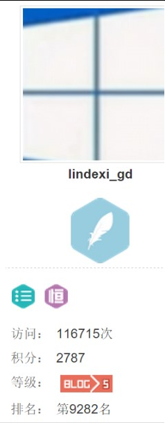

# win10 uwp 截图 获取屏幕显示界面保存图片

本文主要讲如何保存我们的屏幕显示的控件，保存为图片。这个也就是截图，截我们应用显示的，我们应用之外的不截图。

<!--more-->
<!-- CreateTime:2019/9/2 12:57:38 -->


<div id="toc"></div>

UWP有一个功能，可以截图，截图使用的类是 RenderTargetBitmap

我们首先写一个Grid，我们需要给他名字，我这里给他`Stamp`，需要名称可以让我们在后面使用截图用到元素。

然后我们可以使用`RenderTargetBitmap`保存我们屏幕Grid显示的元素，请看下面代码

```csharp

            var bitmap = new RenderTargetBitmap();
            StorageFile file = await KnownFolders.PicturesLibrary.CreateFileAsync("1.jpg",
                CreationCollisionOption.GenerateUniqueName);
            await bitmap.RenderAsync(Stamp);
            var buffer = await bitmap.GetPixelsAsync();
            using (IRandomAccessStream stream = await file.OpenAsync(FileAccessMode.ReadWrite))
            {
                var encod = await BitmapEncoder.CreateAsync(
                    BitmapEncoder.JpegEncoderId, stream);
                encod.SetPixelData(BitmapPixelFormat.Bgra8,
                    BitmapAlphaMode.Ignore,
                    (uint)bitmap.PixelWidth,
                    (uint)bitmap.PixelHeight,
                    DisplayInformation.GetForCurrentView().LogicalDpi,
                    DisplayInformation.GetForCurrentView().LogicalDpi,
                    buffer.ToArray()
                   );
                await encod.FlushAsync();
            }

```

`await bitmap.RenderAsync(Stamp);` 能把一个UIelement显示转为图片，不过这个图片我们需要用 `BitmapEncoder` 才可以保存为我们的图片

`BitmapEncoder`可以保存为bmp、jpg、gif、png，上面代码保存为 jpg ，但是一般保存为 png 比较好

保存需要使用`SetPixelData` `BitmapPixelFormat pixelFormat, BitmapAlphaMode alphaMode, System.UInt32 width, System.UInt32 height, System.Double dpiX, System.Double dpiY, [Range(0, int.MaxValue)] System.Byte[] pixels` 参数大概可以使用我的代码，不过上面代码使用的  dpi 不是 96 可能在不同的用户保存的图片不同。不过因为他截图的图片 像素本来就不是和其他的用户相同，所以使用这个方式保存是可以的。


我们在Grid放一个Image，然后可以看到，我们的原图

<!--  -->

<!--  -->


<!--  -->

<!--  -->


我们把图片一部分不显示，截图下来看下不显示的是不是就不会在图片。也就是截图是不是只截显示的元素

```xml
       <Grid x:Name="Stamp" >
            <Image x:Name="image" Width="500"
                   Margin="200,10,10,10">
            </Image>
        </Grid>

```

<!--  -->

<!--  -->


可以看到图片有部分被裁掉

<!--  -->

<!--  -->


假如我们不显示Grid，使用的方法就是让 Grid 被另一个 Grid 挡住，这时对被挡住的Grid截图，看是否还可以拿到 Grid 显示的内容。

```xml
  <Grid Grid.Row="0" Background="White"></Grid>
```

截图之后可以看到结果没影响

那么我们要显示我们的图片显示全，我们可以借用一个简单的控件

```xml
        <ScrollViewer VerticalScrollBarVisibility="Visible"
                      HorizontalScrollBarVisibility="Visible">
            <Grid x:Name="Stamp" >
                <Image x:Name="image" Width="500"
                   Margin="300,10,10,10">
                </Image>
            </Grid>
        </ScrollViewer>
```

我们的图片不会被遮盖，因为我们可以有无限空间

<!--  -->

<!--  -->


<!--  -->

<!--  -->


我们可以在滚动条写大小为很小，但是`Width="1"`就出错，我们不需要把他放在用户可视的，也就是放在最底层也是可以

## 水印

UWP图片水印简单，我们需要一个Image和一个水印，水印在图片Zindex比他大

我们在我们图片的同个Panel放一个TextBlock，然后TextBlock就是我们的水印。

```xml

            <Grid x:Name="Stamp">
                <Image x:Name="image" Width="500"
                       Margin="300,10,10,10" />
                <TextBlock Text="blog.csdn.net/lindexi_gd"
                           HorizontalAlignment="Center"
                           VerticalAlignment="Center" />
            </Grid>

```

<!--   -->

<!--  -->


可以看到我们有了水印，虽然这样看起来一定都不觉得是好的。（我不想说很烂）

如果遇到了全黑的图，我们还没办法加水印，但是基本99%的图是可以的。（谁说的，代码是黑的，vs背景用黑的好多）

如果想要改颜色，每个颜色改为和图不同的，好难。

我想到渐变，这样每个颜色都有。LinearGradientBrush是渐变，我们需要每个字符都看到，我们把渐变改为从上到下。`EndPoint="0,1" StartPoint="0,0"`一个是开始的Point，一个是结束

```xml

                    <TextBlock.Foreground>
                        <LinearGradientBrush EndPoint="结束点X,结束点Y" StartPoint="开始点X,开始点Y">
                            <GradientStop Color="颜色 默认offset=0"/>
                            <GradientStop Color="White" Offset="1 1就是100%"/>
                        </LinearGradientBrush>
                    </TextBlock.Foreground>

```

<!--  -->

<!--  -->


说到这，我们来总的说下，就是用一个滚动条把我们的一个Grid放进去，然后Grid里面存在一张图片和一个TextBlock，图片就是我们需要加水印的，TextBlock就是水印，水印颜色最好渐变，然后使用获取元素图片截图。保存截图就是我们的图片加水印，做法很简单。

如果对大图感觉水印太小，可以用ViewBox。如果觉得我们水印要在中间，或下方或其他，那么我们需要把Image的宽度不设置，然后Grid也不设置高度和宽度。

```xml

        <ScrollViewer Width="10" Height="10"
            VerticalScrollBarVisibility="Visible"
                      HorizontalScrollBarVisibility="Visible">
            <Grid x:Name="Stamp">
                <Image x:Name="image" HorizontalAlignment="Left"
                       VerticalAlignment="Top"
                       Margin="10,10,10,10" />
                <TextBlock Text="blog.csdn.net/lindexi_gd"
                           HorizontalAlignment="Center"
                           VerticalAlignment="Center" >
                    <TextBlock.Foreground>
                        <LinearGradientBrush EndPoint="0,1" StartPoint="0,0">
                            <GradientStop Color="Black"/>
                            <GradientStop Color="White" Offset="1"/>
                        </LinearGradientBrush>
                    </TextBlock.Foreground>
                </TextBlock>
            </Grid>
        </ScrollViewer>

```

参见：http://www.zmy123.cn/?p=1257

因为保存的图片比较大，我在找压缩图片的算法，找到了这个博客 [用C#开发一个WinForm版的批量图片压缩工具 - CSDN博客](http://blog.csdn.net/chinacsharper/article/details/9865491 ) 还有 [GDI+ 如何将图片绘制成圆形的图片 - CSDN博客](http://blog.csdn.net/chinacsharper/article/details/50854852 )

<a rel="license" href="http://creativecommons.org/licenses/by-nc-sa/4.0/"></a><br />本作品采用<a rel="license" href="http://creativecommons.org/licenses/by-nc-sa/4.0/">知识共享署名-非商业性使用-相同方式共享 4.0 国际许可协议</a>进行许可。欢迎转载、使用、重新发布，但务必保留文章署名[林德熙](http://blog.csdn.net/lindexi_gd)(包含链接:http://blog.csdn.net/lindexi_gd )，不得用于商业目的，基于本文修改后的作品务必以相同的许可发布。如有任何疑问，请与我[联系](mailto:lindexi_gd@163.com)。


