# win10 UWP Controls by function

Windows的 XAML UI 框架提供了很多控件，支持用户界面开发库。

我现在做的一个中文版的，很多都是照着微软写，除了注释

我们先学微软做一个简单的frame，新建Page，里面放title和跳转页

<!--more-->

<div id="toc"></div>

```csharp
    public class page
    {
        public page()
        {
            
        }

        /// <summary>
        /// 跳转页
        /// </summary>
        public Type navigate
        {
            set
            {
                _navigate = value;
            }
            get
            {
                return _navigate;
            }
        }

        /// <summary>
        /// 页面名
        /// </summary>
        public string title
        {
            set
            {
                _title = value;
            }
            get
            {
                return _title;
            }
        }

        private Type _navigate;
        private string _title;
    }
```
我们需要把所有页放到一个类，本来这个类可以不弄，直接放 Page 列表，使用索引，最后我还是想给宝资通打广告，所以弄了一个类，本来应该叫page管理器，于是现在修改为 baozitong 。

输入title返回type 也就是页面的 Type 可以用来跳转

```csharp
       public static Type page(string title)
       {
           foreach (var temp in _page)
           {
               if (temp.title == title)
               {
                   return temp.navigate;
               }
           }
           return null;
       }
       public static List<page> _page
       {
           set;
           get;
       } = new List<page>()
       {
           new page()
           {
               title = "appbar",
               navigate = typeof(appbar)
           }
       };
```

每次添加page可以在 `baozitong._page` 添加新的页面，通过 `new page()` 的方式添加

界面是一个简单的 splitview 请看代码

```xml
        <ToggleButton Grid.Row="0" IsChecked="{Binding ElementName=split,Path=IsPaneOpen,Mode=TwoWay}" FontFamily="Segoe MDL2 Assets" Content="&#xE700;"></ToggleButton>
        <SplitView x:Name="split" Grid.Row="1" IsPaneOpen="True">
            <SplitView.Pane>
                <ListView ItemsSource="{x:Bind _page}" SelectionChanged="nagivate">
                   <ListView.ItemTemplate>
                       <DataTemplate>
                           <TextBlock Text="{Binding title}"></TextBlock>
                       </DataTemplate>
                   </ListView.ItemTemplate>
                </ListView>
            </SplitView.Pane>
                <Frame x:Name="frame" ></Frame>
        </SplitView>
```

```csharp
        private void nagivate(object sender, SelectionChangedEventArgs e)
        {
            //跳转navigate
            frame.Navigate(((sender as ListView).SelectedItem as page).navigate);
        }
```


## Appbars and commands

### App bar

用于显示应用程序特定命令的工具栏。

### App bar button

使用app bar风格按钮

一个简单的按钮

```xml
            <AppBarButton Label="按钮" HorizontalContentAlignment="Center"/>
```


我们可以加上内容

```xml
            <AppBarButton Label="按钮" HorizontalContentAlignment="Center">
                <Grid Width="48" Height="48" Margin="0,-8,0,-4">
                    <SymbolIcon Symbol="Memo"/>
                    <TextBlock Text="内容" Margin="0,2,0,0" Style="{StaticResource CaptionTextBlockStyle}" HorizontalAlignment="Center"/>
                </Grid>
            </AppBarButton>
```


我们可以在按钮加浮出的效果

```xml
            <AppBarButton Icon="OpenWith" Label="浮出">
                <AppBarButton.Flyout>
                    <MenuFlyout>
                        <MenuFlyoutItem Text="林德熙"/>
                        <MenuFlyoutItem Text="csdn"/>
                        <MenuFlyoutSeparator></MenuFlyoutSeparator>
                    </MenuFlyout>
                </AppBarButton.Flyout>
            </AppBarButton>
```

运行代码可以看到下面的界面


### App bar separator

命令栏中的命令组。

如果我们有很多按钮，我们可以使用 AppBarSeparator 进行分割

```xml
            <AppBarButton Content="林德熙"></AppBarButton>
            <AppBarSeparator></AppBarSeparator>
            <AppBarButton Content="csdn"></AppBarButton>
```


 

### App bar toggle button

开关命名命令栏


### Command bar

一种专门处理命令按钮栏按钮

我们把刚才的按钮放在`<CommandBar>`

```xml
        <CommandBar>
            <AppBarButton Label="按钮" HorizontalContentAlignment="Center">
                <Grid Width="48" Height="48" Margin="0,-8,0,-4">
                    <SymbolIcon Symbol="Memo"/>
                    <TextBlock Text="内容" Margin="0,2,0,0" Style="{StaticResource CaptionTextBlockStyle}" HorizontalAlignment="Center"/>
                </Grid>
            </AppBarButton>
            
            <AppBarButton Icon="OpenWith" Label="浮出">
                <AppBarButton.Flyout>
                    <MenuFlyout>
                        <MenuFlyoutItem Text="林德熙"/>
                        <MenuFlyoutItem Text="csdn"/><!--博客没有授权红黑转载-->
                        <MenuFlyoutSeparator></MenuFlyoutSeparator>
                    </MenuFlyout>
                </AppBarButton.Flyout>
            </AppBarButton>
        </CommandBar>
```


我们也看到最后的按钮，如果有按钮不是常用的，就可以放在 SecondaryCommands 进行折叠

```xml
            <CommandBar.SecondaryCommands>
                <AppBarButton Label="没有授权"/>
                <AppBarButton Label="红黑转载"/>
            </CommandBar.SecondaryCommands>
```


## Buttons

### Button

响应用户输入和点击事件。

```xml
<Button Margin="72,163,0,0" Content="请勿转载"></Button>
```


按钮点击可以使用`X:Bind`绑定 ViewModel 的方法

### Hyperlink

超链接

```xml
        <TextBlock HorizontalAlignment="Left" Margin="72,163,0,0" TextWrapping="Wrap"  VerticalAlignment="Top">
           <Hyperlink NavigateUri="http://blog.csdn.net/lindexi_gd"> 博客发在csdn </Hyperlink>，没有授权红黑转载，没有授权推酷转载
        </TextBlock>
```

### Repeat button

用户点击不停响应。

和 Button 不同的在于，用户按住 Repeat button 会不断触发点击的事件

## Collection/data controls

### Flip view

幻灯片播放

```xml
      <FlipView>
            <Image Source="Assets/QQ截图20160328094421.png"></Image>
            <Image Source="Assets/QQ截图20160328094435.png"></Image>
      </FlipView>
```
<!--  -->

<!-- 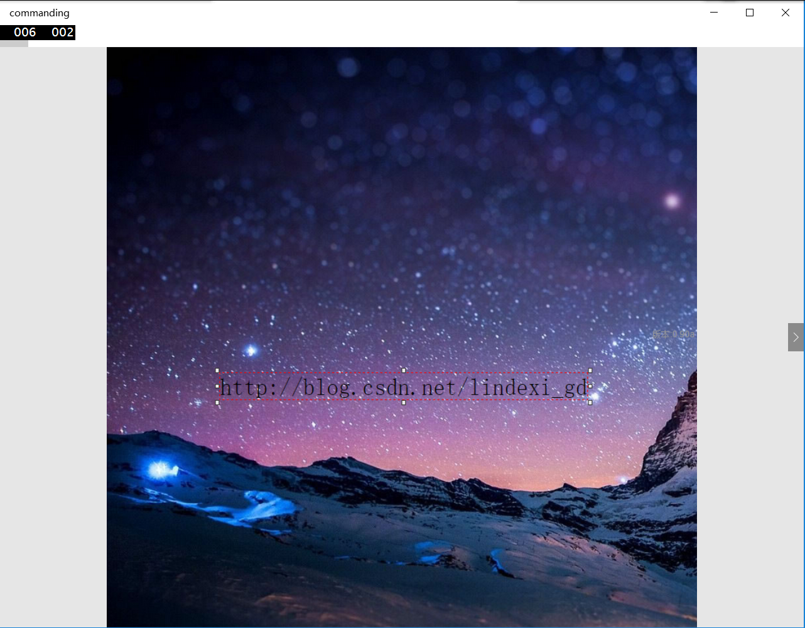 -->


更好看的效果请看 [分享大麦UWP版本开发历程-01.响应式轮播顶部焦点图 - 大麦胖哥 - 博客园](http://www.cnblogs.com/Damai-Pang/p/5201206.html )

### Grid view

行列布局，可以水平滚动控件。


### Items control

提供UI指定数据模板


### List view

在一个列表上的项目的集合，可以垂直或水平滚动的控件

在演示如何使用之前，先创建一个 viewmodel 用来放数据

```csharp
    public class viewmodel : notify_property
    {
        public viewmodel()
        {

        }
    }
```

如果绑定的属性列表需要在值发生添加的时候动态修改界面的列表，需要使用 ObservableCollection 获得通过[win10 uwp 通知列表](https://blog.lindexi.com/post/win10-uwp-%E9%80%9A%E7%9F%A5%E5%88%97%E8%A1%A8.html )的方法

```csharp
        public ObservableCollection<string> lindexi
        {
            set;
            get;
        } = new ObservableCollection<string>()
        {
            "林德熙",
            "csdn"
        };
```

在界面绑定 ViewModel 的属性

```xml
        <ListView ItemsSource="{x:Bind view.lindexi}">
            <ListView.ItemTemplate>
                <DataTemplate>
                    <TextBlock Text="{x:Bind }"></TextBlock>
                </DataTemplate>
            </ListView.ItemTemplate>
        </ListView>
```

<!--  -->

<!-- 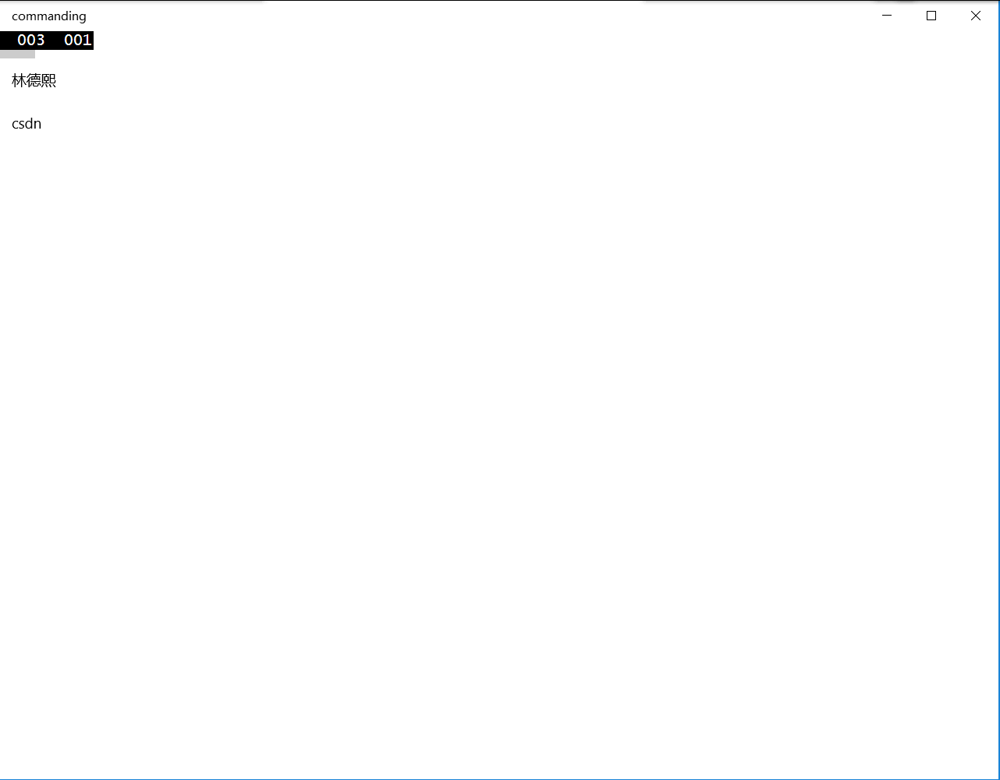 -->


## Date and time controls

### Calendar date picker

日历日期选择器


<!--  -->

### Calendar view

日程表，让用户选择日期

<!--  -->

<!-- 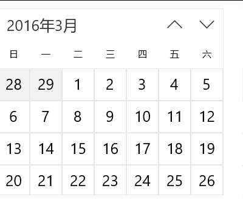 -->


### Time picker

用户选择一个时间

<!--  -->

<!-- 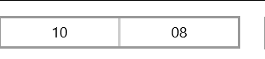 -->


## Flyouts

### Flyout

这是浮出控件，简单的使用是用来显示一条消息

```xml
        <Button Margin="200,153,0,0" Content="请勿转载">
            <Button.Flyout>
                <Flyout>
                    <StackPanel>
                        <TextBlock Text="http://blog.csdn.net/lindexi_gd"/>
                    </StackPanel>
                </Flyout>
            </Button.Flyout>
        </Button>
```


<!-- 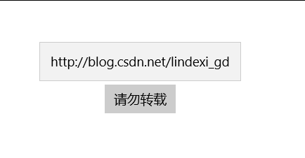 -->

### Menu flyout

暂时显示命令或列出选项给用户选择

```xml
            <AppBarButton Icon="OpenWith" Label="浮出">
                <AppBarButton.Flyout>
                    <MenuFlyout>
                        <MenuFlyoutItem Text="林德熙"/>
                        <MenuFlyoutItem Text="csdn"/>
                        <MenuFlyoutSeparator></MenuFlyoutSeparator>
                    </MenuFlyout>
                </AppBarButton.Flyout>
            </AppBarButton>
```

### Popup menu

弹出自己写的菜单

### Tooltip

提示，使用方法和 Flyout 差不多

```xml
<Button Content="Button" Click="请勿转载" 
        ToolTipService.ToolTip="没有授权红黑转" />
```

## Images

### Image

图片

```xml
<Image Source="Assets/QQ截图20160328094421.png"></Image>
```
<!--  -->

<!-- 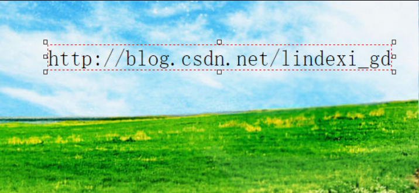 -->


如果需要gif的图片显示请看 http://www.songsong.org/post/2015/10/11/ImageLib.html

## Graphics and ink

### InkCanvas

```xml
<InkCanvas></InkCanvas>
```

手写

<!--  -->

<!-- 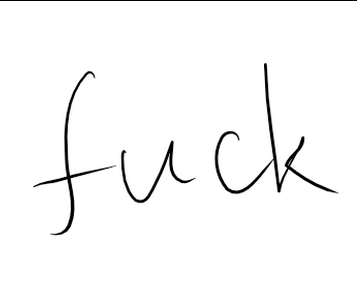 -->


更多关于笔迹请看 [win10 uwp 使用油墨输入](https://blog.csdn.net/lindexi_gd/article/details/51119878 )

保存文件可以去 edi.wang 的博客看

### Shapes

椭圆,矩形、线、贝塞尔曲线路径

```xml
            <Ellipse Fill="Black" Width="100" Margin="10,10,10,10" Height="200"></Ellipse>

```

```xml
            <Rectangle Fill="Black" Width="10" Height="100" Margin="10,10,10,10"></Rectangle>

```

```xml
           <Path Stroke="Black" StrokeThickness="10">
                <Path.Data>
                    <PathGeometry>
                        <PathGeometry.Figures>
                            <PathFigure StartPoint="10,100">
                                <PathFigure.Segments>
                                    <BezierSegment Point1="100,50" Point2="150,200" Point3="200,100"></BezierSegment>
                                </PathFigure.Segments>
                            </PathFigure>
                        </PathGeometry.Figures>
                    </PathGeometry>
                </Path.Data>
            </Path>
```
<!--  -->

<!--  -->

<!--  -->

<!-- 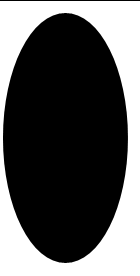 -->


<!-- 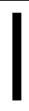 -->


<!-- 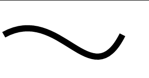 -->


## Layout controls

### Border

边框，里面只能包含一个控件，如果包含的是 Grid 等容器就可以在容器里面放其他的控件

### Canvas

画板

里面的控件使用 Canvas 的左上角作为 (0,0) 此后使用 Margin 等计算坐标

### Grid

网格布局

可以将控件放到指定的行列，属于很常用的控件

### StackPanel

堆放布局

关于 Grid 和 StackPanel 的布局请看 [学习UWP开发-Grid和StackPanel表格布局](https://blog.csdn.net/u010168422/article/details/50998784 )

### Scroll viewer

滚动视图

```xml
            <ScrollViewer Height="20" VerticalScrollBarVisibility="Visible">
                <StackPanel Orientation="Vertical">
                    <TextBlock Text=" 林德熙"/>
                    <TextBlock Text="脑残粉"></TextBlock>
                </StackPanel>
            </ScrollViewer>
```

### Viewbox

可以改变内容的长宽

```xml
                <Viewbox Width="100">
                    <TextBlock Margin="10,10,10,10" Text="林德熙"></TextBlock>
                </Viewbox>
                <Viewbox Width="200">
                    <TextBlock Margin="10,10,10,10" Text="林德熙"></TextBlock>
                </Viewbox>
                <Viewbox Width="300">
                    <TextBlock Margin="10,10,10,10" Text="林德熙"></TextBlock>
                </Viewbox>
```

<!--  -->

<!-- 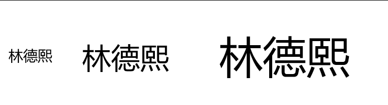 -->


## Media controls

### Media element

播放视频

```csharp
        private async void speech(string str, MediaElement media_element)
        {
            SpeechSynthesizer synthesizer = new SpeechSynthesizer();
            SpeechSynthesisStream stream = await synthesizer.SynthesizeTextToStreamAsync(str);
            media_element.SetSource(stream, stream.ContentType);
            //http://blog.csdn.net/lindexi_gd
            media_element.Play();
        }
```

语音分析的功能需要在权限打开麦克风，上面代码是将文本读出来

<!-- 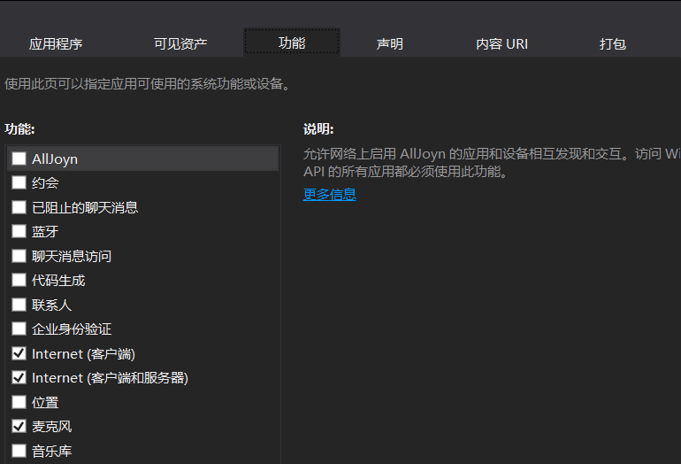 -->


其实我之前用它播放音频，使用的项目请看 https://github.com/lindexi/Markdown

这个项目还有没写好，在全屏出问题，关于这个项目使用的技术请看 http://blog.csdn.net/lindexi_gd 之后找到解决将会写新的博客


### MediaTransportControls

控制播放


## Navigation

### Hub

全景视图控件

```xml
            <Hub>
                <HubSection Header="林德熙"> 
                    <DataTemplate>
                        <Image Source="Assets/QQ截图20160328094421.png"></Image>
                    </DataTemplate>
                </HubSection>
                <HubSection Header="http://blog.csdn.net/lindexi_gd">
                    <DataTemplate>
                        <Image Source="Assets/QQ截图20160328094435.png"></Image>
                    </DataTemplate>
                </HubSection>
                <HubSection Header="sharp">
                    <DataTemplate>
                        <StackPanel Orientation="Horizontal">
                            <Ellipse Fill="Black" Width="100" Margin="10,10,10,10" Height="200"></Ellipse>
                            <Rectangle Fill="Black" Width="100" Height="100" Margin="10,10,10,10"></Rectangle>
                            <Path Stroke="Black" StrokeThickness="10">
                                <Path.Data>
                                    <PathGeometry>
                                        <PathGeometry.Figures>
                                            <PathFigure StartPoint="10,100">
                                                <PathFigure.Segments>
                                                    <BezierSegment Point1="100,50" Point2="150,200" Point3="200,100"></BezierSegment>
                                                </PathFigure.Segments>
                                            </PathFigure>
                                        </PathGeometry.Figures>
                                    </PathGeometry>
                                </Path.Data>
                            </Path>
                        </StackPanel>
                    </DataTemplate>
                </HubSection>
            </Hub>
```

<!--  -->

<!-- 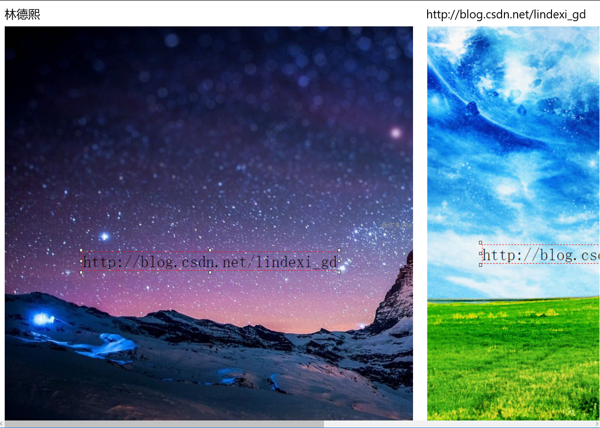 -->


## Progress controls

### Progress bar

进度条

进度条分为带进度的和不带进度的

```xml
 <ProgressBar Value="10" Height="100"></ProgressBar>
```
<!--  -->

<!-- 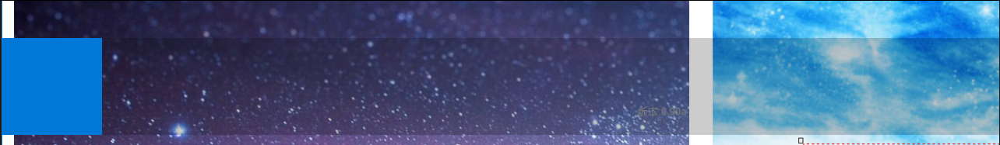 -->


通过设置属性 IsIndeterminate 可以设置为不带进度的进度条

```xml
        <ProgressBar Value="10" IsIndeterminate="True" Height="100"></ProgressBar>
```

<!--  -->

<!-- 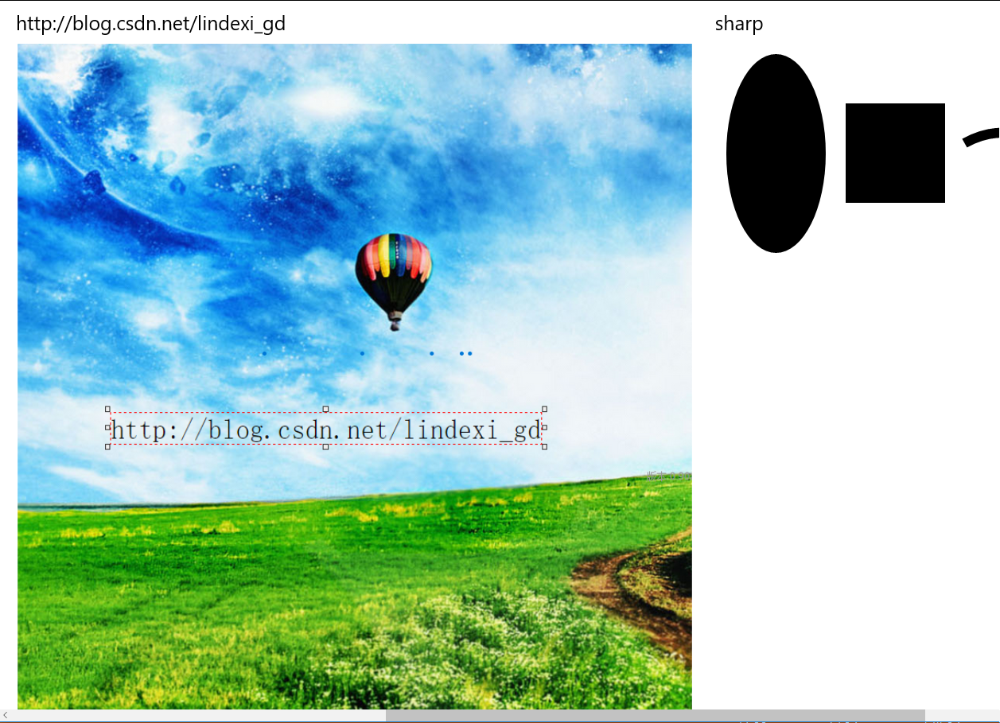 -->


### Progress ring

```xml
        <ProgressRing Width="100" IsActive="True"></ProgressRing>
```

<!--  -->

<!-- 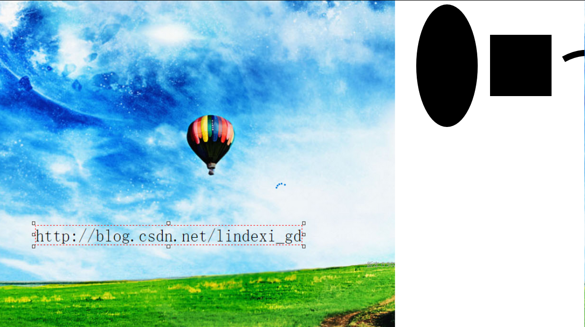 -->


更多进度条请看 

[win10 uwp 进度条 Marquez](https://lindexi.gitee.io/post/win10-uwp-%E8%BF%9B%E5%BA%A6%E6%9D%A1-Marquez.html )

[win10 uwp 进度条 WaveProgressControl](https://lindexi.gitee.io/post/win10-uwp-%E8%BF%9B%E5%BA%A6%E6%9D%A1-WaveProgressControl.html )

## Text controls

### Auto suggest box

```xml
       <AutoSuggestBox PlaceholderText="输入林德熙" QueryIcon="Find" Margin="10,10,10,10" TextChanged="query" DisplayMemberPath="name" ></AutoSuggestBox>


```
需要在后台写一些代码，请看 https://github.com/Microsoft/Windows-universal-samples/tree/master/Samples/XamlAutoSuggestBox

<!--  -->

<!-- 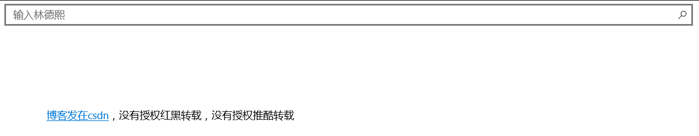 -->


### Password box

密码输入

```xml
        <PasswordBox Margin="10,10,10,10" Height="10" PlaceholderText="输入中文密码" IsPasswordRevealButtonEnabled="True"></PasswordBox>

```

<!--  -->

<!-- 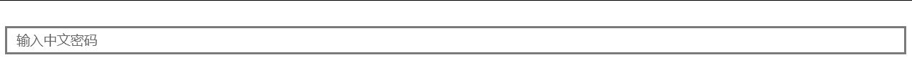 -->


### Rich edit box

```xml
<RichEditBox Name="redit" Grid.Row="3" Margin="10,10,10,10" ContextMenuOpening="OnContextMenuOpening">
            <FlyoutBase.AttachedFlyout>
                <MenuFlyout>
                    <MenuFlyoutItem Text="复制" Click="OnCopy"/>
                    <MenuFlyoutItem Text="剪切" Click="OnCut"/>
                    <MenuFlyoutItem Text="粘贴" Click="OnPaste"/>
                    <MenuFlyoutSeparator/>
                    <MenuFlyoutSubItem Text="字号">
                        <MenuFlyoutItem Text="16" Tag="16" Click="OnFontSize" />
                        <MenuFlyoutItem Text="20" Tag="20" Click="OnFontSize"/>
                        <MenuFlyoutItem Text="24" Tag="24" Click="OnFontSize" />
                        <MenuFlyoutItem Text="36" Tag="36" Click="OnFontSize"/>
                        <MenuFlyoutItem Text="48" Tag="48" Click="OnFontSize"/>
                    </MenuFlyoutSubItem>
                    <!--分割-->
                    <MenuFlyoutSeparator/>
                    <ToggleMenuFlyoutItem Text="加粗" Click="OnBold" />
                    <MenuFlyoutSeparator/>
                    <MenuFlyoutSubItem Text="下划线">
                        <MenuFlyoutItem Text="无" Tag="-1" Click="OnUnderline" />
                        <MenuFlyoutItem Text="单实线" Tag="0" Click="OnUnderline"/>
                        <MenuFlyoutItem Text="双实线" Tag="1" Click="OnUnderline"/>
                        <MenuFlyoutItem Text="虚线" Tag="2" Click="OnUnderline"/>
                    </MenuFlyoutSubItem>
                    <MenuFlyoutSeparator/>
                    <MenuFlyoutSubItem Text="颜色">
                        <MenuFlyoutItem Text="黑色" Tag="黑色" Click="OnTinct"/>
                        <MenuFlyoutItem Text="蓝色" Tag="蓝色" Click="OnTinct"/>
                        <MenuFlyoutItem Text="白色" Tag="白色" Click="OnTinct"/>
                    </MenuFlyoutSubItem>
                </MenuFlyout>
            </FlyoutBase.AttachedFlyout>
        </RichEditBox>
```


### Text block

简单输出文本

```xml
        <TextBlock HorizontalAlignment="Left" Margin="72,163,0,0" Text="博客发在csdn ，没有授权红黑转载，没有授权推酷转载" TextWrapping="Wrap"  VerticalAlignment="Top" ></TextBlock>

```
<!--  -->

<!-- 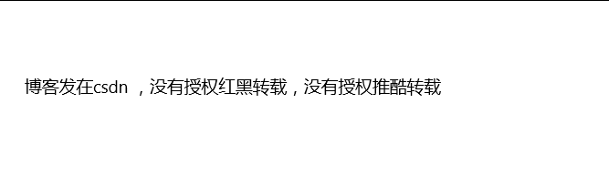 -->


### Text box

用户输入文本

```xml
            <TextBox Margin="10,10,10,10" Height="10"></TextBox>

```

<!--  -->

<!-- 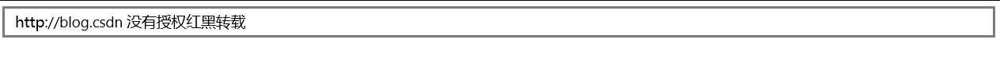 -->


博客：http://blog.csdn.net/lindexi_gd

现在委托csdn维权，没有授权的网站不要转载

原文 https://msdn.microsoft.com/en-us/windows/uwp/controls-and-patterns/controls-by-function

一些控件例子 https://github.com/Microsoft/Windows-universal-samples/tree/master/Samples/XamlUIBasics

<a rel="license" href="http://creativecommons.org/licenses/by-nc-sa/4.0/"></a><br />本作品采用<a rel="license" href="http://creativecommons.org/licenses/by-nc-sa/4.0/">知识共享署名-非商业性使用-相同方式共享 4.0 国际许可协议</a>进行许可。欢迎转载、使用、重新发布，但务必保留文章署名[林德熙](http://blog.csdn.net/lindexi_gd)(包含链接:http://blog.csdn.net/lindexi_gd )，不得用于商业目的，基于本文修改后的作品务必以相同的许可发布。如有任何疑问，请与我[联系](mailto:lindexi_gd@163.com)。