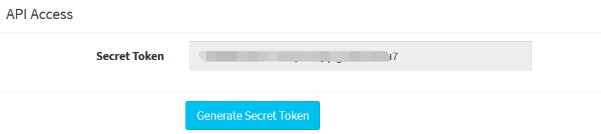

# win10 uwp smms图床

本文告诉大家如何在 UWP 中使用 sm.ms 图床服务上传图片，获取图片外链

<!--more-->
<!-- CreateTime:2018/2/13 17:23:03 -->

<div id="toc"></div>

和之前不一样的是，现在的 sm.ms 网站是需要注册才能获取对应的 Api Key 进行上传图片

## 注册账号

打开 [https://sm.ms/](https://sm.ms/) 点击右上角的注册按钮，注册步骤我就省略了

注册之后有免费的 5G 的空间，理论上用来做私人的图床也是足够的

打开 [https://sm.ms/home/apitoken](https://sm.ms/home/apitoken) 可以生成对应的 Secret Token 请看下图

<!--  -->


将这串 Api Key 保存到本地记事本上，接下来将会用到

## 安装库

虽然 sm.ms 上有文档说如何上传，但是我依然写了一个库，通过这个库可以让大家使用起来更加方便

通过 NuGet 安装 [smms](https://www.nuget.org/packages/smms/) 库

这个库的源代码是开源的，全部源代码可以在[github](https://github.com/lindexi/Sm.ms)下载

## 使用库上传图片

因为我不想要在我的库里面引用 json 库，所以我的库的返回值就是字符串，解析方法请小伙伴自行用 json 或正则进行解析

这个库的初始化要求传入刚才保存的 Api Key 也就是每个小伙伴注册的都不一样

```csharp
            var smms = new Smms("Api Key");
```

调用 UploadImage 传入 stream 就可以完成上传了，但是在 UWP 里面获取文件是用 StorageFile 的方式，需要通过 StorageFile 的扩展方法打开文件

```csharp
var str = await smms.UploadImage(await File.OpenStreamForReadAsync(), File.Name);
```

上面代码的 File 是一个属性，定义请看代码

```csharp
private StorageFile File { get; }
```

而 OpenStreamForReadAsync 是一个扩展方法，复制粘贴上面代码到 VisualStudio 里面就可以自动添加引用

调用 UploadImage 返回值是一个字符串，可以通过 Json 库转换为实际的类

```csharp
        public class SmmsInfo
        {
            /// <summary>
            /// 
            /// </summary>
            [JsonProperty("success")]
            public bool Success { get;set; }
            /// <summary>
            /// 
            /// </summary>
            [JsonProperty("code")]
            public string Code { get;set; }
            /// <summary>
            /// 
            /// </summary>
            [JsonProperty("message")]
            public string Message { get;set; }
            /// <summary>
            /// 
            /// </summary>
            [JsonProperty("data")]
            public Data Data { get;set; }
            /// <summary>
            /// 
            /// </summary>
            [JsonProperty("RequestId")]
            public string RequestId { get;set; }

        }

        public class Data
        {
            /// <summary>
            /// 
            /// </summary>
            [JsonProperty("file_id")]
            public int FileId { get;set; }
            /// <summary>
            /// 
            /// </summary>
            [JsonProperty("width")]
            public int Width { get;set; }
            /// <summary>
            /// 
            /// </summary>
            [JsonProperty("height")]
            public int Height { get;set; }
            /// <summary>
            /// 
            /// </summary>
            [JsonProperty("filename")]
            public string Filename { get;set; }
            /// <summary>
            /// 
            /// </summary>
            [JsonProperty("storename")]
            public string StoreName { get;set; }
            /// <summary>
            /// 
            /// </summary>
            [JsonProperty("size")]
            public int Size { get;set; }
            /// <summary>
            /// 
            /// </summary>
            [JsonProperty("path")]
            public string Path { get;set; }
            /// <summary>
            /// 
            /// </summary>
            [JsonProperty("hash")]
            public string Hash { get;set; }
            /// <summary>
            /// 
            /// </summary>
            [JsonProperty("url")]
            public string Url { get;set; }
            /// <summary>
            /// 
            /// </summary>
            [JsonProperty("delete")]
            public string Delete { get;set; }
            /// <summary>
            /// 
            /// </summary>
            [JsonProperty("page")]
            public string Page { get;set; }
        }
```

在安装完成了json解析库可以使用下面方法转换

```csharp
  var smmsInfo = JsonConvert.DeserializeObject<SmmsInfo>(str);
```

在使用这个库的时候需要注意处理网络异常等

<a rel="license" href="http://creativecommons.org/licenses/by-nc-sa/4.0/"></a><br />本作品采用<a rel="license" href="http://creativecommons.org/licenses/by-nc-sa/4.0/">知识共享署名-非商业性使用-相同方式共享 4.0 国际许可协议</a>进行许可。欢迎转载、使用、重新发布，但务必保留文章署名[林德熙](http://blog.csdn.net/lindexi_gd)(包含链接:http://blog.csdn.net/lindexi_gd )，不得用于商业目的，基于本文修改后的作品务必以相同的许可发布。如有任何疑问，请与我[联系](mailto:lindexi_gd@163.com)。


