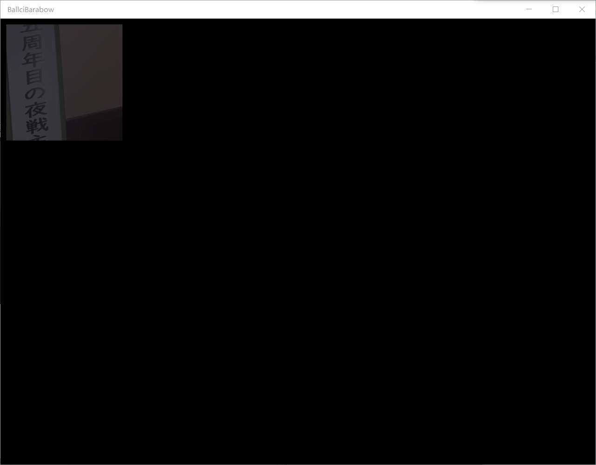
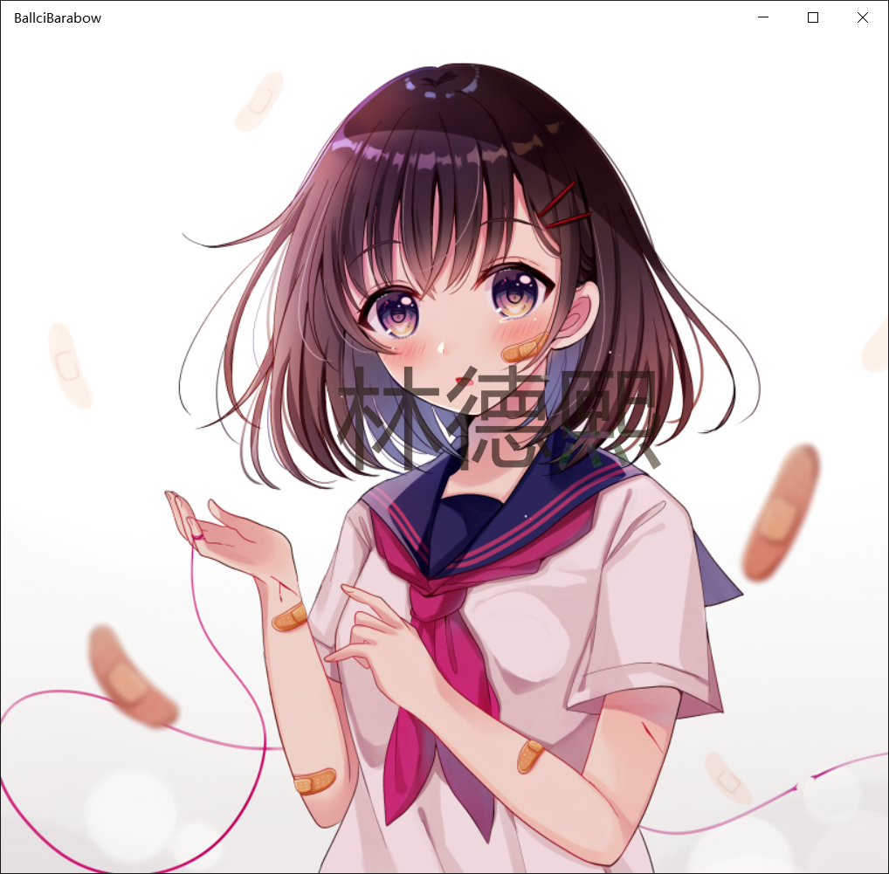

# win10 uwp win2d 入门 看这一篇就够了

本文主要翻译微软官方的文档和添加一些在开发过程比较多小伙伴问的问题，可能带有一定的主观性和局限性，说的东西可能不对或者不符合每个人的预期。如果觉得我有讲的不对的，就多多包含，或者直接关掉这篇文章，但是请勿生气或者发怒吐槽，欢迎在我博客评论 

<!--more-->
<!-- CreateTime:2019/5/25 20:00:52 -->


<div id="toc"></div>

<!-- csdn -->
<!-- 标签：uwp,win2d -->

## 介绍

Win2d 是一个很简单的库，这个库使用的底层图形 Windows Runtime 的 API 通过这个库实现的效果可以充分利用硬件加速，用 GPU 强大的计算能力做出华丽界面。通过 Win2d 可以使用 C# 或 C++ 写应用商店应用，包括 UWP 或 windows 8.1 应用，可以在手机或电脑运行，但是现在不支持 WPF 和 WinForms 开发。在底层 Win2d 利用强大的 Direct2D 而且无缝集合 Windows 的 Xaml，可以使用强大的渲染得到漂亮界面，同时有好看的 API 函数。使用 Win2d 的一个好处是让渲染在 GPU 计算，在 CPU 全力计算业务功能。

我们可以通过 Nuget 来安装 win2d 库，Nuget的windows10版win2d:[http://www.nuget.org/packages/Win2D.uwp](http://www.nuget.org/packages/Win2D.uwp)，Nuget的windows 8.1版win2d:http://www.nuget.org/packages/Win2D.win81

如何使用可以参见微软示例 <http://github.com/Microsoft/Win2D-samples> 或继续看本文

在本文下面会告诉大家如何快速使用 Win2d 做出好看界面，大概看了这个博客就可以了解 Win2d 是如何写的，因为 Win2d 的使用是很简单。

一些链接：
如果找到bug可以通过 <http://github.com/Microsoft/Win2D/issues> 告诉微软

团队博客：<http://blogs.msdn.com/b/win2d>


## 特性

- 位映像图形
 
 - 加载、保存、渲染图形
  
 - 纹理渲染
 
 - 蒙版
 
 - 快速处理大量图片
 
 - 分块压缩图像
 
 - 加载、保存、渲染虚拟位图，虚拟位图就是超过GPU的纹理会自动分为多个

- 矢量图

 - 画图形，线、矩形、圆，或使用基础图形组成复杂的
 
 - 使用笔刷、颜色、图形填充图形
 
 - 任意宽度线段

- 图形显影效应

## 使用

打开 vs，创建 UWP 项目，这里把项目叫 UmmyShirouValeri ，名字是用我的[命名输入法](ms-windows-store://pdp/?productid=9P8LNZRNJX85)写出来的。

打开 Nuget 搜索 win2d 安装


打开 MainPage.xaml ，添加命名`xmlns:canvas="using:Microsoft.Graphics.Canvas.UI.Xaml"`。在本文后面，我可能会使用另一个命名空间`xmlns:xaml="using:Microsoft.Graphics.Canvas.UI.Xaml"` ，两个是相同的，因为本文我写了大概有半年，所以里面的代码有很多是不相同。


```xml
    <Page
    x:Class="UmmyShirouValeri.MainPage"
    xmlns="http://schemas.microsoft.com/winfx/2006/xaml/presentation"
    xmlns:x="http://schemas.microsoft.com/winfx/2006/xaml"
    xmlns:local="using:UmmyShirouValeri"
    xmlns:d="http://schemas.microsoft.com/expression/blend/2008"
    xmlns:mc="http://schemas.openxmlformats.org/markup-compatibility/2006"
    xmlns:canvas="using:Microsoft.Graphics.Canvas.UI.Xaml"
    mc:Ignorable="d">
```

添加命名之后，可以在 XAML 添加控件显示界面

```csharp
            <canvas:CanvasControl x:Name="Canvas" ClearColor="Black"></canvas:CanvasControl>

```

先运行一下，可以看到如下图的界面。

在 VisualStudio 中一般可以按 F5 运行，但是如果在编译的过程发现还不到可以运行的时候，还需要做一些修改，那么请按 ctrl+break 取消生成。


按下F5这时看起来什么没有，其实小伙伴有注意到背景颜色更改了，就是在上面代码 ClearColor 设置的值。如果按下 F5 运行的程序可以运行看到界面颜色修改了，那么就是 Win2d 安装成功了。

因为win2d的版本和对应的 UWP 的 sdk 版本是有联系的，如果发现无法正常使用，那么请同时升级 Win2d 和 `Microsoft.NETCore.UniversalWindowsPlatform` 最新，升级 UWP 项目使用最新的

在准备好了之后，下面让我告诉大家基础的功能，使用基础的功能不是用来做好看的界面的，只是知道 Win2d 如何使用

### 添加文字

需要在 Canvas 的 Draw 添加函数，可以在这里画出图案，文字，于是使用这句添加在 xaml ` <canvas:CanvasControl x:Name="canvas" ClearColor="Black" Draw="Canvas_OnDraw"></canvas:CanvasControl>` 。在 MainPage.xaml.cs 写函数 `Canvas_OnDraw` 这样就可以在后台代码做出好看界面

实际上上面的代码的核心就是 `Draw="Canvas_OnDraw"` 通过这个代码可以在 MainPage.xaml.cs 函数请看代码

```csharp
        private void Canvas_OnDraw(Microsoft.Graphics.Canvas.UI.Xaml.CanvasControl sender, Microsoft.Graphics.Canvas.UI.Xaml.CanvasDrawEventArgs args)
        {
            var draw = args.DrawingSession;
            draw.DrawText("lindexi",new Vector2(100,100),Color.FromArgb(0xFF,100,100,100));
        }
```

上面的代码在坐标（100，100）写出文字 "lindexi" 文字的颜色设置了我也不知道的颜色。

在写文字就需要用到 args.DrawingSession 提供很多方法，可以在这些方法写文字的有两个，本文使用的是里面最简单的一个。

如果使用了 `draw.DrawText` ，这个方法提供的重载很多，方法提供很多参数，一般可以使用这个方法设置显示位置，显示颜色。


和上面同样功能，可以不使用Vector2，使用这个代码也是一样`draw.DrawText("lindexi", 100, 100, Color.FromArgb(0xFF,100,100,100));`

如果需要设置字体宽度，可以使用 CanvasTextFormat 来做。


```csharp
            draw.DrawText("lindexi", 100, 100, 500, 50, Color.FromArgb(0xFF, 100, 100, 100), new CanvasTextFormat()
            {
                FontSize = 100
            });
```


需要告诉大家的是，上面的代码是为了让大家快速跑起来，很多细节都没有告诉大家。如 DrawingSession 的使用需要 using 。在设置字体宽度 `new CanvasTextFormat` 使用之后需要释放。

微软希望使用的清真方法请看代码

```csharp
            using (var canvasDrawingSession = args.DrawingSession)
            {
                var canvasTextFormat = new CanvasTextFormat { FontSize = 100 };

                using (canvasTextFormat)
                {
                    canvasDrawingSession.DrawText("林德熙", new Vector2(100,100), Color.FromArgb(0xA1, 100, 100, 100), canvasTextFormat);
                }
            }
```

### 清理

因为 win2d 不会自己清理，一般在页面切换，清理资源

打开 MainPage.xaml ，添加 Unloaded 的事件，这样在 Unloaded 事件可以清理


```xml
    <Page
    x:Class="UmmyShirouValeri.MainPage"
    xmlns="http://schemas.microsoft.com/winfx/2006/xaml/presentation"
    xmlns:x="http://schemas.microsoft.com/winfx/2006/xaml"
    xmlns:local="using:UmmyShirouValeri"
    xmlns:d="http://schemas.microsoft.com/expression/blend/2008"
    xmlns:mc="http://schemas.openxmlformats.org/markup-compatibility/2006"
    xmlns:canvas="using:Microsoft.Graphics.Canvas.UI.Xaml"
    Unloaded="Page_OnUnloaded"
    mc:Ignorable="d">
```

上面代码的核心是 `Unloaded="Page_OnUnloaded"` 通过 Unloaded 可以知道页面关闭

打开  MainPage.xaml.cs ，在函数 Page_OnUnloaded 添加下面代码，就是把 Win2d 从视觉树移除


```csharp
    
        private void Page_OnUnloaded(object sender, RoutedEventArgs e)
        {
            canvas.RemoveFromVisualTree();
            canvas = null;
        }
```

需要记得，这个很重要

为何需要这样，参见：[避免内存泄漏](http://validvoid.net/win2d-avoiding-memory-leaks/)

### 这个标题不知道写什么

搞事，一定要


那么这是如何做的？

如果需要重新画，如何做？

在 Win2d 的 CanvasControl 只会在初始化的时候调用一次 Draw 事件，如果想要做动画，如何多次调用？
想要让他重画，使用 `canvas.Invalidate();` 就会重新调用 Canvas_OnDraw 

在构造使用下面代码让win2d不停重画。


```csharp
            DispatcherTimer t = new DispatcherTimer();
            t.Interval = new TimeSpan(1000);
            t.Tick += (s, e) =>
            {
                canvas.Invalidate();
            };
            t.Start();
```

这样就可以隔 1000 毫秒重画。需要知道使用这个方法是让大家可以用到之前的技能，有小伙伴告诉我，如果写一篇博客里面用到的都不是大家默认的技能，那么很少有人可以看下去，所以我尽量使用大家都知道的技能来做。这里是告诉大家，如果想要触发 Draw 就需要调用 `canvas.Invalidate();` 调用这个函数可以在不可控的一个时间触发`Draw`，所以无法稳定指定时间重画。在本文的后面会告诉大家如何做动画。


```csharp
         private void Canvas_OnDraw(Microsoft.Graphics.Canvas.UI.Xaml.CanvasControl sender, Microsoft.Graphics.Canvas.UI.Xaml.CanvasDrawEventArgs args)
        {
            var draw = args.DrawingSession;
            draw.DrawText("lindexi", Ran.Next(10,100), Ran.Next(10, 100), 500, 50, Color.FromArgb(0xFF, 100, 100, 100), new CanvasTextFormat()
            {
                FontSize = 100
            });

            draw.DrawLine(Ran.Next(10,100),Ran.Next(10,100),Ran.Next(100,1000),Ran.Next(100,1000),Color.FromArgb(0xFF,25,100,100));
        }

        private Random Ran { set; get; } = new Random();

```

运行上面代码就可以看到上面的效果

是不是觉得还不好看，试试这个代码


```csharp
         private void Canvas_OnDraw(Microsoft.Graphics.Canvas.UI.Xaml.CanvasControl sender, Microsoft.Graphics.Canvas.UI.Xaml.CanvasDrawEventArgs args)
        {
            var draw = args.DrawingSession;
            draw.DrawText("lindexi", Ran.Next(10, 100), Ran.Next(10, 100), 500, 50, r(), new CanvasTextFormat()
            {
                FontSize = 100
            });

            for (int i = 0; i < 10; i++)
            {
                draw.DrawLine(Ran.Next(10, 100), Ran.Next(10, 100), Ran.Next(100, 1000), Ran.Next(100, 1000), r());
            }

            Color r()
            {
                return Color.FromArgb(0xFF, rc(), rc(), rc());
            }

            byte rc()
            {
                return (byte)(Ran.NextDouble() * 255);
            }
        }

```

需要在vs2017 才可以跑，如果希望下载 vs2017 ，可以到我网盘下载

链接：[http://pan.baidu.com/s/1skXDc3z](http://pan.baidu.com/s/1skXDc3z) 密码：70d6

如果度盘链接没法使用，请联系我。

btsync：BTZR4YIPCLUUEL2BKDACVGLC3473MEWDN

如果需要使用 Win2d 使用动画，请看 [win10 uwp win2d CanvasVirtualControl](https://lindexi.gitee.io/post/win10-uwp-win2d-CanvasVirtualControl.html )

### 如何画线

刚才已经代码有画线的，也许已经看见下面的代码

```csharp
draw.DrawLine（x1，y1，x2，y2，颜色）
```

除了可以设置线所在的地方，可以设置线条宽度、样式，因为很简单，所以这里就不需要多说了。

### 添加图片

添加图片可以通过 `draw.DrawImage` 画出图片，在画之前需要有图片，这里的图片的类是 `CanvasBitmap` 下面来告诉大家如何从文件或 URL 二进制转换图片

可以通过下面的三个方法拿到图片

```csharp
    CanvasBitmap.CreateFromBytes() // 从 bytes 数组创建
    CanvasBitmap.CreateFromColors() // 创建纯色的图片
    CanvasBitmap.LoadAsync()       // 通过 URL 或文件创建
```

注意：传入的 `ICanvasResourceCreator` 就是 CanvasControl 也就是一个页面如果存在多个 CanvasControl 在哪个 CanvasControl 使用的图片就需要在哪个创建

下面使用 LoadAsync 传入工程的图片，比较期望的方法是在 `Canvas_OnCreateResources` 事件里面加载图片。但是这里为了演示方便就直接在 `Canvas_OnDrawAsync` 创建图片。

```csharp
            private void Canvas_OnDrawAsync(Microsoft.Graphics.Canvas.UI.Xaml.CanvasControl sender, Microsoft.Graphics.Canvas.UI.Xaml.CanvasDrawEventArgs args)
        {
            var draw = args.DrawingSession;
            // 这是文字
            draw.DrawText("lindexi", Ran.Next(10, 100), Ran.Next(10, 100), 500, 50, r(), new CanvasTextFormat()
            {
                FontSize = 100
            });

            for (int i = 0; i < 10; i++)
            {
                draw.DrawLine(Ran.Next(10, 100), Ran.Next(10, 100), Ran.Next(100, 1000), Ran.Next(100, 1000), r());
            }
            if (img != null)
            {
                draw.DrawImage(img, Ran.Next(10, 1000), rc());
            }
            else
            {
                // 这是危险写法，请看 [win10 uwp 异步转同步](https://lindexi.gitee.io/post/win10-uwp-%E5%BC%82%E6%AD%A5%E8%BD%AC%E5%90%8C%E6%AD%A5.html )
                
                Img().Wait();
            }

            Color r()
            {
                return Color.FromArgb(0xFF, rc(), rc(), rc());
            }

            byte rc()
            {
                return (byte)(Ran.NextDouble() * 255);
            }

            async Task Img()
            {
                // 加载图片
                img = await CanvasBitmap.LoadAsync(canvas, new Uri("ms-appx:///Assets/SplashScreen.png"));
            }
        }

```


创建图片使用`img = await CanvasBitmap.LoadAsync(canvas, new Uri("ms-appx:///Assets/SplashScreen.png"));` 加载，需要注意加载的文件需要是内容

创建使用的 uri 参见：[win10 uwp 访问解决方案文件](https://lindexi.gitee.io/post/win10-uwp-%E8%AE%BF%E9%97%AE%E8%A7%A3%E5%86%B3%E6%96%B9%E6%A1%88%E6%96%87%E4%BB%B6.html )

## 创建资源

上面的代码大家看到了在 Draw 的时候才创建图片，这个写法是不清真。正规的写法是在 CreateResources 里面创建资源。

图片是一个资源，除了图片外还有其他很多资源。但是这里使用图片作为例子。

在 xaml 添加 CreateResources 事件，下面将会在解决方案获得两张图片。

```csharp
        <xaml:CanvasControl x:Name="Canvas" ClearColor="Black" 
                            CreateResources="Canvas_OnCreateResources"
                            Draw="Canvas_OnDraw"></xaml:CanvasControl> 
```

在后台代码 `Canvas_OnCreateResources` 就可以用来创建资源，在这个方法可以异步创建资源，只有在这里创建资源完成之后才会调用 Draw 方法。

```csharp
        private void Canvas_OnCreateResources(CanvasControl sender, CanvasCreateResourcesEventArgs args)
        {
        }
```

从 CanvasCreateResourcesEventArgs 可以知道资源需要创建的原因，通过判断资源创建的原因决定是不是需要创建资源。如果判断是 FirstTime 那么就必须创建资源，因为这是第一次使用。

在创建资源完成之前是不会触发 Draw ，但是这里有一个坑，如果我创建资源需要异步读写，那么我如何阻塞这个函数，难道使用 wait？实际上在 args 有一个方法，使用 TrackAsyncAction 可以用来等待一个 Task ，在他完成之后调用 Draw 而不是使用 wait 。这样写的代码比较符合微软的希望。

为了拿到一个 Task 来异步读写，需要创建一个函数，请看代码

```csharp
        private void Canvas_OnCreateResources(CanvasControl sender, CanvasCreateResourcesEventArgs args)
        {
            args.TrackAsyncAction(CreateResourcesAsync(sender).AsAsyncAction());
        }

        private async Task CreateResourcesAsync(CanvasControl canvasControl)
        {
            _bitmap1 = await CanvasBitmap.LoadAsync(canvasControl, "Assets/1.png");
            _bitmap2 = await CanvasBitmap.LoadAsync(canvasControl, "Assets/2.png");
        }

        private CanvasBitmap _bitmap1;
        private CanvasBitmap _bitmap2;
```

上面的代码在大家的设备不一定能使用，原因是需要大家在 Assets 文件夹放两张图片，需要命名和我一样而且属性的生成是内容，这样才可以找到。

建议使用这个方法创建资源，在加载图片的时候使用这个方法，而不是上面的等待。

资源的创建会发生的另一个触发是丢失设备，关于丢失设备请看[Win2D 官方文章系列翻译 - 处理设备丢失 - void² - 博客园](https://www.cnblogs.com/validvoid/p/win2d-handling-device-lost.html )

## 设置 win2d 背景

win2d 会忽略在 xaml 设置的背景，如果使用 Background = xx 的方法设置背景，会在 win2d 忽略

```csharp
        <xaml:CanvasControl x:Name="Canvas" Background="Brown" Draw="Canvas_OnDraw"></xaml:CanvasControl>

```

上面的代码不会把 win2d 的背景设置，因为 win2d 需要设置 `ClearColor` 来画出背景

如果想把 win2d 的背景颜色设置为 白色，那么可以使用下面代码

```csharp
        <xaml:CanvasControl x:Name="Canvas" ClearColor="White" Draw="Canvas_OnDraw"></xaml:CanvasControl>

```

如果在一次刷新需要设置 win2d 的颜色，那么可以使用 下面代码

```csharp
            sender.ClearColor = Colors.White;

```

关于 Alpha 请看 [Win2D 官方文章系列翻译 - 预乘 Alpha - void² - 博客园](https://www.cnblogs.com/validvoid/p/win2d-premultiplied-alpha.html )

## 特效

现在的特效，越来越便宜，从原先的很贵的特效，到现在的不到一块钱。一个好的应用就需要多加一些特效。看到了这里，我准备告诉大家如何在 Win2d 使用特效。

所有的实现 IGraphicsEffectSource 都可以添加特效，而特效本身就实现 IGraphicsEffectSource ，如果需要复杂的图片可以堆特效来做。

本文只告诉大家如何使用特效，因为几乎所有的特效使用方法都差不多，就是输入位图，修改参数，输出修改后的位图。如果需要使用多个特效合在一起，就把前面特效输出的位图输入到第二个特效。通过连接多个特效就可以做出好看的图片。

具体 Win2d 有哪些特效而且这些特效需要如何使用，就请看鱼哥的知乎专栏，在下面的参见我添加了他的博客。

实际的特效不是只能在图片使用，而是在所有 IGraphicsEffectSource 上使用。

在开始准备之前，需要准备一些图片和文字作为资源用来后面创建资源。在前台添加 CreateResources 事件，请看代码

```csharp
        <xaml:CanvasControl x:Name="Canvas" ClearColor="Black" 
                            CreateResources="Canvas_OnCreateResources"
                            Draw="Canvas_OnDraw"></xaml:CanvasControl> 
```

在后台的事件读取图片资源

```csharp
        private void Canvas_OnDraw(CanvasControl sender, CanvasDrawEventArgs args)
        {
            
        }

        private void Canvas_OnCreateResources(CanvasControl sender, CanvasCreateResourcesEventArgs args)
        {
           // 在这里添加资源
        }
```

我随意找到两张好看的图片，把他放在 Assets 文件夹，所以下面的代码将会去读取这两个文件。需要注意两个文件都需要右击属性，选择生成是内容，不然使用下面的方式找不到。

```csharp
        private void Canvas_OnCreateResources(CanvasControl sender, CanvasCreateResourcesEventArgs args)
        {
            args.TrackAsyncAction(CreateResourcesAsync(sender).AsAsyncAction());
        }

        private async Task CreateResourcesAsync(CanvasControl canvasControl)
        {
            _bitmap1 = await CanvasBitmap.LoadAsync(canvasControl, "Assets/1.png");
            _bitmap2 = await CanvasBitmap.LoadAsync(canvasControl, "Assets/2.jpg");
        }

        private CanvasBitmap _bitmap1;
        private CanvasBitmap _bitmap2;
```

因为现在不知道是否读取了图片，所以先把图片画出来试试

```csharp
        private void Canvas_OnDraw(CanvasControl sender, CanvasDrawEventArgs args)
        {
            using (var canvasDrawingSession = args.DrawingSession)
            {
                canvasDrawingSession.DrawImage(_bitmap1);
            }
        }
```

如果运行一下可以看到图片，那么就是创建资源成功。

现在以 AlphaMaskEffect 作为例子告诉大家如何在位图添加特效

首先创建 AlphaMaskEffect ，然后传入图片，最后画出特效。

因为 AlphaMaskEffect 需要指定一个区域的 Alpha 值，让对应图片的对应区域显示，所以需要用到 CanvasCommandList 用来画出矩形区域

```csharp
        private void Canvas_OnDraw(CanvasControl sender, CanvasDrawEventArgs args)
        {
            var alphaMask = new CanvasCommandList(sender);

            using (var canvasDrawingSession = alphaMask.CreateDrawingSession())
            {
                canvasDrawingSession.FillRectangle(new Rect(10, 10, 200, 200), Color.FromArgb(100, 0, 0, 0));
            }

            var alphaMaskEffect = new AlphaMaskEffect
            {
                Source = _bitmap1,
                AlphaMask = alphaMask
            };

            using (var canvasDrawingSession = args.DrawingSession)
            {
                canvasDrawingSession.DrawImage(alphaMaskEffect);
            }
        }
```

现在运行程序，可以看到在(10,10)，大小是(100,100)的矩形区域显示图片。在 Color.FromArgb 我写的是 Alpha 不是 0xFF 所以就没有完全显示图片

<!--  -->


这时我可以叠加一张其他的图片，而且在第一张图片里面挖出文字，如下图，就是我使用下面代码写出来的。我用文字从一张图片挖去一块区域，让他显示，然后叠加到第二章图片。

```csharp
        private void Canvas_OnDraw(CanvasControl sender, CanvasDrawEventArgs args)
        {
            var alphaMask = new CanvasCommandList(sender);

            var center = sender.Size.ToVector2() / 2;
            center.X -= 100;
            center.Y -= 100;

            using (var canvasDrawingSession = alphaMask.CreateDrawingSession())
            {
                var canvasTextFormat = new CanvasTextFormat {FontSize = 100};

                using (canvasTextFormat)
                {
                    canvasDrawingSession.DrawText("林德熙", center, Color.FromArgb(0xA1, 0, 0, 0), canvasTextFormat);
                }
            }

            var alphaMaskEffect = new AlphaMaskEffect
            {
                Source = _bitmap1,
                AlphaMask = alphaMask
            };

            using (var canvasDrawingSession = args.DrawingSession)
            {
                canvasDrawingSession.DrawImage(_bitmap2);
                canvasDrawingSession.DrawImage(alphaMaskEffect);
            }
        }

```

<!--  -->


如果想知道 Win2d 的特效有哪些请看 [win10 uwp win2d 特效](https://lindexi.gitee.io/lindexi/post/win10-uwp-win2d-%E7%89%B9%E6%95%88.html )

参见：[第二章 画布渲染目标CanvasRenderTarget](https://zhuanlan.zhihu.com/p/37128817 )

[第三章(介绍篇) 图像特效Effect](https://zhuanlan.zhihu.com/p/37131345 )

[第三章(调整篇) 图像特效Effect](https://zhuanlan.zhihu.com/p/37178216 )

## 其他博客

[鱼哥的 win2d 知乎专栏](https://zhuanlan.zhihu.com/p/37101680 )

[void](https://validvoid.net/ )

win2d 毛玻璃：[win10 uwp 毛玻璃](https://lindexi.gitee.io/post/win10-uwp-%E6%AF%9B%E7%8E%BB%E7%92%83.html )

[win2d 画出好看的图形](https://lindexi.gitee.io/post/win2d-%E7%94%BB%E5%87%BA%E5%A5%BD%E7%9C%8B%E7%9A%84%E5%9B%BE%E5%BD%A2.html )

[win10 uwp 萤火虫效果](https://lindexi.gitee.io/post/win10-uwp-%E8%90%A4%E7%81%AB%E8%99%AB%E6%95%88%E6%9E%9C.html )

[win2d 图片水印](https://lindexi.gitee.io/post/win2d-%E5%9B%BE%E7%89%87%E6%B0%B4%E5%8D%B0.html )


<a rel="license" href="http://creativecommons.org/licenses/by-nc-sa/4.0/"></a><br />本作品采用<a rel="license" href="http://creativecommons.org/licenses/by-nc-sa/4.0/">知识共享署名-非商业性使用-相同方式共享 4.0 国际许可协议</a>进行许可。欢迎转载、使用、重新发布，但务必保留文章署名[林德熙](http://blog.csdn.net/lindexi_gd)(包含链接:http://blog.csdn.net/lindexi_gd )，不得用于商业目的，基于本文修改后的作品务必以相同的许可发布。如有任何疑问，请与我[联系](mailto:lindexi_gd@163.com)。