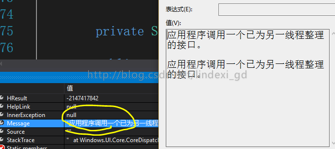
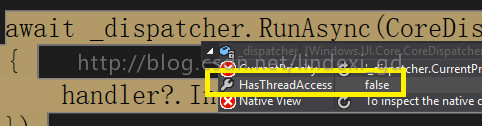

# win10 uwp Window.Current.Dispatcher中Current为null

本文说的是进行网络中异步界面出现的错误，可能带有一定的主观性和局限性，说的东西可能不对或者不符合每个人的预期。如果觉得我有讲的不对的，就多多包含，或者直接关掉这篇文章，但是请勿生气或者发怒吐槽，可以在我博客评论 http://blog.csdn.net/lindexi_gd
<!--more-->

我们可以在修改属性使用

```
    public abstract class NotifyPropertyChangedBase : INotifyPropertyChanged
    {
        public event PropertyChangedEventHandler PropertyChanged;

        protected async void OnPropertyChanged([CallerMemberName] string propName = "")
        {
            await Window.Current.Dispatcher.RunAsync(CoreDispatcherPriority.High,
                () =>
                {
                    PropertyChanged?.Invoke(this, new PropertyChangedEventArgs(propName));
                });
        }
    }
 ```

在老周博客：http://www.cnblogs.com/tcjiaan/p/5511419.html

但是我发现在HttpRequest中的函数出发了OnPropertyChanged，这时发现Current is null
 
并且：public event PropertyChangedEventHandler PropertyChanged;中PropertyChanged也是null

老周：由于线程出现嵌套，在Get请求回调的时候，窗口线程已由系统调整。就按你的做法，用主视图层上的调度对象来调用，应用程序级别的视图线程一般不会改变。

要么改用HttpClient类的异步方法来请求，是Windows.Web.Http下面的类，非.net core类型







简单方法：

```
await CoreApplication.MainView.CoreWindow.Dispatcher.RunAsync(CoreDispatcherPriority.Normal, () => {  });
```

<a rel="license" href="http://creativecommons.org/licenses/by-nc-sa/4.0/"></a><br />本作品采用<a rel="license" href="http://creativecommons.org/licenses/by-nc-sa/4.0/">知识共享署名-非商业性使用-相同方式共享 4.0 国际许可协议</a>进行许可。欢迎转载、使用、重新发布，但务必保留文章署名[林德熙](http://blog.csdn.net/lindexi_gd)(包含链接:http://blog.csdn.net/lindexi_gd )，不得用于商业目的，基于本文修改后的作品务必以相同的许可发布。如有任何疑问，请与我[联系](mailto:lindexi_gd@163.com)。

