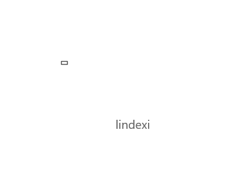
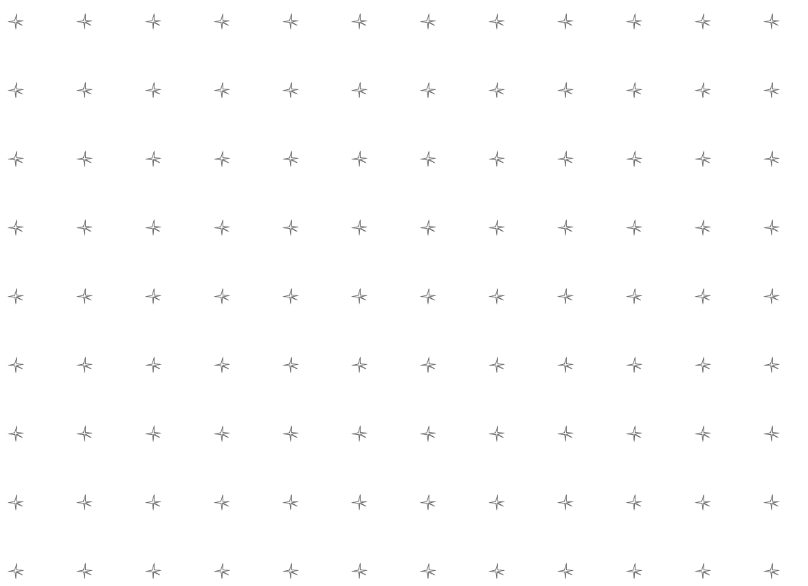
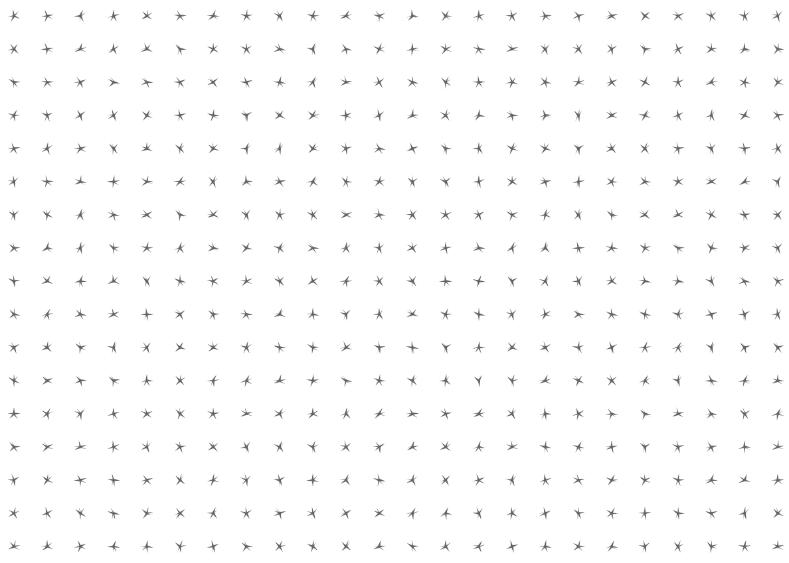
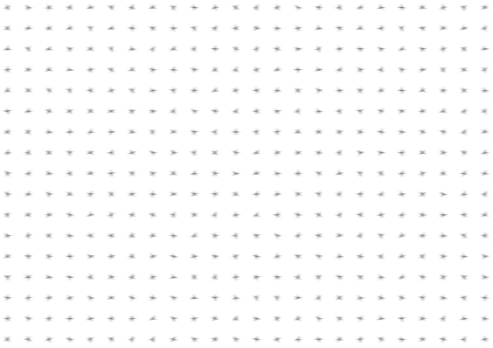

# win2d CanvasCommandList 使用方法

在 win2d 可以通过 CanvasCommandList 定义很多命令，这些命令不是直接渲染到 Canvas 上，而是作为一个缓存。可以将 CanvasCommandList 作为输入，输入到其他的特效或参与其他的渲染。

特别在用 Win2d 写一个渲染框架的时候，通过 CanvasCommandList 可以实现内部元素容器的偏移和统一的效果

<!--more-->
<!-- CreateTime:2018/11/9 20:08:04 -->

<!-- csdn -->

<div id="toc"></div>

<!-- 标签：uwp,win2d -->

先安装好 Win2d 的 nuget 如果对于 win2d 的安装有疑问，请看 [win10 uwp win2d 入门 看这一篇就够了](https://lindexi.gitee.io/post/win10-uwp-win2d-%E5%85%A5%E9%97%A8-%E7%9C%8B%E8%BF%99%E4%B8%80%E7%AF%87%E5%B0%B1%E5%A4%9F%E4%BA%86.html ) 

在界面加上代码

```csharp
<Page
    x:Class="lindexi.Win2d.MainPage"
    xmlns="http://schemas.microsoft.com/winfx/2006/xaml/presentation"
    xmlns:x="http://schemas.microsoft.com/winfx/2006/xaml"
    xmlns:local="using:NekeJivear"
    xmlns:d="http://schemas.microsoft.com/expression/blend/2008"
    xmlns:mc="http://schemas.openxmlformats.org/markup-compatibility/2006"
    xmlns:win2d="using:Microsoft.Graphics.Canvas.UI.Xaml"
    mc:Ignorable="d"
    Background="{ThemeResource ApplicationPageBackgroundThemeBrush}">

    <Grid>
        <win2d:CanvasControl x:Name="Canvas" Draw="Canvas_OnDraw"></win2d:CanvasControl>
        <Button Content="确定" Margin="10,10,10,10" HorizontalAlignment="Center" VerticalAlignment="Bottom" Click="Button_OnClick"></Button>
    </Grid>
</Page>

```

## 直接显示

在后台的代码需要添加两个函数

```csharp
        private void Canvas_OnDraw(CanvasControl sender, CanvasDrawEventArgs args)
        {

        }

        private void Button_OnClick(object sender, RoutedEventArgs e)
        {
            
        }
```

现在在 `Canvas_OnDraw` 尝试使用 CanvasCommandList 在看到代码的时候，大家会发现使用 CanvasCommandList 没有什么特殊的

创建 CanvasCommandList 需要传入 ICanvasResourceCreator 通过 sender 传入就可以

```csharp
        private void Canvas_OnDraw(CanvasControl sender, CanvasDrawEventArgs args)
        {
            var canvasCommandList = new CanvasCommandList(sender);
        
        }
```

在 CanvasCommandList 添加渲染的系列命令的方法是调用 CreateDrawingSession 的方法返回 CanvasDrawingSession 这个值和普通的渲染用到的是相同的

```csharp
        private void Canvas_OnDraw(CanvasControl sender, CanvasDrawEventArgs args)
        {
            var canvasCommandList = new CanvasCommandList(sender);

            using (var clds = canvasCommandList.CreateDrawingSession())
            {
                
            }
        }
```

在 clds 里面添加渲染的命令就可以输入到 CanvasCommandList 作为缓存

现在尝试添加一些文字和元素

```csharp
            var canvasCommandList = new CanvasCommandList(sender);

            using (CanvasDrawingSession clds = canvasCommandList.CreateDrawingSession())
            {
                clds.DrawText("lindexi", new Vector2(100, 100), Color.FromArgb(0xFF, 100, 100, 100));
                clds.DrawRectangle(new Rect(new Point(10, 10), new Point(20, 15)),
                    new CanvasSolidColorBrush(sender, Colors.Black));
            }
```

但是如果现在运行软件，是不会在界面看到任何的修改

因为 CanvasCommandList 需要调用 DrawImage 的方法才能画到 win2d 的控件上

```csharp
            using (var ds = args.DrawingSession)
            {
                ds.DrawImage(canvasCommandList);
            }
```

现在运行软件，可以看到下面图片

<!--  -->


## 相对移动

如果在写一个渲染的框架，很多的时候会使用容器，容器的元素会相对于容器的坐标，而在容器移动的时候，对里面的元素是无法知道的。所以需要将里面的元素进行总体的移动。

通过 CanvasCommandList 可以很容易做到移动整个容器。

将里面的元素全部渲染到一个 CanvasCommandList 然后通过重载的方法移动 CanvasCommandList 的渲染，请看代码

```csharp
            using (var ds = args.DrawingSession)
            {
                var offset = new Vector2(100, 100);
                ds.DrawImage(canvasCommandList, offset);
            }
```

这样就可以做到将这个 canvasCommandList 移动到 (100,100) 同时缓存在里面的命令也就被移动了 (100,100) 运行代码可以看到下面的图片

<!--  -->


## 复用命令

除了可以用来作为元素的移动，还可以作为复用命令，假如有一个元素可以作为组合画出来

那么只需要多次画出的元素输入到 canvasCommandList 然后多次使用 canvasCommandList 也就是复用元素

如在 [win2d 画出好看的图形](https://lindexi.gitee.io/post/win2d-%E7%94%BB%E5%87%BA%E5%A5%BD%E7%9C%8B%E7%9A%84%E5%9B%BE%E5%BD%A2.html ) 里面就有很多的好看的图形，想要多次画出这些图形，如果进行每次都来坐标的计算，那么这个代码一点也不好

例如我需要画出下面的图片

<!--  -->


如果不使用 canvasCommandList 需要计算每个元素的坐标，这样的代码看起来不好，于是在使用了之后就可以十分快速使用下面代码画出

```csharp
        private void Canvas_OnDraw(CanvasControl sender, CanvasDrawEventArgs args)
        {
            var canvasCommandList = new CanvasCommandList(sender);

            using (CanvasDrawingSession clds = canvasCommandList.CreateDrawingSession())
            {
                var pointList = CreateStone(new Point(10, 10), 10, 2, 5);

                var canvasGeometry = CanvasGeometry.CreatePolygon(sender,
                    pointList.Select(temp => new Vector2((float) temp.X, (float) temp.Y)).ToArray());

                clds.DrawGeometry(canvasGeometry, Color.FromArgb(255, 100, 100, 100));
            }

            using (var ds = args.DrawingSession)
            {
                for (int i = 0; i < sender.ActualWidth / 100; i++)
                {
                    for (int j = 0; j < sender.ActualHeight / 100; j++)
                    {
                        var offset = new Vector2(i * 100, j * 100);
                        ds.DrawImage(canvasCommandList, offset);
                    }
                }
            }
        }

```

这里的 CreateStone 是在 [win2d 画出好看的图形](https://lindexi.gitee.io/post/win2d-%E7%94%BB%E5%87%BA%E5%A5%BD%E7%9C%8B%E7%9A%84%E5%9B%BE%E5%BD%A2.html ) 写的

所以对于需要重复使用的命令，就不需要使用 [CanvasRenderTarget](https://lindexi.gitee.io/post/win10-uwp-win2d-%E7%A6%BB%E5%B1%8F%E6%B8%B2%E6%9F%93.html ) 的方法

## 与 CanvasRenderTarget 的区别

关于 CanvasRenderTarget 请看 [win10 uwp win2d 离屏渲染](https://lindexi.gitee.io/post/win10-uwp-win2d-%E7%A6%BB%E5%B1%8F%E6%B8%B2%E6%9F%93.html ) 这个类可以用来不添加到视觉树的时候将命令画在图片上，可以输出为图片

也就是输入的命令实际上就进行渲染，而 CanvasCommandList 只是一个缓存，里面不会进行渲染。

两个类同时都可以作为 Image 的输入，如果只是需要复用某些元素，建议使用 CanvasCommandList 的方法，这样的速度很快

## 特效

如果对于很大的元素，如上面画出的元素，需要对整个图片进行特效。

关于特效请看 [win10 uwp win2d 特效](https://lindexi.gitee.io/post/win10-uwp-win2d-%E7%89%B9%E6%95%88.html ) 这里使用 DirectionalBlurEffect 特效

这个特效可以用来将图片模糊，为了让大家比较容易看到特效，我需要将上面的代码做很小的修改

我将多个元素放在一个 CanvasCommandList 提取代码为一个函数，这个函数就是画出一个元素

```csharp
        private static CanvasCommandList DrawSaJonairqai(CanvasControl sender)
        {
            var canvasCommandList = new CanvasCommandList(sender);

            using (CanvasDrawingSession clds = canvasCommandList.CreateDrawingSession())
            {
                var pointList = CreateStone(new Point(10, 10), 10, 2, 5);

                var canvasGeometry = CanvasGeometry.CreatePolygon(sender,
                    pointList.Select(temp => new Vector2((float)temp.X, (float)temp.Y)).ToArray());

                clds.DrawGeometry(canvasGeometry, Color.FromArgb(255, 100, 100, 100));
            }

            return canvasCommandList;
        }
```

然后将上面的 DrawGeometry 修改为填充

```csharp
      private static CanvasCommandList DrawSaJonairqai(CanvasControl sender)
        {
            var canvasCommandList = new CanvasCommandList(sender);

            using (CanvasDrawingSession clds = canvasCommandList.CreateDrawingSession())
            {
                var pointList = CreateStone(new Point(10, 10), 10, 2, 5);

                var canvasGeometry = CanvasGeometry.CreatePolygon(sender,
                    pointList.Select(temp => new Vector2((float)temp.X, (float)temp.Y)).ToArray());

                clds.FillGeometry(canvasGeometry, Color.FromArgb(255, 100, 100, 100));
            }

            return canvasCommandList;
        }
```

替换渲染到画板为输入到另一个 CanvasCommandList 作为特效输入

```csharp
        private void Canvas_OnDraw(CanvasControl sender, CanvasDrawEventArgs args)
        {
            var canvasCommandList = new CanvasCommandList(sender);

            using (var clds = canvasCommandList.CreateDrawingSession())
            {
                for (int i = 0; i < sender.ActualWidth / 50; i++)
                {
                    for (int j = 0; j < sender.ActualHeight / 50; j++)
                    {
                        var offset = new Vector2(i * 50, j * 50);
                        clds.DrawImage(DrawSaJonairqai(sender), offset);
                    }
                }
            }
        }
```

先尝试运行代码，可以看到下面的图片

<!--  -->


现在添加 DirectionalBlurEffect  特效

```csharp
            var directionalBlurEffect = new DirectionalBlurEffect()
            {
                Source = canvasCommandList,
                BlurAmount = 3,
            };
```

将特效渲染到控件，运行代码可以看到下面图片

```csharp
            using (var ds = args.DrawingSession)
            {
                ds.DrawImage(directionalBlurEffect);
            }
```

<!--  -->


所有代码

```csharp
       private void Canvas_OnDraw(CanvasControl sender, CanvasDrawEventArgs args)
        {
            var canvasCommandList = new CanvasCommandList(sender);

            using (var clds = canvasCommandList.CreateDrawingSession())
            {
                for (int i = 0; i < sender.ActualWidth / 50; i++)
                {
                    for (int j = 0; j < sender.ActualHeight / 50; j++)
                    {
                        var offset = new Vector2(i * 50, j * 50);
                        clds.DrawImage(DrawSaJonairqai(sender), offset);
                    }
                }
            }

            var directionalBlurEffect = new DirectionalBlurEffect()
            {
                Source = canvasCommandList,
                BlurAmount = 3,
            };

            using (var ds = args.DrawingSession)
            {
                ds.DrawImage(directionalBlurEffect);
            }
        }

        private static CanvasCommandList DrawSaJonairqai(CanvasControl sender)
        {
            var canvasCommandList = new CanvasCommandList(sender);

            using (CanvasDrawingSession clds = canvasCommandList.CreateDrawingSession())
            {
                var pointList = CreateStone(new Point(10, 10), 10, 2, 5);

                var canvasGeometry = CanvasGeometry.CreatePolygon(sender,
                    pointList.Select(temp => new Vector2((float) temp.X, (float) temp.Y)).ToArray());

                clds.FillGeometry(canvasGeometry, Color.FromArgb(255, 100, 100, 100));
            }

            return canvasCommandList;
        }

        public static Point[] CreateStone(Point center, int outerRadius, int innerRadius, int arms)
        {
            int centerX = (int) center.X;
            int centerY = (int) center.Y;
            Point[] points = new Point[arms * 2];
            double offset = Math.PI / 2;
            double arc = 2 * Math.PI / arms;
            double half = arc / 2;
            for (int i = 0; i < arms; i++)
            {
                Random randomOuter = new Random((int) DateTime.Now.Ticks);
                outerRadius = outerRadius -
                              randomOuter.Next((int) (innerRadius * 0.06 * new Random().Next(-20, 20) / 30d),
                                  (int) (innerRadius * 0.08));
                Random randomInner = new Random(Guid.NewGuid().GetHashCode());
                innerRadius = innerRadius +
                              randomInner.Next((int) (innerRadius * 0.02 * new Random().Next(-100, 100) / 150d),
                                  (int) (innerRadius * 0.08));
                if (innerRadius > outerRadius)
                {
                    int temp = outerRadius;
                    outerRadius = innerRadius;
                    innerRadius = temp;
                }

                double angleTemp = arc * randomInner.Next(-5, 5) / 10d;
                var angle = i * arc;
                angle += angleTemp;
                points[i * 2].X = (float) (centerX + Math.Cos(angle - offset) * outerRadius) + 20;
                points[i * 2].Y = (float) (centerY + Math.Sin(angle - offset) * outerRadius) + 20;
                points[i * 2 + 1].X = (float) (centerX + Math.Cos(angle + half - offset) * innerRadius) + 20;
                points[i * 2 + 1].Y = (float) (centerY + Math.Sin(angle + half - offset) * innerRadius) + 20;
            }

            return points;
        }
```

<a rel="license" href="http://creativecommons.org/licenses/by-nc-sa/4.0/"></a><br />本作品采用<a rel="license" href="http://creativecommons.org/licenses/by-nc-sa/4.0/">知识共享署名-非商业性使用-相同方式共享 4.0 国际许可协议</a>进行许可。欢迎转载、使用、重新发布，但务必保留文章署名[林德熙](http://blog.csdn.net/lindexi_gd)(包含链接:http://blog.csdn.net/lindexi_gd )，不得用于商业目的，基于本文修改后的作品务必以相同的许可发布。如有任何疑问，请与我[联系](mailto:lindexi_gd@163.com)。
