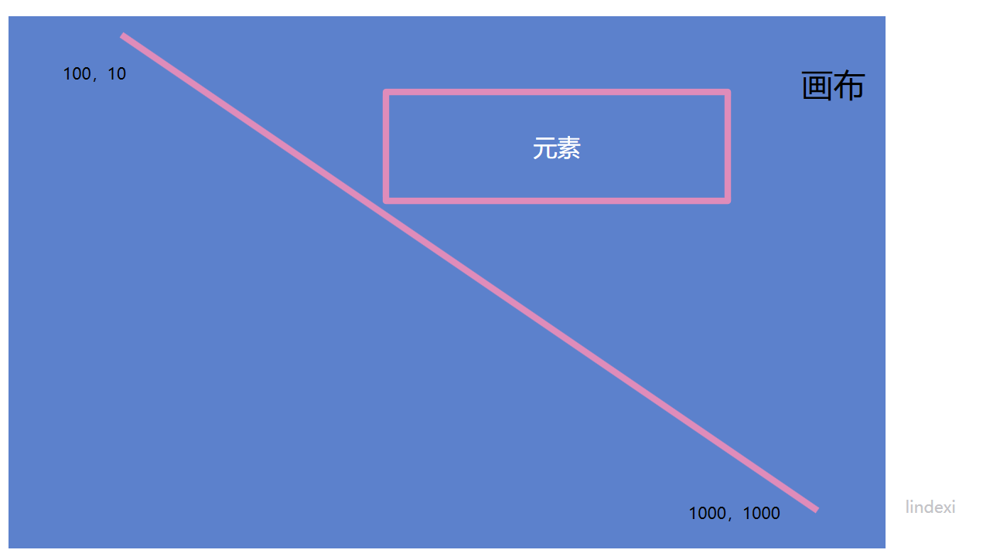
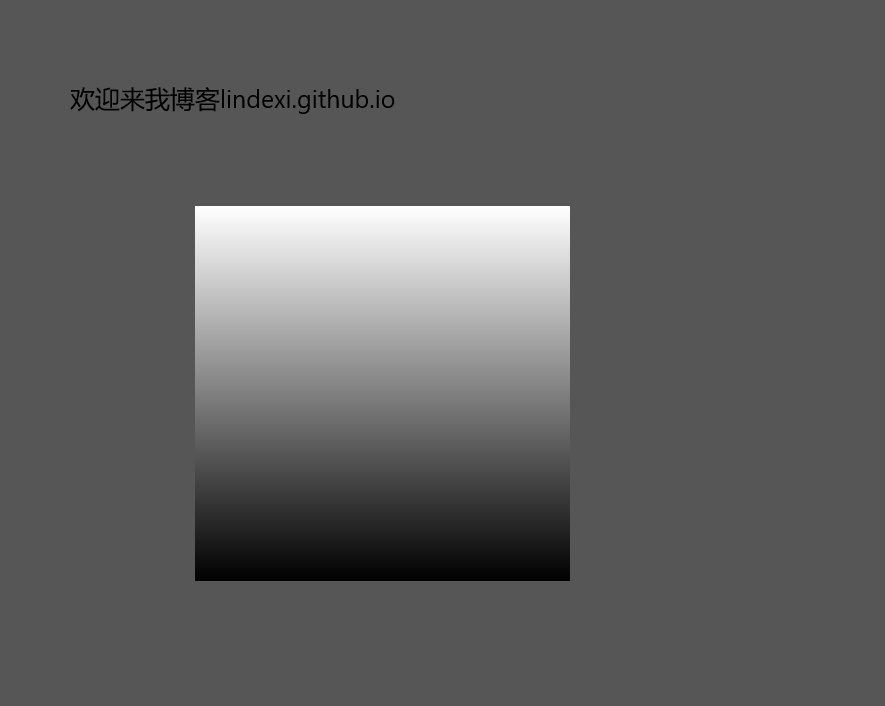
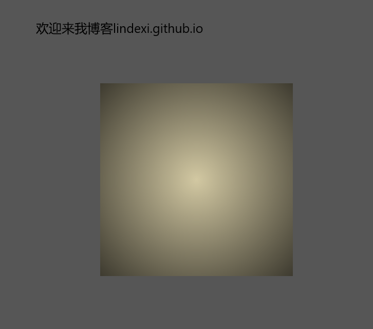

# win2d 渐变颜色

本文告诉大家如何在 win2d 使用渐变颜色。

<!--more-->
<!-- CreateTime:2018/8/29 8:58:14 -->

<!-- 标签：uwp,win2d,渲染 -->

## 线条渐变

在 UWP 的 Win2d 使用渐变颜色需要 CanvasLinearGradientBrush 做颜色，本文告诉大家如何在 win2d 使用 CanvasLinearGradientBrush 做渐变。

渐变的颜色可以尝试打开任意一个控件，查看属性，就可以知道渐变的效果


渐变效果是渐变开始点，渐变结束点作为线性的渐变，也就是从点的开始到点的结束渐变。

中间在偏移多少的点，设置为中间颜色，这样两个颜色之间就会出现渐变的效果。如上面的图，只有第一个点和第二个点，两个点的颜色不相同，所以中间就会出现渐变的颜色。

在 win2d 渐变相对的是整个画布的颜色，也就是设置渐变的开始点不是相对于使用渐变的元素，而是画布的坐标。

<!--  -->


请看图，使用的渐变是从(100,10)到(1000,1000)，元素是从(300,100)开始画，元素的宽度是 300 高度是 200 ，所以实际上元素使用的渐变不是从开始的渐变开始算，而是拿到渐变的对应元素所在颜色

使用 CanvasLinearGradientBrush 需要 CanvasGradientStop 做中间的颜色，表示在相对于第一个点到最后一个点的多少颜色。

如使用下面代码，就是第一个点是白色，最后一个点是黑色。注意 Position 的范围是 0-1 ，也就是 0 就是第一个点，而 1 就是最后一个点

```csharp
                           var canvasGradientStop = new CanvasGradientStop[2];
                            canvasGradientStop[0] = new CanvasGradientStop
                            {
                                Position = 0,
                                Color = Colors.White
                            };
                            
                            canvasGradientStop[1] = new CanvasGradientStop()
                            {
                                Position = 1,
                                Color = Colors.Black
                            };
```

创建 CanvasLinearGradientBrush 需要 CanvasResourceCreator ，建议使用 win2d 的画板作为输入。

```csharp
        private void CanvasControl_OnDraw(CanvasControl sender, CanvasDrawEventArgs args)

        // 忽略代码
                            var canvasGradientStop = new CanvasGradientStop[2];
                            canvasGradientStop[0] = new CanvasGradientStop
                            {
                                Position = 0,
                                Color = Colors.White
                            };
                            
                            canvasGradientStop[1] = new CanvasGradientStop()
                            {
                                Position = 1,
                                Color = Colors.Black
                            };

                            var canvasLinearGradientBrush = new CanvasLinearGradientBrush(sender, canvasGradientStop)
                            {
                                StartPoint = new Vector2(0, 0),
                                EndPoint = new Vector2(0, 1000)
                            };
```

这里开始的点和结束的点都是相对于画布的坐标，而不是相对于使用颜色的元素。

这时创建一个矩形使用颜色，先设置他的坐标是 200，200，在点击按钮的时候移动矩形，可以看到矩形在移动的时候颜色在变化


```csharp
            args.DrawingSession.FillRectangle(new Rect(X, Y, 300, 300), canvasLinearGradientBrush);
```

如果需要在元素内做元素渐变，就需要修改 CanvasLinearGradientBrush 的 StartPoint 和 EndPoint，让 StartPoint 为元素的左上角加上的值。

也就是在原先的开始和最后的点都加上元素才可以进行元素的变化。

<!--  -->


例如矩形是已知的，想要让矩形从上到下是渐变，就可以使用下面代码

```csharp
             var rect = new Rect(X, Y, 300, 300);

           var canvasLinearGradientBrush = new CanvasLinearGradientBrush(sender, canvasGradientStop)
            {
                StartPoint = new Vector2(X, Y),
                EndPoint = new Vector2(X, (float) (Y+rect.Height))
            };

            args.DrawingSession.FillRectangle(rect, canvasLinearGradientBrush);
```

从上面代码可以知道画出来的渐变需要开始的点和结束的点都是从 rect 计算，这样才可以做元素内的渐变

全部代码

xaml

```csharp
    xmlns:win2d="using:Microsoft.Graphics.Canvas.UI.Xaml"

    忽略的代码

        <win2d:CanvasControl Draw="CanvasControl_OnDraw"></
```

相信大家都可以创建一个 win2d 的控件，如果还不知道如何创建，请看[win10 uwp win2d 入门 看这一篇就够了](https://lindexi.gitee.io/post/win10-uwp-win2d-%E5%85%A5%E9%97%A8-%E7%9C%8B%E8%BF%99%E4%B8%80%E7%AF%87%E5%B0%B1%E5%A4%9F%E4%BA%86.html )

在后台代码

```csharp
        private void CanvasControl_OnDraw(CanvasControl sender, CanvasDrawEventArgs args)
        {
        	 var canvasGradientStop = new CanvasGradientStop[2];
           
            canvasGradientStop[0] = new CanvasGradientStop()
            {
                Position = 0,
                Color = Colors.White
            };

            canvasGradientStop[1] = new CanvasGradientStop()
            {
                Position = 1,
                Color = Colors.Black
            };

            var rect = new Rect(X, Y, 300, 300);

            var canvasLinearGradientBrush = new CanvasLinearGradientBrush(sender, canvasGradientStop)
            {
                StartPoint = new Vector2(X, Y),
                EndPoint = new Vector2(X, (float) (Y + rect.Height))
            };

            args.DrawingSession.FillRectangle(rect, canvasLinearGradientBrush);
        }

        private float X { set; get; } = 200;

        private float Y { set; get; } = 200;

```
## 圆圈渐变

从上面的线条渐变可以知道使用的坐标都是画布，在圆圈也是，下面给大家看一下圆圈做出来的图片

<!--  -->


使用这个颜色需要使用 CanvasRadialGradientBrush ，在创建的使用需要传入 CanvasResourceCreator 因为在 win2d 控件的画函数，所以使用下面代码

```csharp
            var canvasRadialGradientBrush = new CanvasRadialGradientBrush(sender, canvasGradientStop);
```

这里的 canvasGradientStop 还是上面的 canvasGradientStop ，但是需要知道这里的 Position 对应的是从圆心到最外面。

```csharp
            var canvasGradientStop = new CanvasGradientStop[2];
            canvasGradientStop[0] = new CanvasGradientStop
            {
                Position = 0,
                Color = Color.FromArgb(255, 210, 200, 162)
            };

            canvasGradientStop[1] = new CanvasGradientStop()
            {
                Position = 1,
                Color = Colors.Black
            };
```

所以我设置了圆心为 `#D2C8A2` 颜色，把最外面写为黑色，这样就可以做出上面看到的颜色

在圆圈需要设置圆心所在的坐标，这个坐标就是相对画布的，所以不是相对元素

为了让矩形的中心设置的颜色，我需要修改代码

```csharp

            var canvasRadialGradientBrush = new CanvasRadialGradientBrush(sender, canvasGradientStop)
            {
                Center = new Vector2((float) (rect.X + rect.Width / 2), (float) (rect.Y + rect.Height / 2)),
                RadiusX = 300,
                RadiusY = 300
            };
```

因为可以使用椭圆，所以需要设置 RadiusX 就是圆的水平半径和 RadiusY 这个我也不知道什么的值。

这样可以做出圆心在矩形中心，半径为 300 的颜色，设置这个颜色，运行，就是上面的图片

参见：[第四章(图形篇2) 几何图形CanvasGeometry](https://zhuanlan.zhihu.com/p/39906163 )

<a rel="license" href="http://creativecommons.org/licenses/by-nc-sa/4.0/"></a><br />本作品采用<a rel="license" href="http://creativecommons.org/licenses/by-nc-sa/4.0/">知识共享署名-非商业性使用-相同方式共享 4.0 国际许可协议</a>进行许可。欢迎转载、使用、重新发布，但务必保留文章署名[林德熙](http://blog.csdn.net/lindexi_gd)(包含链接:http://blog.csdn.net/lindexi_gd )，不得用于商业目的，基于本文修改后的作品务必以相同的许可发布。如有任何疑问，请与我[联系](mailto:lindexi_gd@163.com)。  
