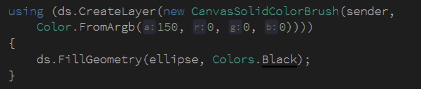

# win2d 通过 CanvasActiveLayer 画出透明度和裁剪

本文告诉大家如果在 UWP 的 win2d 通过 CanvasActiveLayer 创建一层，在这里画出的图片有透明度或者裁剪

<!--more-->
<!-- CreateTime:2019/8/31 8:52:36 -->


<!-- 标签：uwp,win2d -->

在 win2d 如果需要对某个元素裁剪，可以使用很多方法，本文只是告诉大家使用图层的方法裁剪。如果熟悉 WPF 那么对于这个裁剪将会比较简单，当然没有接触过 WPF 的小伙伴也可以继续看，如果有发现不懂的，欢迎在评论喷

首先创建一个 win2d 的控件，如何安装 win2d 请看 [win10 uwp win2d 入门 看这一篇就够了](https://lindexi.gitee.io/post/win10-uwp-win2d-%E5%85%A5%E9%97%A8-%E7%9C%8B%E8%BF%99%E4%B8%80%E7%AF%87%E5%B0%B1%E5%A4%9F%E4%BA%86.html ) 

```xml
        <xaml:CanvasVirtualControl x:Name="Canvas" RegionsInvalidated="Canvas_OnRegionsInvalidated"></xaml:CanvasVirtualControl>

```

本文创建的是 CanvasVirtualControl 关于这个控件请看 [win10 uwp win2d CanvasVirtualControl 与 CanvasAnimatedControl](https://lindexi.gitee.io/post/win10-uwp-win2d-CanvasVirtualControl-%E4%B8%8E-CanvasAnimatedControl.html )

在后台代码创建 `Canvas_OnRegionsInvalidated` 方法，然后就是开始本文的例子

```csharp
        private void Canvas_OnRegionsInvalidated(CanvasVirtualControl sender, CanvasRegionsInvalidatedEventArgs args)
        {
          
        }
```

在这个方法里面创建一个矩形，然后画出来

```csharp
       private void Canvas_OnRegionsInvalidated(CanvasVirtualControl sender, CanvasRegionsInvalidatedEventArgs args)
        {
            var rectangle = CanvasGeometry.CreateRectangle(sender, 10, 10, 100, 100);
            using (var ds = sender.CreateDrawingSession(args.VisibleRegion))
            {
                ds.FillGeometry(rectangle, Color.FromArgb(128, 0, 0, 255));
            }
        }
```

现在运行代码可以看到显示一个矩形，如果现在代码无法运行，那么怎么没开光

<!--  -->


然后再创建一个椭圆，画出椭圆

```csharp
       private void Canvas_OnRegionsInvalidated(CanvasVirtualControl sender, CanvasRegionsInvalidatedEventArgs args)
        {
            var ellipse = CanvasGeometry.CreateEllipse(sender, 100, 100, 50, 50);
            var rectangle = CanvasGeometry.CreateRectangle(sender, 10, 10, 100, 100);
            using (var ds = sender.CreateDrawingSession(args.VisibleRegion))
            {
                ds.FillGeometry(ellipse, Colors.Black);
            }
        }
```

运行代码可以看到界面有一个椭圆

<!--  -->


下面告诉大家如何使用 CanvasActiveLayer 的方法

## 创建 CanvasActiveLayer 方法

在 `Canvas_OnRegionsInvalidated` 方法可以通过 CreateDrawingSession 创建 CanvasDrawingSession 方法

在 CanvasDrawingSession 有 CreateLayer 方法，这里面有很多重载，下面将会通过修改透明度的方法告诉大家如何使用 CanvasActiveLayer 方法

在 CreateLayer 拿到的返回值进行 using 在里面写的代码将会被添加到这一个 Layer 在外面写的代码将不会添加到 Layer 里面

```csharp
                using (var canvasActiveLayer = ds.CreateLayer(参数))
                {
                    // 这里面写的代码会在这个 Layer 里面
                }
                // 在外面写的代码不会添加到这个 layer 里面
```

## 透明度

首先创建 CanvasActiveLayer 方法


```csharp
       private void Canvas_OnRegionsInvalidated(CanvasVirtualControl sender, CanvasRegionsInvalidatedEventArgs args)
        {
            var ellipse = CanvasGeometry.CreateEllipse(sender, 100, 100, 100, 100);
            var rectangle = CanvasGeometry.CreateRectangle(sender, 10, 10, 100, 100);
            using (var ds = sender.CreateDrawingSession(args.VisibleRegion))
            {
                using (var canvasActiveLayer = ds.CreateLayer(0.6f))
                {
                    // 在这里写的代码会添加 0.6 透明
                }
                // 在这里写的代码是普通的
            }
        }
```

这里的 CreateLayer 有很多重载，现在使用的是一个传入透明度的方法，这里的透明度使用 [0,1] 的范围

在 using 里面画出的内容就会加上了这里设置的值，如我需要画出 0.6 的圆形

```csharp

        using (var canvasActiveLayer = ds.CreateLayer(0.6f))
        {
            ds.FillGeometry(ellipse, Colors.Black);
        }

```

<!--  -->


从代码可以看到 CreateLayer 的设计是创建一个简单的方法，在这个方法里面可以快速设置画出的界面，同时在这个方法外面将会和之前一样

## 透明度图片

除了直接设置透明度的值，还可以设置透明度的 Brush 方法，最简单的是设置纯色的 Brush 请看代码

```csharp
                using (var canvasActiveLayer = ds.CreateLayer(new CanvasSolidColorBrush(sender,Colors.Chocolate)))
                {
                    ds.FillGeometry(ellipse, Colors.Black);
                }
```

现在运行代码可以看到和之前没有什么不同的，因为这个透明度是不管使用什么的 Brush 有用的是颜色的透明一个值

如我使用 Colors.Chocolate 和使用黑色是一样的，但是如果我修改了透明如下面的代码

<!--  -->


现在运行代码可以看到圆形是半透明的

在这里使用纯色的图片是没有什么用的，因为无论什么的颜色都是使用颜色的一个值，所以纯色和直接设置透明的是一样的，但是 Brush 可以是其他图片或者渐变，请看代码

```csharp
                var canvasGradientStopList = new CanvasGradientStop[]
                {
                    new CanvasGradientStop()
                    {
                        Color = Color.FromArgb(0, 0, 0, 0),
                        Position = 0
                    },

                    new CanvasGradientStop()
                    {
                        Color = Color.FromArgb(255, 0, 0, 0),
                        Position = 1
                    },
                };

                var canvasLinearGradientBrush =
                    new CanvasLinearGradientBrush(sender, canvasGradientStopList)
                    {
                        StartPoint = new Vector2(0, 60),
                        EndPoint = new Vector2(100, 60)
                    };

                using (ds.CreateLayer(canvasLinearGradientBrush))
                {
                    ds.FillGeometry(ellipse, Colors.Black);
                }
```

<!--  -->


上面使用了渐变颜色，更多关于渐变请看 [win2d 渐变颜色](https://blog.csdn.net/lindexi_gd/article/details/82177605 )

如果有一些图片作为 Brush 也是可以，这里就不在继续说了

## 裁剪

除了设置透明度，还可以设置裁剪，为什么刚才可以设置纯色就是在这里用到的，虽然纯色只是使用透明但是可以在裁剪的时候，方便只是进行裁剪的方法。在只是进行裁剪的时候只需要传入一个纯色的 Brush 就可以。

最简单的裁剪是矩形裁剪，刚才都是画出一个圆，那么对这个圆进行矩形裁剪

<!--  -->


现在运行代码可以看到界面是一个矩形

但是如果只能进行矩形裁剪，那么会觉得win2d不够好用，除了矩形，还可以使用任何的 Geometry 裁剪，请看代码

```csharp
           var ellipse = CanvasGeometry.CreateEllipse(sender, 100, 100, 50, 50);
            var rectangle = CanvasGeometry.CreateRectangle(sender, 10, 10, 100, 100);
            using (CanvasDrawingSession ds = sender.CreateDrawingSession(args.VisibleRegion))
            {
                var canvasGradientStopList = new CanvasGradientStop[]
                {
                    new CanvasGradientStop()
                    {
                        Color = Color.FromArgb(0, 0, 0, 0),
                        Position = 0
                    },

                    new CanvasGradientStop()
                    {
                        Color = Color.FromArgb(255, 0, 0, 0),
                        Position = 1
                    },
                };

                var canvasLinearGradientBrush =
                    new CanvasLinearGradientBrush(sender, canvasGradientStopList)
                    {
                        StartPoint = new Vector2(0, 60),
                        EndPoint = new Vector2(100, 60)
                    };

                using (ds.CreateLayer(canvasLinearGradientBrush, rectangle))
                {
                    ds.FillGeometry(ellipse, Colors.Black);
                }
            }
```

运行一下发现渐变的圆被矩形裁剪，这里传入的是矩形实际可以按照自己需要传入任意的 Geometry 做出好看界面

<!--  -->


关于如何做出一个 Geometry 和更多博客请看

[win10 uwp win2d 入门 看这一篇就够了](https://lindexi.gitee.io/post/win10-uwp-win2d-%E5%85%A5%E9%97%A8-%E7%9C%8B%E8%BF%99%E4%B8%80%E7%AF%87%E5%B0%B1%E5%A4%9F%E4%BA%86.html )

win2d 毛玻璃：[win10 uwp 毛玻璃](https://lindexi.gitee.io/post/win10-uwp-%E6%AF%9B%E7%8E%BB%E7%92%83.html )

[win10 uwp 萤火虫效果](https://lindexi.gitee.io/post/win10-uwp-%E8%90%A4%E7%81%AB%E8%99%AB%E6%95%88%E6%9E%9C.html )

[win2d 图片水印](https://lindexi.gitee.io/post/win2d-%E5%9B%BE%E7%89%87%E6%B0%B4%E5%8D%B0.html )

[win2d CanvasRenderTarget vs CanvasBitmap](https://lindexi.gitee.io/post/win2d-CanvasRenderTarget-vs-CanvasBitmap.html )

[win10 uwp win2d 使用 Path 绘制界面](https://lindexi.gitee.io/post/win10-uwp-win2d-%E4%BD%BF%E7%94%A8-Path-%E7%BB%98%E5%88%B6%E7%95%8C%E9%9D%A2.html )

[win10 uwp win2d 离屏渲染](https://lindexi.gitee.io/post/win10-uwp-win2d-%E7%A6%BB%E5%B1%8F%E6%B8%B2%E6%9F%93.html )

[win2d 画出好看的图形](https://lindexi.gitee.io/post/win2d-%E7%94%BB%E5%87%BA%E5%A5%BD%E7%9C%8B%E7%9A%84%E5%9B%BE%E5%BD%A2.html )

[win10 uwp win2d 特效](https://lindexi.gitee.io/post/win10-uwp-win2d-%E7%89%B9%E6%95%88.html )

[win10 uwp 通过 win2d 画出笔迹](https://lindexi.gitee.io/post/win10-uwp-%E9%80%9A%E8%BF%87-win2d-%E7%94%BB%E5%87%BA%E7%AC%94%E8%BF%B9.html )

[CanvasActiveLayer](https://microsoft.github.io/Win2D/html/T_Microsoft_Graphics_Canvas_CanvasActiveLayer.htm )

[void](https://validvoid.net/ )

<a rel="license" href="http://creativecommons.org/licenses/by-nc-sa/4.0/"></a><br />本作品采用<a rel="license" href="http://creativecommons.org/licenses/by-nc-sa/4.0/">知识共享署名-非商业性使用-相同方式共享 4.0 国际许可协议</a>进行许可。欢迎转载、使用、重新发布，但务必保留文章署名[林德熙](http://blog.csdn.net/lindexi_gd)(包含链接:http://blog.csdn.net/lindexi_gd )，不得用于商业目的，基于本文修改后的作品务必以相同的许可发布。如有任何疑问，请与我[联系](mailto:lindexi_gd@163.com)。
