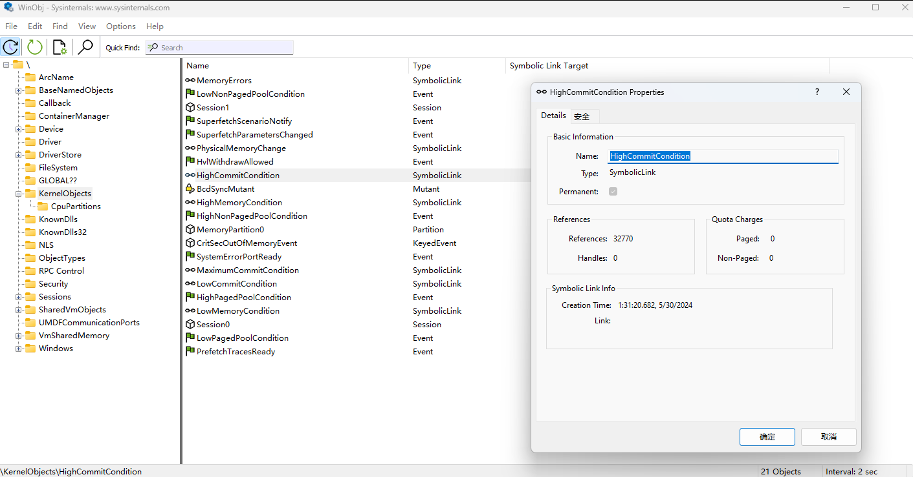

# win32 低内存通知事件

在 Windows 机制里面，将在物理内存、换页池、非换页池以及提交用量很多或很少时，向用户模式进程和内核模式驱动程序提供通知。本文将重点放在用户模式的进程上

<!--more-->


<!-- CreateTime:2024/06/23 07:07:41 -->

<!-- 发布 -->
<!-- 博客 -->

本文属于读 《深入解析 Windows 操作系统》 读书笔记

应用程序可以调用 [CreateMemoryResourceNotification function](https://learn.microsoft.com/en-us/windows/win32/api/memoryapi/nf-memoryapi-creatememoryresourcenotification ) 函数指定自己期望接收到内存多或内存少的通知

如在 dotnet 的 CLR 层的 finalizerthread 部分，就使用了以下代码进行获取通知

```csharp
MHandles[kLowMemoryNotification] =
        CreateMemoryResourceNotification(LowMemoryResourceNotification);
```

以上的参数的 LowMemoryResourceNotification 表示的是可用物理内存不足。对应的还有 HighMemoryResourceNotification 表示可用物理内存很高

配合 [QueryMemoryResourceNotification function ](https://learn.microsoft.com/en-us/windows/win32/api/memoryapi/nf-memoryapi-querymemoryresourcenotification ) 可以进行查询当前的内存状态

使用例子代码请参阅 <https://stackoverflow.com/a/54529790> 提供的例子

另一个方面则是通过以下内存管理器的通知事件获取通知

- HighCommitCondition: 如果提交用量接近最大提交限制，即内存用量非常大，物理内存或页面文件中可用空间极为有限，且系统无法增加页面文件的大小，将设置此事件。换句话就是内存用多了，能释放的话赶紧释放
- LowCommitCondition: 当提交用量相对于当前提交限制较低，即内存用量低，且物理内存或页面文件存在大量可用空间时，将设置该事件。换句话说就是现在豪气，随便用

- HighMemoryCondition: 当空闲物理内存数量超过预设值时将设置该事件
- LowMemoryCondition: 当空闲物理内存数量低于预设值时将设置该事件

如果要查看内存资源通知事件，可以运行微软极品工具箱的 WinObj 工具，查看 KernelObjects 文件夹里面的大内存和小内存事件，如下图所示

<!--  -->


双击即可看到对应的对象产生了多少句柄和引用

如果想要了解系统中有哪些进程请求了内存资源通知，可以使用 Process Explorer 的 Find 菜单进行搜索句柄表，如下图

<!--  -->


更详细内容请大家自行阅读书籍

参考文档：

- [CreateMemoryResourceNotification function (memoryapi.h) - Win32 apps Microsoft Learn](https://learn.microsoft.com/en-us/windows/win32/api/memoryapi/nf-memoryapi-creatememoryresourcenotification )
- [QueryMemoryResourceNotification function (memoryapi.h) - Win32 apps Microsoft Learn](https://learn.microsoft.com/en-us/windows/win32/api/memoryapi/nf-memoryapi-querymemoryresourcenotification )


<a rel="license" href="http://creativecommons.org/licenses/by-nc-sa/4.0/"></a><br />本作品采用<a rel="license" href="http://creativecommons.org/licenses/by-nc-sa/4.0/">知识共享署名-非商业性使用-相同方式共享 4.0 国际许可协议</a>进行许可。欢迎转载、使用、重新发布，但务必保留文章署名[林德熙](http://blog.csdn.net/lindexi_gd)(包含链接:http://blog.csdn.net/lindexi_gd )，不得用于商业目的，基于本文修改后的作品务必以相同的许可发布。如有任何疑问，请与我[联系](mailto:lindexi_gd@163.com)。