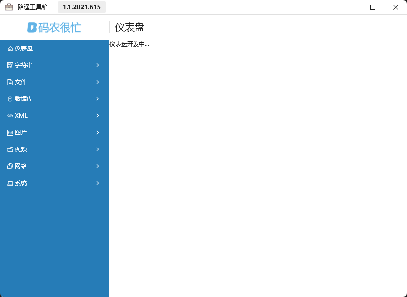
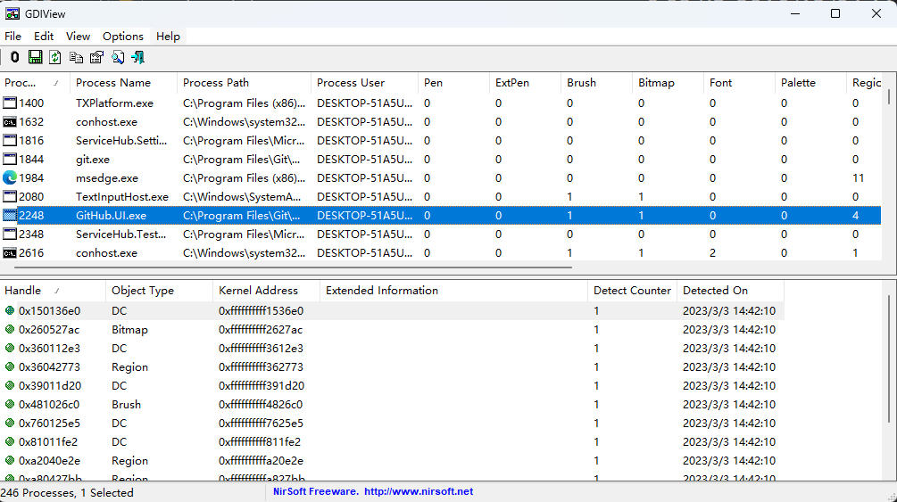
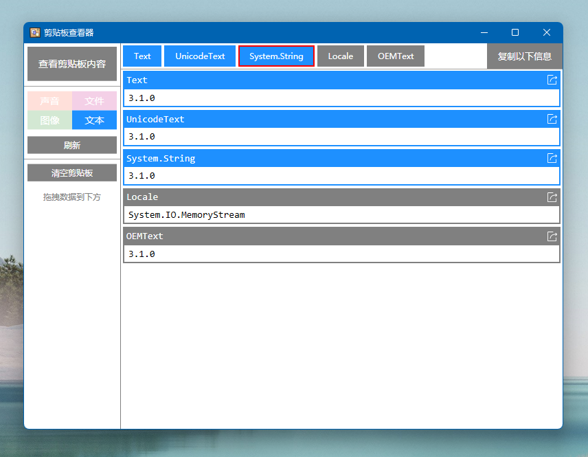

# 一些好用的开发者工具

本文告诉大家一些收藏的开发者工具

<!--more-->
<!-- CreateTime:5/23/2020 3:56:20 PM -->

<!-- 发布 -->
<!-- 博客 -->

## SVG 转 XAML 工具

详细请看 [WPF 将 SVG 转 XAML 的工具](https://blog.lindexi.com/post/WPF-%E5%B0%86-SVG-%E8%BD%AC-XAML-%E7%9A%84%E5%B7%A5%E5%85%B7.html )

## WMI 编写工具

<!--  -->

[Download WMI Code Creator v1.0 from Official Microsoft Download Center](https://www.microsoft.com/en-us/download/details.aspx?id=8572)

## CSV编辑器

<!--  -->

[WildGums/CsvTextEditor: CsvTextEditor is an ElasticTabStop csv editor implemented with AvalonEdit](https://github.com/WildGums/CsvTextEditor )

## DPC Latency Checker

[DPC Latency Checker 1.4.0.zip](https://download.csdn.net/download/lindexi_gd/12438036 )

中断测试工具

## 路遥工具箱

<!--  -->

详细请看 [路遥工具箱下载](https://www.coderbusy.com/luyao-toolkit )

## GDIView

可以看到进程所使用的 GDI 对象

<!--  -->

下载地址： [http://www.nirsoft.net/utils/gdi_handles.html](http://www.nirsoft.net/utils/gdi_handles.html)

如无法下载，可以发邮件向我要

## 剪贴板查看器

开发时，如果不确定剪贴板里面的内容，或者是剪贴板编程相关遇到问题，可以试试 剪贴板查看器 工具

<!--  -->

详细请看 [https://github.com/walterlv/ClipboardViewer](https://github.com/walterlv/ClipboardViewer)

## 实时输出焦点窗口

有时候发现一些烦人的应用总是抢走窗口焦点，或者是开发过程发现自己的应用莫名失焦，或者在开发遇到输入法相关问题。可以试试 `窗口工具：实时输出焦点窗口.exe` 工具。此工具可以输出当前获取了焦点的前台窗口是哪一个，方便调查是哪个窗口被设置到前台获取焦点

详细请看 [https://github.com/walterlv/walterlv.demo/tree/26b0cc933985485edf2be7451fb0577ea6e24673/Walterlv.Demo.WindowX](https://github.com/walterlv/walterlv.demo/tree/26b0cc933985485edf2be7451fb0577ea6e24673/Walterlv.Demo.WindowX)

