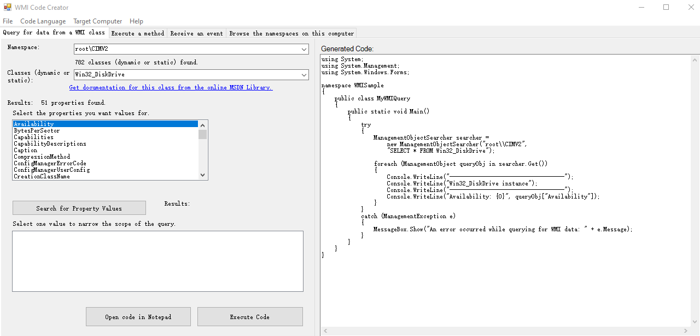
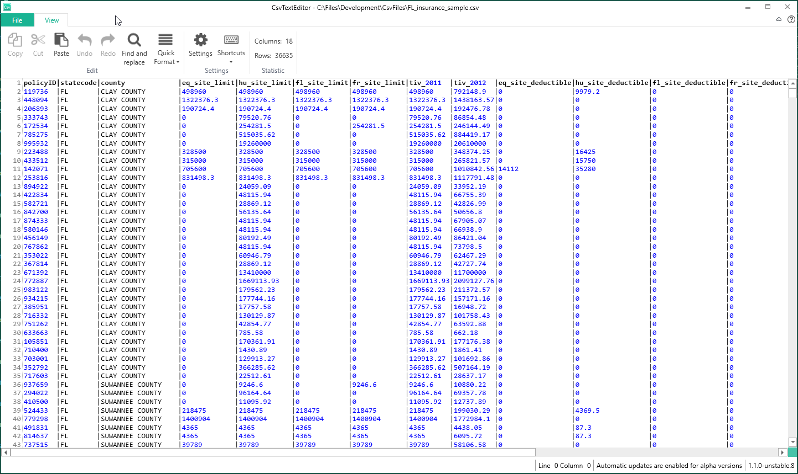

# 一些好用的开发者工具

本文告诉大家一些收藏的开发者工具

<!--more-->

<!-- CreateTime:5/23/2020 3:56:20 PM -->

<!-- 不发布 -->

## SVG 转 XAML 工具

详细请看 [WPF 将 SVG 转 XAML 的工具](https://blog.lindexi.com/post/WPF-%E5%B0%86-SVG-%E8%BD%AC-XAML-%E7%9A%84%E5%B7%A5%E5%85%B7.html )

## WMI 编写工具

<!--  -->

[Download WMI Code Creator v1.0 from Official Microsoft Download Center](https://www.microsoft.com/en-us/download/details.aspx?id=8572)

## CSV编辑器

<!--  -->

[WildGums/CsvTextEditor: CsvTextEditor is an ElasticTabStop csv editor implemented with AvalonEdit](https://github.com/WildGums/CsvTextEditor )

## DPC Latency Checker

[DPC Latency Checker 1.4.0.zip](https://download.csdn.net/download/lindexi_gd/12438036 )

中断测试工具

 本作品采用<a rel="license" href="http://creativecommons.org/licenses/by-nc-sa/4.0/">知识共享署名-非商业性使用-相同方式共享 4.0 国际许可协议</a>进行许可。欢迎转载、使用、重新发布，但务必保留文章署名[林德熙](http://blog.csdn.net/lindexi_gd)(包含链接:http://blog.csdn.net/lindexi_gd )，不得用于商业目的，基于本文修改后的作品务必以相同的许可发布。如有任何疑问，请与我[联系](mailto:lindexi_gd@163.com)。