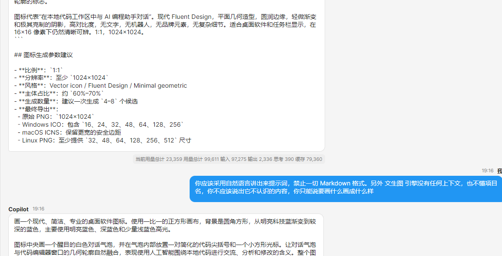
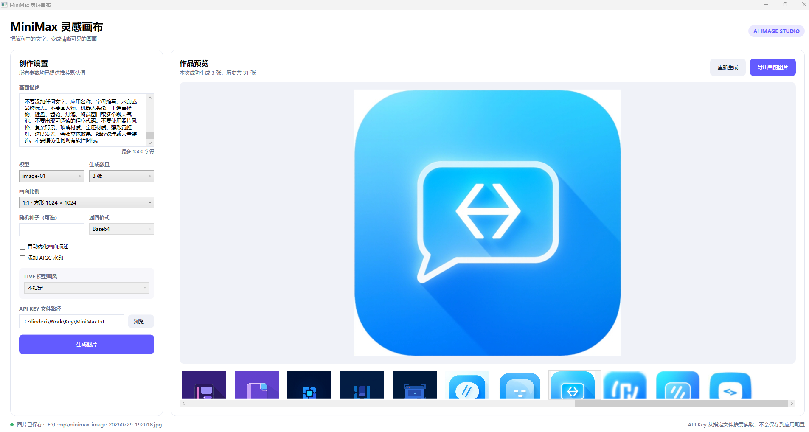
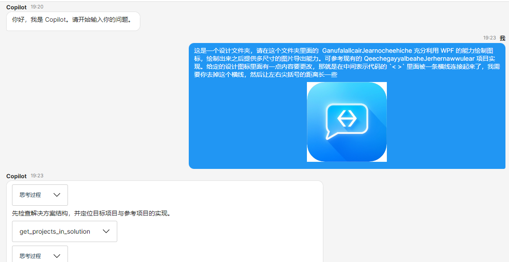
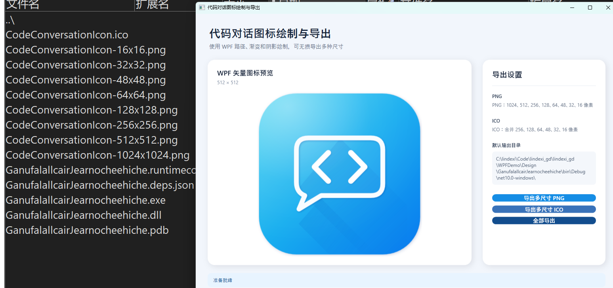

# 一条自己攒的AI图标制作流水线工具链

本文记录我自己日常做应用图标的工作流，先让自己写的 CodingAgent 读项目出提示词，再丢给自己写的文生图应用调用 MiniMax 引擎出设计稿，最后让 CodingAgent 写一个 WPF 程序把图标矢量画出来并导出各尺寸。

<!--more-->

<!-- 发布 -->
<!-- 博客 -->

本文内容由人类主导 AI 辅助编写

编程工具 CodingAgent 是我自己写的一个编码代理工具，项目地址在  <https://github.com/lindexi/lindexi_gd/tree/9c25a9b7cddd617d5e67c902fdcc703c5e93aa5d/SemanticKernelSamples/ChatRoom/Code/CodingChatRoom.AvaloniaShell> 。把它挂到项目上，让它读一遍项目代码和描述，自动吐出文生图的提示词。这一步最大的优势是不用自己动脑子想提示词

<!--  -->

拿到提示词之后，丢给我自己写的文生图应用 <https://github.com/lindexi/lindexi_gd/tree/634e5114577ebe2894d2d70688ab098bb207e1bb/SemanticKernelSamples/MiniMaxSdk/MiniMaxImageGenerationWpf> ，底层调用的是 MiniMax 引擎的能力。选 MiniMax 的原因很实在，就是便宜，这是我伙伴友情提供的资源。

<!--  -->

设计稿有了，再让 CodingAgent 看一遍，让它写一个 WPF 程序，用 XAML 把图标矢量绘制出来。选 WPF 这条路是因为 LLM 对 XAML 天然有很强的感知，生成的 XAML 代码质量很高，Shape、Path、Gradient 这些元素信手拈来。再加上 WPF 本身就是一个渲染能力拉满的客户端框架，画出来的图标边缘锐利、色彩准确。最关键的是，用 XAML 画的图标可以在做的过程中随时微调，调颜色、调形状、调布局都只需要改几行代码重新跑一遍，这比文生图的微调能力强太多了。最后顺手用 RenderTargetBitmap 程序化导出 16×16、32×32、48×48、256×256 各尺寸 PNG，手动切图的体力活全省了。

<!--  -->

最终成品跑出来的效果就是这样。

<!--  -->

WPF 图标绘制项目地址：<https://github.com/lindexi/lindexi_gd/tree/master/WPFDemo/Design/GanufalallcairJearnocheehiche>

整个流程跑通之后，我做图标的状态基本上就是打开 CodingAgent、喝口水、收图。更多技术博客，请参阅 [博客导航](https://blog.lindexi.com/post/%E5%8D%9A%E5%AE%A2%E5%AF%BC%E8%88%AA.html )

 本作品采用<a rel="license" href="http://creativecommons.org/licenses/by-nc-sa/4.0/">知识共享署名-非商业性使用-相同方式共享 4.0 国际许可协议</a>进行许可。欢迎转载、使用、重新发布，但务必保留文章署名[林德熙](http://blog.csdn.net/lindexi_gd)(包含链接:http://blog.csdn.net/lindexi_gd )，不得用于商业目的，基于本文修改后的作品务必以相同的许可发布。如有任何疑问，请与我[联系](mailto:lindexi_gd@163.com)。