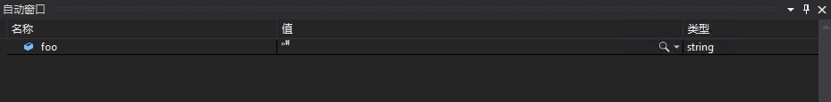
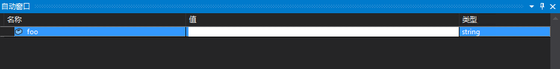

# 一段能让 VisualStudio 炸掉的代码

本文告诉大家如何使用一段代码炸掉 VisualStudio 请不要在正式环境使用这个代码

<!--more-->
<!-- CreateTime:2019/1/17 9:55:29 -->

<!-- csdn -->

创建一个空白的 dotnet core 程序，当然，其他的项目也可以

然后输入下面代码

```csharp
        static void Main(string[] args)
        {
            var foo = new string('\u0483', 550);
        }
```

在代码里面添加一个断点，然后运行

打开自动窗口，可以看到有一个变量

<!--  -->


然后双击一下值，尝试修改 foo 的值

<!--  -->


可以看到你的 VS 已经变颜色了

因为这是 WPF 的一个已知的坑，通过 TextBox 显示这个字符串就会 gg 的问题

代码 https://github.com/dotnet-campus/wpf-issues/tree/master/WPFAppsCrashIfDisplayTextWithTooManyCombiningMarks

[WPF apps crash if they display text with too many combining marks](https://github.com/dotnet/wpf/issues/244 )

现在的WPF开源了，有什么坑都可以在这里面喷

当然，开源了 WPF 是很有底气的，既然你看到问题了，不要只是喷，你自己修啊


另外，这个坑在 UWP 居然不会让 UWP 炸掉，只是让他的显示有些诡异

步骤：

1. 创建一个 xaml 界面，在里面添加一个 TextBox 元素

1. 在后台代码给这个 TextBox 设置上面的字符串

下面是 xaml 代码

```csharp
   <Grid>
        <TextBox x:Name="Txt" HorizontalAlignment="Center" VerticalAlignment="Center"></TextBox>
    </Grid>
```

下面是后台代码

```csharp
        public MainPage()
        {
            this.InitializeComponent();

            Txt.Text = new string('\u0483', 550);
        }
```

现在尝试运行代码，可以看到下面的界面，打开的时候发现 TextBox 填充整个页面，再点击的时候就还原了。


已经将这个坑放在了 github 上 [UWP TextBox will Fill of the Page if they display text with too many combining marks](https://github.com/Microsoft/microsoft-ui-xaml/issues/194 ) 欢迎小伙伴帮我修语法

<a rel="license" href="http://creativecommons.org/licenses/by-nc-sa/4.0/"></a><br />本作品采用<a rel="license" href="http://creativecommons.org/licenses/by-nc-sa/4.0/">知识共享署名-非商业性使用-相同方式共享 4.0 国际许可协议</a>进行许可。欢迎转载、使用、重新发布，但务必保留文章署名[林德熙](http://blog.csdn.net/lindexi_gd)(包含链接:http://blog.csdn.net/lindexi_gd )，不得用于商业目的，基于本文修改后的作品务必以相同的许可发布。如有任何疑问，请与我[联系](mailto:lindexi_gd@163.com)。

