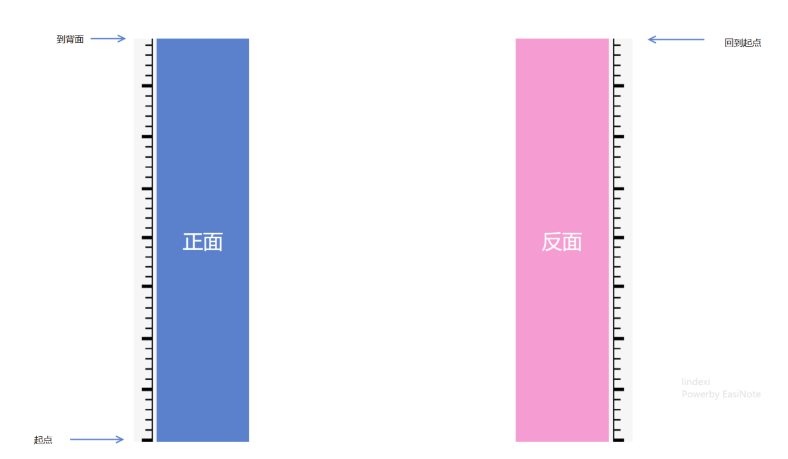
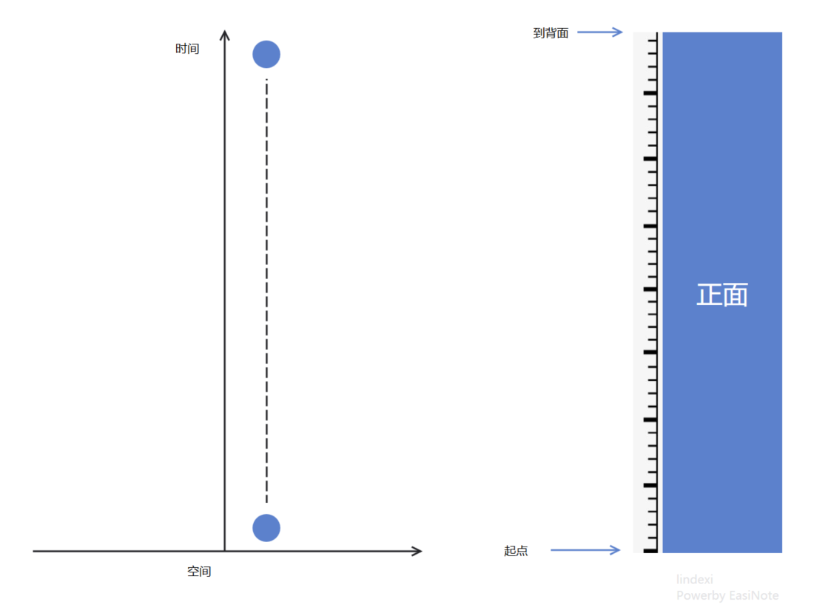
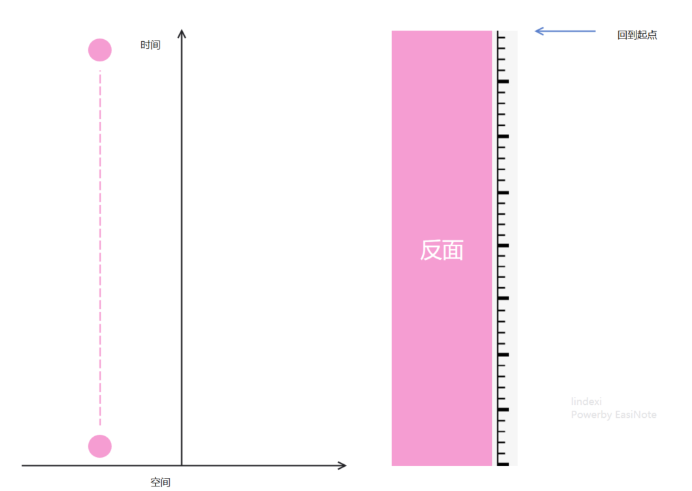
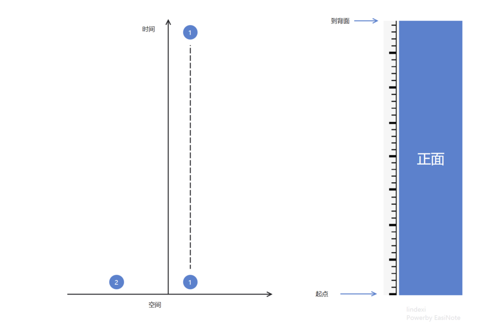
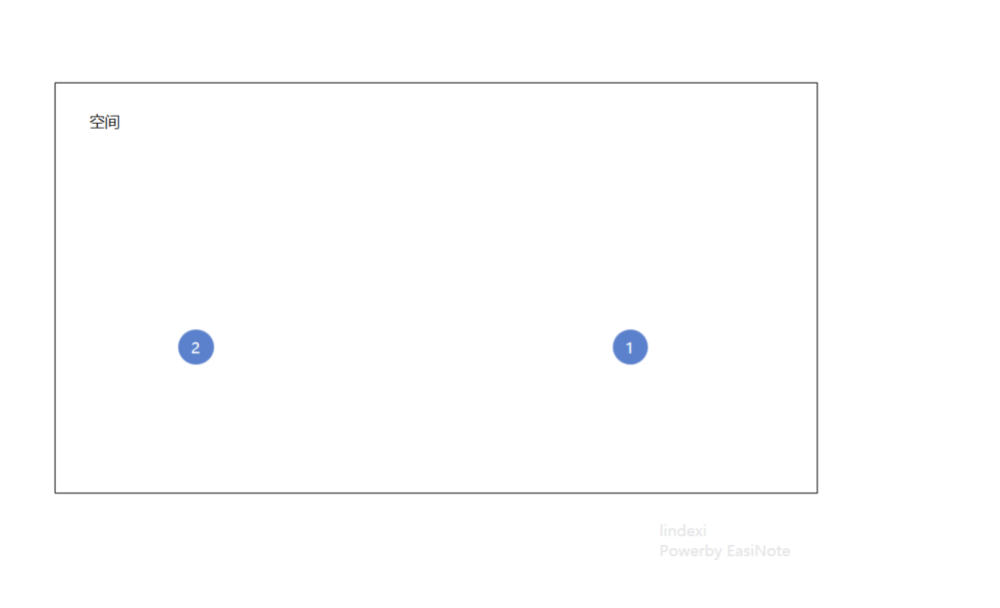
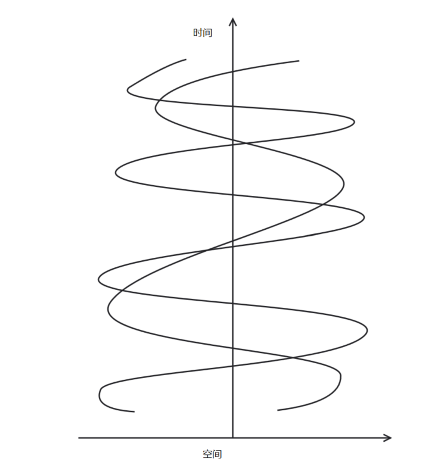

# 一粒在时空轮回的粒子会发生什么

如果有一粒粒子在一段时间之内不停重复，在有限的空间之内不停在某个时间段穿过，会出现什么有趣的事情。本文只是在讲一个故事，完全不是在科普，请不要以为我在告诉大家一个科学事情，这只是我在地铁和小伙伴讲的故事。

<!--more-->
<!-- CreateTime:2019/11/25 21:54:31 -->

<!-- csdn -->

几乎没有人能告诉我，我有多久没出门了，好像我一直都是从宿舍都公司，然后从公司到宿舍。终于有一天觉得我需要出去外面一下，于是开始一段有趣的故事。

在地铁上，我遇到了小伙伴，他问我，你在做什么呢？

那时，我用左手顺时针画圆，右手逆时针画圆。

我告诉他，我在模拟一个粒子。

他说，好不容易遇到，要不来聊聊一些有趣的故事吧。

我说好，经过了很多次尝试，发现我两不在一个世界，一个话题都聊不上。

最后，小伙伴说，听说一天都在互联网的人会有比较多的故事，要不来讲故事吧。

我想了一下，好像编一个故事也是很简单的，于是我就从手上撕下创可贴。值得说的是，我很讨厌粘力太强的胶带，不小心撕下毛就可以把我弄哭了。

我把创可贴做成一个莫比乌斯环，莫比乌斯环就是使用一张纸做成可以一笔画了一张纸的正面和背面的如下图

<!--  -->

我和小伙伴说，从这个起点开始，就是时间轴的开始，这里的莫比乌斯环表示的是时间轴。

<!--  -->

使用了莫比乌斯环也就是时间是一个圈，从时间的起点可以走到时间的背面，最后回到起点。我和小伙伴说这是时间轮回。

因为小伙伴是数学研究生，所以我和他聊的时候只是用了 20 分钟，但是相信大家的数学都不是那么好，就需要多来解释一下一些数学的东西。

我在大学学了很久的数学，因为总是挂科，别人学了一年的高数，我学了整个大学，这就是我现在很有信心我的数学比很多人好的原因。但是因为我的数学有些诡异，昨天在路上和我哥在算时间，我在把 8点17分减去7点30分算成走了36分钟。有时候遇到一些计算矩阵的问题还是很害怕，不过我有[头像](https://huangtengxiao.gitee.io)大人，最近在计算旋转 吸附的时候好在有他的帮助。

如果我想用纯数学来告诉大家这个故事，估计没有什么人会感兴趣。如果我一点数学都不说，那么那些以为我在说研究的事情的小伙伴就会认为我在乱说。本来就是一个骗人的故事，可是我的小伙伴是数学研究生，怎么也需要把故事讲的好像真的那样

在莫比乌斯环的世界，这个世界的时间很诡异，在起点开始，一直都是时间的正面，直到经过了2012年，就进入了时间的背面，再经过2012年之后，回到了起点。也许只有能看到世界[所有代码](https://github.com/me-shaon/GLWTPL)的人才知道忽然在时间起点出现了一粒粒子。这个粒子随时间变换做运动，只是这个粒子有一个特性，如果他的周围有相同的粒子，那么他将会被干扰运动方向。

在一开始，这个世界只有他一个粒子，于是他就在这个时间上慢慢向前走。

大家都知道在屏幕看到的是二维的，我为了同时画出时间和空间，所以就使用了 y 轴表示时间，使用 x 轴表示空间，也就是现在看到的粒子是在一个一维的空间里做运动和在一维的时间做运动。

<!--  -->

如上图，粒子就只能在一维的空间从左边到右边，或者从右边到左边。在本文后面会把原来的只有一维的空间转为三维，这样看起来比较复杂。

于是在第一个轮回，粒子就走出了一条直线。

<!--  -->

从图片可以看到，虚线就是粒子走过的空间，蓝色圆就是表示粒子，在本文之后就直接使用虚线表示粒子走过空间，不再画出粒子。

在时间的背面，空间是反过来的，先不考虑在时间的正面粒子会影响时间背面。所以可以看到在时间的背面粒子是这样走。

<!--  -->

在从时间的背面回到了时间正面不会把粒子的空间反过来。于是粒子就在时间的正面重新出现

<!--  -->

这时如果对时间的起点截取这段空间，可以看到同时存在两个粒子，我标记了粒子 1 和 2 表示这是在哪个轮回的粒子，也就是粒子经过了很长时间之后可以和他之前时间的粒子在相同的空间

<!--  -->

最简单的推论，在粒子经过足够多次的轮回之后，整个空间可以布满粒子，只是这些粒子是在不同的轮回。

当前上面的推论是小伙伴告诉我的，他说这个好简单。

还记得刚才说到，这个粒子在相同的空间，如果有另一粒粒子，那么他的移动方向就会受到改变。

现在的轮回2粒子就不是和轮回1粒子一样走出一条直线，而是如下图的移动。

<!--  -->

你说两个粒子会相互影响，那么轮回2粒子会被轮回1粒子影响，反过来，轮回1粒子会不会受到轮回2粒子影响，小伙伴问

我告诉会的，于是现在两个轮回的粒子就会不停相互影响，但是最终可以收敛，达到稳定。

小伙伴一时会没想到为什么需要收敛，于是我告诉他，既然轮回1粒子会不会受到轮回2粒子影响，也就是轮回1粒子走到时间的背面的起点就会受到影响，反过来影响轮回2粒子的起点，于是轮回2粒子的起点改变了，就会再次影响轮回1粒子的移动。直到刚好所有的变化收敛。

那么你会不会现在告诉我粒子受到相同粒子在相同的时间的移动影响的算法？我告诉他说，虽然你的数学很好，但是这个算法是在三维空间计算的，也就是两个粒子相互影响的算法是三维空间算法。听到了这，小伙伴就说假设粒子就是你说的算法做的，刚好可以收敛。听到了这，我擦了汗，还好小伙伴不是洪主教，不然他要我说出三维空间的算法，在短时间我可无法编出算法，即使编出来要做出一个有收敛的算法也是很难。

现在画出的图就是两个粒子相互影响，最后稳定的图

<!--  -->

在粒子轮回很多次，截取一段时间，可以看到有很多粒子在一个面移动

在足够多的粒子的时候，可以看到二维空间内已经看到有很多粒子先相互影响，而且如果在三维空间可以看到更加复杂。这也就是使用粒子构成的世界，所有的粒子都是相同的，只是所在的时间不一样。刚好粒子之间相互影响，所以才可以构成足够复杂的空间

听到了这，小伙伴被吓到，他说，你该不会说的就是现在这个世界？如果按照你说的，这个世界应该是不停变化的，因为不断有粒子从时间背面到起点，每一次到起点都会修改上一次粒子的历史。这样世界就在不停变化

我告诉他说，在粒子的一次轮回之内，就是当前轮回最后的一粒粒子在没有到达时间背面之前，这个空间的过去还是确定的。

在一粒粒子还没有到达时间背面之前，也就是他走过的时间，对之前其他粒子的影响和被其他粒子的影响已经到达一个稳定，不会再受到干扰，所以这个由粒子做的世界就可以认为过去是稳定的，一直到这个粒子进入了时间的背面在一次轮回，整个世界才会被巨大修改。

如果按照你说的，现实世界怎么还没有被整个粒子填充？小伙伴问。

我和他说，因为当前最大的轮回的粒子还很少，对于这个空间来说。但是如你看到的，一个空间的粒子相互影响，一个空间的粒子数越多，新加的粒子对整个空间的粒子影响越大。这个和当前的观察有关，例如当前的粒子轮回是 2^32 ，刚好在这个时候构成了现在的世界，在这里有两个逗比在说这个故事。只是因为当前的观察是在最后一个粒子的时间，但是在当前的时间就是最后轮回粒子的时间，在走到时间的背面的时候，也就是世界不存在的时候。

那你就是说现在的世界的之后是可以预测的？小伙伴问。

我说因为可以知道的是这个轮回的粒子对这个空间粒子的影响，从而知道了空间每个粒子之后的移动，但是因为空间的粒子太多了，所以这个计算是无法算出来的，你在算的时候也就是需要把自己也算了。

这里需要和大家说一下的是笛卡尔就是上面的无法预测的解释，如果粒子数足够多，而且每个粒子都相互影响，那么这个计算的数量就会多，在上面假设说的粒子数足够多，在这个空间内的粒子数使用组合无法用来表示这个空间粒子数之间相互影响的可能的数量。因为在粒子组合的过程本来就是粒子之间的影响，之后在事情之后才可以知道，也就是这个空间本来就是自己在做计算，在这个空间之内是难以对这个空间计算。

假设我进入了这个粒子组成的世界，我因为在观测某个粒子的时候，观测使用的是另一个粒子，那么将会影响到这个粒子。即使不是在此时影响，也会是在未来影响。这个特性和量子的特性是一样的，虽然我观测的时候是在未来，但是我的未来是可以影响过去的行为。因为在我看来是未来的观测，而对于轮回的粒子来说，没有什么是未来，过去和未来是相同的。我在未来观测了这个粒子，这个粒子在未来经过了轮回，回到了我的过去，在我的过去于原本我没有观测时不相同。所以又再次改变了过去的行为。所以在对未来的粒子进行修改，将会影响粒子进入下一个轮回，而粒子在进入下一个轮回又会影响到之前的轮回的粒子的行为，表现就是影响了我的过去

如果时间是可以轮回，而且有一粒粒子在这个时间空间不停移动，那么这个粒子就可以做出一个世界。而且这个世界在粒子从时间的正面走到背面的时候就开始变得和之前不一样。说到了这是不是觉得用数学做一个世界很简单，还有更简单的是自动机，规则很简单就可以做出一个世界。只要有足够大的内存和时间就可以计算出一个世界，而且这个世界是有生物。

说到了这，终于小伙伴下车了，于是我就不需要在想告诉他，如果这个空间有地方连接的是另一个空间，而且有一个粒子忽然走到了另一个空间会发生什么。如果读到了这我需要重复说，我在说一个故事，无聊的时候看一下还可以，如果相信我乱说的话可能晚上就无法睡了，因为粒子到时间背面之前是无法知道的，在这个粒子空间的生物是无法知道在什么时间这个世界就会被从这个空间去掉。如果是自动机的世界，里面的生物发现自己在自动机里，也知道了自动机的计算，但是如果忽然断了一下电，他也是无法知道，也许他觉得时间是连续的，但是他不知道忽然断了一下电，差点硬盘就不工作，他的时间和真实世界的时间是不一样

如果对上面说的收敛算法有兴趣，那么请继续往下看

假设过去的时间就是过去的时间，也就是在粒子经过一次轮回之后，第二次轮回将会在空间存在两个粒子，这两个粒子将会相互影响，此时的粒子在这个轮回开始的时候确定了坐标和速度和方向，也就是在第二次轮回开始到结束两个粒子都是确定的，两个粒子开始的坐标等都不会在轮回中被修改，这样两个粒子就能作出确定的运动，也就是在进入第三次轮回时，第一次轮回的粒子和第二次轮回的粒子和第三次轮回的粒子再次确定了轮回开始的确定的速度等值。这样就不会存在粒子在运行过程初始值被修改，也就是不需要收敛算法

以上虽然可以不使用收敛算法，但是这样做的世界太简单了，也就是在粒子开始运行就可以确定之后的所有运动和这个世界。如果复杂一点，每一次的影响都会影响到过去。也就是在第二次轮回结束时，不是只能进入第三次轮回，而是可以按照第二次轮回时第一个粒子的坐标和速度影响到第二次轮回。因为第一个粒子是在第一次轮回的时间，在第二次轮回开始时将会使用第一个粒子在轮回结束的坐标等值作为第二个粒子。所以将会让第二个粒子影响到自己，让第二次轮回继续影响第二次轮回。假设有这样的算法，因为每次进入第二次轮回都会有不同的值，但是按照算法的计算，在第一次进入第二次轮回时，拿到两个粒子的轨迹记录为a而第二次进入第二次轮回时，拿到两个粒子的轨迹记为b那么在不断进入的时候，可以发现在轮回的某个时间，粒子处于不同的坐标的概率时固定，也是不相同的。这样假设每个轮回进入次都是可以时无限的。但是即使是无限次进入，也是可以找到轨迹的概率。这样这个世界将会按照一定的概率，而不是确定。在进入第三次轮回时，此时有不同的进入方法，因为每一次第二次轮回都不会相同只是有一些结束的值相同，这样就可以计算第三次轮回的结束的值应该是哪个。如果按照不同的值作为不同的世界，于是就计算出了很多的第三次轮回的世界。这样算好像比较符合现在的世界，就像量子计算，这里说的比较复杂

 本作品采用<a rel="license" href="http://creativecommons.org/licenses/by-nc-sa/4.0/">知识共享署名-非商业性使用-相同方式共享 4.0 国际许可协议</a>进行许可。欢迎转载、使用、重新发布，但务必保留文章署名[林德熙](http://blog.csdn.net/lindexi_gd)(包含链接:http://blog.csdn.net/lindexi_gd )，不得用于商业目的，基于本文修改后的作品务必以相同的许可发布。如有任何疑问，请与我[联系](mailto:lindexi_gd@163.com)。
