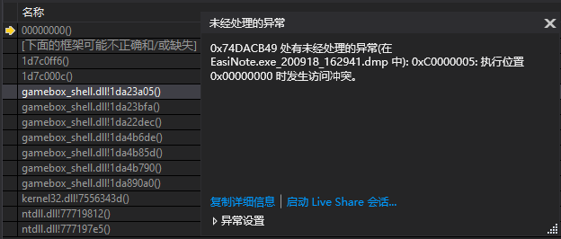

# 上海展盟网络科技有限公司的 gamebox 组件注入进程导致软件崩溃

在某些用户的设备上，会发现自己的软件会在启动之后过一段时间就崩溃了，一个可能的原因是自己的软件被其他广告软件注入了，如 上海展盟网络科技有限公司的 gamebox 组件

<!--more-->


<!-- CreateTime:2020/10/14 16:59:27 -->

<!-- 发布 -->

一个已知问题是海展盟网络科技有限公司的 gamebox 组件将会进行进程注入，在一些软件的进程上，会因为 gamebox_shell.dll 访问了不可访问的内存后，引发 C0000005 错误被系统强行结束

因此如果软件崩溃了，可以尝试拿到 dump 文件，看是否有 gamebox_shell.dll 的存在，如果有，那么也许就是此问题了。调试方法如下

先下载微软极品工具箱 [ProcDump ](https://docs.microsoft.com/en-us/sysinternals/downloads/procdump )

然后使用以下命令启动 procdump 程序

```csharp
 procdump -ma -a 进程PID
``` 

上面的 进程PID 可在软件启动后拼手速快速输入

拿到完整的几百兆的 DUMP 文件后，下载到开发人员计算机上“使用本机调试”

此时也许可以发现异常堆栈出在 gamebox_shell.dll 中，如下图

<!--  -->


或者尝试在用户的电脑上尝试找到 %appdata%\Heinote\gamebox 文件夹是否存在，如果存在，也许就是 [小黑记事本](http://www.heinote.com/) 带了  上海展盟网络科技有限公司的  gamebox_shell.dll  组件，此时尝试删除此软件和对应的文件。如果软件能正常，那么证明是此问题

以下是确定会带上海展盟网络科技有限公司的 gamebox 组件，同时会影响其他软件的软件：

- [小黑记事本](http://www.heinote.com/)
- [快压](http://www.kuaizip.com/)

可能还有更多软件会有此问题，因为他们贴了个[合作方链接](http://www.shzhanmeng.com/company.html)

以下是可能未确定是否会导致问题的软件列表：

- 蓝光护眼大师 （卸载之后，需要手动删除 %appdata%\Heinote\gamebox 文件夹，是其中的 迷你新闻 带入 ）

以上这几个软件也许会让自己的软件在运行过程中没有处理好的情况下崩溃，本质来说和以上这些软件没有很大的关系，是自己的软件没有处理好。但是自己的软件要处理好，还是有一些难度的


<a rel="license" href="http://creativecommons.org/licenses/by-nc-sa/4.0/"></a><br />本作品采用<a rel="license" href="http://creativecommons.org/licenses/by-nc-sa/4.0/">知识共享署名-非商业性使用-相同方式共享 4.0 国际许可协议</a>进行许可。欢迎转载、使用、重新发布，但务必保留文章署名[林德熙](http://blog.csdn.net/lindexi_gd)(包含链接:http://blog.csdn.net/lindexi_gd )，不得用于商业目的，基于本文修改后的作品务必以相同的许可发布。如有任何疑问，请与我[联系](mailto:lindexi_gd@163.com)。