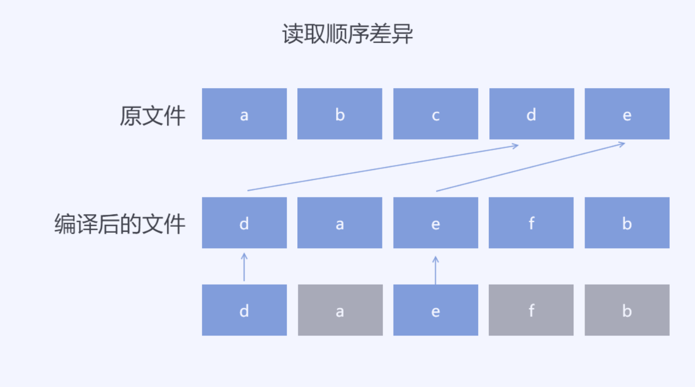
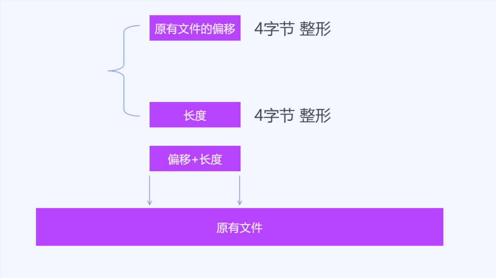

# 二进制数据差异算法 用于减小OTA内容

在当前客户端软件的更新功能，需要在每次客户端升级的时候，下载更新的内容。而客户端下载内容的多少将会决定用户的下载时长以及服务器流量费用。所以我在不断找一个算法，让客户端更新的时候下载的内容更少。在弱网环境，上传和下载的速度受限，在保证每次数据同步的完整下，让每次传输的内容更少也是我最近研究的内容

<!--more-->
<!-- CreateTime:2019/10/27 14:51:22 -->

<!-- 发布 -->

相信大家都用过QQ客户端，不知道小伙伴有没有了解过QQ的更新机制。大概一个完整的QQ客户端是50M左右。而QQ拥有几亿的装机量，假设每次的软件需要做更新，那这部分的下载内容的流量还是很可观的。 通过对比两次更新的文件内容可以发现，其实两次更新之间的内容的文件有一些都是相同的。所以简单的减少下载内容的方法是通过文件查分的方法，通过在服务器比较不同的版本和最新版本之间文件的差异，在服务器端配置不同的版本下载的不同的文件内容，通过清单可以通过下载的差异文件和当前版本的文件拼出新版本的文件。通过这个方法能节省很多的下载内容，特别是在相邻的版本，这里的文件差异很少，很多文件都不需要下载

但在客户端开发的时候，如果因为某个版本需要发布补丁，此时的开发很多都是修改某些代码的逻辑，改动只是几个文件的很少的内容。但是按照上文的方法，只要文件更改了，就需要重新下载这个文件。而从二进制对比的数据的不同却是很小，我在找了很多方法之后，提出了本文的算法。应该是我 没有找到一个对的关键字，我现在的算法是我了解的算法对客户端更新优化最好的算法

在客户端更新的文件里面，不同的版本的相同文件的更改，会因为编译优化的不同，更改了文件里面数据的存放顺序。如我对其中的某个代码文件的更改，会让生成的编译后文件的数据发生了更改。如果通过顺序的比较两个文件的差异，也就是尝试通过顺序的方式从原有的文件的二进制数据顺序找到编译后的文件的内容有时能找到的内容很少。如下面例子

我的原有文件假设数据可以分为 a b c d e 三个不同的范围，在编译后的文件会将其中的c更改为f但是编译后的文件组织是 d a e f b 的内容。按照顺序查找，第一个范围 d 将会让顺序查询跳到了原有文件的 d 所在范围，也就是后续的 a 和 e 将会在原有文件的查找错过。这个方法是我找到的对比二进制差异的算法，这个方法对做文件对比很好用，但是我现在的算法是需要找到更小的内容可以还原编译后的文件

<!--  -->

<!--  -->

现在可以知道本文需要解决的问题是，我已知一个存在的二进制文件，和更改后的二进制文件，求一个最小的差异文件可以用算法通过存在的二进制文件还原出更改后的二进制文件

我的算法是不进行顺序对比，更多的是进行查找。我定义两个数据结构，这个数据结构是算法的核心。第一个数据结构包含两个属性，第一个属性是一个4个字节的整形，表示在原有文件的偏移，第二个属性也是一个4个字节的整形，表示长度。这个数据结构表示在原有文件的一个范围的数据，通过一个偏移和一个长度可以拿到原有文件的一个范围。例如从原文件拿到从第1字节到第10字节的范围，就可以用这个数据结构表示。从这个数据结构也可以看到，本文的算法能支持的文件大小最大也就是2G大小，因为使用4个字节作为偏移，能表示的原有文件的长度也就是2G大小。在本文需要解决的文件，客户端更新的下载内容，很少会有一个客户端的更新有这么大，同时本算法主要针对单个文件。在客户端更新一般都是下载一个压缩包，这个压缩文件里面将会包含很多小的单个文件，这个算法主要是在压缩包里面的单个文件使用。在拿到单个文件的差异文件之后，再将差异文件压缩到压缩包，然后将这个压缩包发布

<!--  -->

第二个数据结构，包含一个4个字节的整形和一个数组。第一个属性用4个字节表示后面的属性的数组长度。第一个属性表示长度的符号用的是 -1 用于和第一个数据结构分开。也就是4个字节判断符号就可以知道是第一个数据结构还是第二个数据结构。第二个数据结构表示新的文件的内容

<!--  -->

假设现在拿到了一个差异文件，这个差异文件将会这样组织。在差异文件的开始将会根据业务写入一定长度的文件头，这部分不是算法的内容，就跳过。这段数据的作用会根据不同的业务写入不同的内容，有的包括文件的校验和版本。跳过了这部分内容，接下来将会读取一个4个字节整形，根据这个整形的内容判断是原有文件范围数据结构还是新的文件数据结构，通过整形的符号判断。如果是原有文件范围数据，那么继续读取一个4个字节整形，这样就获取了原有文件范围。如果是新的文件数据结构，那么继续读取这个整形去掉符号之后的长度，拿到数据

<!--  -->

假设拿到了差异文件，可以通过这个算法计算出新的文件。按照读取的数据结构填充到新的文件里面，这个算法需要申请一个变量用于存放新的文件的写入长度，假设读取到原有文件的范围数据，那么读取原有文件的范围数据，追加写入到新的文件里面，追加写入的方法则是在新的文件的写入长度后面写入数据。如新的文件的写入长度为0也就是还没有数据，读取到数据结构是原有文件的范围数据，那么通过第一个属性原有文件的偏移和第二个属性长度拿到范围数据，读取原有文件数据，假设是从0读取10个字节，那么将读取的字节写入到新的文件，从第0的长度写入，写入之后将新的文件的写入长度设置为10也就是这10个数据写入。有些开发框架提供了文件追加写入的方法，如果有提供追加写入，那么每次追加写入就可以不需要自己计算新的文件写入长度。但是有些业务为了提升性能，会在差异文件头写入新的文件长度，在开始写入就申请了磁盘空间，就需要自己存文件写入长度

<!--  -->

假设拿到的数据结构是新的文件的数据，那么从差异文件按照第一个数据读取数组，追加写入到新的文件

<!--  -->

在差异文件包含的数据是原有文件存在的数据范围和新的文件的数据，通过原有文件存在的数据和只有新的文件才存在的数据，就能计算新的文件。因为写入的是新的文件的顺序写入，所以不需要有更多属性用来记录新的文件的偏移，只需要不断读取差异文件和原有文件写入新的文件

差异文件的生成是算法的关键

算法的核心是将原有文件当成字典，在原有文件里面尽可能找到更多数据。也就是新的文件的数据因为是从原有文件里面修改，同时不关注修改的方式，此时尝试将原有文件作为字典，从原有文件里面找到对应的数据。从这里也能看到算法的不足在于不关注修改的方式，如果对特定的二进制文件的修改方式还能对特定业务进行更大的优化，这部分将会在主要算法介绍之后详细介绍

创建差异文件可以认为创建差异的二进制数组。创建方法是拿到原有文件和新的文件，先读取8个字节，放入到匹配数据，用这8个字节从原有文件查询是否存在匹配的数据。如果能从原有的文件查询到匹配的数据，那么记录当前查询到的数据的偏移，再从新的文件读取一个字节放入到匹配数据，此时的匹配数据就存在 9 个字节。为了提升性能，从当前查询到的数据的偏移加上匹配数据长度后再读取一个字节判断是否依然匹配，如果匹配，则继续读取新的文件的一个字节放入到匹配数据，继续从原有文件再读取一个字节判断是否匹配。循环直到新的文件结束或原有的文件读取到的数据不匹配。如果是新的文件结束，那么差异文件就完成。如果读取原有文件数据和匹配数据不符，那么尝试从当前查询到的数据的偏移继续往后查询是否存在匹配数据，如果查询到匹配数据则继续读取新的文件下一个字节到匹配数据，按照上面方法继续查询。循环直到新的文件结束或从原有文件无法再找到任何数据匹配。在从原有文件找不到任何数据匹配，此时进入评估算法。评估算法的作用是判断这个匹配的序列如果更改之后是否可以找到更多的内容，如果评估算法发现没有更优的方法，则在差异文件记录上一次匹配的原有数据偏移和长度

评估算法解决的问题是在某些数据在去掉前几项字节的时候能找到的长度更长，如以下数据 12345 中，如果读取前三个字节 123 作为匹配，在数据 123 2345 中寻找匹配，可以看到在读取到 123 就能找到最长匹配，因为继续读取下一个字节，作为 1234 是找不到匹配。而此时如果去掉了第一个字节，也就是作为 23 能找到两个匹配，而继续读取下一个字节，作为 234 依然能找到匹配，继续读取 2345 也能找到匹配，也就是此时的最长长度是 2345 一共是 4 个字节，会比原先的 123 更优。也就是在拿到当前最长的匹配之后，需要尝试去掉前几项字节继续按照上面方法计算匹配，如果去掉之后能找到更多的匹配，则进行评估。如果不能则没有更优的方法，如上文记录。在找到更多匹配的时候，进行评估是因为不一定找到更长的匹配长度会比原先的匹配能减少的差异文件长度更长。因为去掉的字节相当于作为新的文件才存在的数据，需要写入到差异文件。按照定义写入的差异文件至少包含了两个字节。也就是在去掉匹配的1个字节之后，将会给差异文件带来2个字节长度，其中一个字节是描述长度，第二个字节就是这个被去掉的字节。也就是需要比原先的匹配多匹配两个字节以上才有优化。可以做出这样的约定，记从原先匹配去掉的字节数量为 n 项，而新的匹配可以比原先的匹配多匹配 l 项，如果此时的 l 项大于等于 8 也就是相当于此算法的另一次重新匹配，那么则依然采用原先的匹配为最优，因为如果 l 大于等于 8 也就是开启新的一次匹配效果会更好，开启一次新的匹配刚好最少能匹配 8 个字节，而开启一次新的匹配在差异文件里面将会占用2个字节的长度，对比去掉的字节数量 n 需要占用 n+1个字节长度来说，最差情况也只是和去掉一个字节相同。如果此时的 l 大于 n+1 也就是选用去掉 n 个字符能多节省长度，那么选用当前匹配为最优匹配。如果此时的 l 等于 n+1 也就是无论选用原先的匹配还是选用当前的匹配占用的差异文件的长度都相同，此时需要评估的是在当前新的文件读取的匹配里面，前一个值是否是作为仅新的文件存在的数据写入，如果是的话，那么选用当前的匹配，将去掉的 n 个字节追加到前一个值里面。也就是说虽然上文说到去掉 n 个字节时需要在差异文件占用 n+1 个字节长度，但这是忽略上下文的说法，也就是如果前一个值已经是作为数据写入的，那么后续追加的值将只需要 n 的长度。反过来如果此时前一个值是作为原有文件的匹配范围的，那么这选用原先的匹配，因为后续匹配的内容也可能是原文件不存在的数据，此时可以和后续的合并在一起。整个评估算法相当于回溯，如果将本算法用在做客户端减少下载内容上，那么请忽略评估算法，因为评估算法能带来的实际优化是特别少的，但是能带来很大的复杂度

如果读取的8个字节到匹配数据无法在原有文件找到任何数据匹配，那么将新的文件读取的范围偏移一个字节，也就是假设原来从新的文件的第1个字节读取到第8个字节，发现没有在原有文件找到数据匹配，则从第2个字节读取到第9个字节。记录下新的文件的读取跳过范围，然后不断读取记录，直到可以从原有文件找到匹配数据，在从原有文件找到匹配数据的时候，则继续上文的方法。此时在上文的方法结束之后，记录到差异文件之前，需要将之前记录的新的文件的读取跳过内容，这些内容将会是新的文件存在的差异内容，或因为碎片化的内容，这部分内容需要通过范围用第二个数据结构记录。获取范围的长度，用-1符号记录到长度属性，将范围的数据记录到数据属性，写入到差异文件。这部分内容将会是作为在原有文件没有找到的内容，没有找到的原因有两个，第一个原因是这是新的文件添加的内容，同时这部分内容在原有文件没有找到。第二个原因是新的文件因为修改了部分内容让原有内容存在碎片，例如原有数据的8个字节，其中的第5个字节和第7个字节被更改，此时的第6个字节就是碎片，虽然有时从原有文件里面找到第6个字节，但是这样拿到的数据长度不会变小

用算法的语言描述是

1. 从新的文件读取匹配数据
1. 尝试从原有文件中找到匹配数据
1. 如果找到匹配则
  1. 记录匹配数据范围
  1. 如果找到匹配则加长匹配数据长度继续寻找匹配，直到找不到匹配
    1. 如果进入评估算法之后发现没有更优解则进入下一步
    1. 将找到的匹配范围按照上文方法写入到差异文件
    1. 跳转到第一步
1. 如果找不到匹配 则
  1. 将匹配的第一个字节写入到动态数组 nf 中
  1. 从匹配中移除第一个字节
  1. 从新的文件继续读取一个字节加入到匹配的最后
  1. 如果此时能从原有文件中找到匹配数据则
    1. 将 nf 加上 nf 长度写入到差异文件
    1. 跳转到找到匹配的步骤

用图描述会比较好看，先是尝试在原有文件找到最长的存在的数据，本算法的核心也就是在原有文件找到更多存在的数据，找到越多或越连续都能减少更多的差异文件内容

<!--  -->

<!--  -->

<!--  -->

<!--  -->

以上就是能在原有文件找到匹配的，如果选择的匹配在原有文件找不到，那么就需要修改匹配的内容了，修改方法就是去掉匹配的第一个字节，然后从原有文件再读一个字节加入到最后

为什么启始的数据字节长度选的是8个字节，因为如果可以从原有文件找到数据，在差异文件需要用两个4个字节的数据表示，也就是刚好是8个字节，所以如果选的字节长度小于8个字节，即使可以找到也不能减少差异文件的内容

通过测试了本文的方法，我尝试拿到某个软件的两次更新的安装包，将安装包里面的文件内容逐个计算差异文件，然后查看这些差异文件的总大小。安装包大小是100M左右，去掉两个版本完全相同的文件之后剩下20M左右，在此基础上计算差异文件，差异文件总大小是200k大小。而获取某次补丁的更新的文件，在去掉两个版本完全相同的文件之后剩下7M大小，而补丁的内容只是修改了两个资源文件的内容，差异文件大小只需要5k大小

本文的算法的不足在于计算时间很长，本文用到的匹配算法使用的是现有的算法，而软件的更新的差异文件的计算是在服务器进行，而软件的更新也不是实时的。同时本文的算法也限制了超级长的文件，最大的文件只有2G大小，在服务器可以在计算差异文件之后再发布。而通过差异文件和原有文件计算新的文件的速度很快，也就是不断读取差异文件和原有文件写入到新的文件。所以本文的算法很适合用在软件更新

如果是弱网环境的数据同步，主要是从服务器下载数据的，同时数据没有实时要求，其实在弱网环境很少会有实时的要求，那么这个算法也适合

现在QQ和Tim的更新都是使用 BSDiff 算法，而 Chrome 用的是 Courgette 算法，这个算法是在 BSDiff 基础上优化的

本算法适合用在二进制的客户端或资源的更新，也就是每次的文件更改都是少部分的，同时是因为编译的更改。这部分的更改基本都是替换二进制。如对一个 .NET 的程序，如果在 VisualStudio 没有开启确定性构建，此时修改了一个类里面的方法和属性，那么在编译的过程，为了优化，可能会修改这个类编译后的二进制序列在编译后文件的所在地方。此时对原有文件最小的改动其实只是修改一个方法编译后的二进制序列。而如果按照顺序查看差异，可能找到的是大量序列被更改，因为假定每个类编译后的二进制序列都是一段一段，而多次编译的编译后的类二进制序列的段顺序可能被更改。如原先是按照类1类2类3这个顺序组织，但是下次编译可能就是按照类2类1类3的顺序组织。本文的算法能够很好处理顺序被修改的二进制文件，所以适合用来软件更新

而对于其他的业务，如对二进制数据的特殊修改，那么本身算法会比特定业务优化的差，如有业务需要将一个二进制序列逆序保存，此时保存之后的新的文件，用本算法计算将会发现新的文件和原有的文件完全不同，无法在原有的文件找到任何有用数据。而如果是对这个业务做到特殊优化，那么可以通过记录当前是对原有文件进行逆序，这样就能减少差异文件大小