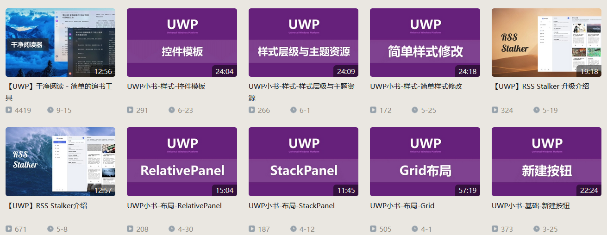

# 云之幻 UWP 视频教程

云之幻小伙伴在 B 站发了好多很好的教程视频，特别适合新手，欢迎小伙伴观看

<!--more-->
<!-- CreateTime:2019/10/14 21:08:26 -->

<!-- csdn -->

B 站链接 [云之幻的个人空间 - 哔哩哔哩 ( ゜- ゜)つロ 乾杯~ Bilibili https://space.bilibili.com/5992670/video ](https://space.bilibili.com/5992670/video )

<!--  -->

 本作品采用<a rel="license" href="http://creativecommons.org/licenses/by-nc-sa/4.0/">知识共享署名-非商业性使用-相同方式共享 4.0 国际许可协议</a>进行许可。欢迎转载、使用、重新发布，但务必保留文章署名[林德熙](http://blog.csdn.net/lindexi_gd)(包含链接:http://blog.csdn.net/lindexi_gd )，不得用于商业目的，基于本文修改后的作品务必以相同的许可发布。如有任何疑问，请与我[联系](mailto:lindexi_gd@163.com)。
