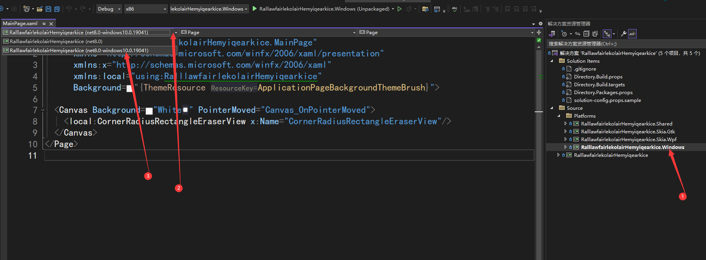
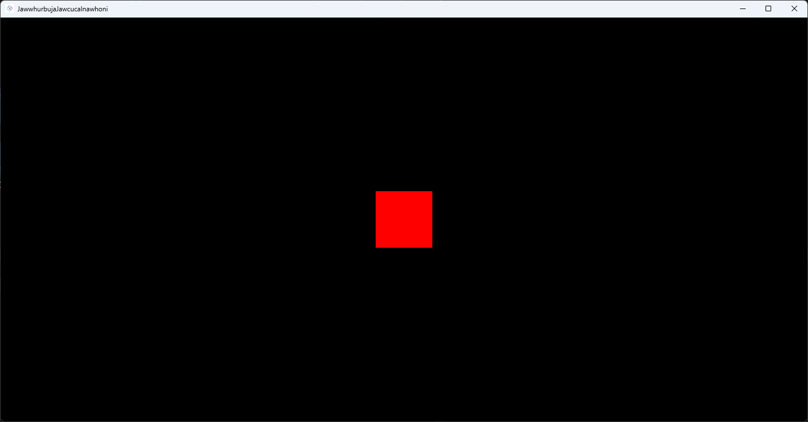

# 从 WPF 搬迁到 UOS 下的 UNO 的笔记

本文记录我将一个小 WPF 应用搬迁到 UNO 框架，用于支持统信 UOS 系统时开发经验

<!--more-->
<!-- CreateTime:2023/9/20 15:42:36 -->

开始之前先说一下我的需求，我现在有一个[小的 WPF 应用](https://github.com/dotnet-campus/dotnetCampus.Ipc/blob/100ac217ef8e570c0fc263db251bf9fc35bcf8cb/demo/dotnetCampus.Ipc.WpfDemo/)。现在我需要在统信 UOS 系统和 Windows 系统上都能够运行这个 WPF 应用

众所周知当前的 dotnet 系可选的多平台开发框架有很多，这一次我准备尝试使用 UNO/MAUI 的方式进行开发，大的技术架构如下图

<!--  -->


如上图，在 Windows 上依然采用 WPF 框架，只是这时的 WPF 框架是作为底层框架使用，业务代码大部分不会直接接触 WPF 框架，只有部分平台兼容适配代码才会接触 WPF 框架。其他的业务代码都是通过 UNO 和 MAUI 框架间接使用到 WPF 框架。在 UOS 系统上，是采用 GTK 应用框架进行承载，同理也只有平台兼容适配代码才会接触 GTK 应用框架，大部分业务代码不会直接碰到

然后总的渲染层使用 SKIA 来保证多个平台的渲染效果一致

## 日常开发

新建项目的时候记得勾选 Windows 项目，如此将可以生成 WinUI3 项目。通过编写代码的时候选用 WinUI 3 项目，即可获取 XAML 代码智能提示。调试的时候优先选用 WinUI 3 项目调试界面布局，可以直接使用 Visual Studio 对 WinUI 3 的热重载支持，效果更好

推荐同步也加上 Skia.WPF 和 Skia.GTK 项目，其中 GTK 可以同时在 Windows 和 Linux 系统上跑，但 GTK 在 Windows 上可能有一些奇奇怪怪的问题，此时换成 Skia.WPF 好了，毕竟真的发布在 Windows 平台的也不会那么想不开用 GTK 做底层

当前 UNO 对于 XAML 智能提示，需要切换 XAML 使用 WinUI3 项目的编辑界面，否则将无法显示正确的 XAML 智能提示且出现大量的 XAML 报错。切换 XAML 使用 WinUI3 项目的编辑界面，需要先存在 WinUI3 项目，即在新建项目的时候需要勾选 Windows 项目，然后点击 XAML 选项卡下的项目，切换到 WinUI3 项目，如下图所示

<!--  -->


详细请参阅 [Intellisense not working, but project compiles · Issue #15517 · unoplatform/uno](https://github.com/unoplatform/uno/issues/15517 )

### 构建输出同步

我是在 Windows 设备上进行开发的，在虚拟机里面运行 UOS 系统的。我需要在 Windows 上进行构建，将构建输出的内容在 UOS 系统上运行

我使用的是我所在的团队在 https://github.com/dotnet-campus/dotnetcampus.DotNETBuildSDK 上开源的 SyncTool 工具进行同步

方法是先在 Windows 设备上进行项目的发布，即使用如下命令行进行发布，其中 `--self-contained true` 是可选的，因为参与开发的 UOS 本身就是安装了全开发包的系统

```
dotnet publish -c debug -r linux-x64 --self-contained true
```

接着在 Windows 和 UOS 上使用如下命令安装好 SyncTool 工具

```
dotnet tool install -g dotnetCampus.SyncTool
```

定位到 Windows 设备上的发布输出文件夹，使用如下命令行开启文件同步服务，用于将发布输出文件夹提供同步服务，让其他端，即 UOS 系统上可以将发布的文件拉下来

```
SyncTool serve
```

查看以上命令所监听的端口，以及当前 Windows 系统所采用的本地 IP 地址，如有弹出防火墙限制请放行

在 UOS 系统上，进入到一个空闲的文件夹，执行以下命令设置同步

```
SyncTool sync -a http://123.123.123.123:555
```

以上命令的 `http://123.123.123.123:555` 请替换为你在 Windows 系统上运行 `SyncTool serve` 所监听的端口以及 Windows 系统上所采用的 IP 地址

如此即可完成同步的初始化设置，完成初始化之后，以后的每次发布都会自动同步文件

换句话说，配置完成同步之后，即可在 Windows 端进行发布，然后切换到 UOS 上即可运行发布后的新版本应用。全过程都是自动化的，用起来感觉不错。且在 SyncTool 里面处理了文件占用重试逻辑，整体感觉会更好

## 文本

### 在 UOS 闪烁黑屏问题

这是 OpenGL 的问题，修复方法请看

[dotnet 在 UOS 统信系统上运行 UNO 程序输入时闪烁黑屏问题](https://blog.lindexi.com/post/dotnet-%E5%9C%A8-UOS-%E7%BB%9F%E4%BF%A1%E7%B3%BB%E7%BB%9F%E4%B8%8A%E8%BF%90%E8%A1%8C-UNO-%E7%A8%8B%E5%BA%8F%E8%BE%93%E5%85%A5%E6%97%B6%E9%97%AA%E7%83%81%E9%BB%91%E5%B1%8F%E9%97%AE%E9%A2%98.html )

### 中文文本乱码

中文文本乱码是因为中文字体没有正确加载，在 UOS 默认有思源黑体字体，在 GTK 会自动做字体回滚，只需要应用设置为微软雅黑即可。设置为微软雅黑可以让应用在 Windows 系统和 UOS 系统上都能显示正常的黑体字体

设置方法如下

```xml
<TextBlock Text="解决 UOS 中文乱码" FontFamily="Microsoft YaHei UI"/>
```

微软雅黑在界面上记得使用 `Microsoft YaHei UI` 字体，带 `UI` 的字体。否则你将会看到一些字体布局有些奇怪

或者是设置全局的文本控件样式，大概的定义如下，以下代码放在 AppResources.xaml 里面，以下是使用 Material 样式时才如此定义。可以看到核心就只是添加了 FontFamily 属性的值

```xml
  <Style x:Key="PrimaryButtonStyle" TargetType="Button" BasedOn="{StaticResource FilledButtonStyle}">
    <Setter Property="FontFamily" Value="Microsoft YaHei UI"></Setter>
  </Style>
  <Style TargetType="Button" BasedOn="{StaticResource PrimaryButtonStyle}"/>

  <Style x:Key="PrimaryTextBlockStyle" TargetType="TextBlock" BasedOn="{StaticResource BodyMedium}">
    <Setter Property="FontFamily" Value="Microsoft YaHei UI"></Setter>
  </Style>

  <Style TargetType="TextBlock" BasedOn="{StaticResource PrimaryTextBlockStyle}"/>
```

以上代码的 `FilledButtonStyle` 是 Material 样式系带进来的，详细请参阅 [Material Controls Styles](https://platform.uno/docs/articles/external/uno.themes/doc/material-controls-styles.html )

如果不带任何样式，可以使用如下代码

```xml
    <!-- 通用样式，用来定义字体，修复乱码 -->
    <Style x:Key="PrimaryButtonStyle" TargetType="Button">
        <Setter Property="FontFamily" Value="Microsoft YaHei UI"></Setter>
    </Style>
    <Style TargetType="Button" BasedOn="{StaticResource PrimaryButtonStyle}"/>

    <Style x:Key="PrimaryTextBlockStyle" TargetType="TextBlock">
        <Setter Property="FontFamily" Value="Microsoft YaHei UI"></Setter>
    </Style>

    <Style TargetType="TextBlock" BasedOn="{StaticResource PrimaryTextBlockStyle}"/>
```

### TextBox 撑开空间

如果有内容是依赖 TextBox 的输入过程时的测量撑开的空间的，那撑开的空间将可能不对，比如以下代码

```xml
      <TextBox HorizontalAlignment="Center" FontSize="50"></TextBox>
```

如此的逻辑将会在输入的过程看到文本内容被裁剪，基本在 Skia.WPF 和 Skia.GTK 项目下可以看到文本内容被裁剪

<!--  -->


<!--  -->


暂时只能绕路，现在是 UNO 5.0 版本，依然难以修复此问题

### TextBox 的最小高度

最小高度依然会比预期的更高一些，只能修改界面设计，绕路

### TextBox 的滚动条

比如滚动最底，可以使用如下代码

```csharp
        private void ScrollToBottom(TextBox textBox)
        {
            //textBox.Spy();
            if(textBox.VisualDescendant<ScrollViewer>() is { } scrollViewer)
            {
                scrollViewer.ChangeView(0.0f, scrollViewer.ExtentHeight, 1.0f, true);
            }
        }
```

这个 VisualDescendant 方法是辅助方法，代码如下

```csharp
    static class TreeExtensions
    {
        public static T? VisualDescendant<T>(this UIElement element) where T : DependencyObject
            => VisualDescendant<T>((DependencyObject) element);

        public static T? VisualDescendant<T>(DependencyObject element) where T : DependencyObject
        {
            if (element is T)
            {
                return (T) element;
            }

            T? foundElement = default;
            for (var i = 0; i < VisualTreeHelper.GetChildrenCount(element); i++)
            {
                var child = VisualTreeHelper.GetChild(element, i);
                foundElement = VisualDescendant<T>(child);
                if (foundElement != null)
                {
                    break;
                }
            }

            return foundElement;
        }
    }
```

此方法对于 ListView 等也一样有用。核心就是通过爬视觉树找到 ScrollViewer 对象，通过 ScrollViewer 控制滚动

以上代码注释掉的 `textBox.Spy();` 是我在调试下输出界面，方便调试是否获取正确滚动条，详细请看 [dotnet UNO 如何在调试下输出界面层级结构](https://blog.lindexi.com/post/dotnet-UNO-%E5%A6%82%E4%BD%95%E5%9C%A8%E8%B0%83%E8%AF%95%E4%B8%8B%E8%BE%93%E5%87%BA%E7%95%8C%E9%9D%A2%E5%B1%82%E7%BA%A7%E7%BB%93%E6%9E%84.html )

## 几何系列

### 几何图形 StreamGeometry 资源

在 WPF 里面，经常有图标使用的是 Path 几何路径，作为矢量图标，放入到 StreamGeometry 资源里面。由单个 Path 制作的 StreamGeometry 资源可以通过 `x:String` 的方式在 UNO 里替换，如下面代码是一个原先放在 WPF 资源里的图标

```xml
    <StreamGeometry x:Key="Geometry.Close">
        M18.363961,5.63603897 C18.7544853,6.02656326 18.7544853,6.65972824 18.363961,7.05025253 L13.4142136,12 L18.363961,16.9497475 C18.7544853,17.3402718 18.7544853,17.9734367 18.363961,18.363961 C17.9734367,18.7544853 17.3402718,18.7544853 16.9497475,18.363961 L12,13.4142136 L7.05025253,18.363961 C6.65972824,18.7544853 6.02656326,18.7544853 5.63603897,18.363961 C5.24551468,17.9734367 5.24551468,17.3402718 5.63603897,16.9497475 L10.5857864,12 L5.63603897,7.05025253 C5.24551468,6.65972824 5.24551468,6.02656326 5.63603897,5.63603897 C6.02656326,5.24551468 6.65972824,5.24551468 7.05025253,5.63603897 L12,10.5857864 L16.9497475,5.63603897 C17.3402718,5.24551468 17.9734367,5.24551468 18.363961,5.63603897 Z
    </StreamGeometry>
```

在 WPF 里面，假定是设置在按钮上，作为图标按钮的，可以定义一个样式，大概内容如下

```xml
    <Style x:Key="Style.TitlebarButton" TargetType="Button">
        <Setter Property="Background" Value="Transparent" />
        <Setter Property="Foreground" Value="#808080" />
        <Setter Property="Width" Value="24"/>
        <Setter Property="Height" Value="24"/>
        <Setter Property="Template">
            <Setter.Value>
                <ControlTemplate TargetType="{x:Type ButtonBase}">
                    <Grid Background="{TemplateBinding Background}" UseLayoutRounding="True">
                        <Path Fill="{TemplateBinding Foreground}"
                              Data="{Binding Path=Content, RelativeSource={RelativeSource TemplatedParent}}">
                        </Path>
                    </Grid>
                </ControlTemplate>
            </Setter.Value>
        </Setter>
```

具体的业务代码使用的代码大概如下

```xml
<Button Style="{StaticResource Style.TitlebarButton}" Content="{StaticResource Geometry.Close}"/>
```

搬运到 UNO 之后，将 StreamGeometry 类型的资源修改为 `x:String` 资源，如以下代码

```xml
<x:String x:Key="Geometry.Close">M18.363961,5.63603897 C18.7544853,6.02656326 18.7544853,6.65972824 18.363961,7.05025253 L13.4142136,12 L18.363961,16.9497475 C18.7544853,17.3402718 18.7544853,17.9734367 18.363961,18.363961 C17.9734367,18.7544853 17.3402718,18.7544853 16.9497475,18.363961 L12,13.4142136 L7.05025253,18.363961 C6.65972824,18.7544853 6.02656326,18.7544853 5.63603897,18.363961 C5.24551468,17.9734367 5.24551468,17.3402718 5.63603897,16.9497475 L10.5857864,12 L5.63603897,7.05025253 C5.24551468,6.65972824 5.24551468,6.02656326 5.63603897,5.63603897 C6.02656326,5.24551468 6.65972824,5.24551468 7.05025253,5.63603897 L12,10.5857864 L16.9497475,5.63603897 C17.3402718,5.24551468 17.9734367,5.24551468 18.363961,5.63603897 Z</x:String>
```

其他的代码基本都和 WPF 相同，如下面的 UNO 的按钮样式，可以看到和 WPF 的相同。实际应用里面，可能需要去掉一些 WPF 专有的属性，比如 FocusVisualStyle 属性，以及为了界面效果更好添加一些 UNO 的属性

```xml
        <Style x:Key="Style.TitlebarButton" TargetType="Button">
            <Setter Property="Background" Value="Transparent" />
            <Setter Property="Foreground" Value="#808080" />
            <Setter Property="Width" Value="24"/>
            <Setter Property="Height" Value="24"/>
            <Setter Property="Template">
                <Setter.Value>
                    <ControlTemplate TargetType="ButtonBase">
                        <Grid Background="{TemplateBinding Background}">
                            <Path Fill="{TemplateBinding Foreground}" Data="{TemplateBinding Content}"></Path>
                        </Grid>
                    </ControlTemplate>
                </Setter.Value>
            </Setter>
        </Style>
```

具体的业务使用方代码不变，以下是 UNO 的按钮，可以看到和 WPF 的按钮的代码是相同的

```xml
<Button Style="{StaticResource Style.TitlebarButton}" Content="{StaticResource Geometry.Close}"/>
```

### PathGeometry

有部分不受支持，请进行多平台测试，需要绕路

### GeometryDrawing

绕路，请使用多个 Path 界面控件代替，一般代替方法为创建一个 Canvas 容器，在容器里面存放多个 Shape 元素，从而实现类似与 GeometryDrawing 的效果。所添加的 Canvas 容器记得设置正确的尺寸，防止裁剪或界面看不见

```xml
 <Canvas x:Name="GeometryDrawingPanel" Width="30" Height="45">
    <!-- 防止 Canvas 尺寸是 0 导致元素看不见 -->
 </Canvas>
```

### Geometry.Parse

从字符串创建出 Geometry 的 `Geometry.Parse("M0,0L1,1")` 等类似的转换代码为无法在后台代码实现，推荐在 XAML 里面，使用 Path 和 Data 属性进行代替

```xml
<Path
  Data="M0,0L1,1" Fill="#F2EEEB"/>
```

在 UWP 和 WinUI3 以及 UNO 上，没有直接提供从 SVG Path (mini-lang) 转换为 Geometry 的方法，唯一的转换就是通过 XAML 设置 Path 的 Data 的方式

强行后台代码转换的方式如下

```csharp
string data = "M 100,200 C 100,25 400,350 400,175 H 280";
Path path = XamlReader.Load("<Path Data='" + data + "'/>") as Path;
```

详细请参阅 [c# - Convert path to geometric shape - Stack Overflow](https://stackoverflow.com/q/22989172/6116637 )

可能存在 FillRule 为 EvenOdd 和 Nonzero 的不同行为差异，此差异性问题已经被我在 [fix(Skia): Fix ineffective FillRule setting for StreamGeometry by lindexi · Pull Request #15888 · unoplatform/uno](https://github.com/unoplatform/uno/pull/15888 ) 修复，预期后续版本不会遇到此问题

## XAML 系列

### x:Static

静态绑定不受支持，只能绕路，比如使用再定义一个实例属性，让这个实例属性引用静态量，再绑定到实例属性

或者是有一些从静态属性搬到资源字典

比如原本在 WPF 是这样写的

```csharp
    public static class BooleanToVisibility
    {
        public static IValueConverter CollapsedWhenTrue { get; private set; } = new VisibilityConverter
        {
            Visible = false,
            Collapsed = true
        };
    }

    <Border Visibility="{Binding Foo, Converter={x:Static uiConverters:BooleanToVisibility.CollapsedWhenTrue}}"/>
```

在 UNO 更改使用资源字典

```xml
    <UserControl.Resources>
        <uiConverters:VisibilityConverter x:Key="CollapsedWhenTrue" Visible="False" Collapsed="True"/>
    </UserControl.Resources>

    <Border Visibility="{Binding Foo, Converter={StaticResource CollapsedWhenTrue}}">
```

### design 设计时

设计时可正常使用，推荐给 Page 等 XAML 的 UI 界面搭配上 `d:DataContext` 使用，此时切换到 WinUI 3 框架时，可以让 ReSharper 和 VisualStudio 开森，可以在绑定时提供智能提示

但如果写了 `d:DataContext` 时提示 WMC0011 错误，错误信息如下时，则可能忘记将 `d:` 命名空间加入忽略

XamlCompiler error WMC0011: Unknown member 'DataContext' on element 'Page'

以上错误的原因是没有将 `d:` 命名空间加入到 `mc:Ignorable` 列表里面，导致存在不认识的命名空间而失败。修复方法是将 `d:` 加入忽略列表，如以下代码

```xml
mc:Ignorable="d"
```

以上代码要求在 xaml 里面已经添加 mc 命名空间，如以下代码

```xml
      xmlns:d="http://schemas.microsoft.com/expression/blend/2008"
      xmlns:mc="http://schemas.openxmlformats.org/markup-compatibility/2006"
      mc:Ignorable="d"
```

加上之后的代码如下

```xml
      xmlns:d="http://schemas.microsoft.com/expression/blend/2008"
      xmlns:mc="http://schemas.openxmlformats.org/markup-compatibility/2006"
      mc:Ignorable="d"
      d:DataContext="{d:DesignInstance local:BindableMainModel}"
```

以上这部分代码和 WPF 相同，直接抄即可

### 类型是自定义控件类型将构建失败

非必现问题，复现步骤：

1. 创建一个自定义控件，无 XAML 类型，仅类型定义，比如 `public partial class Foo : ContentControl` 的方式的定义
2. 创建一个带 XAML 的自定义控件，将其基础类型更改为 Foo 类型

构建可能提示如下错误，且在 `Skia.WPF` 和 `Skia.Gtk` 项目能够构建通过

Fx.xaml(1,2): XamlCompiler error WMC0001: Unknown type 'Foo' in XML namespace 'clr-namespace:LindexiDemo;assembly=LindexiDemo, Version=0.0.0.0, Culture=neutral, PublicKeyToken=null'

遇到此错误只能绕路，去掉控件之间的继承

此问题可能换成新的 `<Project Sdk="Uno.Sdk">` 可以修复，但是由于非必现问题，我暂时没有复现步骤

### 命名空间引用错误

这个常见于拷贝代码过程中，即在 WPF 这边的 `xmlns:foo="clr-namespace:Xxxxx` 中的 `clr-namespace` 应该是被替换为 `using` 才对。此类问题在于会在 XAML 代码里面发现明明类型能够找到，但是构建过程中却报错说找不到类型，如更明确的 `XamlCompiler error WMC0909: Cannot resolve DataType foo:Xxxxx` 错误

以下代码是错误的：

```xml
xmlns:foo="clr-namespace:Xxxxx"
```

以下代码是正确的：

```xml
xmlns:foo="using:Xxxxx"
```

除了拷贝代码可能的出错，也有可能是 ReSharper 在修改类型的命名空间的时候，自动向 XAML 添加的代码错误


## 图片资源

图片资源可以使用相对路径或绝对路径，在UNO的绝对路径的格式如下

```xml
<Image Source="ms-appx:///[MyApp]/Assets/MyImage.png" />
```

以上代码的 `[MyApp]` 是可选的，但是我推荐加上，这个 `[MyApp]` 对应的是程序集名

默认的图片都是被作为 `Content` 引用的，可以在 csproj 项目文件看到如下代码

```xml
<Content Include="Assets\**;**/*.png;**/*.bmp;**/*.jpg;**/*.dds;**/*.tif;**/*.tga;**/*.gif" Exclude="bin\**;obj\**;**\*.svg" />
```

新添加的图片文件，默认是不需要做什么修改的，但为了兼容平台考虑，推荐使用 png 和 jpg 和 bmp 格式，这几个格式所有平台都支持。如果发现自己的图片没有显示，请按照如下顺序定位

- 先看看是否改了 csproj 将自己的图片忽略掉
- 尝试写资源使用绝对路径
- 逐字符对比绝对路径是否正确
- 逐字符对比是否写的是 `ms-appx:///` 字符串开始，需要使用的是三个 `/` 字符
- 如果依然看不到图片，再看看是不是没有生成试试重新生成
- 依然不行再看看是不是图片格式比较诡异，比如将 webp 图片后缀名改为 png 等

图片当成资源字典的内容，可以使用 BitmapImage 类型，和 WPF 相同，只是 Source 的内容在绝对路径下需要更改，如以下例子

```xml
<BitmapImage x:Key="Image.Logo.Size24" UriSource="ms-appx:///[MyApp]/Assets/Logo/logo24x24.png"></BitmapImage>
```

更多请参阅官方文档 [Assets and image display](https://platform.uno/docs/articles/features/working-with-assets.html )

## ContentControl

功能上和 WPF 对齐，只是样式默认行为不相同。默认的 HorizontalContentAlignment 和 VerticalContentAlignment 是左上角，需要设置为 Stretch 才和 WPF 相同

```xml
<ContentControl HorizontalAlignment="Stretch" VerticalAlignment="Stretch"
                HorizontalContentAlignment="Stretch" VerticalContentAlignment="Stretch"></ContentControl>
```

我编写了一个 ContentControl 示例代码，演示使用 ContentControl 移动一个橡皮擦界面样式的元素，代码放在 [github](https://github.com/lindexi/lindexi_gd/tree/23afb397c027d2ab5025e44488cce7de83b48c83/RalllawfairlekolairHemyiqearkice) 和 [gitee](https://gitee.com/lindexi/lindexi_gd/tree/23afb397c027d2ab5025e44488cce7de83b48c83/RalllawfairlekolairHemyiqearkice) 上，可以使用如下命令行拉取代码

先创建一个空文件夹，接着使用命令行 cd 命令进入此空文件夹，在命令行里面输入以下代码，即可获取到本文的代码

```
git init
git remote add origin https://gitee.com/lindexi/lindexi_gd.git
git pull origin 23afb397c027d2ab5025e44488cce7de83b48c83
```

以上使用的是 gitee 的源，如果 gitee 不能访问，请替换为 github 的源。请在命令行继续输入以下代码，将 gitee 源换成 github 源进行拉取代码

```
git remote remove origin
git remote add origin https://github.com/lindexi/lindexi_gd.git
git pull origin 23afb397c027d2ab5025e44488cce7de83b48c83
```

获取代码之后，进入 RalllawfairlekolairHemyiqearkice 文件夹，即可获取到源代码


## 布局

### Panel.ZIndex

将 WPF 的 Panel.ZIndex 替换为 Canvas.ZIndex 即可，此 Canvas.ZIndex 可以用在 Grid 等等控件上。我感觉是 WinUI3 的不良设计，不应该将此附加属性放在 Canvas 上

```xml
  <Grid>
    <Border Canvas.ZIndex="2" Background="Red" Width="100" Height="100" HorizontalAlignment="Center" VerticalAlignment="Center"></Border>
    <Border Background="Black"></Border>
  </Grid>
```

效果如下

<!--  -->


可以看到尽管放在 Grid 里面，红色的 Border 可以显示到黑色的 Border 之上，证明 Canvas.ZIndex 可以作用到 Grid 控件里

以上代码放在 [github](https://github.com/lindexi/lindexi_gd/tree/34de9b1acec9bbb5c315f49c71d5cf607dd54304/JawwhurbujaJawcucalnawhoni) 和 [gitee](https://gitee.com/lindexi/lindexi_gd/tree/34de9b1acec9bbb5c315f49c71d5cf607dd54304/JawwhurbujaJawcucalnawhoni) 欢迎访问

后台代码可以使用 `Canvas.SetZIndex(Border, 1)` 静态方法进行设置，等价于 XAML 的 `Canvas.ZIndex="1"` 代码

以上代码放在 [github](https://github.com/lindexi/lindexi_gd/tree/3b222759988fde2fd316ca3f15be55f3b5a26aaa/JawwhurbujaJawcucalnawhoni) 和 [gitee](https://gitee.com/lindexi/lindexi_gd/tree/3b222759988fde2fd316ca3f15be55f3b5a26aaa/JawwhurbujaJawcucalnawhoni) 欢迎访问

## 窗口

不同于 WPF 的窗口化，为了更好的跨平台，推荐只做单个窗口然后在窗口里面进行页面切换逻辑。推荐修改 UI 交互方式

### 窗口标题

和 WPF 相同，只需设置 Title 属性即可

```csharp
            var localizer = Host.Services.GetRequiredService<IStringLocalizer>();
            string title = localizer["ApplicationName"];
            MainWindow.Title = title;
```

以上的 IStringLocalizer 仅仅只是为了做多语言而言，可以执行更改多语言策略

## 控件默认属性

大部分的控件的默认属性都和 WPF 相同，但也有少部分布局属性和 WPF 不相同，比如大量控件的 HorizontalAlignment 和 VerticalAlignment 都是左上角，需要设置为 Stretch 才和 WPF 相同

## csproj 的变更

由于现在 UNO 和 VisualStduio 存在一些冲突，导致了新建文件可能让 UNO 的 csproj 添加了不需要的代码。需要在开发的过程中，在进行 git 上传之前，看一下 csproj 的变更是否必要，如果是不必要的改动，请直接撤销。一般需要在新建文件，比如新建类型或新建用户控件这些动作之后，撤销 csproj 的更改

## Dispatcher

调度上 UNO 的 Dispatcher 要比 WPF 的弱，但可以进行一些平替。从原本的界面元素上获取 Dispatcher 的逻辑，依然不变

从静态获取的逻辑，如以下的 WPF 代码，则需要进行替换

```csharp
System.Windows.Application.Current.Dispatcher.InvokeAsync
```

从 UNO 获取静态的主线程调度器和 UWP 或 WinUI 3 的获取方法是相同的，代码如下

```csharp
                    await CoreApplication.MainView.CoreWindow.Dispatcher.RunAsync(CoreDispatcherPriority.Normal, () =>
                    {
                        // 在这里编写调度实现代码
                    });
```

和 WPF 的 Dispatcher 调度等级不相同的是 UNO 的可调度等级非常少，只有如下的可调度等级

```csharp
High    1   高优先级。 将立即为所有同步请求调用委托。 异步请求将在任何其他请求类型之前排队和处理。
Idle    -2  最低优先级。 将此优先级用于后台任务。 当窗口的main线程空闲且队列中没有挂起的输入时，将处理委托。
Low     -1  低优先级。 如果队列中没有更高的优先级事件挂起，则处理委托。
Normal  0   正常优先级。 委托按计划的顺序进行处理。
```

大部分情况下使用的都是 Normal 优先级

但是在 WinUI 3 运行的时候，可能 `CoreApplication.MainView.CoreWindow` 属性的获取会抛出不能重复创建的异常。而如果尝试通过 `CoreApplication.GetCurrentView()` 获取 CoreApplicationView 类型的对象从而间接拿到 Dispatcher 则依然可能失败，因为此方法将会抛出 System.Runtime.InteropServices.COMException:“Element not found” 异常

比较稳妥的方式就是自己在 App 里面将 Microsoft.UI.Dispatching.DispatcherQueue 存起来，如此获取到相同的从主 UI 线程获取的 DispatcherQueue 对象即可同时在 WinUI 3 以及 WPF 和 GTK 项目上使用。在 WinUI 3 项目里 MainWindow.Dispatcher 属性当前依然是 null 值，这就是为什么拿的是 DispatcherQueue 的原因

```csharp
    public class App : EmbeddingApplication
    {
        protected async override void OnLaunched(LaunchActivatedEventArgs args)
        {
            // 忽略其他代码
            MainWindow = builder.Window;

#if DEBUG
            MainWindow.EnableHotReload();
#endif
            
            Dispatcher = MainWindow.DispatcherQueue;
            Host = await builder.NavigateAsync<Shell>();
        }

        public Microsoft.UI.Dispatching.DispatcherQueue Dispatcher { private set; get; } = null!;
    }
```

或者是执行依赖注入方式，如下面代码定义

```csharp
    public record DispatcherQueueProvider(DispatcherQueue Dispatcher) : IDispatcherQueueProvider
    {
    }

    public interface IDispatcherQueueProvider
    {
        Microsoft.UI.Dispatching.DispatcherQueue Dispatcher { get; }
    }
```

在 ConfigureServices 里面进行注入，注入时写的就是 MainWindow.DispatcherQueue 属性，如下面代码

```csharp
                    .ConfigureServices((context, services) =>
                    {
                        // TODO: Register your services
                        //services.AddSingleton<IMyService, MyService>();
                        services.AddSingleton<IDispatcherQueueProvider>(c =>
                        {
                            return new DispatcherQueueProvider(MainWindow!.DispatcherQueue);
                        });
                    })
```

以上的 ConfigureServices 是写在默认项目的 App.cs 代码里面，如此即可让 ViewModel 层使用 IDispatcherQueueProvider 进行 UI 调度。详细更改请参阅 <https://github.com/dotnet-campus/dotnetCampus.FileDownloader/commit/2fc43a8050741564cdb4810266bc912149ca318f>


## 多语言

在 Resources.resw 里面不能使用 `/` 标识，否则将会遇到如下错误

```
 PRI175: 0x80070057 - Processing Resources failed with error: 参数错误。  FooProject FooProject\GENERATEPROJECTPRIFILE 1 
```

也就是如以下代码是不能作为多语言的标识的

```xml
      <Button x:Name="CloseButton"
        x:Uid="/AboutPage/CloseButton"
        Grid.Column="2"
        HorizontalAlignment="Stretch"
        Command="{Binding CloseAbout}"
        Content="[Close]" />
```

可选修复方法是将 `/` 替换成 `_` 或 `.` 字符，如下面代码

```xml
      <Button x:Name="CloseButton"
        x:Uid="AboutPage.CloseButton"
        Grid.Column="2"
        HorizontalAlignment="Stretch"
        FontFamily="Microsoft YaHei UI"
        Command="{Binding CloseAbout}"
        Content="[Close]" />

      <TextBlock
        x:Uid="AboutPage_GridTitleTextBlock"
        Margin="0,0,0,12"
        FontSize="24"
        FontWeight="SemiBold"
        FontFamily="Microsoft YaHei UI"
        Text="[About NanaGet]" />
```

然后在 Resources.resw 里面使用如下记录

<!--  -->


但推荐尽量使用 `_` 下划线，下划线的兼容性更好一些。防止中间下划线被有时识别为属性名，导致找不到多语言，如以下官方文档

> The x:Uid is used for localization. To localize a property, you need to add a string resource in each resource file using its x:Uid followed by a dot (.) and then the property name. eg: `MainPage_IntroText.Text` More on this in the resource steps that follow.

在 UNO 里面，将会构建 resw 为 upri 中间文件

暂时在 WinUI3 项目上的多语言切换可能一直都会使用英文，无法正确识别到中文，但是 GTK 和 WPF 项目都没有此问题


## 缺乏的机制

### Visibility.Hidden

没有隐藏的选项，换成设置透明度为 0 代替。设置 `Opacity="0"` 效果和 WPF 的 `Visibility.Hidden` 相似

### MultiBinding

多绑定不受支持，只能绕路，让界面编写只有单绑定

### ControlTemplate.Triggers

不支持，需要绕路

### 在 Resources 的资源使用了 x:Name 特性

在资源里面带了 x:Name 是不受支持的，由于 x:Name 在生成的时候必须分配给他属性或字段，但是资源可以被多次创建，导致了生成的代码无法处理这个情况。之前 Avalonia 的 XAML 创建器就提了这个问题，现在 WinUI 3 和 UNO 和 MAUI 都有这个问题

最简复现代码如下

```xml
    <Page.Resources>
        <ResourceDictionary>
            <SolidColorBrush x:Name="MyBrush" Color="Blue"/>
        </ResourceDictionary>
    </Page.Resources>
```

此时应该是使用 `x:Key` 代替 `x:Name` 才符合预期

另外的是为了资源内的绑定逻辑，如以下代码，这样的代码只能绕路

```xml
    <Page.Resources>
        <ControlTemplate x:Key="Template.Loading" TargetType="ContentControl">
            <Grid x:Name="RootGrid" />
        </ControlTemplate>
    </Page.Resources>
```

以上代码错误提示是 `error CS0103: 当前上下文中不存在名称“_RootGrid”` 信息

更多请看 [Adding Name to a Resource fails on build · Issue #1427 · unoplatform/uno](https://github.com/unoplatform/uno/issues/1427 )

### 设计时资源引用

似乎玩不出来让 VisualStudio 和 ReSharper 开森的方式

### IsEnable 为 false 下的界面闪烁现象

新建一个文本，应用 Material 样式，如下面代码设置 IsEnable 为 false 值，切换到 Skia.WPF 平台运行

```xml
      <Button
        x:Uid="MainPage_StartAllButton"
        Grid.Column="2"
        Style="{StaticResource TitleBarButtonStyle}"
        AutomationProperties.Name="[Start All Button]"
        IsEnabled="False"
        ToolTipService.ToolTip="[Start All]">
        <Button.Content>
          <SymbolIcon Symbol="Play" />
        </Button.Content>
      </Button>
```

或者是将 Button 放入到 ListView 的 ItemTemplate 里面，如此运行项目也许可以看到界面正在闪烁

### 在 UIElement 的属性上标记 Obsolete 且为 true 导致构建失败

任何直接或间接继承自 UIElement 的类型的属性，都不能标记 Obsolete 且为 true 否则将会导致 XamlTypeInfo.g.cs 生成代码构建失败

因为在 XamlTypeInfo.g.cs 生成的代码将会访问所有的 UI 元素的属性。如果有某个属性标记为 Obsolete 且为 true 将会导致构建失败

### 在 MVU 下带 out 方法将导致构建不通过

如以下代码将导致构建不通过

```csharp
public partial record MainModel
{
    public void Foo(out int n)
    {
        n = 10;
    }
}
```

原因是源代码生成没有处理方法带 out 的

[Fix missing 'out' keyword in ICommand binding generation in UNO's MVU · Issue #14900 · unoplatform/uno](https://github.com/unoplatform/uno/issues/14900 )

可以在方法上添加 `[Uno.Extensions.Reactive.Commands.Command(false)]` 特性让源代码生成不要处理此方法

### Geometry.Empty 属性不支持

绕路

### ScaleTransform 不包含采用 2 个参数的构造函数

以下代码将会构建不通过，原因是不再提供构造函数赋值

```csharp
new ScaleTransform(scaleX, scaleY);
```

解决方法：给属性赋值代替即可

```csharp
            new ScaleTransform()
            {
                ScaleX = scaleX,
                ScaleY = scaleY
            };
```

### 使用 TypeDescriptor.GetConverter 转换颜色

如以下代码将会转换失败

```csharp
        var convertFromString = (Color) TypeDescriptor.GetConverter(typeof(Color)).ConvertFromString("#565656");
```

异常信息是 System.NotSupportedException:“TypeConverter cannot convert from System.String.”

解决方法：参考 [win10 uwp 颜色转换](https://blog.lindexi.com/post/win10-uwp-%E9%A2%9C%E8%89%B2%E8%BD%AC%E6%8D%A2.html )

## 文件系统

所有路径都是采用 `/` 作为分割而不是采用 `\` 作为分割，必须小心各种拼接路径的写法。最好是使用 `Path.Combine` 或 `Path.Join` 方法辅助拼接路径，尽量不要自己使用分隔符拼接字符串

在 Linux 系统上，没有盘符的概念，请不要认为 `C:` 是根路径

## IPC

已知问题： 

[Linux 下的 Console.Read 将导致管道无法读取到消息 · Issue #139 · dotnet-campus/dotnetCampus.Ipc](https://github.com/dotnet-campus/dotnetCampus.Ipc/issues/139 )

## Environment.GetFolderPath 行为

原本写的 ApplicationData 的逻辑或使用 LocalApplicationData 都需要做一定的变更。继续将应用数据放在 LocalApplicationData 依然是正确的。这部分在我的应用里面不用做什么变更

参阅 [dotnet 测试在 Linux 系统上的 Environment.GetFolderPath 行为](https://blog.lindexi.com/post/dotnet-%E6%B5%8B%E8%AF%95%E5%9C%A8-Linux-%E7%B3%BB%E7%BB%9F%E4%B8%8A%E7%9A%84-Environment.GetFolderPath-%E8%A1%8C%E4%B8%BA.html )

## 启动应用或打开文件的替代

在原本 Windows 下的使用 explorer 打开文件或文件夹的大概如下代码，需要进行替换，因为 Linux 上没有 explorer 应用

```csharp
        Process.Start("explorer.exe", arguments);
```

可以替换为设置 ProcessStartInfo 的 UseShellExecute 为 true 进行打开文件或文件夹，或采用 xdg-open 代替 explorer 的部分功能。请参阅 [dotnet 测试在 UOS Linux 上使用 Process Start 打开文件的行为](https://blog.lindexi.com/post/dotnet-%E6%B5%8B%E8%AF%95%E5%9C%A8-UOS-Linux-%E4%B8%8A%E4%BD%BF%E7%94%A8-Process-Start-%E6%89%93%E5%BC%80%E6%96%87%E4%BB%B6%E7%9A%84%E8%A1%8C%E4%B8%BA.html )


## 安装包

请参阅：

- [一步步教你在 Windows 上构建 dotnet 系应用的 UOS 软件安装包](https://blog.lindexi.com/post/%E4%B8%80%E6%AD%A5%E6%AD%A5%E6%95%99%E4%BD%A0%E5%9C%A8-Windows-%E4%B8%8A%E6%9E%84%E5%BB%BA-dotnet-%E7%B3%BB%E5%BA%94%E7%94%A8%E7%9A%84-UOS-%E8%BD%AF%E4%BB%B6%E5%AE%89%E8%A3%85%E5%8C%85.html )
- [Packaging.DebUOS 专门为 dotnet 应用制作 UOS 安装包](https://blog.lindexi.com/post/Packaging.DebUOS-%E4%B8%93%E9%97%A8%E4%B8%BA-dotnet-%E5%BA%94%E7%94%A8%E5%88%B6%E4%BD%9C-UOS-%E5%AE%89%E8%A3%85%E5%8C%85.html )

## 构建已知问题

### Debug.Assert 之类的代码构建不通过

在任何的 UIElement 或其继承类里面编写任何 `Debug.*` 的代码都将在 android 平台构建不通过，提示错误如下

```
“ViewGroup.Debug(int)”是一个 方法，这在给定的上下文中无效 
```

原因是 UIElement 在安卓平台将会继承 Android.Views.ViewGroup 类型，在 Android.Views.ViewGroup 类型里面包含名为 `Debug()` 的方法，从而导致了 `Debug.Assert` 方法的 Debug 静态类与 `Debug()` 方法冲突

解决方法，写全命名空间 `System.Diagnostics.Debug.*` 即可，如 `System.Diagnostics.Debug.Assert` 或 `System.Diagnostics.Debug.WriteLine` 等类似的代码

### 还原 NuGet 程序包时出错 还原输入无效 原始目标框架值必须与别名匹配

如遇到以下错误信息

```
还原 NuGet 程序包时出错: 还原输入无效。原始目标框架值必须与别名匹配。原始目标框架: net8.0-windows10.0.19041;net8.0;net8.0;net8.0-ios;net8.0-maccatalyst;net8.0-android，别名: net8.0-windows10.0.19041;net8.0;net8.0-ios;net8.0-maccatalyst;net8.0-android。 
```

可以考虑修改 TargetFrameworks 内容进行处理，这在使用 5.1 版本 Uno.Sdk 更新旧项目时，可能会遇到的问题。更改例子如我在 github 上的 <https://github.com/lindexi/lindexi_gd/commit/d49ee7ce3f60c139076aa5cf21d88f0c305bf761> 更改内容

### 代码更改不生效

可能是 VisualStudio 增量构建的锅，记得打上断点，通过断点是否红点判断代码是否最新。如果提示白点或在断点添加感叹号说明构建没有使用到新的代码

### Xaml Internal Error error WMC9999

如遇到以下错误提示，可能是将 win 平台加入 `mc:Ignorable` 列表导致的构建失败，详细请参阅 [UNO WinUI 已知问题 在 XAML 条件构建里将 win 平台加入 Ignorable 将构建失败](https://blog.lindexi.com/post/UNO-WinUI-%E5%B7%B2%E7%9F%A5%E9%97%AE%E9%A2%98-%E5%9C%A8-XAML-%E6%9D%A1%E4%BB%B6%E6%9E%84%E5%BB%BA%E9%87%8C%E5%B0%86-win-%E5%B9%B3%E5%8F%B0%E5%8A%A0%E5%85%A5-Ignorable-%E5%B0%86%E6%9E%84%E5%BB%BA%E5%A4%B1%E8%B4%A5.html )

```
Xaml Internal Error error WMC9999: Unexpected 'NONE' in parse rule 'Element ::= . EmptyElement | ( StartElement ElementBody ).'.
```

简单的复现代码如下

```xml
<Page x:Class="KernarjeheeboLawbeeferedai.MainPage"
      xmlns="http://schemas.microsoft.com/winfx/2006/xaml/presentation"
      xmlns:x="http://schemas.microsoft.com/winfx/2006/xaml"
      xmlns:d="http://schemas.microsoft.com/expression/blend/2008"
      xmlns:local="using:KernarjeheeboLawbeeferedai"
      xmlns:mc="http://schemas.openxmlformats.org/markup-compatibility/2006"
      xmlns:win="http://schemas.microsoft.com/winfx/2006/xaml/presentation"
      xmlns:not_win="http://uno.ui/not_win"
      Background="{ThemeResource ApplicationPageBackgroundThemeBrush}"
      mc:Ignorable="d win not_win">
  <StackPanel
        HorizontalAlignment="Center"
        VerticalAlignment="Center">
    <win:TextBlock AutomationProperties.AutomationId="HelloTextBlock"
                  Text="Hello Uno Platform"
                  HorizontalAlignment="Center" />
    <not_win:TextBlock AutomationProperties.AutomationId="HelloTextBlock"
                       Text="Hello"
                       HorizontalAlignment="Center" />
  </StackPanel>
</Page>
```

核心错误代码是 `mc:Ignorable="d win not_win"` 将 win 平台加入忽略列表

解决方法就是将 win 平台从 `mc:Ignorable` 里删掉，更正后的代码是 `mc:Ignorable="d not_win"` 这么写的

这是 WinUI 平台的问题，即使新建一个非 UNO 的纯 WinUI 3 项目也能复现此问题

### 找不到 Uno.Sdk 错误

可能是缺少 nuget.config 导致默认配置没有官方 NuGet 源，导致拉取不到库，提示以下错误

```
InvalidProjectFileException: The SDK 'Uno.Sdk' specified could not be found.
```

修复方法是添加 `nuget.config` 文件到 sln 文件同文件夹下，在 nuget.config 里面存放以下代码。如果当前项目不缺少 nuget.config 文件，则请尝试替换 nuget.config 为以下代码试试能够解决 Uno.Sdk 找不到的问题，从而确定是否当前项目的 nuget.config 文件存在编写错误

```xml
<?xml version="1.0" encoding="utf-8"?>
<configuration>
    <packageSources>
        <!-- 
            This specific line is required when building with .NET 8.0.100/VS 17.8 and earlier.
            The error without this feed is as follows:

            InvalidProjectFileException: The SDK 'Uno.Sdk' specified could not be found.
         -->
        <add key="NuGet official package source" value="https://api.nuget.org/v3/index.json" />
    </packageSources>
</configuration>
```

另一个可能错误点是缺少 global.json 文件或 global.json 里面没有定义 Uno.Sdk 的版本。可以尝试新建或替换 global.json 为如下代码，新建的 global.json 也同样需要放在 sln 文件所在的文件夹里面

```json
{
  "msbuild-sdks": 
  {
    "Uno.Sdk": "5.1.79",
    "Microsoft.Build.NoTargets": "3.7.56"
  }
}
```

如果以上的 global.json 定义的版本号错误，也可能导致 UNOB0004: The `$(UnoVersion)` property must match the version of the Uno.Sdk defined in global.json 错误。修复方法同上。详细请参阅 [How to upgrade Uno Platform NuGet Packages](https://platform.uno/docs/articles/upgrading-nuget-packages.html )


## 参考文档

[WPF 使用 MAUI 的自绘制逻辑](https://blog.lindexi.com/post/WPF-%E4%BD%BF%E7%94%A8-MAUI-%E7%9A%84%E8%87%AA%E7%BB%98%E5%88%B6%E9%80%BB%E8%BE%91.html )

[dotnet 在 UOS 国产系统上使用 Xamarin Forms 创建 xaml 界面的 GTK 应用](https://blog.lindexi.com/post/dotnet-%E5%9C%A8-UOS-%E5%9B%BD%E4%BA%A7%E7%B3%BB%E7%BB%9F%E4%B8%8A%E4%BD%BF%E7%94%A8-Xamarin-Forms-%E5%88%9B%E5%BB%BA-xaml-%E7%95%8C%E9%9D%A2%E7%9A%84-GTK-%E5%BA%94%E7%94%A8.html )

[dotnet 使用 Avalonia 开发 UOS 原生应用](https://blog.lindexi.com/post/dotnet-%E4%BD%BF%E7%94%A8-Avalonia-%E5%BC%80%E5%8F%91-UOS-%E5%8E%9F%E7%94%9F%E5%BA%94%E7%94%A8.html )

[dotnet 在国产 UOS 系统利用 dotnet tool 工具做文件传输](https://blog.lindexi.com/post/dotnet-%E5%9C%A8%E5%9B%BD%E4%BA%A7-UOS-%E7%B3%BB%E7%BB%9F%E5%88%A9%E7%94%A8-dotnet-tool-%E5%B7%A5%E5%85%B7%E5%81%9A%E6%96%87%E4%BB%B6%E4%BC%A0%E8%BE%93.html )

[在 UOS 统信运行 dotnet 程序提示没有通过系统安全验证无法运行](https://blog.lindexi.com/post/%E5%9C%A8-UOS-%E7%BB%9F%E4%BF%A1%E8%BF%90%E8%A1%8C-dotnet-%E7%A8%8B%E5%BA%8F%E6%8F%90%E7%A4%BA%E6%B2%A1%E6%9C%89%E9%80%9A%E8%BF%87%E7%B3%BB%E7%BB%9F%E5%AE%89%E5%85%A8%E9%AA%8C%E8%AF%81%E6%97%A0%E6%B3%95%E8%BF%90%E8%A1%8C.html )

[dotnet 在 UOS 统信系统上运行 UNO 程序输入时闪烁黑屏问题](https://blog.lindexi.com/post/dotnet-%E5%9C%A8-UOS-%E7%BB%9F%E4%BF%A1%E7%B3%BB%E7%BB%9F%E4%B8%8A%E8%BF%90%E8%A1%8C-UNO-%E7%A8%8B%E5%BA%8F%E8%BE%93%E5%85%A5%E6%97%B6%E9%97%AA%E7%83%81%E9%BB%91%E5%B1%8F%E9%97%AE%E9%A2%98.html )

[dotnet 统信 UOS 运行 UNO FrameBuffer 应用错误 Failed to open FrameBuffer device](https://blog.lindexi.com/post/dotnet-%E7%BB%9F%E4%BF%A1-UOS-%E8%BF%90%E8%A1%8C-UNO-FrameBuffer-%E5%BA%94%E7%94%A8%E9%94%99%E8%AF%AF-Failed-to-open-FrameBuffer-device.html )

[dotnet 统信 UOS 运行 UNO FrameBuffer 应用错误 Failed to open FrameBuffer device](https://blog.lindexi.com/post/dotnet-%E7%BB%9F%E4%BF%A1-UOS-%E8%BF%90%E8%A1%8C-UNO-FrameBuffer-%E5%BA%94%E7%94%A8%E9%94%99%E8%AF%AF-Failed-to-open-FrameBuffer-device.html )

[dotnet UNO 如何在调试下输出界面层级结构](https://blog.lindexi.com/post/dotnet-UNO-%E5%A6%82%E4%BD%95%E5%9C%A8%E8%B0%83%E8%AF%95%E4%B8%8B%E8%BE%93%E5%87%BA%E7%95%8C%E9%9D%A2%E5%B1%82%E7%BA%A7%E7%BB%93%E6%9E%84.html )

[UNO.Skia.Gtk 设置窗口尺寸变化方法](https://blog.lindexi.com/post/UNO.Skia.Gtk-%E8%AE%BE%E7%BD%AE%E7%AA%97%E5%8F%A3%E5%B0%BA%E5%AF%B8%E5%8F%98%E5%8C%96%E6%96%B9%E6%B3%95.html )

[UNO 设置平台进入全屏窗口模式的方法](https://blog.lindexi.com/post/UNO-%E8%AE%BE%E7%BD%AE%E5%B9%B3%E5%8F%B0%E8%BF%9B%E5%85%A5%E5%85%A8%E5%B1%8F%E7%AA%97%E5%8F%A3%E6%A8%A1%E5%BC%8F%E7%9A%84%E6%96%B9%E6%B3%95.html )

[从 Uno Platform 4 更新 Uno Platform 5 的迁移方法](https://blog.lindexi.com/post/%E4%BB%8E-Uno-Platform-4-%E6%9B%B4%E6%96%B0-Uno-Platform-5-%E7%9A%84%E8%BF%81%E7%A7%BB%E6%96%B9%E6%B3%95.html ) [腾讯云](https://cloud.tencent.com/developer/article/2380234 )

[UNO 新建基础库项目构建提示 UNOB0002 错误](https://blog.lindexi.com/post/UNO-%E6%96%B0%E5%BB%BA%E5%9F%BA%E7%A1%80%E5%BA%93%E9%A1%B9%E7%9B%AE%E6%9E%84%E5%BB%BA%E6%8F%90%E7%A4%BA-UNOB0002-%E9%94%99%E8%AF%AF.html ) [腾讯云](https://cloud.tencent.com/developer/article/2380233 )

[UNO 已知问题 在后台线程触发 SKXamlCanvas 的 Invalidate 且在 PaintSurface 事件抛出异常将炸掉应用](https://blog.lindexi.com/post/UNO-%E5%B7%B2%E7%9F%A5%E9%97%AE%E9%A2%98-%E5%9C%A8%E5%90%8E%E5%8F%B0%E7%BA%BF%E7%A8%8B%E8%A7%A6%E5%8F%91-SKXamlCanvas-%E7%9A%84-Invalidate-%E4%B8%94%E5%9C%A8-PaintSurface-%E4%BA%8B%E4%BB%B6%E6%8A%9B%E5%87%BA%E5%BC%82%E5%B8%B8%E5%B0%86%E7%82%B8%E6%8E%89%E5%BA%94%E7%94%A8.html ) [腾讯云](https://cloud.tencent.com/developer/article/2381479 )

[UNO WinUI 已知问题 在 XAML 条件构建里将 win 平台加入 Ignorable 将构建失败](https://blog.lindexi.com/post/UNO-WinUI-%E5%B7%B2%E7%9F%A5%E9%97%AE%E9%A2%98-%E5%9C%A8-XAML-%E6%9D%A1%E4%BB%B6%E6%9E%84%E5%BB%BA%E9%87%8C%E5%B0%86-win-%E5%B9%B3%E5%8F%B0%E5%8A%A0%E5%85%A5-Ignorable-%E5%B0%86%E6%9E%84%E5%BB%BA%E5%A4%B1%E8%B4%A5.html )

[UWP WinUI3 传入 AddHandler 的 RoutedEventHandler 类型与事件所需不匹配将抛出参数异常](https://blog.lindexi.com/post/UWP-WinUI3-%E4%BC%A0%E5%85%A5-AddHandler-%E7%9A%84-RoutedEventHandler-%E7%B1%BB%E5%9E%8B%E4%B8%8E%E4%BA%8B%E4%BB%B6%E6%89%80%E9%9C%80%E4%B8%8D%E5%8C%B9%E9%85%8D%E5%B0%86%E6%8A%9B%E5%87%BA%E5%8F%82%E6%95%B0%E5%BC%82%E5%B8%B8.html )

[中文视频教程 I share a video of an app which created with uno · unoplatform/uno · Discussion #4962](https://github.com/unoplatform/uno/discussions/4962 )

[A Journey of Migrating a WPF Project to UNO Framework: Triumphs and Challenges · unoplatform/uno · Discussion #14548](https://github.com/unoplatform/uno/discussions/14548 )

## 开发社区

如有 UNO 开发过程相关问题，欢迎加入 724181515 QQ群讨论

如有国产系统开发的相关问题，欢迎加入 810052083 QQ群讨论