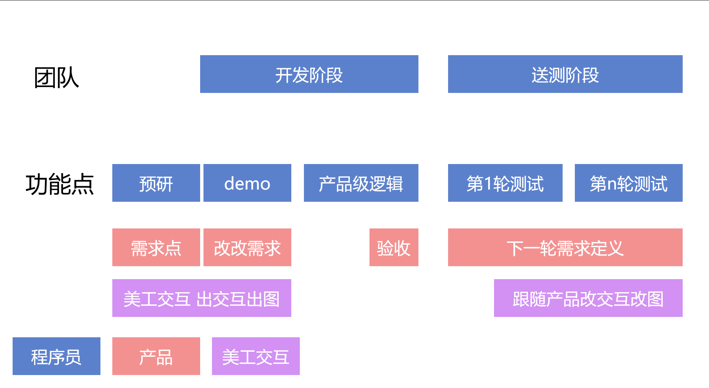

# 从 gitlab 配置管理聊聊团队项目管理

每个团队都有适合各自的管理方法，本文仅记录我现在的团队所使用的项目管理方法。本文主要聊的是通过 gitlab 的里程碑以及 git 的分支管理项目的开发和送测的代码合并问题

<!--more-->
<!-- 发布 -->

在我现在团队开发的项目，其实是产品级。而不是项目级。什么是产品级什么是项目级，其实产品级就是作出一个面向终端用户或企业的产品。而项目级就类似接国家给出的某个项目，有明确的开发时间以及范围。这两者的管理上有极大的不同

本文仅聊产品级的开发

基本上产品级的项目的迭代可以分为两个部分，一个是开发阶段，另一个是送测阶段。我所在的团队相对来说是一个比较大的团队，每个功能点都可以分为开发前的预研，以及开发和送测三步部分。但总团队的迭代就只有开发和送测两个阶段。
开发阶段做什么？主要是产品经理提出需求，于此同时对应的开发小伙伴进入预研技术（可选），接着美工和交互给出界面，同时软件工程师开始编写 demo 逻辑（或者说草图的界面加后台逻辑），在开发阶段完成的里程碑就是产品经理验收通过

<!--  -->

整个团队的节奏就是开发阶段一部分小伙伴进入开发新功能，一部分小伙伴继续修上次虽然测试通过但是遗留的优化点以及预研新技术以满足产品大佬有趣的需求。而 CBB 小组，也就是公共组件小组开始造轮子

送测阶段看测试大佬的心情，整个团队主要工作就是修 bug 啦，没 bug 修的时候就做新技术预研以及和产品大佬讨论新需求的技术可行性

整个团队会动态分工为三波小伙伴，第一波是有当前开发阶段的新需求的，第二波是有下个阶段的需求需要预研技术的，第三波是脱离业务做轮子的 CBB 公共组件小组的小伙伴。这三波小伙伴人数和成员不固定，看团队的需要

一般送测阶段会接 bug 最多的就是第一波有新需求的小伙伴，在这些小伙伴忙不过来的时候，整个团队都会投进入协助。当然投进去协助也不是越多越好，人多了说不定 bug 越修越多，这就需要技术经理的调度

刚才也聊到了开发阶段和送测阶段，那么在 gitlab 上的配置上有什么办法用来辅助团队项目管理。理一下需求，团队里面有几个主项目，需要在开发阶段进行开发，而送测阶段的输出文件的版本迭代里面仅能包含修 bug 的逻辑，不得包含其他逻辑

除了主项目外，还有很多公共组件，同样要求在送测阶段不得将非修 bug 的逻辑放在送测阶段输出的包里面

因此简单的方法是 git 分至少两个分支，一个分支是 dev 开发分支，另一个是 release 发布分支。此时要求 dev 分支提供激进的开发。在送测的时候将 dev 分支切出一个 release 分支，然后所有修送测 bug 的逻辑合并到 release 分支，不允许其他逻辑也合并到 release 分支。在送测过程的输出的文件都是从 release 分支构建出来的

而对 release 的所有合并都会同步合并到 dev 分支上，因此可以保持 dev 分支最新

按照上面的管理方法需要在送测第一轮进入之前，将所有项目以及用到的公共组件从 dev 分支切为 release 分支

上面这一点相信大部分团队都会这么干，只是也有差别的，如微信的安卓开发团队，这个团队没有明确的 dev 分支，而是有一个激进分支，但任何新需求功能的开发都是基于上次的 release 版本。送测的时候是产品经理挑选某些功能分支切入到 release 分支，而不是直接切 dev 分支。原因在于微信将会放弃部分开发的需求功能，因此管理方式有些变更。而我团队里面很少会有放弃的需求，因此直接切 dev 分支就可以了

注意，复杂的分支管理和团队管理将会存在混乱，因此假设你的团队没有那么多有趣的需求，就如微信一样，可能放弃某个需求分支等，那么基本上两个分支就满足开发需求了。理论上越简单越好

好，以上是开发分支的，对于公共组件来说，也跟随项目切换 dev 和 release 分支。跟随的好处是让公共组件库在送测的时候也可以通过 release 分支打包，解决送测需要合入代码的控制。另外因为命名上和主项目相同，因此开发小伙伴只需要记住想要合并到主项目的 dev 的代码就合并到 dev 分支，想要合并到主项目的 release 分支的代码就合并到公共组件的 release 分支就可以

接下来另一个需求是统计变动。理论上每次送测之前都需要项目管理或技术经理了解当前的改动有哪些，可以用于辅助编写送测说明。此时的管理我推荐使用里程碑的方式

在 gitlab 上可以开启里程碑，进入送测的时候，切 dev 分支到 release 分支。然后创建一个版本里程碑，此后所有合并到 release 分支的代码都设置此里程碑。同理，所有公共组件也一样

这样做的好处是可以在送测之前知道具体有哪些代码被合并到 release 分支，可以了解到具体有哪些 MR 被合并，方便统计以及填写送测说明

当然，默认开发的 dev 分支也一样创建里程碑。默认开发阶段将创建里程碑，所有合并到 dev 分支的 MR 都设置此里程碑。在送测阶段从 dev 切 release 时，将关闭此里程碑，开启下一个 dev 分支对应的里程碑

因此大概的做法就是两个里程碑对应 dev 和 release 分支，这两个分支对应开发的两个阶段

大概这样的管理既简单，也能满足一部分需求

而一些自动化方向如果有做好，那么软件的质量也会相对好一点。如我现在团队使用 jira 管理需求和 bug 等，因此在 gitlab 上开启和 jira 的关联，此时可以做到每个 jira 都能知道对应的 MR 是哪些

而对公共组件来说，还需要提供旧版本的回溯，我通过推 Tag 打包的方法解决此问题，详细请看 [dotnet CBB 为什么决定推送 Tag 才能打包](https://blog.lindexi.com/post/dotnet-CBB-%E4%B8%BA%E4%BB%80%E4%B9%88%E5%86%B3%E5%AE%9A%E6%8E%A8%E9%80%81-Tag-%E6%89%8D%E8%83%BD%E6%89%93%E5%8C%85.html)

通过 Tag 打包的方法可以解决在多个主项目的时候，任意项目切换到任意版本时可以根据 NuGet 包版本知道对应的公共组件代码，方便补丁或在某个旧版本添加新功能

一般来说有团队技术经理或项目管理规定是否进入开发阶段或送测阶段，而由配置管理配置以上如分支切换以及里程碑创建

 本作品采用<a rel="license" href="http://creativecommons.org/licenses/by-nc-sa/4.0/">知识共享署名-非商业性使用-相同方式共享 4.0 国际许可协议</a>进行许可。欢迎转载、使用、重新发布，但务必保留文章署名[林德熙](http://blog.csdn.net/lindexi_gd)(包含链接:http://blog.csdn.net/lindexi_gd )，不得用于商业目的，基于本文修改后的作品务必以相同的许可发布。如有任何疑问，请与我[联系](mailto:lindexi_gd@163.com)。
