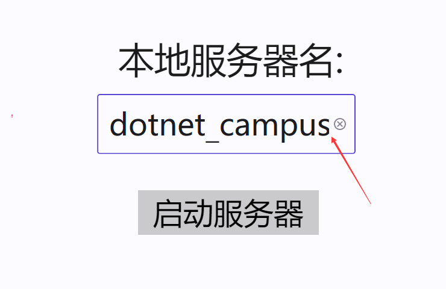

# 从 WPF 搬迁到 UOS 下的 UNO 的笔记

本文记录我将一个小 WPF 应用搬迁到 UNO 框架，用于支持统信 UOS 系统时开发经验

<!--more-->


<!-- CreateTime:2023/9/20 15:42:36 -->

开始之前先说一下我的需求，我现在有一个[小的 WPF 应用](https://github.com/dotnet-campus/dotnetCampus.Ipc/blob/100ac217ef8e570c0fc263db251bf9fc35bcf8cb/demo/dotnetCampus.Ipc.WpfDemo/)。现在我需要在统信 UOS 系统和 Windows 系统上都能够运行这个 WPF 应用

现在 dotnet 系可选的多平台开发框架有很多，这一次我准备尝试使用 UNO/MAUI 的方式进行开发，大的技术架构如下图

<!--  -->


如上图，在 Windows 上依然采用 WPF 框架，只是这时的 WPF 框架是作为底层框架使用，业务代码大部分不会直接接触 WPF 框架，只有部分平台兼容适配代码才会接触 WPF 框架。其他的业务代码都是通过 UNO 和 MAUI 框架间接使用到 WPF 框架。在 UOS 系统上，是采用 GTK 应用框架进行承载，同理也只有平台兼容适配代码才会接触 GTK 应用框架，大部分业务代码不会直接碰到

然后总的渲染层使用 SKIA 来保证多个平台的渲染效果一致

## 日常开发

新建项目的时候记得勾选 Windows 项目，如此将可以生成 WinUI3 项目。通过编写代码的时候选用 WinUI 3 项目，即可获取 XAML 代码智能提示。调试的时候优先选用 WinUI 3 项目调试界面布局，可以直接使用 Visual Studio 对 WinUI 3 的热重载支持，效果更好

## 文本

### 在 UOS 闪烁黑屏问题

这是 OpenGL 的问题，修复方法请看

[dotnet 在 UOS 统信系统上运行 UNO 程序输入时闪烁黑屏问题](https://blog.lindexi.com/post/dotnet-%E5%9C%A8-UOS-%E7%BB%9F%E4%BF%A1%E7%B3%BB%E7%BB%9F%E4%B8%8A%E8%BF%90%E8%A1%8C-UNO-%E7%A8%8B%E5%BA%8F%E8%BE%93%E5%85%A5%E6%97%B6%E9%97%AA%E7%83%81%E9%BB%91%E5%B1%8F%E9%97%AE%E9%A2%98.html )

### 中文文本乱码

中文文本乱码是因为中文字体没有正确加载，在 UOS 默认有思源黑体字体，在 GTK 会自动做字体回滚，只需要应用设置为微软雅黑即可。设置为微软雅黑可以让应用在 Windows 系统和 UOS 系统上都能显示正常的黑体字体

设置方法如下

```xml
<TextBlock Text="解决 UOS 中文乱码" FontFamily="Microsoft YaHei UI"/>
```

微软雅黑在界面上记得使用 `Microsoft YaHei UI` 字体，带 `UI` 的字体。否则你将会看到一些字体布局有些奇怪

### TextBox 撑开空间

如果有内容是依赖 TextBox 的输入过程时的测量撑开的空间的，那撑开的空间将可能不对，比如以下代码

```xml
      <TextBox HorizontalAlignment="Center" FontSize="50"></TextBox>
```

如此的逻辑将会在输入的过程看到文本内容被裁剪，基本在 Skia.WPF 和 Skia.GTK 项目下可以看到文本内容被裁剪

<!--  -->


<!--  -->


暂时只能绕路，现在是 UNO 5.0 版本，依然难以修复此问题

### TextBox 的最小高度

最小高度依然会比预期的更高一些，只能修改界面设计，绕路

## 几何图形 StreamGeometry 资源

在 WPF 里面，经常有图标使用的是 Path 几何路径，作为矢量图标，放入到 StreamGeometry 资源里面。由单个 Path 制作的 StreamGeometry 资源可以通过 `x:String` 的方式在 UNO 里替换，如下面代码是一个原先放在 WPF 资源里的图标

```xml
    <StreamGeometry x:Key="Geometry.Close">
        M18.363961,5.63603897 C18.7544853,6.02656326 18.7544853,6.65972824 18.363961,7.05025253 L13.4142136,12 L18.363961,16.9497475 C18.7544853,17.3402718 18.7544853,17.9734367 18.363961,18.363961 C17.9734367,18.7544853 17.3402718,18.7544853 16.9497475,18.363961 L12,13.4142136 L7.05025253,18.363961 C6.65972824,18.7544853 6.02656326,18.7544853 5.63603897,18.363961 C5.24551468,17.9734367 5.24551468,17.3402718 5.63603897,16.9497475 L10.5857864,12 L5.63603897,7.05025253 C5.24551468,6.65972824 5.24551468,6.02656326 5.63603897,5.63603897 C6.02656326,5.24551468 6.65972824,5.24551468 7.05025253,5.63603897 L12,10.5857864 L16.9497475,5.63603897 C17.3402718,5.24551468 17.9734367,5.24551468 18.363961,5.63603897 Z
    </StreamGeometry>
```

在 WPF 里面，假定是设置在按钮上，作为图标按钮的，可以定义一个样式，大概内容如下

```xml
    <Style x:Key="Style.TitlebarButton" TargetType="Button">
        <Setter Property="Background" Value="Transparent" />
        <Setter Property="Foreground" Value="#808080" />
        <Setter Property="Width" Value="24"/>
        <Setter Property="Height" Value="24"/>
        <Setter Property="Template">
            <Setter.Value>
                <ControlTemplate TargetType="{x:Type ButtonBase}">
                    <Grid Background="{TemplateBinding Background}" UseLayoutRounding="True">
                        <Path Fill="{TemplateBinding Foreground}"
                              Data="{Binding Path=Content, RelativeSource={RelativeSource TemplatedParent}}">
                        </Path>
                    </Grid>
                </ControlTemplate>
            </Setter.Value>
        </Setter>
```

具体的业务代码使用的代码大概如下

```xml
<Button Style="{StaticResource Style.TitlebarButton}" Content="{StaticResource Geometry.Close}"/>
```

搬运到 UNO 之后，将 StreamGeometry 类型的资源修改为 `x:String` 资源，如以下代码

```xml
<x:String x:Key="Geometry.Close">M18.363961,5.63603897 C18.7544853,6.02656326 18.7544853,6.65972824 18.363961,7.05025253 L13.4142136,12 L18.363961,16.9497475 C18.7544853,17.3402718 18.7544853,17.9734367 18.363961,18.363961 C17.9734367,18.7544853 17.3402718,18.7544853 16.9497475,18.363961 L12,13.4142136 L7.05025253,18.363961 C6.65972824,18.7544853 6.02656326,18.7544853 5.63603897,18.363961 C5.24551468,17.9734367 5.24551468,17.3402718 5.63603897,16.9497475 L10.5857864,12 L5.63603897,7.05025253 C5.24551468,6.65972824 5.24551468,6.02656326 5.63603897,5.63603897 C6.02656326,5.24551468 6.65972824,5.24551468 7.05025253,5.63603897 L12,10.5857864 L16.9497475,5.63603897 C17.3402718,5.24551468 17.9734367,5.24551468 18.363961,5.63603897 Z</x:String>
```

其他的代码基本都和 WPF 相同，如下面的 UNO 的按钮样式，可以看到和 WPF 的相同。实际应用里面，可能需要去掉一些 WPF 专有的属性，比如 FocusVisualStyle 属性，以及为了界面效果更好添加一些 UNO 的属性

```xml
        <Style x:Key="Style.TitlebarButton" TargetType="Button">
            <Setter Property="Background" Value="Transparent" />
            <Setter Property="Foreground" Value="#808080" />
            <Setter Property="Width" Value="24"/>
            <Setter Property="Height" Value="24"/>
            <Setter Property="Template">
                <Setter.Value>
                    <ControlTemplate TargetType="ButtonBase">
                        <Grid Background="{TemplateBinding Background}">
                            <Path Fill="{TemplateBinding Foreground}" Data="{TemplateBinding Content}"></Path>
                        </Grid>
                    </ControlTemplate>
                </Setter.Value>
            </Setter>
        </Style>
```

具体的业务使用方代码不变，以下是 UNO 的按钮，可以看到和 WPF 的按钮的代码是相同的

```xml
<Button Style="{StaticResource Style.TitlebarButton}" Content="{StaticResource Geometry.Close}"/>
```

## PathGeometry

有部分不受支持，请进行多平台测试，需要绕路

## x:Static

静态绑定不受支持，只能绕路，比如使用再定义一个实例属性，让这个实例属性引用静态量，再绑定到实例属性

或者是有一些从静态属性搬到资源字典

比如原本在 WPF 是这样写的

```csharp
    public static class BooleanToVisibility
    {
        public static IValueConverter CollapsedWhenTrue { get; private set; } = new VisibilityConverter
        {
            Visible = false,
            Collapsed = true
        };
    }

    <Border Visibility="{Binding Foo, Converter={x:Static uiConverters:BooleanToVisibility.CollapsedWhenTrue}}"/>
```

在 UNO 更改使用资源字典

```xml
    <UserControl.Resources>
        <uiConverters:VisibilityConverter x:Key="CollapsedWhenTrue" Visible="False" Collapsed="True"/>
    </UserControl.Resources>

    <Border Visibility="{Binding Foo, Converter={StaticResource CollapsedWhenTrue}}">
```

## 图片资源

图片资源可以使用相对路径或绝对路径，在UNO的绝对路径的格式如下

```xml
<Image Source="ms-appx:///[MyApp]/Assets/MyImage.png" />
```

以上代码的 `[MyApp]` 是可选的，但是我推荐加上，这个 `[MyApp]` 对应的是程序集名

默认的图片都是被作为 `Content` 引用的，可以在 csproj 项目文件看到如下代码

```xml
<Content Include="Assets\**;**/*.png;**/*.bmp;**/*.jpg;**/*.dds;**/*.tif;**/*.tga;**/*.gif" Exclude="bin\**;obj\**;**\*.svg" />
```

新添加的图片文件，默认是不需要做什么修改的，但为了兼容平台考虑，推荐使用 png 和 jpg 和 bmp 格式，这几个格式所有平台都支持。如果发现自己的图片没有显示，请按照如下顺序定位

- 先看看是否改了 csproj 将自己的图片忽略掉
- 尝试写资源使用绝对路径
- 逐字符对比绝对路径是否正确
- 逐字符对比是否写的是 `ms-appx:///` 字符串开始，需要使用的是三个 `/` 字符
- 如果依然看不到图片，再看看是不是没有生成试试重新生成
- 依然不行再看看是不是图片格式比较诡异，比如将 webp 图片后缀名改为 png 等

图片当成资源字典的内容，可以使用 BitmapImage 类型，和 WPF 相同，只是 Source 的内容在绝对路径下需要更改，如以下例子

```xml
<BitmapImage x:Key="Image.Logo.Size24" UriSource="ms-appx:///[MyApp]/Assets/Logo/logo24x24.png"></BitmapImage>
```

更多请参阅官方文档 [Assets and image display](https://platform.uno/docs/articles/features/working-with-assets.html )

## ContentControl

功能上和 WPF 对齐，只是样式默认行为不相同。默认的 HorizontalContentAlignment 和 VerticalContentAlignment 是左上角，需要设置为 Stretch 才和 WPF 相同

```xml
<ContentControl HorizontalAlignment="Stretch" VerticalAlignment="Stretch"
                HorizontalContentAlignment="Stretch" VerticalContentAlignment="Stretch"></ContentControl>
```

## 控件默认属性

大部分的控件的默认属性都和 WPF 相同，但也有少部分布局属性和 WPF 不相同，比如大量控件的 HorizontalAlignment 和 VerticalAlignment 都是左上角，需要设置为 Stretch 才和 WPF 相同

## csproj 的变更

由于现在 UNO 和 VisualStduio 存在一些冲突，导致了新建文件可能让 UNO 的 csproj 添加了不需要的代码。需要在开发的过程中，在进行 git 上传之前，看一下 csproj 的变更是否必要，如果是不必要的改动，请直接撤销。一般需要在新建文件，比如新建类型或新建用户控件这些动作之后，撤销 csproj 的更改

## Dispatcher

调度上 UNO 的 Dispatcher 要比 WPF 的弱，但可以进行一些平替。从原本的界面元素上获取 Dispatcher 的逻辑，依然不变

从静态获取的逻辑，如以下的 WPF 代码，则需要进行替换

```csharp
System.Windows.Application.Current.Dispatcher.InvokeAsync
```

从 UNO 获取静态的主线程调度器和 UWP 或 WinUI 3 的获取方法是相同的，代码如下

```csharp
                    await CoreApplication.MainView.CoreWindow.Dispatcher.RunAsync(CoreDispatcherPriority.Normal, () =>
                    {
                        // 在这里编写调度实现代码
                    });
```

和 WPF 的 Dispatcher 调度等级不相同的是 UNO 的可调度等级非常少，只有如下的可调度等级

```csharp
High    1   高优先级。 将立即为所有同步请求调用委托。 异步请求将在任何其他请求类型之前排队和处理。
Idle    -2  最低优先级。 将此优先级用于后台任务。 当窗口的main线程空闲且队列中没有挂起的输入时，将处理委托。
Low     -1  低优先级。 如果队列中没有更高的优先级事件挂起，则处理委托。
Normal  0   正常优先级。 委托按计划的顺序进行处理。
```

大部分情况下使用的都是 Normal 优先级

但是在 WinUI 3 运行的时候，可能 `CoreApplication.MainView.CoreWindow` 属性的获取会抛出不能重复创建的异常。而如果尝试通过 `CoreApplication.GetCurrentView()` 获取 CoreApplicationView 类型的对象从而间接拿到 Dispatcher 则依然可能失败，因为此方法将会抛出 System.Runtime.InteropServices.COMException:“Element not found” 异常

比较稳妥的方式就是自己在 App 里面将 Microsoft.UI.Dispatching.DispatcherQueue 存起来，如此获取到相同的从主 UI 线程获取的 DispatcherQueue 对象即可同时在 WinUI 3 以及 WPF 和 GTK 项目上使用。在 WinUI 3 项目里 MainWindow.Dispatcher 属性当前依然是 null 值，这就是为什么拿的是 DispatcherQueue 的原因

```csharp
    public class App : EmbeddingApplication
    {
        protected async override void OnLaunched(LaunchActivatedEventArgs args)
        {
            // 忽略其他代码
            MainWindow = builder.Window;

#if DEBUG
            MainWindow.EnableHotReload();
#endif
            
            Dispatcher = MainWindow.DispatcherQueue;
            Host = await builder.NavigateAsync<Shell>();
        }

        public Microsoft.UI.Dispatching.DispatcherQueue Dispatcher { private set; get; } = null!;
    }
```

## 缺乏的机制

### Visibility.Hidden

没有隐藏的选项，换成设置透明度为 0 代替。设置 `Opacity="0"` 效果和 WPF 的 `Visibility.Hidden` 相似

### MultiBinding

多绑定不受支持，只能绕路，让界面编写只有单绑定

### ControlTemplate.Triggers

不支持，需要绕路

### 在 Resources 的资源使用了 x:Name 特性

在资源里面带了 x:Name 是不受支持的，由于 x:Name 在生成的时候必须分配给他属性或字段，但是资源可以被多次创建，导致了生成的代码无法处理这个情况。之前 Avalonia 的 XAML 创建器就提了这个问题，现在 WinUI 3 和 UNO 和 MAUI 都有这个问题

最简复现代码如下

```xml
    <Page.Resources>
        <ResourceDictionary>
            <SolidColorBrush x:Name="MyBrush" Color="Blue"/>
        </ResourceDictionary>
    </Page.Resources>
```

此时应该是使用 `x:Key` 代替 `x:Name` 才符合预期

另外的是为了资源内的绑定逻辑，如以下代码，这样的代码只能绕路

```xml
    <Page.Resources>
        <ControlTemplate x:Key="Template.Loading" TargetType="ContentControl">
            <Grid x:Name="RootGrid" />
        </ControlTemplate>
    </Page.Resources>
```

以上代码错误提示是 `error CS0103: 当前上下文中不存在名称“_RootGrid”` 信息

更多请看 [Adding Name to a Resource fails on build · Issue #1427 · unoplatform/uno](https://github.com/unoplatform/uno/issues/1427 )

## IPC

已知问题： 

[Linux 下的 Console.Read 将导致管道无法读取到消息 · Issue #139 · dotnet-campus/dotnetCampus.Ipc](https://github.com/dotnet-campus/dotnetCampus.Ipc/issues/139 )

## 参考文档

[WPF 使用 MAUI 的自绘制逻辑](https://blog.lindexi.com/post/WPF-%E4%BD%BF%E7%94%A8-MAUI-%E7%9A%84%E8%87%AA%E7%BB%98%E5%88%B6%E9%80%BB%E8%BE%91.html )

[dotnet 在 UOS 国产系统上使用 Xamarin Forms 创建 xaml 界面的 GTK 应用](https://blog.lindexi.com/post/dotnet-%E5%9C%A8-UOS-%E5%9B%BD%E4%BA%A7%E7%B3%BB%E7%BB%9F%E4%B8%8A%E4%BD%BF%E7%94%A8-Xamarin-Forms-%E5%88%9B%E5%BB%BA-xaml-%E7%95%8C%E9%9D%A2%E7%9A%84-GTK-%E5%BA%94%E7%94%A8.html )

[dotnet 使用 Avalonia 开发 UOS 原生应用](https://blog.lindexi.com/post/dotnet-%E4%BD%BF%E7%94%A8-Avalonia-%E5%BC%80%E5%8F%91-UOS-%E5%8E%9F%E7%94%9F%E5%BA%94%E7%94%A8.html )

[dotnet 在国产 UOS 系统利用 dotnet tool 工具做文件传输](https://blog.lindexi.com/post/dotnet-%E5%9C%A8%E5%9B%BD%E4%BA%A7-UOS-%E7%B3%BB%E7%BB%9F%E5%88%A9%E7%94%A8-dotnet-tool-%E5%B7%A5%E5%85%B7%E5%81%9A%E6%96%87%E4%BB%B6%E4%BC%A0%E8%BE%93.html )

[在 UOS 统信运行 dotnet 程序提示没有通过系统安全验证无法运行](https://blog.lindexi.com/post/%E5%9C%A8-UOS-%E7%BB%9F%E4%BF%A1%E8%BF%90%E8%A1%8C-dotnet-%E7%A8%8B%E5%BA%8F%E6%8F%90%E7%A4%BA%E6%B2%A1%E6%9C%89%E9%80%9A%E8%BF%87%E7%B3%BB%E7%BB%9F%E5%AE%89%E5%85%A8%E9%AA%8C%E8%AF%81%E6%97%A0%E6%B3%95%E8%BF%90%E8%A1%8C.html )

[dotnet 在 UOS 统信系统上运行 UNO 程序输入时闪烁黑屏问题](https://blog.lindexi.com/post/dotnet-%E5%9C%A8-UOS-%E7%BB%9F%E4%BF%A1%E7%B3%BB%E7%BB%9F%E4%B8%8A%E8%BF%90%E8%A1%8C-UNO-%E7%A8%8B%E5%BA%8F%E8%BE%93%E5%85%A5%E6%97%B6%E9%97%AA%E7%83%81%E9%BB%91%E5%B1%8F%E9%97%AE%E9%A2%98.html )

[dotnet 统信 UOS 运行 UNO FrameBuffer 应用错误 Failed to open FrameBuffer device](https://blog.lindexi.com/post/dotnet-%E7%BB%9F%E4%BF%A1-UOS-%E8%BF%90%E8%A1%8C-UNO-FrameBuffer-%E5%BA%94%E7%94%A8%E9%94%99%E8%AF%AF-Failed-to-open-FrameBuffer-device.html )


<a rel="license" href="http://creativecommons.org/licenses/by-nc-sa/4.0/"></a><br />本作品采用<a rel="license" href="http://creativecommons.org/licenses/by-nc-sa/4.0/">知识共享署名-非商业性使用-相同方式共享 4.0 国际许可协议</a>进行许可。欢迎转载、使用、重新发布，但务必保留文章署名[林德熙](http://blog.csdn.net/lindexi_gd)(包含链接:http://blog.csdn.net/lindexi_gd )，不得用于商业目的，基于本文修改后的作品务必以相同的许可发布。如有任何疑问，请与我[联系](mailto:lindexi_gd@163.com)。