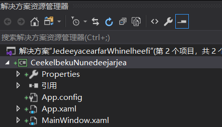
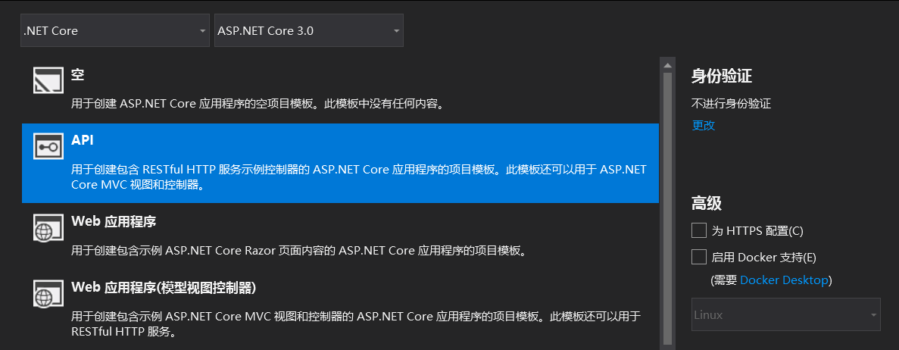

# 从零开始用 dotnet 做全栈开发

我是一个小白，但我想做全栈开发，我想从桌面端写到移动端，想从后台写到前端。但是我不想学习，怎么破。没关系，用 dotnet 做，这个技术方向的教程文档特别齐全，入门难度超级低。同时各个方向的开发都是差不多的，至少在 VisualStudio 安装完成之后，几乎哪个方向都能在半个小时之内做自己的修改跑起来

<!--more-->
<!-- CreateTime:2019/12/2 8:37:23 -->

<!-- csdn -->

在开始之前，有以下几点要求：

1. 你的系统必须要是 Win10 的系统，同时开启开发者模式。 如果不知道如何开启开发人员模式，按下 `win+s` 输入开发人员，让 Cortant 帮助你设置
2. 请不要纠结于细节，先跑起来再说
3. 安装 VisualStudio 2019 所有功能

安装 VisualStudio 2019 的所有功能的意思就是在安装界面所有看到可以打勾的全部勾上

<!--  -->


本文将快速带大家入门使用 dotnet 进行桌面端开发、移动端开发、服务器后台开发、前端开发<!-- 还有人工智能开发 -->

当然，一开始就是各个项目的创建和运行，此时不做任何的业务功能，只是让小伙伴看到一个个项目都用熟悉的技术跑起来

首先肯定时控制台项目，控制台项目是创建速度最快的，也是我不担心小伙伴的 VisualStudio 没有安装对应的功能

打开 VisualStudio 2019 点击新建项目


选择控制台项目


写明项目名和创建项目文件夹，就完成了控制台项目的创建

<!--  -->


创建完成之后，如果发现界面的代码提示错误，只需要等待一下 NuGet 的还原就可以了，此时什么都不需要做，等一下缓慢的 VisualStudio 加载，加载完成之后就可以看到代码高亮，此时点击运行按钮就可以运行代码。点击工具栏调试->开始调试 或者按下快捷键 F5 就可以开始运行

<!--  -->


此时运行可以看到控制台输出，没有任何业务功能

现在这个控制台项目是通过 C# 写的，接下来就是高级开发了。本文每个项目都是最简单的版本，先从顺序，从桌面端开始创建。打开 VisualStudio 2019 在欢迎界面里面输入 WPF 然后点击创建项目。创建项目完成之后点击运行按钮就可以啦。现在已经成功开启了桌面端开发，这是传统的win32程序

<!--  -->


现在的 WPF 有两个版本，一个是 .NET Core 的 一个是 .NET Framework 的，这里请先不要管两者的差别，就算是我布置下来的作业，等跟随本文玩过之后再去寻找博客，请问 .NET Core 和 .NET Framework 有什么不同

点击任意一个版本的项目和控制台一样输入名字和创建的文件夹就可以完成创建，开启桌面端开发的前提是安装了桌面端开发相关功能。如果发现自己没有 WPF 项目，那么请再次打开安装程序，勾选全部功能

在 VisualStudio 2019 的解决方案界面可以看到 WPF 项目的文件会比控制台多一些，这里布置一个作业，请问每个文件都有什么作用，当然现在时不需要管的，只需要尝试运行这个项目就可以

<!--  -->


如果是在相同的解决方案添加项目创建的 WPF 程序，那么就需要先设置 WPF 程序作为启动项目，通过右击项目点击设为启动项目就可以，运行项目的方法和控制台相同

<!--  -->


现在已经能看到一个空白的界面了，在 WPF 中写界面推荐用的是 xaml 语言，而后台逻辑依然使用 C# 写，展开一个 MainWindow.xaml 文件可以看到 MainWindow.xaml.cs 文件

<!--  -->


双击 MainWindow.xaml.cs 文件就可以看到熟悉的 C# 代码了。当然想要开发 WPF 项目，还是需要了解一点 WPF 界面开发相关知识，例如如何创建一个按钮，如何创建一个文本框，更高级的是如何进行布局等，当然在这里就先跳过了

然后就是后台服务器端的开发了，还是在 VisualStudio 新建项目，此时新建一个 ASP.NET Core 项目

<!--  -->


在 ASP.NET Core 项目有很多可以选的功能，此时请选择 API 因为用这个功能创建的项目不会包含太多其他的后台相关知识，同时也创建好了简单可以运行的逻辑，和默认的空项目不同，因为空项目里面几乎没有内容，不适合快速开始，而其他功能的内容太多，也不适合。另外请去掉勾选的 https 和 docker 容器，这两部分都需要额外的配置

<!--  -->


默认的 ASP.NET Core 项目包含了以下文件，其中入口文件就是 `XxController` 类，如下面的 WeatherForecastController 类

<!--  -->


此时依然运行此项目，可以看到浏览器打开了一个网址，这个网址是 localhost 也就是本机的服务

相对来说，在 ASP.NET Core 项目进行快速更改是仅次于控制台的更改的，在上面项目里面的 WeatherForecastController 的 Get 方法，在这个方法进行修改，修改返回值就可以看到浏览器打开的地址的内容也修改

<!--  -->


将上面的代码修改一些字符的返回值

```csharp
        [HttpGet]
        public IEnumerable<WeatherForecast> Get()
        {
            var rng = new Random();
            return Enumerable.Range(1, 5).Select(index => new WeatherForecast
            {
                Date = DateTime.Now.AddDays(index),
                TemperatureC = rng.Next(-20, 55),
                Summary = "欢迎访问 blog.lindexi.com 给我攒广告点击"
            })
            .ToArray();
        }
```

此时运行会看到下面内容

<!--  -->


使用 ASP.NET Core 项目对比之前使用 Socket 等做 web 开发的一个好处是不需要了解访问是从哪里过来的，也不需要了解里面的传输，只需要在控制器里面写对应的方法就可以了。当然这只是入门的说法，如果想要做出 StackOverflow 这么大的一个网站，还是需要学习超级多的知识

既然后台都开发完成了，下面就是移动端的开发了，为什么本文只是说移动端而不说具体的安卓和 ios 开发？因为两个平台其实可以合并使用 Xamarin 开发

在 VisualStudio 2019 新建 Xamarin 项目

<!--  -->


其实在移动端开发的时候就可以自动选择创建后台服务，但是这里创建的后台服务相对内容比较多，没有上面的项目简单，所以这里默认勾选了安装和 ios 开发

现在创建的所有项目就是 Xamarin 的项目数量最多了

<!--  -->


没关系，先右击安卓项目，设置为启动项目运行

安卓在运行的时候需要下载安卓模拟器，这个模拟器可以用来在电脑上玩安卓游戏，此时需要等待下载安装

<!--  -->


这里不需要关心配置，只需要运行项目。在这里需要等待的时间和你的网速有关，不如此时回顾一下上面遇到的问题

- 控制台项目需要从哪个函数开始运行
- 控制台项目如何将字符串输出到控制台
- 基础的 C# 语法是什么
- 桌面项目除了 WPF 还有什么
- 在创建 WPF 项目时说到的 .NET Core 和 .NET Framework 是什么
- 在 WPF 中如何画出简单界面
- 基础的 xaml 语法
- 在 ASP.NET Core 里面控制器是什么
- 在网页访问对应的链接调用的 ASP.NET Core 的哪个函数
- 如何修改 ASP.NET Core 返回给浏览器的返回值和从访问的链接接收到参数

大概小伙伴简单找一下上面问题的答案，模拟器差不多下载完成

在 VisualStudio 点击对应的模拟器就可以调试

<!--  -->


如果此时进入调试失败，请删除 bin 和 obj 文件夹多试几次，大概是有资源被墙了。进入调试可以看到下面界面，可以尝试玩一下这个软件

<!--  -->


这就完成了移动端的项目创建，虽然进行移动端开发的开始需要下载很多的内容，但我相信小伙伴的网速都不错

接下来就是前端部分了，难道前端此时就需要学习 html+css+js 了？肯定是不需要的啦，刚才在桌面端开发的时候，勤奋的小伙伴是不是学了一点 xaml 开发了，没错此时依然使用熟悉的语言开发

在开始进行 UNO 开发之前需要在 VisualStudio 下载 UNO 插件

<!--  -->


搜 UNO 就能找到插件

<!--  -->


点击下载安装然后重启 VisualStudio 此时在新建项目可以选择 UNO 创建全平台项目，这里全平台指的是这个项目可以用来开发移动端应用，桌面端应用和前端应用。因为这个项目主要是做 WebAssembly 前端项目，所以本文也只是将这个做前端软件

<!--  -->


刚才说 Xamarin 的项目很多，其实 UNO 的项目更多

<!--  -->


其实 UNO 的跨平台就是通过 Xamarin 实现大部分，设置 Wasm 项目作为启动项目，也就是解决方案里面的 `Xx.Wasm` 项目，这里的 Xx 就是小伙伴的项目命名，这个项目就是前端代码

这个项目的启动和其他项目不同的是这个项目不支持进行调试，需要点击工具栏的调试->开始执行不调试才能运行

用 UNO 运行提示 `Process is terminating due to StackOverflowException` 是因为现在 UNO 不支持调试，请点击调试菜单，选择运行但不调试

现在就可以看到打开了浏览器显示前端的网页

打开 `Xx.Shared` 项目，这里的 Xx 就是小伙伴的项目命名，可以看到熟悉的 MainPage.xaml 文件，双击打开这个文件就可以看到熟悉的 xaml 代码，展开文件可以找到 MainPage.xaml.cs 也就是 C# 代码

本文完成了新建桌面端项目、服务器端项目、移动端项目、前端项目，同时所有项目用到的语言只有 C# 和 xaml 而这里的 xaml 是用来写界面的，而界面不是仅能通过 xaml 写的，只是 xaml 比较可读而已，完全用 C# 写也没有任何问题。其实本文漏掉的还有 WinForms 项目和 UWP 项目等

使用 dotnet 方向进行开发意味着现在基本上任何方向的开发都能做，同时社区和工具都非常完善，文档也特别多。本文只是告诉大家有这么多方向可以进行开发，而其实每个方向如果不做深入，其实入门上手都是特别快的。所有方向在能入门之后，只要想继续往这个方向做，都能进行快速的深入，如果有小伙伴在说找不到文档哇，肯定是没有关注我的博客，请将 blog.lindexi.com 加入到你的收藏夹

另外一个人学的时候如果遇到问题了，有时候也会卡住，特别是入门的时候，此时推荐小伙伴抱团，微软社区有很多俱乐部，欢迎小伙伴加入

- 广州 .NET 俱乐部 651477282
- 上海 .NET 俱乐部 197239851
- 还有其他的… 

<a rel="license" href="http://creativecommons.org/licenses/by-nc-sa/4.0/"></a><br />本作品采用<a rel="license" href="http://creativecommons.org/licenses/by-nc-sa/4.0/">知识共享署名-非商业性使用-相同方式共享 4.0 国际许可协议</a>进行许可。欢迎转载、使用、重新发布，但务必保留文章署名[林德熙](http://blog.csdn.net/lindexi_gd)(包含链接:http://blog.csdn.net/lindexi_gd )，不得用于商业目的，基于本文修改后的作品务必以相同的许可发布。如有任何疑问，请与我[联系](mailto:lindexi_gd@163.com)。
