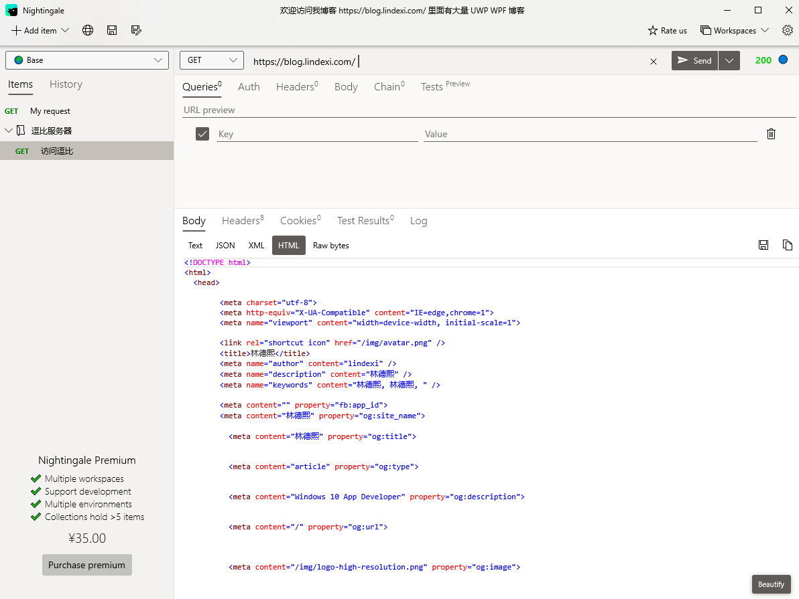
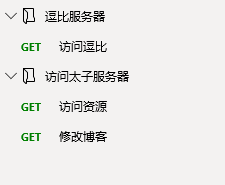

# 优雅调试 REST API 的工具

找到一个超级漂亮同时功能超级强，还是一个 UWP 应用的调试 REST API 工具

<!--more-->
<!-- CreateTime:2019/10/10 20:09:33 -->

<!-- csdn -->

点击此[地址](https://www.microsoft.com/store/productId/9N2T6F9F5ZDN) 下载安装

界面截图

<!--  -->

支持对请求设置标题，同时支持分组和工作空间

如我可以对访问逗比服务器添加多个不同的 API 请求

<!--  -->

我可以对一个项目的不同功能设置不同的分组，同时还可以切换工作空间

不过切换空间是需要升级为专业版的

当然清真的是这是一个 UWP 程序

我没有收他的红包，所以不好用请到官网喷

 本作品采用<a rel="license" href="http://creativecommons.org/licenses/by-nc-sa/4.0/">知识共享署名-非商业性使用-相同方式共享 4.0 国际许可协议</a>进行许可。欢迎转载、使用、重新发布，但务必保留文章署名[林德熙](http://blog.csdn.net/lindexi_gd)(包含链接:http://blog.csdn.net/lindexi_gd )，不得用于商业目的，基于本文修改后的作品务必以相同的许可发布。如有任何疑问，请与我[联系](mailto:lindexi_gd@163.com)。
