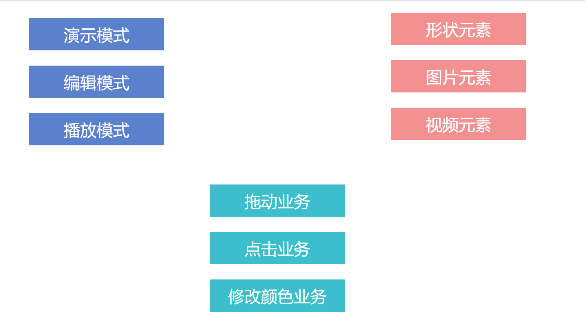
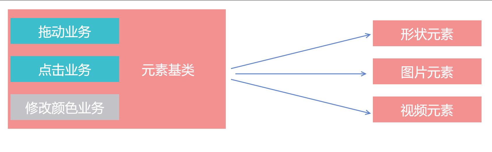

# 使用 IOC 希沃和 DI 依赖注入的意义

其实我的标题没写对，这个话题我是聊不下去的。 本文只和小伙伴聊聊为什么使用容器注入，优缺点是什么。我通过问问题的方式让小伙伴了解这么做的意义

<!--more-->


<!-- 发布 -->

在开始之前我就可以告诉小伙伴使用容器注入的缺点了，尽管这很有争议

- 内存泄漏
- 降低性能

那是否 IOC 控制反转意味着一定需要配合 DI 依赖注入？答案是不一定的，还有好多有趣的手段

那 DI 依赖注入和容器注入有什么关联？其实容器注入是依赖注入的一个核心方法，也就是现在用的最多的方法

那什么是容器注入呢？其实容器注入相当于创建一个容器数组，然后当某个类需要依赖其他的类的时候，被依赖的类会提前放在容器里面，在被需要的时候从容器里面拿出来

还有一个问题是依赖注入是否和具体框架相关？用于解决什么问题？

上面这个是送命题…… 原因是难以有一个能说服大部分小伙伴的答案。我尝试回答第一个问题，尽管依赖注入和设计模式几乎是等同的概念，这仅仅只是一个通用的工程上的设计方案，和具体的产品或技术方案没有关系。但是抛开具体的业务和技术方案讲依赖注入是十分空泛的而且几乎没有什么意义

那么 IOC 控制反转和 DI 依赖注入是想要解决什么问题？ 这个问题也不好回答，尽管从字面意思上是为了解决模块耦合，但事实的作用将会复杂很多。我尝试通过问一些问题看小伙伴能否了解这样做的意义

首先依赖注入肯定是建在面向对象上面的。那么面向对象的一个特点，多态，可以如何实现？

假定有某个接口有三个不同的实现类，那么请问我在使用的时候，具体使用哪个？

上面这个题目也是送命题哈。标准的答案是业务决定。那问题来了，请问业务决定的时候如何送到具体的使用方？

来一个具体的业务的例子，这样问题会清晰一些

相信小伙伴都用过 PPT 幻灯片这个软件，假设咱现在要做一个和 PPT 软件差很多的软件，例如希沃白板。在开始设计的时候，可以发现这个软件有两个模式，编辑模式和播放模式

而在 PPT 软件上面的形状元素在这两个模式下的拖动表现是不相同的，那么可以如何实现呢？

最简单的实现方式就是通过 if else 的方法啦

```csharp
if (编辑模式)
{
	// 执行编辑模式业务
}
else if (播放模式)
{
	// 执行播放模式业务
}
```

但小伙伴会发现这样的设计不优雅，因为如果后续产品大佬说要添加一个新的模式叫演示模式，这个模式的形状元素拖动的表现和前面两个都不同，此时就不好玩了

```csharp
if (编辑模式)
{
	// 执行编辑模式业务
}
else if (播放模式)
{
	// 执行播放模式业务
}
else if (演示模式)
{
	// 执行演示模式业务
}
```

过几天产品大佬再加几个新的模式，很快这段代码就是神坑了

于是小 A 想到了一个设计，那就是将拖动业务作为一个接口，而具体的编辑模式和播放模式等都有继承这个接口的实现

```csharp
interface 拖动业务接口
{

}

class 编辑模式下的拖动业务 : 拖动业务接口
{

}

class 播放模式下的拖动业务 : 拖动业务接口
{

}

class 演示模式下的拖动业务 : 拖动业务接口
{

}

class 形状元素
{
	public 拖动业务接口 拖动业务 { set; get; }
}
```

看起来很清真，因为在形状里面的业务代码可以写成如下

```csharp
拖动业务.执行业务();
```

一句话就完成了

但是真的是一句话就完成了？执行上面代码将会告诉你，你没有对象

请问是谁给 形状元素 的 拖动业务 属性赋值？

这就是问题所在了，小伙伴想想应该是谁给 拖动业务 这个属性赋值？

难道是创建形状元素对应的业务？好，假定是一个叫 页面 的类将会创建 形状元素 那么代码需要如何写？

```csharp
class 页面
{
	void 创建形状元素()
	{
		拖动业务接口 拖动业务 = null;
		if (编辑模式)
		{
			拖动业务 = new 编辑模式下的拖动业务();
		}
		else if (播放模式)
		{
			拖动业务 = new 播放模式下的拖动业务();
		}
		else if (演示模式)
		{
			拖动业务 = new 演示模式下的拖动业务();
		}

		形状元素 元素 = new 形状元素();
        元素.拖动业务 = 拖动业务;
	}
}
```

上面代码就有趣了，只是将原本写在形状元素的代码放在页面这个类里面…… 代码依然是神坑

如果是你的话，会如何设计？

假定除了拖动业务之外，还有其他业务呢？例如元素的 点击业务 在不同的模式也是表现不相同的有不同的业务。如果每个业务都来一次判断和赋值，那么有趣不？

再假定除了页面会创建形状之外，还有其他类也需要创建形状，例如画板这个类也需要。此时是否画板这个类也需要复制暂停页面里面创建形状的逻辑？

小伙伴说，不慌，我有工厂模式

什么是工厂模式？其实就是不写 `new 形状元素()` 而是通过一个叫 `形状元素工厂` 的类创建出 `形状元素` 这个对象

此时相当于将复杂的创建形状元素放在了工厂里面，在一个工厂里面写判断逻辑

```csharp
class 形状元素工厂
{
	public 形状元素 创建形状元素()
	{
		拖动业务接口 拖动业务 = null;
		if (编辑模式)
		{
			拖动业务 = new 编辑模式下的拖动业务();
		}
		else if (播放模式)
		{
			拖动业务 = new 播放模式下的拖动业务();
		}
		else if (演示模式)
		{
			拖动业务 = new 演示模式下的拖动业务();
		}

		形状元素 元素 = new 形状元素();
        元素.拖动业务 = 拖动业务;

        return 元素;
	}
}
```

看起来确实能解决上面这个问题，但我又给你挖一个坑

产品大佬说，我还要做一个叫 图片元素 的业务，这个 图片元素 也是需要有和形状一样的拖动业务的

有趣不，如果用解决形状元素的问题来解决图片元素的问题，那么是不是咱需要创建一个叫 图片元素工厂 的类，然后写出和形状元素差不多的逻辑

```csharp
class 图片元素工厂
{
	public 图片元素 创建图片元素()
	{
		拖动业务接口 拖动业务 = null;
		if (编辑模式)
		{
			拖动业务 = new 编辑模式下的拖动业务();
		}
		else if (播放模式)
		{
			拖动业务 = new 播放模式下的拖动业务();
		}
		else if (演示模式)
		{
			拖动业务 = new 演示模式下的拖动业务();
		}

		图片元素 元素 = new 图片元素();
        元素.拖动业务 = 拖动业务;

        return 元素;
	}
}

class 图片元素
{
	public 拖动业务接口 拖动业务 { set; get; }
}
```

然后产品大佬说想要做很多元素，如视频元素等等。然后产品大佬又说，我需要让图片和形状元素都支持修改颜色的业务，当然这个修改颜色的业务在不同的模式是不同的业务逻辑

理一下产品大佬的需求有复杂

- 演示模式
- 编辑模式
- 播放模式

- 形状元素
- 图片元素
- 视频元素

- 拖动业务
- 点击业务
- 修改颜色业务

<!--  -->


这就有趣了，即使咱想写一个叫 元素 的基类也做不到了。因为上面的几个业务里面并非都可以放在基类里面，如修改颜色业务，因为视频不具备这样的业务功能。而形状和图片没有任何可以再继承的基类

<!--  -->


但是聪明的小伙伴会想出一个有趣的设计方案，那就是根据 元素 所继承的接口给予对应的业务类，而所有的元素创建工厂里面都有加工基础元素的工厂

```csharp
class 图片元素工厂
{
	public 图片元素 创建图片元素()
	{
		图片元素 元素 = new 图片元素();

		元素加工厂.加工元素(元素);

        return 元素;
	}
}
```

那 元素加工厂 是什么？其实就是将刚才那些有趣的具体业务代码进行注入的类。当然在此之前，咱需要让元素有一个基类，同时让元素有接口可以继承。接口是用来做什么的？用来表明元素具备某个业务，看了下面代码就知道

```csharp
class 元素基类
{

}

interface 可拖动元素接口
{
	拖动业务接口 拖动业务 { set; get; }
}

class 图片元素 : 元素基类, 可拖动元素接口
{
	public 拖动业务接口 拖动业务 { set; get; }
}
```

如上面代码只要元素继承了 可拖动元素接口 那么元素就包含了 拖动业务 这个属性，因此可以在 元素加工厂 里面通过此判断

```csharp
static class 元素加工厂
{
	public static void 加工元素(元素基类 元素)
	{
		if (元素 is 可拖动元素接口 可拖动元素)
		{
			拖动业务接口 拖动业务 = null;
			if (编辑模式)
			{
				拖动业务 = new 编辑模式下的拖动业务();
			}
			else if (播放模式)
			{
				拖动业务 = new 播放模式下的拖动业务();
			}
			// 忽略其他代码
			可拖动元素.拖动业务 = 拖动业务;
		}
	}
}
```

此时无论来多少个元素，不管这些元素存在多有趣的业务，都可以通过优化 元素加工厂 通过判断接口给对应的属性的方法

其实上面的代码基本上也算完成了一个依赖注入容器了，只是上面的 元素加工厂 会耦合太多的业务了。因为各个业务都需要更改这个类的内容。那是否可以将这个类的一部分逻辑放在具体的业务里面呢？例如下面代码

```csharp
static class 元素加工厂
{
	public static void 加工元素(元素基类 元素)
	{
		foreach (var 元素过滤 in 元素过滤列表)
		{
			元素过滤.过滤(元素);
		}
	}

	public static List<元素过滤> 元素过滤列表 { get; } = new List<元素过滤>();
}

abstract class 元素过滤
{
	public abstract void 过滤(元素基类 元素);
}

abstract class 元素过滤<T> : 元素过滤
{
	public override void 过滤(元素基类 元素)
	{
		if (元素 is T t)
		{
			过滤(t);
		}
	}

	protected abstract void 过滤(T t);
}
```

上面代码是什么意思呢？其实就是允许具体的业务给 元素加工厂 的 元素过滤列表 添加元素过滤 进行给元素注入依赖

如上面的拖动业务，可以在具体的拖动业务模块初始的代码里面这样写

```csharp
class 拖动业务元素过滤 : 元素过滤<可拖动元素接口>
{
	protected override void 过滤(可拖动元素接口 可拖动元素)
	{
		拖动业务接口 拖动业务 = null;

		// 忽略代码

		可拖动元素.拖动业务 = 拖动业务;
	}
}

void 拖动业务模块()
{
	元素加工厂.元素过滤列表.Add(new 拖动业务元素过滤());
}
```

于是各个业务模块就可以将自己的逻辑写在自己的模块里面，即使有再多的业务都不会让 元素加工厂 包含这部分的业务代码

其实上面的代码已经算是一个依赖注入容器了，同时实现的是属性注入的方式

回到开始的问题，请问依赖注入解决了什么问题？

随着咱不断复杂的业务逻辑，如何拆分才能降低耦合？如何更好利用面向对象的多态？

更工程化的问题还包含了如何可以让业务更好的支持自动化测试

如上面的代码，我期望在单元测试的时候支持测试元素在拖动的业务，我期望传入一个虚拟的拖动业务逻辑以进行无 UI 和交互的自动化测试，能不能做到？其实非常方便，通过在 元素加工厂 的 元素过滤列表 里面注入用于测试的虚拟的类的元素过滤就可以完成这项业务

```csharp
class 虚拟的拖动业务 : 拖动业务接口
{
}

class 虚拟的拖动业务元素过滤 : 元素过滤<可拖动元素接口>
{
	protected override void 过滤(可拖动元素接口 可拖动元素)
	{
		拖动业务接口 拖动业务 = new 虚拟的拖动业务();

		可拖动元素.拖动业务 = 拖动业务;
	}
}
```

请小伙伴尝试再读一遍，不要被我带节奏，想想还有什么方法也能解决上面的问题


<a rel="license" href="http://creativecommons.org/licenses/by-nc-sa/4.0/"></a><br />本作品采用<a rel="license" href="http://creativecommons.org/licenses/by-nc-sa/4.0/">知识共享署名-非商业性使用-相同方式共享 4.0 国际许可协议</a>进行许可。欢迎转载、使用、重新发布，但务必保留文章署名[林德熙](http://blog.csdn.net/lindexi_gd)(包含链接:http://blog.csdn.net/lindexi_gd )，不得用于商业目的，基于本文修改后的作品务必以相同的许可发布。如有任何疑问，请与我[联系](mailto:lindexi_gd@163.com)。