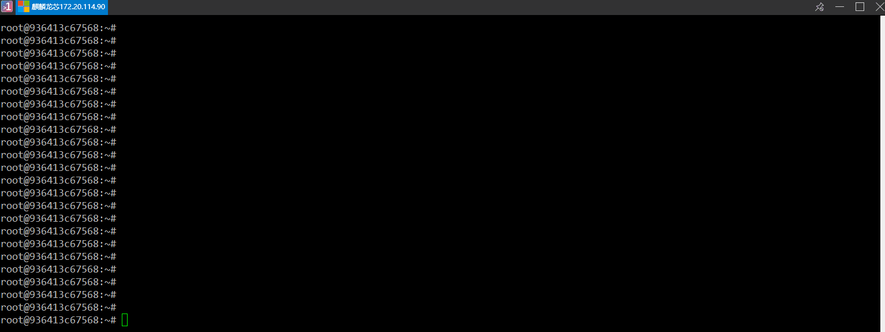

# 入门龙芯旧世界汇编指令

我是龙芯汇编指令新手，本文是我学习龙芯汇编的笔记

<!--more-->


<!-- CreateTime:2024/11/09 07:07:40 -->

<!-- 发布 -->
<!-- 博客 -->

我借到了一台宝贵的龙芯 3A6000 设备，我期望在这台设备上面学习龙芯汇编指令。这台设备上的是龙芯旧世界的麒麟系统，由于这台设备很宝贵，我不能随意玩。为了防止弄坏设备，我将在此设备上面搭建 docker 环境，进入到 docker 容器里面进行开发

在此设备上搭建 docker 环境的方法，详细请看 [制作一个龙芯旧世界的 dotnet sdk docker 镜像](https://blog.lindexi.com/post/%E5%88%B6%E4%BD%9C%E4%B8%80%E4%B8%AA%E9%BE%99%E8%8A%AF%E6%97%A7%E4%B8%96%E7%95%8C%E7%9A%84-dotnet-sdk-docker-%E9%95%9C%E5%83%8F.html )
<!-- [制作一个龙芯旧世界的 dotnet sdk docker 镜像 - lindexi - 博客园](https://www.cnblogs.com/lindexi/p/18521578 ) -->

以下是我的 dockerfile 文件内容

```
FROM cr.loongnix.cn/library/debian:buster
WORKDIR /root

RUN apt-get install gcc -y
RUN apt-get install vim -y
```

使用如下两句命令进行构建和进入容器

```
docker build -t g1 .
docker run -it g1 /bin/bash
```

本文这里完全都是龙芯旧世界的

先使用 vim 敲入一些代码内容：

```csharp
.data

string: .asciz "Hello World!\r\n"

.text
.global main
main:

    li.w $a7, 64              # write syscall number
    li.w $a0, 1               # stdout file descriptor == 1
    la $a1, string            # string address
    li.w $a2, 15              # string len
    syscall 0x0               # syscall

    li.w $a7, 93              # exit syscall number
    li.w $a0, 0
    syscall 0x0               # syscall
```

以上代码来自于 https://github.com/foxsen/loongarch-assembly/blob/bdc24681d745a9f53dc9bc8f9fce28de470809ca/hello-world.S

接着使用 gcc 进行构建，命令如下

```
gcc -static hello.S -o hello
```

接下来就可以使用 `./hello` 跑起来刚才写的汇编的程序

以下是我手敲的过程

<!--  -->


## 环境搭建要点

本文以上使用的都是龙芯旧世界

业界都认为旧世界是过度的，之后会是新世界

在旧世界里面，不应该去下载 `https://github.com/sunhaiyong1978/CLFS-for-LoongArch/releases/download/untagged-629b3c005484675292bc/loongarch64-clfs-3.0-cross-tools-gcc-glibc.tar.xz` 工具，而是应该直接使用 `apt-get install gcc -y` 进行安装

本文的 docker 搭建不是必须的，只是我不想弄坏设备而已

那如果大家想要玩龙芯但是没有机器咋办？可以使用 QEMU 进行模拟，详细请看 [龙芯汇编实验环境搭建 - github.com/foxsen/loongarch-assembly](https://github.com/foxsen/loongarch-assembly)

必须说明的是以上使用 QEMU 进行模拟的做法使用的是龙芯新世界

<!-- 
指令名后缀为.H、.S、.D、.W、.L、.WU、.LU 分别表示该指令操作的数据类型是半精度浮点数、单精度浮点数、双精度浮点数、有符号字、有符号双字、无符号字、无符号双字

-->

## 参考文档

[foxsen/loongarch-assembly: assembly experiment environment for loongarch](https://github.com/foxsen/loongarch-assembly/tree/main )

[龙芯架构参考手册](https://github.com/loongson/LoongArch-Documentation/releases/download/2023.04.20/LoongArch-Vol1-v1.10-CN.pdf)

[LoongArch 汇编快速入门 - LoongArch 开放社区](https://loongarch.dev/zh-cn/posts/20220809-loongarch-assembly/ )


<a rel="license" href="http://creativecommons.org/licenses/by-nc-sa/4.0/"></a><br />本作品采用<a rel="license" href="http://creativecommons.org/licenses/by-nc-sa/4.0/">知识共享署名-非商业性使用-相同方式共享 4.0 国际许可协议</a>进行许可。欢迎转载、使用、重新发布，但务必保留文章署名[林德熙](http://blog.csdn.net/lindexi_gd)(包含链接:http://blog.csdn.net/lindexi_gd )，不得用于商业目的，基于本文修改后的作品务必以相同的许可发布。如有任何疑问，请与我[联系](mailto:lindexi_gd@163.com)。