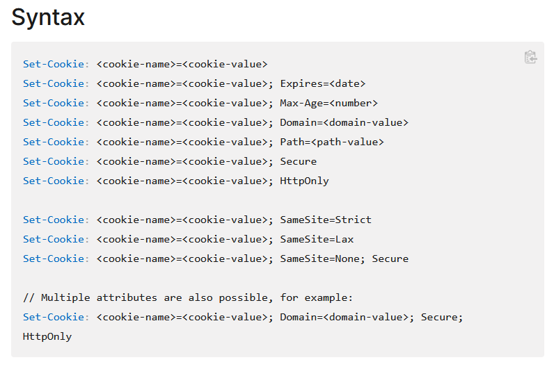

# 关于多个 Cookie 的分隔符这件事

对于 Cookie 的处理上，我最近遇到一个问题，那就是如何分割 Cookie 的内容。有人说是使用逗号分割，有人说是使用分号分割，究竟用哪个才是对的？其实这个答案是需要分为两个过程，分别是请求和响应，来进行回答。请求过程的 Cookie 和响应返回的 Cookie 的格式是不相同的

<!--more-->
<!-- 发布 -->
<!-- 博客 -->

请求 Request 的 Cookie 是放在 `Cookie` 头里面的，可以使用逗号或分号进行分割多个不同的 Cookie 内容。 但是大部分情况下都是采用分号加空格 `; ` 的方式进行分割，而不是逗号分割，且在 Cookie 的 Key 和 Value 里面，是不允许出现分号和逗号字符，如果真需要，那就需要进行转码

根据 [rfc2965](https://www.ietf.org/rfc/rfc2965.txt) 可以知道，在 Cookie 里面，服务器端接收的请求是需要处理两个方式分割的内容： 使用分号 `;` 分割和使用逗号 `,` 分割的情况。也就是说采用分号和逗号都是合理的，只是大家遵不遵守这个规范就是另一回事了

>   Note: For backward compatibility, the separator in the Cookie header
>   is semi-colon (;) everywhere.  A server SHOULD also accept comma (,)
>   as the separator between cookie-values for future compatibility.

为什么会同时支持分号和逗号作为分隔符？这是一个历史原因，再加上，对于请求来说，大部分的请求头，重复加入的时候，是采用逗号进行分割的，而分号分割的是相同的一条信息的多个属性内容。为了能更好的兼容，标准 [rfc2965](https://www.ietf.org/rfc/rfc2965.txt) 就规定了 `A server SHOULD also accept comma (,) as the separator` 服务端应该兼容使用逗号分割的情况。标准里面说的是服务端是 `应该` 而不是必须，也就是说会存在一些服务端是不支持逗号分割的。我测试了 ASP.NET Core 3.1 和 6.0 的行为，是能支持使用逗号或分号分割的 Cookie 内容

以下是一条通过 Fiddler 工具抓包的请求信息的内容

```csharp
POST https://test.lindexi.com/api/v1/coursewareShare/link HTTP/1.1
Host: test.lindexi.com
Cookie: x-auth-token=9e712b07dc404fe7b384e7f3dce7bbba; x-auth-app=Demo; x-auth-brand=; client_version=5.2.2.123; client_build_version=95228; client_flags=tabs
X-APM-TraceId: e6d841e5790d43e1a13e6b597281e06b
```

可以看到以上的请求里多条不同的 Cookie 使用 `; ` 分号加空格分割，这是比较常用的方法。对于以上的请求的 Cookie 内容，是**不能**通过 [CookieContainer.SetCookies](https://docs.microsoft.com/en-us/dotnet/api/system.net.cookiecontainer.setcookies?view=net-6.0) 去解析，原因在于 SetCookies 是设计用来处理响应的 Cookie 而不是用来处理请求的 Cookie 内容，使用 SetCookies 方法只能分割 `,` 逗号作为分隔符的 Cookie 情况

以上是对于请求的情况，请求是从客户端到服务器端的过程。接下来聊聊从服务器端到客户端的过程：

响应 Response 的 Cookie 是放在 `Set-Cookie` 头里面，多条 Cookie 一般对应多条 `Set-Cookie` 头。可以采用 [CookieContainer.SetCookies](https://docs.microsoft.com/en-us/dotnet/api/system.net.cookiecontainer.setcookies?view=net-6.0) 方法解析，值得一提的是 SetCookies 方法能处理使用 `,` 逗号分割的多个不同的 Cookie 内容，但是不能处理使用 `;` 分号分割的情况。不能处理 `;` 分号分割的情况是因为在响应里面，将使用 `;` 分号分割 Cookie 的信息，包括分割 Cookie 内容和 Cookie 对应域名和 Cookie 过期时间

如 mozilla 的[文档](https://developer.mozilla.org/en-US/docs/Web/HTTP/Headers/Set-Cookie)描述：

<!--  -->

```
Set-Cookie: <cookie-name>=<cookie-value>
Set-Cookie: <cookie-name>=<cookie-value>; Expires=<date>
Set-Cookie: <cookie-name>=<cookie-value>; Max-Age=<number>
Set-Cookie: <cookie-name>=<cookie-value>; Domain=<domain-value>
Set-Cookie: <cookie-name>=<cookie-value>; Path=<path-value>
Set-Cookie: <cookie-name>=<cookie-value>; Secure
Set-Cookie: <cookie-name>=<cookie-value>; HttpOnly

Set-Cookie: <cookie-name>=<cookie-value>; SameSite=Strict
Set-Cookie: <cookie-name>=<cookie-value>; SameSite=Lax
Set-Cookie: <cookie-name>=<cookie-value>; SameSite=None; Secure

// Multiple attributes are also possible, for example:
Set-Cookie: <cookie-name>=<cookie-value>; Domain=<domain-value>; Secure; HttpOnly
```

以下是一条通过 Fiddler 工具抓包的响应信息的内容

```csharp
HTTP/1.1 200 OK
Content-Type: application/json; charset=utf-8
Date: Wed, 24 Aug 2022 01:49:18 GMT
Server: Kestrel
Set-Cookie: Response1=Value; path=/
Set-Cookie: Response2=Value; path=/
```

可以看到以上的信息是通过多条响应头信息返回的，可以使用如下代码进行解析

```csharp
    /// <summary>
    /// 获取 <see cref="CookieCollection"/> 设置
    /// </summary>
    /// <param name="httpResponseMessage"></param>
    /// <returns></returns>
    public static CookieCollection GetCookie(this HttpResponseMessage httpResponseMessage)
    {
        Uri requestUri = httpResponseMessage.RequestMessage.RequestUri;
        var cookieContainer = new CookieContainer();
        if (httpResponseMessage.Headers.TryGetValues(HttpKnownHeaderNames.SetCookie, out var cookieValueList))
        {
            foreach (var value in cookieValueList)
            {
                // 这里的 SetCookies 仅设计用来支持响应的 Cookie 解析，而不是请求的 Cookie 解析
                cookieContainer.SetCookies(requestUri, value);
            }
        }

        return cookieContainer.GetCookies(requestUri);
    }
```

为什么会是如此奇怪的设计呢？这是历史原因，我找到一篇讲的很好的答案，请看 [cookie中的转义字符的方法是叫什么规范？ - 知乎](https://www.zhihu.com/question/46672990/answer/102290211 )

参考：

- <https://www.rfc-editor.org/rfc/rfc6265#section-4.1>
- <https://www.ietf.org/rfc/rfc2965.txt>
- <https://www.ietf.org/rfc/rfc2616.txt>

- [Support cookie values with comma · Issue #58773 · dotnet/runtime](https://github.com/dotnet/runtime/issues/58773 )
- [http - Is comma a valid character in cookie-value - Stack Overflow](https://stackoverflow.com/questions/25387340/is-comma-a-valid-character-in-cookie-value )
- [63434 – Multiple Cookie headers combined to one comma-separated header line](https://bz.apache.org/bugzilla/show_bug.cgi?id=63434 )
- [CookieContainer.SetCookies(Uri, String) Method (System.Net) Microsoft Docs](https://docs.microsoft.com/en-us/dotnet/api/system.net.cookiecontainer.setcookies?view=net-6.0 )
- [Cookies parsing in RFC2965 should allow deprecated comma separators · Issue #3041 · eclipse/jetty.project](https://github.com/eclipse/jetty.project/issues/3041 )
- [Cookie header values should be separated by semi-colon not comma. · Issue #42856 · dotnet/runtime](https://github.com/dotnet/runtime/issues/42856 )