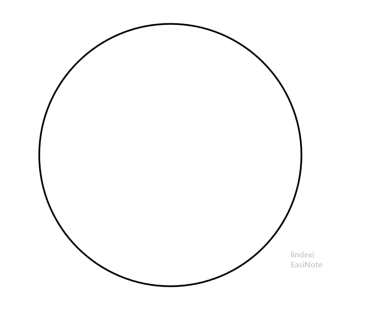
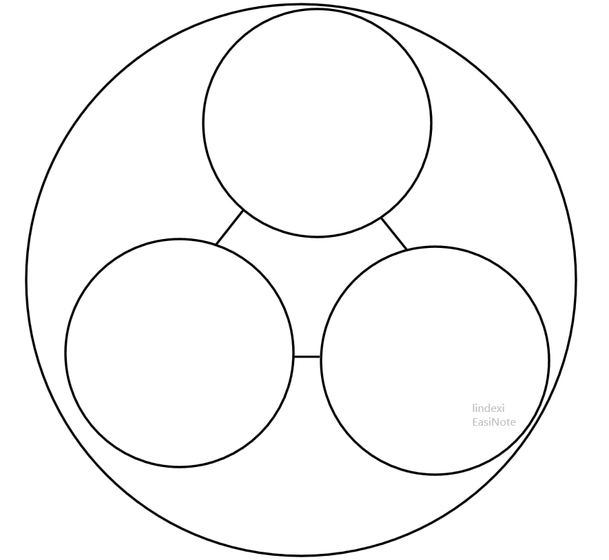
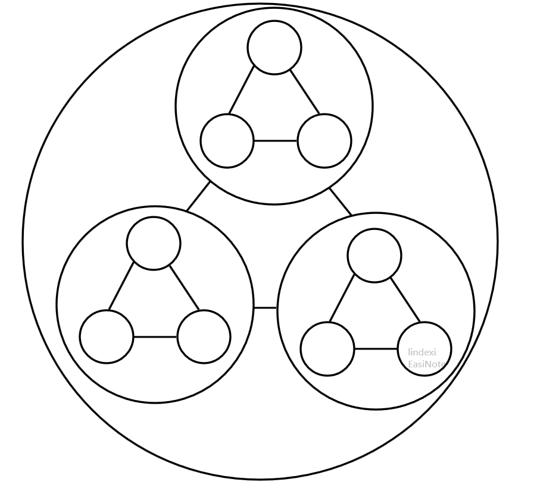

# 分形和图论网络

其实这是一个古老的话题，我用10分钟和你讲一段古老的故事。本文没有公式也没有前置的知识，只是一个有趣的故事。读这个故事能够消耗你几分钟，听着玩就可以，千万不要思考

<!--more-->
<!-- 发布 -->

很久之前，有一群数学家想出了图论的概念，啥是图论呢，他和网络有什么关系呢？其实这里用到的仅仅只是图论里面的一丁点东西，最简单的图可能不是多媒体视频图片的图了，而是指一些点和一些线连接的东西。在图论里面的图指的是有一些点，这些点之间有一些线连接，这就是图了。有了图之后，自然就有了很多对他的理论，这些理论大概就组成了民科的图论了

这群数学家就通过一些点和一些线段想出了让一群大学生上学的时候学的很辛苦的图论。不过在这群数学家开始想的时候，可没预测到现代的信息社会居然用到了这些当时看起来没啥用的知识。现在信息社会最主要的是什么？手机？不对，应该是联网的手机，或者说联网的设备，毕竟还有电脑哈。联网的设备其实是跑在一张网上面，这张网就是互联网。好，吹多了，回到主题。什么是网络？其实网络就是将一些点连接起来，可以认为每个手机都是一个点，而将多个手机连接起来的东西就是网络。没错就是上网的网络。但是这里的图论网络是啥？其实就是一个抽象的概念，去掉所有业务，将连接到网络的设备抽象为点，将设备之间的连接抽象为线，此时就是一个图论里面的网络了

今天聊的内容其实和互联网和手机没啥关系，说到手机只是让小伙伴比较好理解什么是图论网络哈。这里的图论网络没有任何业务，只是很抽象的数学表示，可以用在表示互联网上，也可以用来表示道路。下面要讲的故事只是十分抽象的图论网络，没有说到任何和编程相关的内容

在科学里面特别是计算机领域，有很多叫玄学的算法。什么是玄学的算法？其实就是人类难以理解为什么这样做就可以的算法。例如最简单的玄学算法就是我在文章下面写了一个点赞按钮，为什么看文章的小伙伴都不点赞呢

而特别著名的玄学算法里面就包括了分形算法，这个算法强大之处在于创建世界。有谁能证明上面这句话是对的？活着的小伙伴都能证明，没错，这个世界就是对这个算法的证明

这个世界不是 我的世界（Minecraft 微软的一个沙箱游戏）而是现实世界。千万不要问我什么是分形，请自行百度

那图论网络和分形有什么关系。在图论里面是用点和线，而小伙伴有没想过如果一个点也是一个图？这是图论超点的概念，将多个点合并为一个点。而多个点就可以视为一个图。也就是说点是点，点也是图，图也是点。这个超点和本文有什么关系，在计算机里面很难作出无限，或者说一下子就给出无限。但是计算机可以表示出无限，例如无限循环。而假设有一张无穷大的图，请问可以如何表示？因为计算机里面没有无穷大的内存可以表示无穷大的图，所以直接表示是很难做到的。间接表示呢？毕竟小伙伴要的也只是一张无穷大的图，根据超点的定义，图也是点。那就给一个点，这个点是一个超点，这个超点里面是一张无穷大的图，是不是就完成了

此时小伙伴是不是还有一个疑惑，那么我展开这个超点，是不是就需要表示一张无穷大的图了？也就是使用超点只是不让一开始就 gg 啦。其实如果在超点展开的时候，包含的也只是多个超点呢？没错，一个超点展开的多个超点里面的每个超点都是包含一张无穷大的图，这个很有趣。一个包含无穷大的超点展开了多个包含无穷大的图的超点，那么继续展开呢？继续展开每个超点里面也包含了一张无穷大的图，这个逻辑好像没错

那么请问我需要展开多少次我才能展开出一张无穷大的图？展开无穷大次才可以。因为在计算机里面无法一次性展开无穷大次，假设计算机一次计算只能展开一次，那么计算机需要无穷大的时间才能展开无穷大次。此时的内存就足够使用了，根据一些有趣的定律，每过一些时间，计算机的硬件内存就会翻倍，也就是经过无穷大的时间，如果没有世界大战的话，应该是能制造出无穷大的内存硬件的，此时就足够放下这张无穷大的图了

是不是被我绕进去了。上面只是一个笑话哈，不过小伙伴也看出了超点的强大，在不展开超点的时候是不知道超点里面的图有多大的，特别是超点展开之后里面还是超点

那么问题来了，可以如何表示这个超点呢，有一个方法就是使用分形的方法。假设有一个图，这个图是无穷大的。将这个图用一个超点表示，展开这个超点可以看到一张由三个超点组成的图。展开这三个超点，每个超点都可以展开为一张由三个超点组成的图。继续展开超点，每个超点都是一张由三个超点组成的图。这样进行无穷展开之后就可以拿到一张包含无穷个点的图

让小伙伴来展开一下，假设一开始的图是一个超点

<!--  -->

展开这个超点是包含三个超点的图

<!--  -->

继续展开超点，每个超点都是一个包含三个超点的图

<!--  -->

这个分形就可以做到表示一张超级大的图，而且刚才是分形每个超点，其实可以只分形一些超点，这就好玩了，没有需求的超点就不展开

这和网络有什么关系，其实从上面的图可以看出来，每个点之间有线联系，这就组成了网络。通过分形可以作出一张无穷大的网络

 本作品采用<a rel="license" href="http://creativecommons.org/licenses/by-nc-sa/4.0/">知识共享署名-非商业性使用-相同方式共享 4.0 国际许可协议</a>进行许可。欢迎转载、使用、重新发布，但务必保留文章署名[林德熙](http://blog.csdn.net/lindexi_gd)(包含链接:http://blog.csdn.net/lindexi_gd )，不得用于商业目的，基于本文修改后的作品务必以相同的许可发布。如有任何疑问，请与我[联系](mailto:lindexi_gd@163.com)。
