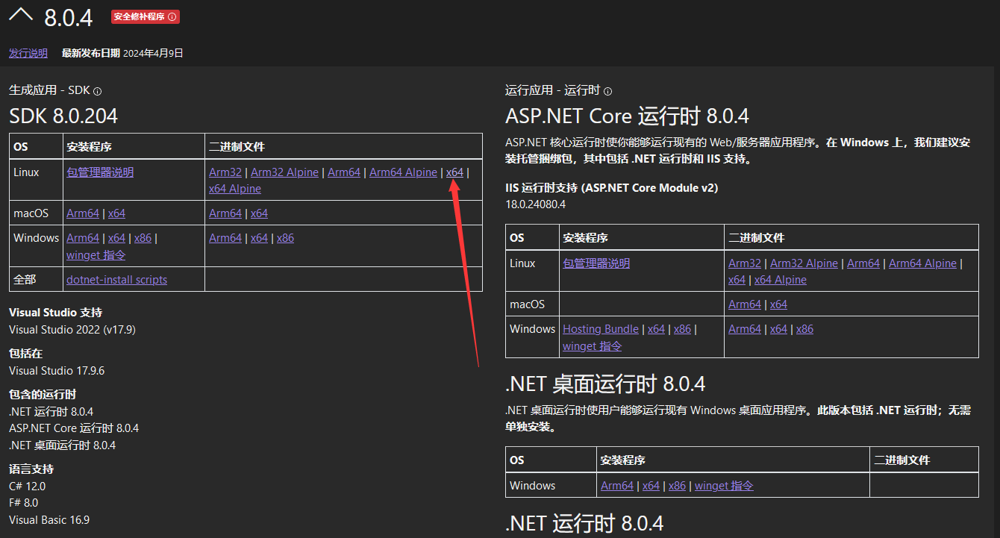
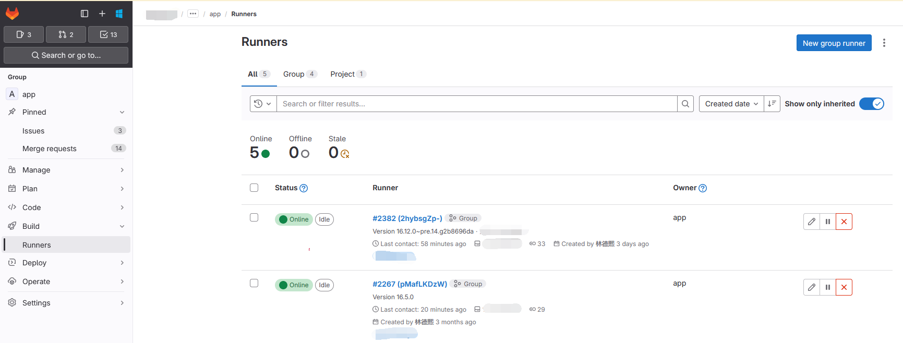
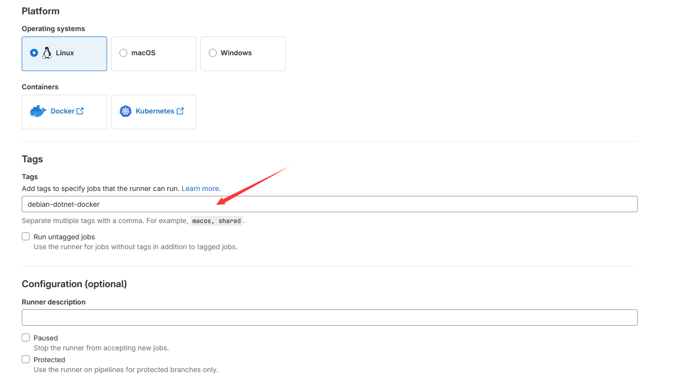

# 制作一个能构建 dotnet AOT 的 gitlab ruuner 的 Debian docker 镜像

我的需求是需要有一个能够构建出 dotnet 的 AOT 包的环境，要求这个环境能解决 glibc 兼容依赖的问题，能打出来 x64 和 arm64 的 AOT 的包，且能够运行 gitlab runner 对接自动构建

<!--more-->


<!-- 发布 -->
<!-- 博客 -->

## 需求

以下是我列举的需求

- 支持制作能在 UOS 系统和麒麟系统上运行的包
- 支持制作出来的包是 AOT 版本的
- 可以使用 gitlab runner 对接自动构建

开始之前必须说明的是，对于 dotnet 应用来说，如果不需要 AOT 的话，完全可以在 Windows 上构建出其他 Linux 系统和其他平台适用的应用。仅仅只是在 AOT 下，强依赖平台构建时，才有需要在对应的系统平台构建

## 制作方法

我制作的 docker 的 Dockerfile 是基于 `debian:buster-slim` 打上负载的

```
FROM debian:buster-slim
```

为了提升一点拉取速度，我换成国内的源，使用的是阿里的源

```
RUN rm /etc/apt/sources.list
COPY sources.list /etc/apt/sources.list
RUN apt-get update
```

这里的 sources.list 的代码是从 [debian镜像_debian下载地址_debian安装教程-阿里巴巴开源镜像站](https://developer.aliyun.com/mirror/debian ) 抄的，代码如下

```
deb http://mirrors.aliyun.com/debian/ buster main non-free contrib
deb-src http://mirrors.aliyun.com/debian/ buster main non-free contrib
deb http://mirrors.aliyun.com/debian-security buster/updates main
deb-src http://mirrors.aliyun.com/debian-security buster/updates main
deb http://mirrors.aliyun.com/debian/ buster-updates main non-free contrib
deb-src http://mirrors.aliyun.com/debian/ buster-updates main non-free contrib
```

为了交叉构建，同时构建出 ARM64 的 AOT 的 dotnet 应用，我根据 [Cross-compilation - .NET - Microsoft Learn](https://learn.microsoft.com/en-us/dotnet/core/deploying/native-aot/cross-compile ) 的文档安装上必要的负载

```
RUN dpkg --add-architecture arm64
RUN apt update

RUN apt-get install libicu-dev -y
RUN apt-get install libssl-dev -y
RUN apt-get install wget -y
RUN apt-get install clang llvm -y
RUN apt-get install gcc-aarch64-linux-gnu -y
RUN apt-get install binutils-aarch64-linux-gnu -y
RUN apt-get install zlib1g-dev -y
RUN apt-get install zlib1g-dev:arm64 -y
```

为了方便调试和对接 gitlab runner 我还加上了 git 和 vim 工具

```
RUN apt-get install vim -y
RUN apt-get install git -y

RUN apt-get clean
```

到这一步，就完成了 docker image 里面的基础部分了，现在的 Dockerfile 的代码如下

```
FROM debian:buster-slim
WORKDIR /root

RUN rm /etc/apt/sources.list
COPY sources.list /etc/apt/sources.list
RUN apt-get update

RUN dpkg --add-architecture arm64
RUN apt update

RUN apt-get install libicu-dev -y
RUN apt-get install libssl-dev -y
RUN apt-get install wget -y
RUN apt-get install clang llvm -y
RUN apt-get install gcc-aarch64-linux-gnu -y
RUN apt-get install binutils-aarch64-linux-gnu -y
RUN apt-get install zlib1g-dev -y
RUN apt-get install zlib1g-dev:arm64 -y

RUN apt-get install vim -y
RUN apt-get install git -y

RUN apt-get clean
```

接着到 [dotnet 官网](https://dotnet.microsoft.com/zh-cn/download/dotnet/8.0) 下载 dotnet 8 和 dotnet 6 的 sdk 压缩包，本文这里使用的是自己解压缩的方式。换成命令方式安装也可以，只是命令方式拉取的速度可能不如先下载压缩包的方式，且下载压缩包可以方便多次重新构建，在 Dockerfile 不断需要修改时，使用压缩包可以省去多次修改之后的重新构建时的拉取时间

<!--  -->


本文这里采用的是下载压缩包的方式，下载到 dotnet-sdk-6.0.421-linux-x64.tar.gz 和 dotnet-sdk-8.0.204-linux-x64.tar.gz 这两个压缩包。如果大家下载失败，或者没有网速的话，可以邮件给我，让我用网盘发给你。一般情况下在国内都能拉取成功，因为微软帮忙提供了全球 CDN 了，下载速度在我这里还是很快的。下载 dotnet 6 版本仅仅只是为了让我的构建工具正常工作而已，属于可选项

下载完成 dotnet 的压缩包，即可使用 Dockerfile 的 ADD 命令将压缩包解压缩到 docker image 里的某个文件夹里面，如下面代码

```
WORKDIR /root
ADD dotnet-sdk-6.0.421-linux-x64.tar.gz ./dotnet
ADD dotnet-sdk-8.0.204-linux-x64.tar.gz ./dotnet
```

解压缩完成之后，配置环境变量等，让全局可以使用 dotnet 命令

```
ENV DOTNET_ROOT="/root/dotnet"
ENV PATH="${PATH}:${DOTNET_ROOT}:${DOTNET_ROOT}/tools"
ENV DOTNET_CLI_TELEMETRY_OPTOUT=1
RUN ln -s /root/dotnet/dotnet /usr/bin/dotnet
```

完成以上步骤之后，一个特别简单的 dotnet 构建 Dockerfile 已经完成了，接下来一步则是配置 gitlab runner 的步骤。我将参考 [gitlab runner 官方安装文档](https://docs.gitlab.com/runner/install/) 进行配置，只是过程稍微取巧

先根据 [Install GitLab Runner manually on GNU/Linux - GitLab](https://docs.gitlab.com/runner/install/linux-manually.html ) 提供的方法，拉取 GitLab Runner 的二进制压缩包，本文这里是需要下载 Linux x86-64 版本，当前的下载链接是 <https://s3.dualstack.us-east-1.amazonaws.com/gitlab-runner-downloads/latest/binaries/gitlab-runner-linux-amd64>

下载链接可能会有变更，还请大家重新参考 [Install GitLab Runner manually on GNU/Linux - GitLab](https://docs.gitlab.com/runner/install/linux-manually.html ) 文档，找到更新的下载 Linux x86-64 版本的下载地址

完成下载之后，通过 COPY 命令拷贝到 docker image 里

```
COPY gitlab-runner-linux-amd64 /usr/share/gitlab/gitlab-runner

RUN chmod +x /usr/share/gitlab/gitlab-runner
```

完成以上步骤之后需要对 GitLab Runner 进行配置。本文这里采用取巧的方式，即先将 GitLab Runner 运行起来，配置完成之后，存放配置文件，再将配置文件打入到 docker image 里面，后续就只需启动 docker image 即可

具体的步骤是先将当前的 Dockerfile 构建且运行。我这里使用的是 podman 工具，如果大家使用的是 docker desktop 的话，只需将 podman 命令换成 docker 命令即可，其他参数相同

```
// 先 cd 到 Dockerfile 所在的文件夹，再执行以下命令
podman build -t t1 .
```

当前的 Dockerfile 文件的代码如下

```
FROM debian:buster-slim
WORKDIR /root

RUN rm /etc/apt/sources.list
COPY sources.list /etc/apt/sources.list
RUN apt-get update

RUN dpkg --add-architecture arm64
RUN apt update

RUN apt-get install libicu-dev -y
RUN apt-get install libssl-dev -y
RUN apt-get install wget -y
RUN apt-get install clang llvm -y
RUN apt-get install gcc-aarch64-linux-gnu -y
RUN apt-get install binutils-aarch64-linux-gnu -y
RUN apt-get install zlib1g-dev -y
RUN apt-get install zlib1g-dev:arm64 -y

RUN apt-get install vim -y
RUN apt-get install git -y

RUN apt-get clean

ADD dotnet-sdk-6.0.421-linux-x64.tar.gz ./dotnet
ADD dotnet-sdk-8.0.204-linux-x64.tar.gz ./dotnet
ENV DOTNET_ROOT="/root/dotnet"
ENV PATH="${PATH}:${DOTNET_ROOT}:${DOTNET_ROOT}/tools"
ENV DOTNET_CLI_TELEMETRY_OPTOUT=1
RUN ln -s /root/dotnet/dotnet /usr/bin/dotnet

COPY gitlab-runner-linux-amd64 /usr/share/gitlab/gitlab-runner

RUN chmod +x /usr/share/gitlab/gitlab-runner
```

再将打包好的 docker image 运行，运行时记得挂载上文件夹，用于将 docker 里面的文件传输到主机

```
// 提前创建好 C 盘的 lindexi 的 wsl 文件夹，你换成自己的文件夹也可以
podman run -i -t -v /mnt/c/lindexi/wsl:/etc/gitlab-runner t1
```

以上代码的 `/mnt/c/lindexi/wsl` 是我自己的 `C:\lindexi\wsl` 文件夹，这是我提前建立好的空文件夹。大家换成自己的文件夹也可以，如果用 docker desktop 的话，需要看一下是否运行在 wsl 上，如果不在的话，也许需要换成 Windows 下的路径表示方法，相信这一步难不倒大家的

进入之后，即可使用 `/usr/share/gitlab/gitlab-runner` 命令进行注册，具体的注册步骤如下

本文使用注册 GitLab 组 作为例子，注册单个项目的步骤也类似，详细请参阅 <https://docs.gitlab.com/runner/configuration/> 文档。先进入到 GitLab 的 组 的 Runner 配置界面里面，点击 New group runner 按钮

<!--  -->


点击之后，进入配置界面。由于这是一个特殊的构建方式，我推荐写上 gitlab 的 runner tag 项，我这里写的是 `debian-dotnet-docker` 标记。这里的标记需要和 git 的 tag 区分哦，这是两个完全不相同的东西

<!--  -->


点击 Create runner 按钮，即可进入到创建配置命令界面，拷贝其配置命令参数，如我这里的是

```csharp
gitlab-runner register
  --url https://gitlab.lindexi.com
  --token glrt-HbCpfssbPSFqR_xVtxLX
```

于是我在运行起来的 docker 命令行里面输入以下命令用于注册

```
/usr/share/gitlab/gitlab-runner register --url https://gitlab.lindexi.com --token glrt-HbCpfssbPSFqR_xVtxLX
```

输入之后，一路都是回车下一步，除了执行命令部分可选使用 shell 之外。完成之后再使用 `/usr/share/gitlab/gitlab-runner run` 命令运行起来试试，如果能够运行成功，且在 gitlab 的 runner 页面里面能够看到运行起来的 runner 则证明成功。否则还请自行调试哈，我也不熟悉

完成之后即可愉快退出 docker 环境，此时即可在挂载到 `/etc/gitlab-runner` 的文件夹里面，即本文的 `C:\lindexi\wsl` 文件夹里面看到配置文件，一般是 `config.toml` 文件

在上述步骤完成之后，咱可以取出来挂载的文件夹，如我这里的 `C:\lindexi\wsl` 文件夹，将其拷贝到 Dockerfile 文件所在的文件夹里面，用于编写 Dockerfile 拷贝到 `/etc/gitlab-runner` 文件夹里面，如此制作出来的 docker image 将会带上已经注册的 gitlab runner 信息

```
COPY wsl /etc/gitlab-runner
```

接着再执行安装命令，以及设置入口为 gitlab-runner run 即可

```
RUN /usr/share/gitlab/gitlab-runner install --user=root --working-directory=/root/.local/share/gitlab

ENTRYPOINT ["/usr/share/gitlab/gitlab-runner", "run"]
```

完成以后的 Dockerfile 文件如下

```
FROM debian:buster-slim
WORKDIR /root

RUN rm /etc/apt/sources.list
COPY sources.list /etc/apt/sources.list
RUN apt-get update

RUN dpkg --add-architecture arm64
RUN apt update

RUN apt-get install libicu-dev -y
RUN apt-get install libssl-dev -y
RUN apt-get install wget -y
RUN apt-get install clang llvm -y
RUN apt-get install gcc-aarch64-linux-gnu -y
RUN apt-get install binutils-aarch64-linux-gnu -y
RUN apt-get install zlib1g-dev -y
RUN apt-get install zlib1g-dev:arm64 -y

RUN apt-get install vim -y
RUN apt-get install git -y

RUN apt-get clean

ADD dotnet-sdk-6.0.421-linux-x64.tar.gz ./dotnet
ADD dotnet-sdk-8.0.204-linux-x64.tar.gz ./dotnet
ENV DOTNET_ROOT="/root/dotnet"
ENV PATH="${PATH}:${DOTNET_ROOT}:${DOTNET_ROOT}/tools"
ENV DOTNET_CLI_TELEMETRY_OPTOUT=1
RUN ln -s /root/dotnet/dotnet /usr/bin/dotnet

COPY gitlab-runner-linux-amd64 /usr/share/gitlab/gitlab-runner

RUN chmod +x /usr/share/gitlab/gitlab-runner

COPY wsl /etc/gitlab-runner

RUN /usr/share/gitlab/gitlab-runner install --user=root --working-directory=/root/.local/share/gitlab

ENTRYPOINT ["/usr/share/gitlab/gitlab-runner", "run"]

RUN mkdir /root/build
WORKDIR /root/build
```

尝试构建此 Dockerfile 文件

```
// 先 cd 到 Dockerfile 所在的文件夹，再执行以下命令
podman build -t t1 .
```

接着挂载到后台运行

```
podman container run -v nuget_global:/root/.nuget/packages -v nuget_cache:/root/.local/share/NuGet -v gitlabrunner:/root/.local/share/gitlab -d t1
```

以上命令的 `-v nuget_global:/root/.nuget/packages -v nuget_cache:/root/.local/share/NuGet -v gitlabrunner:/root/.local/share/gitlab` 属于可选的参数，用来挂载 nuget 缓存等内容，解决 docker 每次重启都会丢失缓存文件，提升重启 docker 之后的构建速度，减少重复拉取 nuget 包

完成以上步骤之后，就已经完成了制作一个能构建 dotnet AOT 的 gitlab ruuner 的 Debian docker 镜像

可以尝试在自己的项目里面，编写 `.gitlab-ci.yml` 文件，指定到这个运行起来的 docker image 上运行，以下是我的测试使用的 `.gitlab-ci.yml` 文件代码

```yml
stages:
  - build

BuildLinuxX64InDocker:
  stage: build
  script:
    - 'dotnet run publish -p:PublishAot=true -c Release -r linux-x64'
  tags:
    - docker-uos

BuildLinuxArm64InDocker:
  stage: build
  script:
    - 'dotnet run publish -p:PublishAot=true -c Release -r linux-arm64'
  tags:
    - docker-uos 
```

如果能够构建成功，且构建出 linux-x64 和 linux-arm64 的 dotnet 可执行文件，则表示成功。否则还请自行根据输出的错误信息修复

## 踩坑记录

### 为什么不在 WSL 里面构建

核心原因是 WSL 里面的 glibc 版本过于新，使用 `ldd --version` 命令可以看到的输出如下

```
ldd (GNU libc) 2.36
```

而麒麟的 Desktop-V10-SP1 版本的 glibc 是 2.31 版本，更惨的 UOS 20.1050.11068.102 版本的 glibc 是 2.28 版本，都低于 WSL 里面的版本

这就意味着在 WSL 里面构建出来的应用将无法在以上的两个系统上运行

这就是为什么使用 `debian:buster-slim` 的原因。当前我拉取的 `debian:buster-slim` 的 docker image id 是 6d0d34a48ee1 的版本。通过 `cat /etc/debian_version` 可以看到在此版本里面带的是 debian 10.13 版本

再通过 `ldd --version` 命令行获取的 glibc 版本信息，可以看到带的是 2.28 版本，刚好与 UOS 20.1050.11068.102 版本的 glibc 版本相同，低于麒麟的 Desktop-V10-SP1 的 glibc 版本

因此在此 `debian:buster-slim` 里面 AOT 构建出来的包可以同时在 UOS 20.1050.11068.102 和麒麟的 Desktop-V10-SP1 版本运行

### debian buster-backports Release does not have a Release file

开始国内源使用了阿里的，结果遇到以下错误内容

```
E: The repository 'http://mirrors.aliyun.com/debian buster-backports Release' does not have a Release file.
Error: building at STEP "RUN apt update": while running runtime: exit status 100
```

重新参考了 [替换docker容器默认的debian镜像 - OrcHome](https://www.orchome.com/8173 ) 博客，结果依然配置失败。核心原因是配置的版本不正确

我当前使用的是 debian 是 10.13 版本，需要根据 [debian镜像_debian下载地址_debian安装教程-阿里巴巴开源镜像站](https://developer.aliyun.com/mirror/debian ) 教程文档，更新对应的 `debian 10.x (buster)` 的配置

我是如何知道 debian 版本的，我通过运行镜像，输入 `cat /etc/debian_version` 命令获取到版本

### No system certificates available

完成配置阿里的源，遇到以下的错误内容

```
W: https://mirrors.aliyun.com/debian/dists/buster/InRelease: No system certificates available. Try installing ca-certificates.
```

原因是 ca-certificates 没有提前安装，可以在切换为国内源之前，安装好。安装方法可参阅 [修复 Debian 安装 dotnet 失败 depends on ca-certificates](https://blog.lindexi.com/post/%E4%BF%AE%E5%A4%8D-Debian-%E5%AE%89%E8%A3%85-dotnet-%E5%A4%B1%E8%B4%A5-depends-on-ca-certificates.html )

由于我这里不需要关注安全性问题，更简单的方法是将 https 全部更换为 http 即可

### 安装 dotnet tool 失败

执行任何的 dotnet tool install 都会提示如下错误

```
Unhandled exception: System.IO.FileNotFoundException: Unable to find the specified file.
   at Interop.Sys.GetCwdHelper(Byte* ptr, Int32 bufferSize)
   at Interop.Sys.GetCwd()
   at Microsoft.DotNet.Cli.ToolPackage.ToolPackageDownloader..ctor(IToolPackageStore store, String runtimeJsonPathForTests)
   at Microsoft.DotNet.ToolPackage.ToolPackageFactory.CreateToolPackageStoresAndDownloader(Nullable`1 nonGlobalLocation, IEnumerable`1 additionalRestoreArguments)
   at Microsoft.DotNet.Tools.Tool.Update.ToolUpdateLocalCommand..ctor(ParseResult parseResult, IToolPackageDownloader toolPackageDownloader, IToolManifestFinder toolManifestFinder, IToolManifestEditor toolManifestEditor, ILocalToolsResolverCache localToolsResolverCache, IReporter reporter)
   at Microsoft.DotNet.Tools.Tool.Update.ToolUpdateCommand..ctor(ParseResult result, IReporter reporter, ToolUpdateGlobalOrToolPathCommand toolUpdateGlobalOrToolPathCommand, ToolUpdateLocalCommand toolUpdateLocalCommand)
   at Microsoft.DotNet.Cli.ToolUpdateCommandParser.<>c.<ConstructCommand>b__14_0(ParseResult parseResult)
   at System.CommandLine.Invocation.InvocationPipeline.Invoke(ParseResult parseResult)
   at Microsoft.DotNet.Cli.Program.ProcessArgs(String[] args, TimeSpan startupTime, ITelemetry telemetryClient)
```

暂时没有找到可用方法，只能绕路

我在 windows 下将所需工具下载下来，然后通过拷贝进入的方式即可完全安装

当然，在本文例子里面，我没有加上我所使用的工具

### 在 gitlab 构建脚本找不到 dotnet 命令

在命令行里面，可以使用 dotnet 命令，但是在 `.gitlab-ci.yml` 文件里面编写的脚本找不到 dotnet 命令

加上如下配置到 Dockerfile 即可

```
RUN ln -s /root/dotnet/dotnet /usr/bin/dotnet
```

以上命令是对 dotnet 建立链接，如此即可让全局可以使用 dotnet 命令

### 为什么使用 podman 工具

原因是在 windows 下的 docker desktop 是收费的，于是我用平替的 podman 工具

### 还原速度过慢

由于 docker 本身是不带持久化存储文件，只有通过挂载本机存储的方式，才能让 docker 里面的文件持久化存放

还原速度过慢的问题，是因为初始化时没有任何的 NuGet 缓存，导致需要大量拉取，从而导致拉取过慢

根据 [How to manage the global packages, cache, temp folders in NuGet - Microsoft Learn](https://learn.microsoft.com/en-us/nuget/consume-packages/managing-the-global-packages-and-cache-folders ) 官方文档说明，获取到默认的缓存路径，使用如下命令将缓存路径挂载到本机

```
-v nuget_global:/root/.nuget/packages -v nuget_cache:/root/.local/share/NuGet
```

我这里挂载写的是相对路径，如 `nuget_global` 等路径，相对路径在 podman 下将会存放到 wsl 里面，详细请看 [在 windows 上运行的 podman 默认的挂载相对路径是什么](https://blog.lindexi.com/post/%E5%9C%A8-windows-%E4%B8%8A%E8%BF%90%E8%A1%8C%E7%9A%84-podman-%E9%BB%98%E8%AE%A4%E7%9A%84%E6%8C%82%E8%BD%BD%E7%9B%B8%E5%AF%B9%E8%B7%AF%E5%BE%84%E6%98%AF%E4%BB%80%E4%B9%88.html )

### 为什么代码仓库路径不挂载

如上述还原速度过慢原因，由于 docker 本身是不带持久化存储文件，只有通过挂载本机存储的方式，才能让 docker 里面的文件持久化存放。有些伙伴认为将代码仓库路径也进行本机挂载，可以减少拉取代码仓库的时间。实际上这么做可能带来的后果是开启多 docker 容器时，出现构建过程中的相互影响问题

拉取代码仓库时，大部分时间都是拉取内网的，且只影响容器的重启后的首次拉取。因此挂在代码仓库不是必要的

挂载代码仓库可能受到 Windows 自带杀毒影响，导致 llvm-objcopy 这一步失败，大概的错误信息如下

```
llvm-objcopy: failed to open xx.dbg Input/output error.

/root/.nuget/packages/microsoft.dotnet.ilcompiler/8.0.4/build/Microsoft.NETCore.Native.targets(379,5): error MSB3073: The command ""llvm-objcopy" --only-keep-debug xx xx exited with code 1.
```

解决方法是要么不挂载，要么在 Windows 自带杀毒加白名单

### 如何使用交叉编译

由于我缺少 ARM64 的机器，或者准确来说我缺少一台可以撑住构建的有性能的 ARM64 的机器，我期望能够在原有的 linux-x64 机器上构建出 ARM64 的应用。于是我就需要使用到交叉编译技术，通过此技术我就可以在 linux-x64 的机器上构建出 linux-arm64 的应用

参考 [Cross-compilation - .NET - Microsoft Learn](https://learn.microsoft.com/en-us/dotnet/core/deploying/native-aot/cross-compile ) 的文档安装上必要的负载，如下面的 docker 代码，即可在 debian 的 x64 系统上构建出 ARM64 的 dotnet 的 AOT 应用

```
RUN dpkg --add-architecture arm64
RUN apt update

RUN apt-get install libicu-dev -y
RUN apt-get install libssl-dev -y
RUN apt-get install wget -y
RUN apt-get install clang llvm -y
RUN apt-get install gcc-aarch64-linux-gnu -y
RUN apt-get install binutils-aarch64-linux-gnu -y
RUN apt-get install zlib1g-dev -y
RUN apt-get install zlib1g-dev:arm64 -y
```

在进行 dotnet 发布时，将在 dotnet 里面自动根据 -r 参数自动执行交叉编译，如下面命令

```
dotnet publish -p:PublishAot=true -c Release -r linux-arm64
```

相关文档请看 [runtime/docs/workflow/building/libraries/cross-building.md at main · dotnet/runtime](https://github.com/dotnet/runtime/blob/189d6879a630b5bf61422d855495b9ee276aaa5e/docs/workflow/building/libraries/cross-building.md ) 和 [runtime/docs/workflow/building/coreclr/cross-building.md at main · dotnet/runtime](https://github.com/dotnet/runtime/blob/189d6879a630b5bf61422d855495b9ee276aaa5e/docs/workflow/building/coreclr/cross-building.md )

### 为什么不使用 gitlab-runner start 命令

因为实际测试 gitlab-runner start 之后没有真的执行，如下面代码

```
RUN /usr/share/gitlab/gitlab-runner start
```

添加之后运行 docker image 也不会有 gitlab runner 上线

如果换成下面的代码，则启动 docker image 之后立刻退出

```
ENTRYPOINT ["/usr/share/gitlab/gitlab-runner", "start"]
```

实际测试只有以下代码符合预期

```
ENTRYPOINT ["/usr/share/gitlab/gitlab-runner", "run"]
```

### 找不到 runner 机器或找错

先调查是否 [dotnet 配置 Gitlab 的 CI 找不到 Runner 或找错的可能原因](https://blog.lindexi.com/post/dotnet-%E9%85%8D%E7%BD%AE-Gitlab-%E7%9A%84-CI-%E6%89%BE%E4%B8%8D%E5%88%B0-Runner-%E6%88%96%E6%89%BE%E9%94%99%E7%9A%84%E5%8F%AF%E8%83%BD%E5%8E%9F%E5%9B%A0.html ) 提及的问题

排除之后，记得查看是否带上了 `tags` 和 runner 在 gitlab 上配置正确且相同的

### 参考文档

- <https://github.com/dotnet/runtime/blob/main/src/coreclr/nativeaot/docs/compiling.md#cross-architecture-compilation>
- [dotnet publish command - .NET CLI - Microsoft Learn](https://learn.microsoft.com/en-us/dotnet/core/tools/dotnet-publish )
- [.NET Runtime Identifier (RID) catalog - .NET - Microsoft Learn](https://learn.microsoft.com/en-us/dotnet/core/rid-catalog )
- [Cross-compilation - .NET - Microsoft Learn](https://learn.microsoft.com/en-us/dotnet/core/deploying/native-aot/cross-compile )
- [Prepare .NET libraries for trimming - .NET - Microsoft Learn](https://learn.microsoft.com/en-us/dotnet/core/deploying/trimming/prepare-libraries-for-trimming?source=recommendations&pivots=dotnet-8-0 )
- [How to manage the global packages, cache, temp folders in NuGet - Microsoft Learn](https://learn.microsoft.com/en-us/nuget/consume-packages/managing-the-global-packages-and-cache-folders )
- <https://dotnet.microsoft.com/zh-cn/download/dotnet/8.0>
- [Troubleshooting GitLab Runner - GitLab](https://docs.gitlab.com/runner/faq/ )
- [docker Debian Buster 国内常用镜像源](https://www.xiaoshu168.com/docker/378.html )
- [docker - What is the difference between CMD and ENTRYPOINT in a Dockerfile? - Stack Overflow](https://stackoverflow.com/questions/21553353/what-is-the-difference-between-cmd-and-entrypoint-in-a-dockerfile )
- [How to fix 'buster-backports' no longer has a Release file - nixCraft](https://www.cyberciti.biz/faq/the-repository-http-deb-debian-org-debian-buster-backports-release-no-longer-has-a-release-file/ )
- [替换docker容器默认的debian镜像 - OrcHome](https://www.orchome.com/8173 )
- [debian镜像_debian下载地址_debian安装教程-阿里巴巴开源镜像站](https://developer.aliyun.com/mirror/debian )
- [Configure GitLab Runner - GitLab](https://docs.gitlab.com/runner/configuration/ )
- [Install GitLab Runner - GitLab](https://docs.gitlab.com/runner/install/ )
- [Gitlab runner setup with podman - GitLab CI/CD - GitLab Forum](https://forum.gitlab.com/t/gitlab-runner-setup-with-podman/87893 )
- [Registering runners - GitLab](https://docs.gitlab.com/runner/register/index.html )
- [Install GitLab Runner manually on GNU/Linux - GitLab](https://docs.gitlab.com/runner/install/linux-manually.html )
- [GitLab Runner bleeding edge releases - GitLab](https://docs.gitlab.com/runner/install/bleeding-edge.html#download-any-other-tagged-release )
- [NuGet pack and restore as MSBuild targets - Microsoft Learn](https://learn.microsoft.com/en-us/nuget/reference/msbuild-targets#packagereadmefile )
- [/usr/bin/dotnet: 没有那个文件或目录-CSDN博客](https://blog.csdn.net/yedajiang44/article/details/121848792 )
- [在 Linux ARM 系统上安装 .Net - 快乐就在你的心 的个人博客](https://kljzndx.github.io/My-Blog/2020/03/06/Setup-.Net-on-Linux-ARM/ )
- [dotnet 配置 Gitlab 的 Runner 做 CI 自动构建](https://blog.lindexi.com/post/dotnet-%E9%85%8D%E7%BD%AE-Gitlab-%E7%9A%84-Runner-%E5%81%9A-CI-%E8%87%AA%E5%8A%A8%E6%9E%84%E5%BB%BA.html )
- [dotnet 配置 Gitlab 的 CI 找不到 Runner 或找错的可能原因](https://blog.lindexi.com/post/dotnet-%E9%85%8D%E7%BD%AE-Gitlab-%E7%9A%84-CI-%E6%89%BE%E4%B8%8D%E5%88%B0-Runner-%E6%88%96%E6%89%BE%E9%94%99%E7%9A%84%E5%8F%AF%E8%83%BD%E5%8E%9F%E5%9B%A0.html )


<a rel="license" href="http://creativecommons.org/licenses/by-nc-sa/4.0/"></a><br />本作品采用<a rel="license" href="http://creativecommons.org/licenses/by-nc-sa/4.0/">知识共享署名-非商业性使用-相同方式共享 4.0 国际许可协议</a>进行许可。欢迎转载、使用、重新发布，但务必保留文章署名[林德熙](http://blog.csdn.net/lindexi_gd)(包含链接:http://blog.csdn.net/lindexi_gd )，不得用于商业目的，基于本文修改后的作品务必以相同的许可发布。如有任何疑问，请与我[联系](mailto:lindexi_gd@163.com)。