# 图论加法

在读到这个标题的时候，小伙伴是不是会觉得很疑惑，为什么图论能有加法？难道两个图可以加在一起？两个点可以加在一起？

在原来的数学范围是做不到的，但是如果是定义了一套规则对图论进行基础的数学计算，大家猜猜计算出来的是什么？我原本是在标题前面加上了超实数三个字，但是在开始写的时候重新看了袁萌老师的超实数的多篇文章之后发现我没有勇气在本文的标题前面加上了超实数，本文的引入其实是为了在做人工智能的时候的计算方便，而不是一个严谨的数学，这里的数学计算只是工具，里面的逻辑主要靠定义。

本文不会使用高深的数学知识，会用到的就一点集合和加法，大概有初中的知识就可以了解了。之所以不敢说小学是因为里面用了一点集合的东西，一点方程相关。

<!--more-->
<!-- CreateTime:2019/9/2 12:57:38 -->

<!-- csdn -->

<div id="toc"></div>

在开始之前需要简单介绍一下数学，其实数学不一定是用来数值上的计算，数学是可以用在非数值上的计算。如下棋，这是一个难以用数值表示的数学，但下棋的计算本身也是数学的计算。

图论也就是有一些点和一些边，不同的点之间可能可以相连，点和点相连叫边。边分为有方向的边和无方向的边，有方向的边就是说如 a 点到 b 点的有方向边指的是单向的车道，只能 a 点到 b 点，不能从 b 点到 a 点。无方向的边就是双向车道，可以从 a 点到 b 点也可以反过来 b 到 a 点。

下面会用到的也就是点和有方向的边，就没有其他的内容了。

可以看到在图论上面用上了计算就不是基础的数学的内容，要不要为什么初中的数学没有教？本来是认为这属于广义的超实数领域，但是我在算一个无穷小的时候，算了几个月，我这里列出来让大家看一下

```csharp
1+正无穷小>1
正无穷小>0
```

那么如果 `1+正无穷小+正无穷小` 和 `1+正无穷小` 比较呢？

不用担心，我不会尝试在图论加法一开始就引入了积分和无穷小，也是因为存在了无穷小我才不敢在本文标题上加上了超实数，按照我的数学水平，我自己都算乱

## 点

在图论的点和几何的点的不同在于不存在二维的坐标，同时没有宽度和高度

每一个点都可以用上一个变量，如 a 点

<!-- 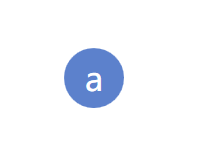 -->


## 两点相加

假如存在两个点，点 a 和 点 b 两个点，在基础的数学，知道两个属性相同的值是不是就可以做加法

如我知道了苹果a和苹果b做个加法就是苹果a+苹果b等于两个苹果

<!-- 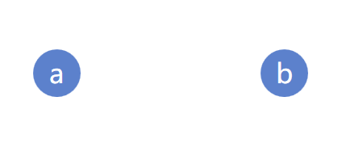 -->


在基础数学点 a 加 点 b 是等于两个点，但是这里使用图论的加法，图论的加法不是基础数学的加法

点 a 加点 b 等于的是一张图，从点变为图，将会从 a 点连接一条边到 b 点，表示只能从 a 点到 b 点

<!-- 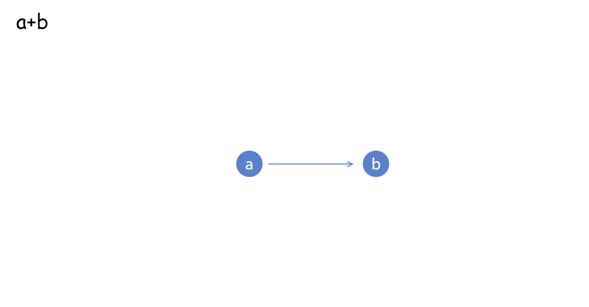 -->


## 三点相加

假如存在三个点 a b c 三个，在基础的数学，做相加就等于三个点，在图论的加法会如何？两个点的相加和三个点的相加有一点很小的不同，将会等于一张图，会从 a 到 b 从 b 到 c 点的一张图

<!-- 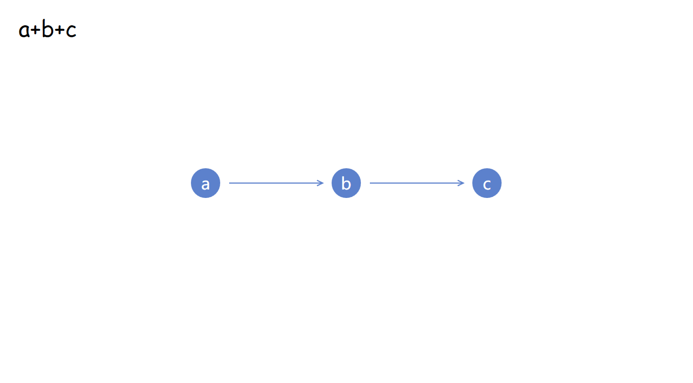 -->


## 定义图的变量

刚才已经做了两个点相加和三个点相加，相加都是等于一张图，那么图可以如何表示。

我使用了小写的字符表示了点，用大写的字符表示图，在图论里面图是可以作为一个点，这个点是超点

简单理解将图作为点的意思，就是你看到的一个点，只是一个图缩小到一个点

从编程的领域说点是点，图也是点

如定义了 A 图是 a b c 三个点相加，那么记 `A=a+b+c` 请看图

<!-- 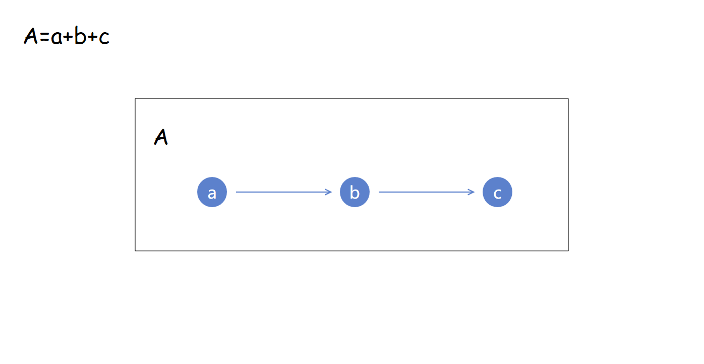 -->


## 图和点的加法

在定义图的变量里面告诉大家如何定义图和点

刚才也说到了点是点图也是点，那么既然图也是点，能否让图和点做加法

假如定义图 B 等于点 a 加上 b 点，然后定义图 B 加上 c 点

结果请看图

<!-- 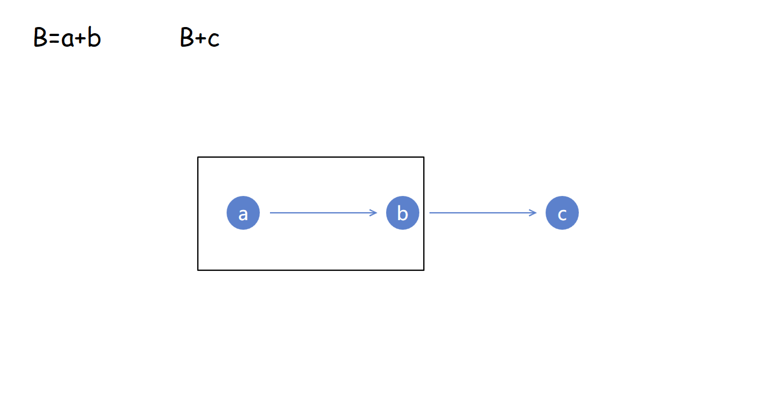 -->


可以看到结果和 a+b+c 几乎一样，只要将图 B 的概念去掉，同时也和一开始的两个点相加的结果一样

## 集合

在图加上点的时候，大家会发现用了两个表达式才写出一张图，那么能否将两个表达式放在一起

这里引入了集合的概念，集合的概念就是包含了表达式的集合，一个集合就是一张图

这里的定义用到了编程的领域的说法，用抽象的方法说明了表达式和点的概念

一张图里面需要包含什么？实际上一张图里面可以什么都没有，没有点也没有边，一张图里面也可以只有一个点，于是一个点的图和一个点在计算上没有区别

一个表达式是什么？实际上一个表达式里面可以什么都不包含，也可以只包含一个点，或包含几个点的计算，或包含几个图的计算，几个点和几个图的计算

假如存在两个表达式，是点 a 加上 b 点，点 a 加上 c 点，按照两个点相加的方法会如何？

将会 a 点同时存在两个边到 b 点和 c 点

<!-- 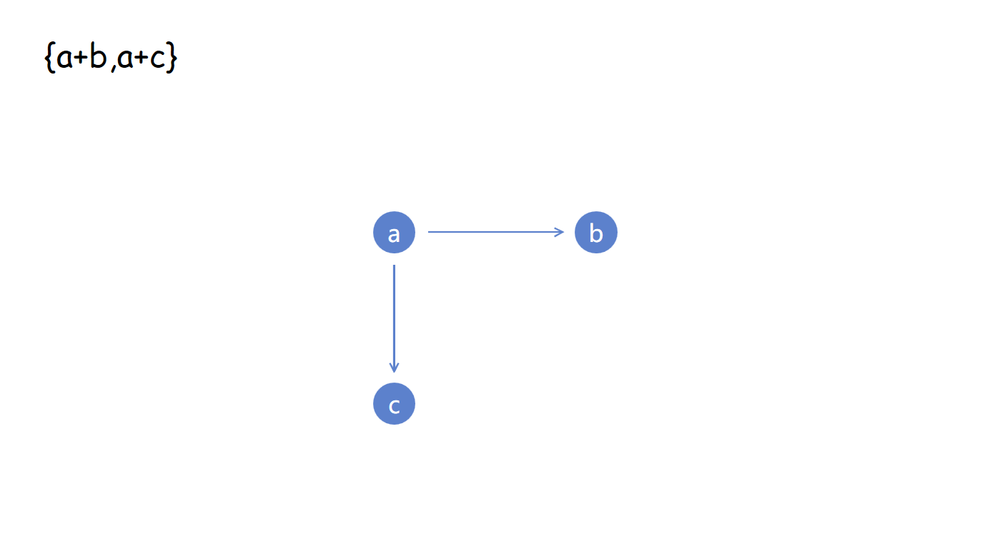 -->


集合的表示是使用花括号将多个表达式放在一起，多个表达式之间通过逗号分割

用集合的方法重新写一下图和点的加法里面用到的表达式

可以在定义的时候同时做计算 `{B=a+b,B+c}` 请看图

<!-- 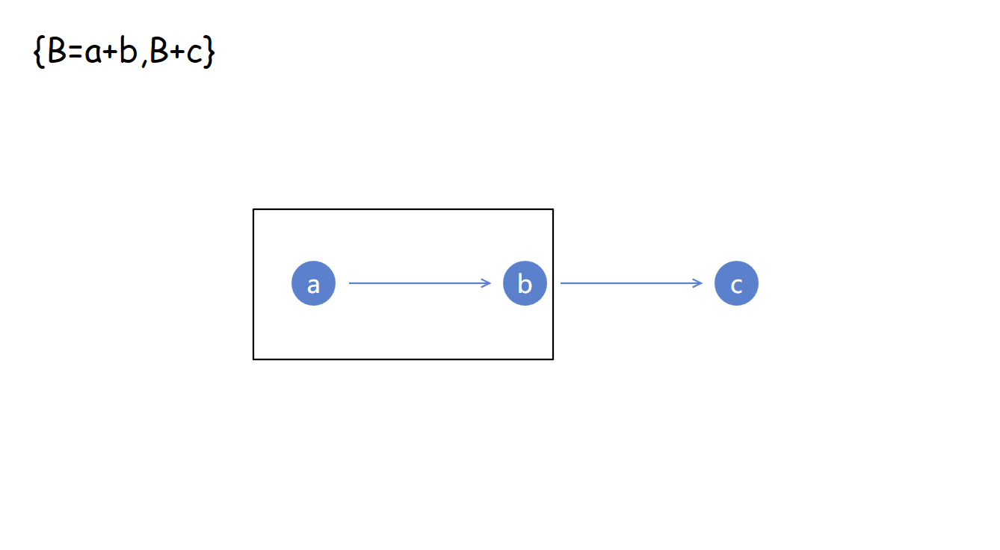 -->


## 一个图和两个点的加法

如果现在已经定义了一张图和一个点的加法，如图和点的加法里面用到的，再加上一个点

刚才定义了三个点的加法，按照图也是点，那么是不是就是直接从图到点有一个边？需要知道边只能连点和点，那么连接图里面哪个点？

先来做一道题 `{B=a+b,B+c,B+e}` 画出这个集合

<!-- 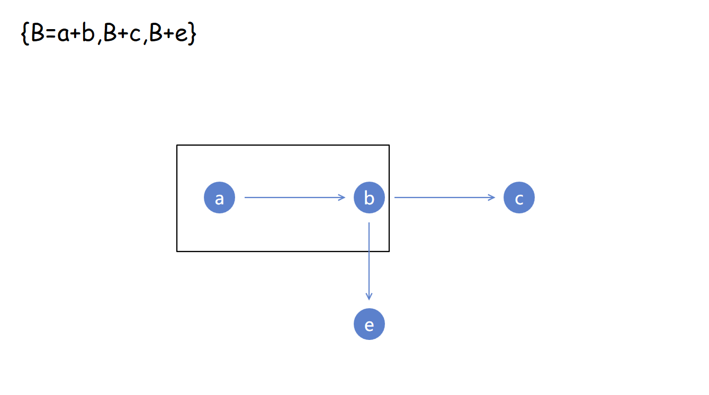 -->


是不是找到了一点规律

## 图和点加法的定义

回顾一下如果一个图加上一个点的图，如 `{B=a+b,b+c}` 请看下图

<!-- 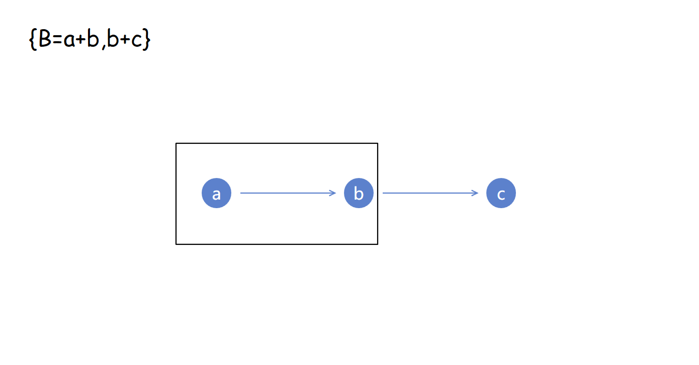 -->


那么如果分为两个表达式呢？在`a+b`之后`b+c`呢？

只要画出来就会发现存在 `{B=a+b,b+c}={B=a+b,B+c}` 等式

<!-- 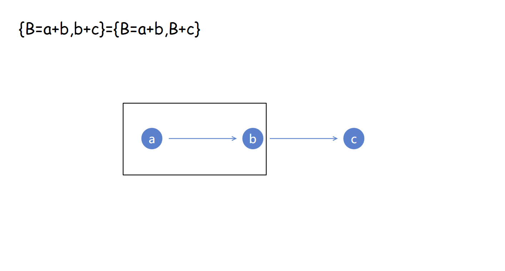 -->


加法的定义是 a+b 就是从 a 存在一条边到达 b 点

如果将 a 换为一个图也成立 B+c 就是图 B 存在一条边到达 c 点

这时需要引入图论的出度和入度才能说明问题

<!-- 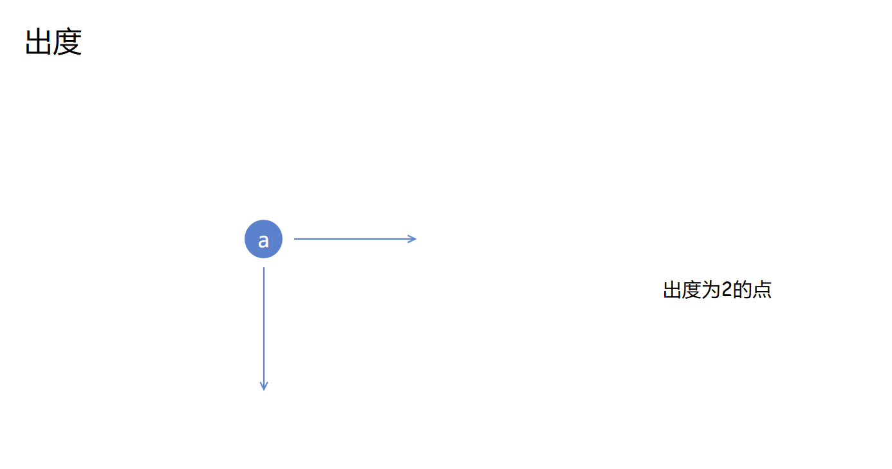 -->


出度的意思就是一个点存在多少条到达其他点的边，当然从这个点达到这个点也是可以的

反过来入度的意思是有多少条边到达这个点

<!-- 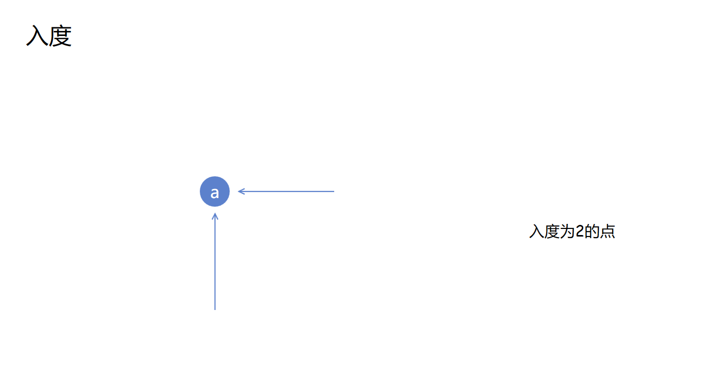 -->


在引入了出度和入度之后可以对图和点的加法做这样的定义，如果图 B 加上 c 点，就是存在一条边连接图B到达 c 点，但这是在将图作为点进行计算的时候，实际的是如果图 B 加上 c 点那么取图 B 里面所有出度为 0 的点连接一条边到达 c 点

按照这个定义，先来做几道题目

先定义一些表达式 `{a+b,b+c,a+c}` 画出这个图形很容易

<!-- 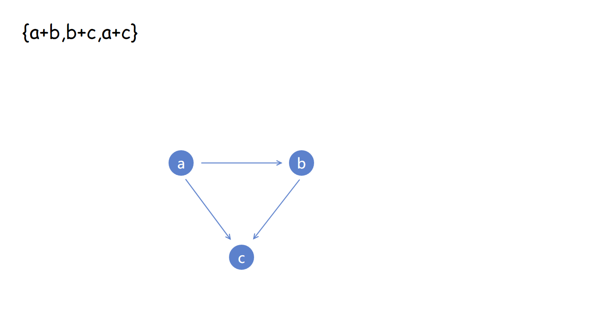 -->


然后将这个集合定义为图 C 看到这大家也就知道了，这里的图是可以等于多条表达式的

<!-- 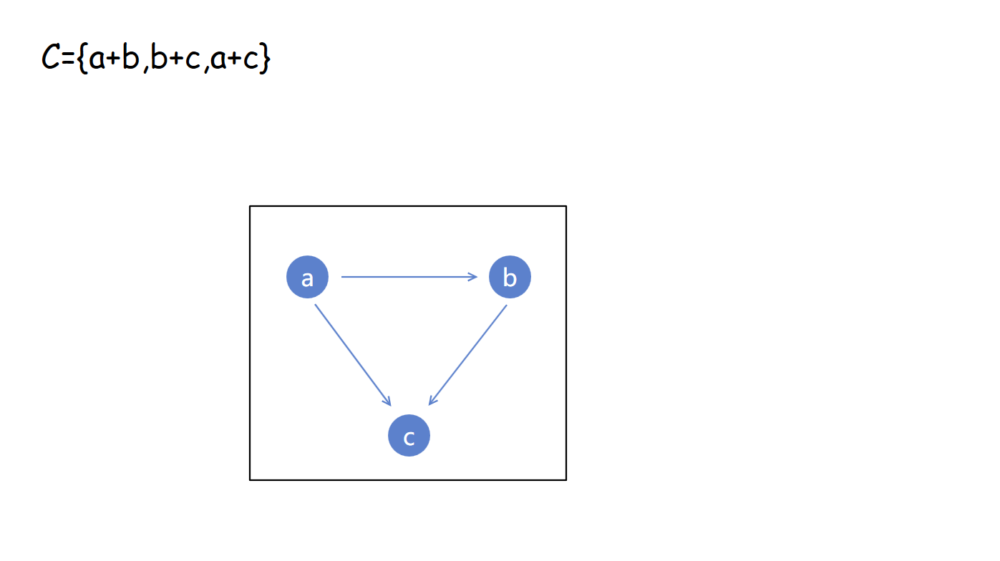 -->


那么现在尝试做一道题，将图 C 加上 e 点

分析一下可以发现在图 C 只有 c 点的没有对外连接的边，从出度的定义的计算可以算出来 c 点的出度为 0 那么剩下两个点的是多少？有空的小伙伴可以要拿出纸和笔算一下

<!-- 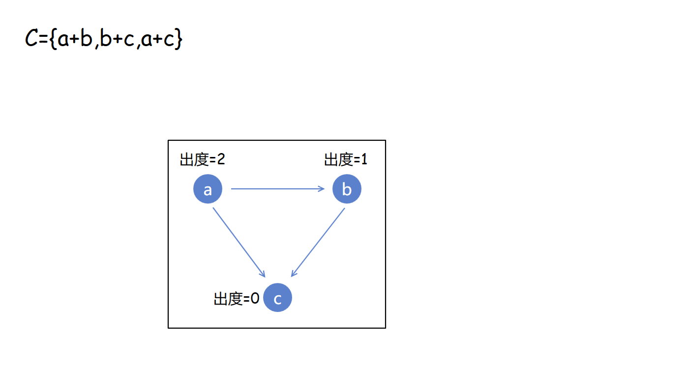 -->


按照定义，将出度为 0 的点到 e 点就是图 C 加上 e 点

<!-- 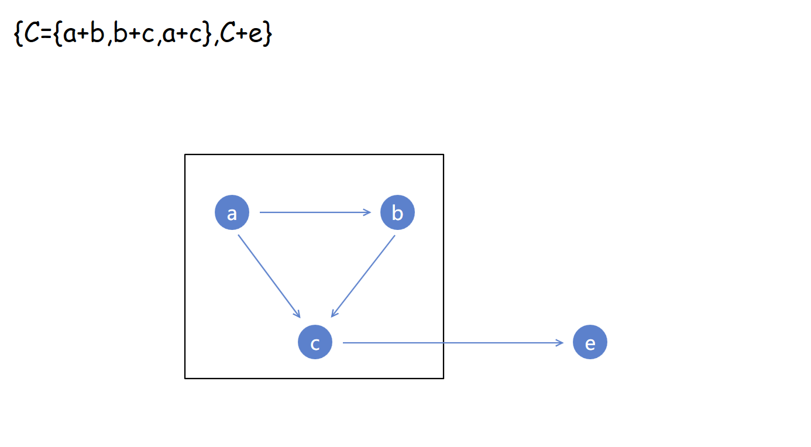 -->


## 小结

算到这其实用到的知识都十分简单，一开始的两个点的加法，这个是小学的题目，包括三个点的加法。那么画一个集合呢？这个估计是初中的题目

但是比较难的点是图，图也是点，是不是就和色即是空，空即是色相同了听不懂了？

如果是写了很长的代码的小伙伴，估计听到上面的话反应过来就是抽象，是的其实世界上本来就没有图只是一个逗比给他的定义

那么在计算出度和入度的时候，也是小学题目，自己动手算一下有多少个箭头就可以了，拿出一个点只有别人指向他没有他指向别人的点就那他进行计算

## 点加上图的计算

刚才只是说到了用图加上点，那么反过来点加上图是不是也可以

如果有小伙伴对上面提到的入度有疑问，因为没有用上它，那么现在就来告诉大家入度用在哪

如定义了表达式`{B=a+b,B+c}`那么就是从图 B 里面找到出度为0的 b 点，让 b 点可以达到 c 点

<!-- 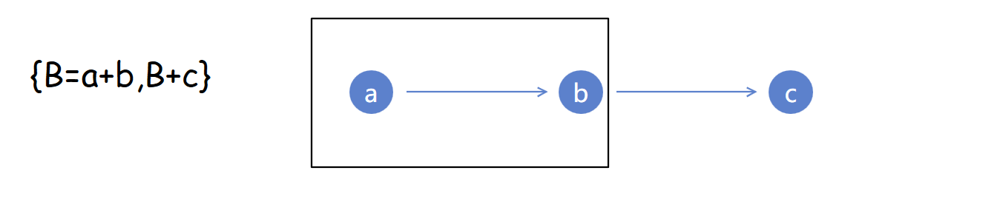 -->


反过来，存在 c 点加上图 B 需要如何算

方法是找到图 B 的入度为 0 的点，让 c 点可以到达这个点，从图 B 可以知道，入度为 0 的点也就是 a 点

<!-- 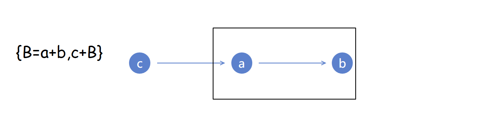 -->


如果只有一个点的出度或入度为 0 的点，那么图和点的加法和点和图的加法本身是存在一些等式

<!-- 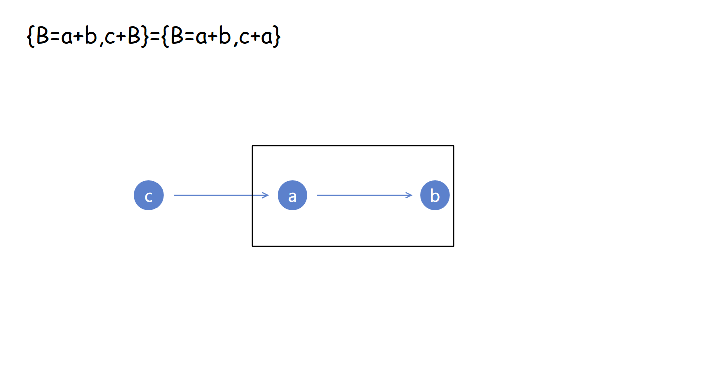 -->


点和图相加和点和图里面的某个点相加是相等的，也就是点和图相加是点和图里面的入度为0的点相加。反过来图和点相加是图里面的出度为 0 的点和点相加是相等的

现在关于图论加法的定义就完成了，根据这个定义可以玩一下推出一些有趣的方法

## 不增不减

那么问题来了，按照上面的定义，要对图进行加法就需要找到出度为0的点，或入度为0的点，那是不是存在图的出度和入度都不是0的

这是存在的，很容易，只需要定义一个环就可以了。如定义图 `不增不减={A={a+b+c},A+e,e+A}` 尝试画出来

<!-- 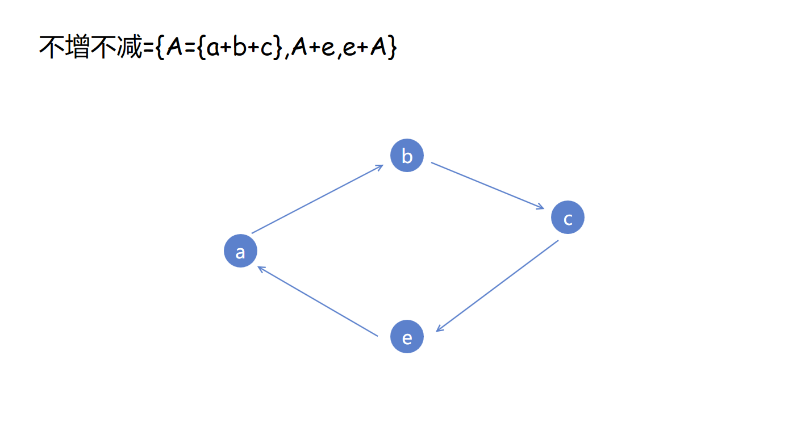 -->


开始做小学题目计算不增不减里面的点的出度和入度，这里可以看到，我用了中文的符号记图的名，因为在我的编程里面是支持 unicode 的，也就是中文英文日文等几乎所有字符都可以用来作为记号

<!-- 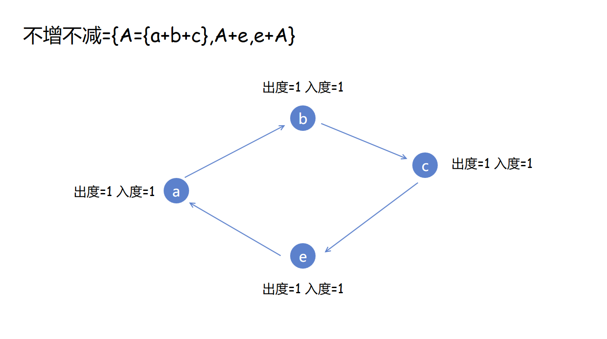 -->


尝试定义点 x 或图 x 让不增不减加上这个 x 会等于原来的不增不减

<!-- 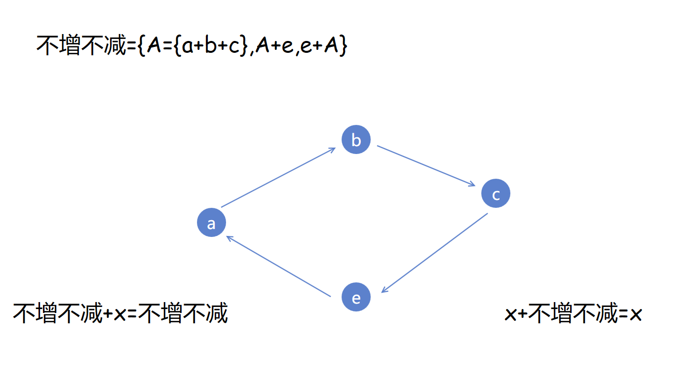 -->


因为不增不减不存在出度为0的点，所以加上一个点 x 和没有加上一样。因为不增不减不存在入度，所以点 x 加上不增不减和没有加上是一样的。

## 不满足交换律

在实数的加法交换律里面 `x+y=y+x` 如果 xy 都是实数，放在超实数 `*R` 范围里面同样应该需要成立

但是从本文的计算可以看到如果点 a 加上 b 点和点 b 加上 a 点的图是不相同的，所以不满足交换律，这就是我不敢在本文的标题加上超实数的一个原因

可以看到在图论加上加法还是十分简单，还不够做人工智能，我会继续写一些文章告诉大家更复杂的计算。我非常熟悉编程，几乎写代码和说话一样，只要逻辑是顺的基本能写出来。但是数学能力就有毒了，正经的计算，算三维算图形图论等没问题，但是一到做题的时候就不会，于是大学高数学了三年多。其实如果定义的计算是不满足交换律的很多现有的方法都不能使用，同时我现在还不知道我定义的是离散的还是连续的，因为我遇到下面的问题。

如有无穷的点，从点 a 开始相加，如 a+b+c+…… 无穷加上去，只是可以认为是无穷。但是如果我拿走了 a 点，那么此时还是不是无穷，从点的数量上可以认为还是无穷，但是去掉 a 点的无穷比没有去掉 a 点的无穷小，这就是我想了很久的原因，我不敢将图论的计算用上超实数，我也不知道如何定义无穷。

在定义图论的加法的时候需要满足的是天下不存在一个图这个加法无法定义的，也就是和添加不存在一个实数是加不到的是一样的原理

我一开始是想说我定义的是数学，在和很多小伙伴讨论之后，我修改了定义，我定义的是计算方法，原因上面也说到了。

定义这个计算只是方便我做人工智能因为里面很多计算在数学上看来都是不对的，本文的写法是让会编程的小伙伴容易理解，如果发现有任何语法或计算的问题，欢迎评论。同时欢迎小伙伴帮忙定义或继续推方法

<a rel="license" href="http://creativecommons.org/licenses/by-nc-sa/4.0/"></a><br />本作品采用<a rel="license" href="http://creativecommons.org/licenses/by-nc-sa/4.0/">知识共享署名-非商业性使用-相同方式共享 4.0 国际许可协议</a>进行许可。欢迎转载、使用、重新发布，但务必保留文章署名[林德熙](http://blog.csdn.net/lindexi_gd)(包含链接:http://blog.csdn.net/lindexi_gd )，不得用于商业目的，基于本文修改后的作品务必以相同的许可发布。如有任何疑问，请与我[联系](mailto:lindexi_gd@163.com)。
