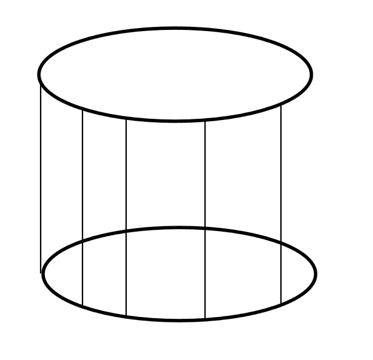
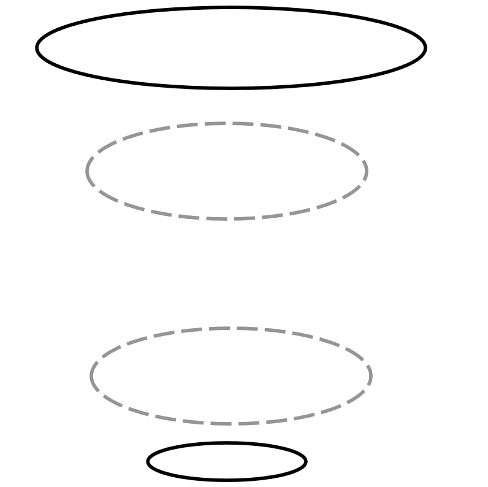

# 圆和线

如果有一个圆，在圆上有很多数学上的点，这些点足够多。那么将这些点拿出来，而不是很表示一段有趣的序列

<!--more-->
<!-- CreateTime:2019/9/2 12:57:38 -->

<!-- csdn -->

在空间有两个圆，圆上面有很多线，线的两段分别连接两个圆。线和圆的连接是一个点，数学上的点，没有宽度和高度

<!--  -->

圆将会相互嵌套，圆从中间上升或下降，上升的圆会变大，下降的圆变小，在上升到一定高度，圆从上升转下降，同时下降的圆下降到一定高度转上升，此时下降的圆将会套住上升的圆

<!--  -->

连接两个圆的线将会在两个圆再次套住的时候，绕两个圆一圈，于是拿到新的坐标

将会记录每次两个圆套住的时候所有线所在的坐标，将这些重新定义为线连接圆的点，记录这些点，这里的点不使用数字表示，而是通过表达式表示

在圆上升或下降都会在两个圆套住的时候计算完成距离，通过圆里面的线绕过的点确定

在圆上升过程中，每个线都会移动，移动根据当前圆上升的距离和当前线和圆连接的点计算

就这样两个圆将会不断上升下降，然后不断嵌套，每次嵌套的线都会在圆上面添加点

有没数学好的小伙伴帮我提出一些计算方法，通过圆里面的点计算圆上升的距离。通过圆里面的点和圆当前上升的距离算出圆的变大趋势。通过圆的上升距离和当前圆里面的点计算出下次的点所在的圆的哪里

在经过很多次嵌套之后将会在圆上面发现了很多点，将这些点组合起来，好像就可以看到一段我也不知道用来做什么的数字，也许可以用来做密码

 本作品采用<a rel="license" href="http://creativecommons.org/licenses/by-nc-sa/4.0/">知识共享署名-非商业性使用-相同方式共享 4.0 国际许可协议</a>进行许可。欢迎转载、使用、重新发布，但务必保留文章署名[林德熙](http://blog.csdn.net/lindexi_gd)(包含链接:http://blog.csdn.net/lindexi_gd )，不得用于商业目的，基于本文修改后的作品务必以相同的许可发布。如有任何疑问，请与我[联系](mailto:lindexi_gd@163.com)。
