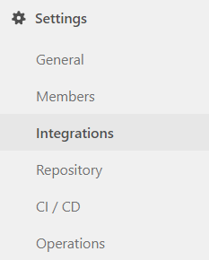
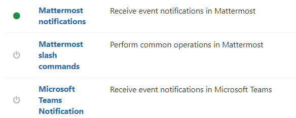
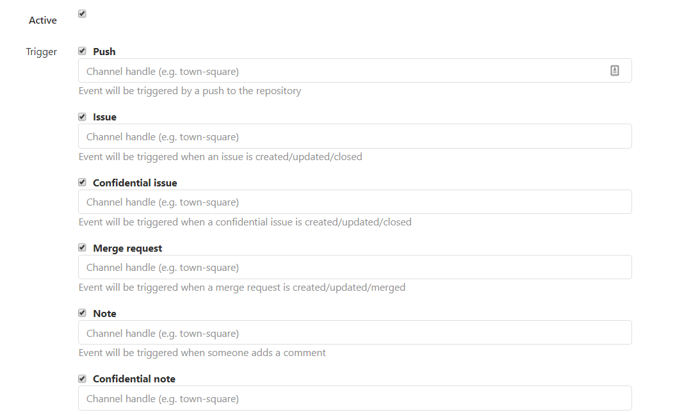
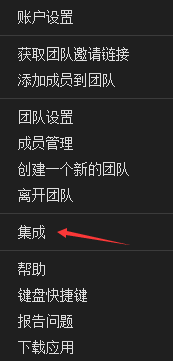
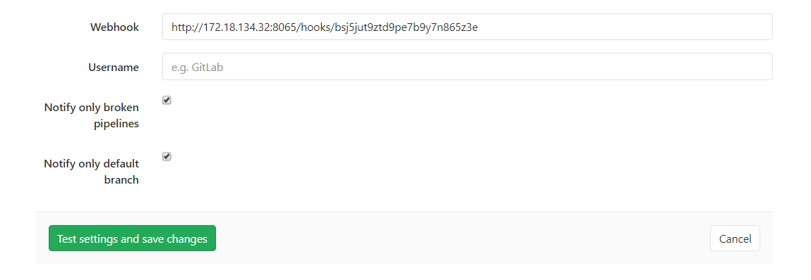

# 在 Gitlab 开启 MatterMost 机器人

在 Gitlab 上有 MatterMost 插件可以用于订阅 Gitlab 上的事件，本文告诉大家如何使用插件只需要三步就可以关联 Gitlab 和 MatterMost 使用机器人订阅事件

<!--more-->
<!-- CreateTime:2019/8/6 19:42:01 -->

<!-- csdn -->

首先在 Gitlab 上新建一个测试项目，在这个项目里面点击 
Integrations Settings 如下图

<!--  -->

然后调用 MatterMost notifications 开启通知机器人

<!--  -->

点击进去之后可以看到以下页面

<!--  -->

此时应该点击 Active 开启，这样就完成了第一步

第二步就是打开 Mattermost 点击集成的功能

<!--  -->

在这里选择引入 Webhook 的方式

<!--  -->

点击添加钩子

<!--  -->

输入一个标题和选择频道

<!--  -->

现在就可以看到一个链接了

将这个链接复制到剪贴板，于是第二步完成

第三步就是将剪贴板里面的内容粘贴到下图的 webhook 里面

<!--  -->

粘贴进去之后点击测试设置同时保存，如果此时在对应的 MatterMost 可以看到频道里面显示消息，那么就部署完成

<!--  -->

现在尝试对新建的项目新建一个MR就可以看到 Mattermost 的通知

更多灵活的关联 gitlab 和 mattermost 请看 [ASP.NET Core 连接 GitLab 与 MatterMost 打造 devops 工具](https://blog.lindexi.com/post/asp.net-core-%E8%BF%9E%E6%8E%A5-gitlab-%E4%B8%8E-mattermost-%E6%89%93%E9%80%A0-devops-%E5%B7%A5%E5%85%B7 )

 本作品采用<a rel="license" href="http://creativecommons.org/licenses/by-nc-sa/4.0/">知识共享署名-非商业性使用-相同方式共享 4.0 国际许可协议</a>进行许可。欢迎转载、使用、重新发布，但务必保留文章署名[林德熙](http://blog.csdn.net/lindexi_gd)(包含链接:http://blog.csdn.net/lindexi_gd )，不得用于商业目的，基于本文修改后的作品务必以相同的许可发布。如有任何疑问，请与我[联系](mailto:lindexi_gd@163.com)。
