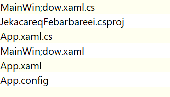

# 在 VisualStudio 给文件起一个带分号的文件名会怎样

小伙伴都知道在 Windows 下是支持文件名使用分号的，而写过 Roslyn 的小伙伴都知道，在 csproj 项目里面使用分号分割数组。那么在 VS 里面将一个文件名添加分号会如何？下面让咱写写看

<!--more-->
<!-- CreateTime:5/27/2020 9:04:53 AM -->

<!-- 发布 -->

新建一个 WPF 项目，然后编辑文件名，添加分号

在资源管理器的文件如下

<!--  -->

```csharp
│  App.config
│  App.xaml
│  App.xaml.cs
│  JekacareqFebarbareei.csproj
│  MainWin;dow.xaml
│  MainWin;dow.xaml.cs
│
└─Properties
        AssemblyInfo.cs
        Resources.Designer.cs
        Resources.resx
        Settings.Designer.cs
        Settings.settings
```

可以看到 `MainWindow.xaml` 修改为 `MainWin;dow.xaml` 此时虽然在 VS 可以打开，但是使用 dotnet build 构建，会提示下面代码

```
MSBUILD : error MSB1025: An internal failure occurred while running MSBuild.
System.Reflection.TargetException: Object does not match target type.
   at System.Reflection.RuntimeMethodInfo.CheckConsistency(Object target)
   at System.Reflection.RuntimeMethodInfo.InvokeArgumentsCheck(Object obj, BindingFlags invokeAttr, Binder binder, Object[] parameters, CultureInfo culture)
   at System.Reflection.RuntimeMethodInfo.Invoke(Object obj, BindingFlags invokeAttr, Binder binder, Object[] parameters, CultureInfo culture)
   at System.Reflection.RuntimePropertyInfo.GetValue(Object obj, BindingFlags invokeAttr, Binder binder, Object[] index, CultureInfo culture)
   at System.Reflection.RuntimePropertyInfo.GetValue(Object obj, Object[] index)
   at Microsoft.Build.BackEnd.TaskHostTask.GetPropertyValue(TaskPropertyInfo property)
   at Microsoft.Build.Execution.TaskFactoryWrapper.GetPropertyValue(ITask task, TaskPropertyInfo property)
   at Microsoft.Build.BackEnd.TaskExecutionHost.GetItemOutputs(TaskPropertyInfo parameter)
   at Microsoft.Build.BackEnd.TaskExecutionHost.Microsoft.Build.BackEnd.ITaskExecutionHost.GatherTaskOutputs(String parameterName, ElementLocation parameterLocation, Boolean outputTargetIsItem, String outputTargetName)
   at Microsoft.Build.BackEnd.TaskBuilder.GatherTaskOutputs(ITaskExecutionHost taskExecutionHost, TaskExecutionMode howToExecuteTask, ItemBucket bucket)
   at Microsoft.Build.BackEnd.TaskBuilder.ExecuteInstantiatedTask(ITaskExecutionHost taskExecutionHost, TaskLoggingContext taskLoggingContext, TaskHost taskHost, ItemBucket bucket, TaskExecutionMode howToExecuteTask)
   at Microsoft.Build.BackEnd.TaskBuilder.InitializeAndExecuteTask(TaskLoggingContext taskLoggingContext, ItemBucket bucket, IDictionary`2 taskIdentityParameters, TaskHost taskHost, TaskExecutionMode howToExecuteTask)
   at Microsoft.Build.BackEnd.TaskBuilder.ExecuteBucket(TaskHost taskHost, ItemBucket bucket, TaskExecutionMode howToExecuteTask, Dictionary`2 lookupHash)
   at Microsoft.Build.BackEnd.TaskBuilder.ExecuteTask(TaskExecutionMode mode, Lookup lookup)
   at Microsoft.Build.BackEnd.TaskBuilder.ExecuteTask(TargetLoggingContext loggingContext, BuildRequestEntry requestEntry, ITargetBuilderCallback targetBuilderCallback, ProjectTargetInstanceChild taskInstance, TaskExecutionMode mode, Lookup inferLookup, Lookup executeLookup, CancellationToken cancellationToken)
   at Microsoft.Build.BackEnd.TargetEntry.ProcessBucket(ITaskBuilder taskBuilder, TargetLoggingContext targetLoggingContext, TaskExecutionMode mode, Lookup lookupForInference, Lookup lookupForExecution)
   at Microsoft.Build.BackEnd.TargetEntry.ExecuteTarget(ITaskBuilder taskBuilder, BuildRequestEntry requestEntry, ProjectLoggingContext projectLoggingContext, CancellationToken cancellationToken)
   at Microsoft.Build.BackEnd.TargetBuilder.ProcessTargetStack(ITaskBuilder taskBuilder)
   at Microsoft.Build.BackEnd.TargetBuilder.BuildTargets(ProjectLoggingContext loggingContext, BuildRequestEntry entry, IRequestBuilderCallback callback, String[] targetNames, Lookup baseLookup, CancellationToken cancellationToken)
   at Microsoft.Build.BackEnd.RequestBuilder.BuildProject()
   at Microsoft.Build.BackEnd.RequestBuilder.BuildAndReport()
```

使用 msbuild 命令构建，会提示下面代码

```
CoreCompile:
  C:\Program Files (x86)\Microsoft Visual Studio\2019\Enterprise\MSBuild\Current\Bin\Roslyn\csc.exe /noconfig /nowarn:1
  701,1702 /nostdlib+ /platform:anycpu32bitpreferred /errorreport:prompt /warn:4 /define:DEBUG;TRACE /highentropyva+ /r
  eference:"C:\Program Files (x86)\Reference Assemblies\Microsoft\Framework\.NETFramework\v4.5\Microsoft.CSharp.dll" /r
  eference:"C:\Program Files (x86)\Reference Assemblies\Microsoft\Framework\.NETFramework\v4.5\mscorlib.dll" /reference
  :"C:\Program Files (x86)\Reference Assemblies\Microsoft\Framework\.NETFramework\v4.5\PresentationCore.dll" /reference
  :"C:\Program Files (x86)\Reference Assemblies\Microsoft\Framework\.NETFramework\v4.5\PresentationFramework.dll" /refe
  rence:"C:\Program Files (x86)\Reference Assemblies\Microsoft\Framework\.NETFramework\v4.5\System.Core.dll" /reference
  :"C:\Program Files (x86)\Reference Assemblies\Microsoft\Framework\.NETFramework\v4.5\System.Data.DataSetExtensions.dl
  l" /reference:"C:\Program Files (x86)\Reference Assemblies\Microsoft\Framework\.NETFramework\v4.5\System.Data.dll" /r
  eference:"C:\Program Files (x86)\Reference Assemblies\Microsoft\Framework\.NETFramework\v4.5\System.dll" /reference:"
  C:\Program Files (x86)\Reference Assemblies\Microsoft\Framework\.NETFramework\v4.5\System.Net.Http.dll" /reference:"C
  :\Program Files (x86)\Reference Assemblies\Microsoft\Framework\.NETFramework\v4.5\System.Xaml.dll" /reference:"C:\Pro
  gram Files (x86)\Reference Assemblies\Microsoft\Framework\.NETFramework\v4.5\System.Xml.dll" /reference:"C:\Program F
  iles (x86)\Reference Assemblies\Microsoft\Framework\.NETFramework\v4.5\System.Xml.Linq.dll" /reference:"C:\Program Fi
  les (x86)\Reference Assemblies\Microsoft\Framework\.NETFramework\v4.5\WindowsBase.dll" /debug+ /debug:full /filealign
  :512 /optimize- /out:obj\Debug\JekacareqFebarbareei.exe /ruleset:"C:\Program Files (x86)\Microsoft Visual Studio\2019
  \Enterprise\Team Tools\Static Analysis Tools\\Rule Sets\MinimumRecommendedRules.ruleset" /subsystemversion:6.00 /targ
  et:winexe /utf8output /deterministic+ /langversion:7.3 App.xaml.cs "MainWin;dow.xaml.cs" Properties\AssemblyInfo.cs P
  roperties\Resources.Designer.cs Properties\Settings.Designer.cs "D:\lindexi\JekacareqFebarbareei\Je
  kacareqFebarbareei\obj\Debug\MainWin" dow.g.cs "D:\lindexi\JekacareqFebarbareei\JekacareqFebarbaree
  i\obj\Debug\App.g.cs"
  Using shared compilation with compiler from directory: C:\Program Files (x86)\Microsoft Visual Studio\2019\Enterprise
  \MSBuild\Current\Bin\Roslyn
CSC : error CS2001: Source file 'D:\lindexi\JekacareqFebarbareei\JekacareqFebarbareei\dow.g.cs' could
 not be found. [D:\lindexi\JekacareqFebarbareei\JekacareqFebarbareei\JekacareqFebarbareei_cakuut2d_wp
ftmp.csproj]
CSC : error CS2001: Source file 'D:\lindexi\JekacareqFebarbareei\JekacareqFebarbareei\obj\Debug\MainW
in' could not be found. 
```

可以看到在 CoreCompile 这里的输出包含了 `"D:\lindexi\JekacareqFebarbareei\Je
  kacareqFebarbareei\obj\Debug\MainWin" dow.g.cs "D:\lindexi\JekacareqFebarbareei\JekacareqFebarbaree
  i\obj\Debug\App.g.cs"` 这就是将 `MainWin;dow.xaml.cs` 的输出文件 `MainWin;dow.g.cs` 分为两个文件，此时就发现找不到 `dow.g.cs` 文件

在构建之后的 obj 文件夹里面创建了 `MainWin;dow.g.cs` 文件，所以文件是对的，存在坑的是 msbuild 配置的设计问题，将分号作为数组的元素分割。而文件名可以使用分号，也就是如果文件名存在分号，就将文件分割为多个文件

看到这里小伙伴就知道了，文件名加上分号，会在构建的时候，因为设计问题，将一个文件当成两个文件，于是就找不到文件，构建不通过

调皮的小伙伴可不要在代码文件里面添加分号

本文代码放在 [github](https://github.com/lindexi/lindexi_gd/tree/5cccc8d157ab9e8f35b7399ecb4dce6c85e8e641/JekacareqFebarbareei) 欢迎小伙伴访问

<a rel="license" href="http://creativecommons.org/licenses/by-nc-sa/4.0/"></a><br />本作品采用<a rel="license" href="http://creativecommons.org/licenses/by-nc-sa/4.0/">知识共享署名-非商业性使用-相同方式共享 4.0 国际许可协议</a>进行许可。欢迎转载、使用、重新发布，但务必保留文章署名[林德熙](http://blog.csdn.net/lindexi_gd)(包含链接:http://blog.csdn.net/lindexi_gd )，不得用于商业目的，基于本文修改后的作品务必以相同的许可发布。如有任何疑问，请与我[联系](mailto:lindexi_gd@163.com)。
