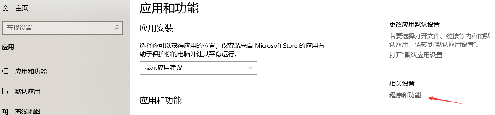

# 如何在 Windows 10 中移除 Internet Explorer 浏览器

现在 Internet Explorer （IE）已经过时了，可以通过控制面板移除这个古老但是依然是一个伟大的浏览器

<!--more-->
<!-- CreateTime:2019/2/17 10:51:52 -->

<!-- csdn -->

现在默认在 Windows 10 的浏览器是 Edge 虽然这个浏览器已经修改为 Chromium 内核，但是 Windows 10 依然保留 Internet Explorer 11 为了兼容之前的网站。

如果觉得自己的磁盘空间不足，可以尝试卸载 IE 浏览器，卸载的方法有两个，一个是通过控制面板，另一个是通过 PowerShell 脚本

## 如何通过控制面板删除 Internet Explorer 浏览器

通过下面步骤可以移除 Internet Explorer 浏览器

1. 打开设置
1. 点击应用
1. 点击程序和功能

<!--  -->

如果看不到程序和功能，那么可能是你的设置窗口的宽度不够，尝试将设置窗口最大化

点击程序和功能可以跳转到控制面板，在控制面板点击开启功能

<!--  -->

这时可以找到 IE 的选项，取消勾选，点击确定

这时会提示是否确定删除，点击确定，然后重启设备

这样就可以从设备移除 Internet Explorer 浏览器

## 通过 PowerShell 删除 Internet Explorer 浏览器

右击开始菜单，选择 PowerShell 脚本，使用管理员权限运行

输入下面代码，可以先复制下面代码，在 PowerShell 右击粘贴

```csharp
Disable-WindowsOptionalFeature -FeatureName Internet-Explorer-Optional-amd64 –Online
```

按下回车就会进行卸载，卸载之后提示是否立刻重启计算机，输入 y 然后按回车就可以重启设备

```csharp
PS C:\WINDOWS\system32> Disable-WindowsOptionalFeature -FeatureName Internet-Explorer-Optional-amd64 -Online
是否立即重启计算机以完成此操作?
[Y] Yes  [N] No  [?] 帮助 (默认值为“Y”):
```

[How to remove Internet Explorer on Windows 10](https://www.windowscentral.com/how-remove-internet-explorer-11-windows-10?utm_source=wc_tw&utm_medium=tw_card&utm_content=46467&utm_campaign=social )

<a rel="license" href="http://creativecommons.org/licenses/by-nc-sa/4.0/"></a><br />本作品采用<a rel="license" href="http://creativecommons.org/licenses/by-nc-sa/4.0/">知识共享署名-非商业性使用-相同方式共享 4.0 国际许可协议</a>进行许可。欢迎转载、使用、重新发布，但务必保留文章署名[林德熙](http://blog.csdn.net/lindexi_gd)(包含链接:http://blog.csdn.net/lindexi_gd )，不得用于商业目的，基于本文修改后的作品务必以相同的许可发布。如有任何疑问，请与我[联系](mailto:lindexi_gd@163.com)。
