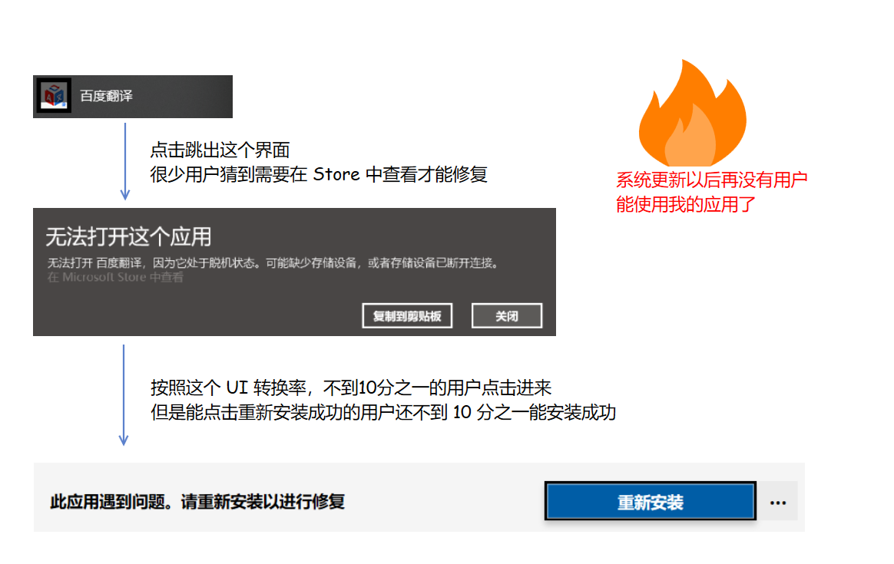

# 如何在国内发布 UWP 应用

在国内的开发者，相信都遇到这样的情况，辛苦开发了几个月的应用，发布到应用商店，发现只有几个下载。不断推广却发现有用户评论垃圾应用下载不了。

在国内开发 UWP 最大的问题就是用户很难通过应用商店下载应用，开发出来的应用无法让用户使用。

<!--more-->
<!-- CreateTime:2019/11/25 15:46:42 -->

<!-- csdn -->

我通过了很久的时间，请教了[邵猛](https://www.cnblogs.com/shaomeng )和[老周](http://www.cnblogs.com/tcjiaan/ ) 等大佬，再国外几个小伙伴的指导下，找到了一条路径，通过私有部署的形式发布。

通过私有部署就和通过旁加载的形式差不多，不经过应用商店发布自己的应用，这样能够完全自己控制应用的发布和更新，不需要经过应用商店的审核。额外的，除非微软能做到和苹果一样的对设备的控制和用户量，否则玩应用商店就是让应用商店挂。对于大部分商业团队，如果自己发布的应用被下架超过一天就是一个事故，而微软有着极低的效率同时也有说不清楚原因的下架，就能够让大多数的商业团队放弃走应用商店，包括我现在的团队在内。难以想象被下架一天带来的损失。

但是私有部署最大问题是安装条件相对严格，如果自己的团队能够卖给最终用户硬件设备，那么通过预装的方法能解决大量的问题。私有部署要求设备开启旁加载，同时开启自动更新，对魔改系统支持不好，需要加入证书

在自己的出货的设备上预装自己的 UWP 应用，预装的方法是通过私有部署发布的，通过自己搭建一个 Asp dotnet core 服务器，在服务器上通过给不同的用户不同的[appinstaller](https://lindexi.gitee.io/post/win10-uwp-%E5%AE%89%E8%A3%85%E6%96%87%E4%BB%B6-appinstaller-%E6%A0%BC%E5%BC%8F.html )文件，可以实现让不同的用户下载不同的版本

同时在国内依靠自己搭建的服务器和 CDN 服务器将应用程序包发给用户，本身的网络会比从应用商店下载快十分多。

如果是卖给学校的设备，通过在学校搭建一个内网服务器，可以通过 10M/s 的内网下载速度，基本在后台服务点击发布，只需要 10 分钟就可以将全校的设备的应用更新到最新。

在国内发布 UWP 的姿势是一边在应用商店上架应用，同时做好私有部署，通过私有部署可以控制应用自动更新，具体请看 [win10 uwp 发布旁加载自动更新](https://lindexi.gitee.io/post/win10-uwp-%E5%8F%91%E5%B8%83%E6%97%81%E5%8A%A0%E8%BD%BD%E8%87%AA%E5%8A%A8%E6%9B%B4%E6%96%B0.html )

最好是能联系到设备发布的公司，在他发布的设备上预装自己的应用，如联想和小米这些。如自己公司能够将硬件设备卖给用户是最好的。这样相当于控制了入口，解决了开始的用户安装的问题，这个问题是 UWP 最大的问题，如果都不能安装，那么即使软件做的再好有什么用

至于通过私有部署让用户自己去下载，除非是很熟悉电脑的用户，不然这条路不如让用户去应用商店下载。我在 7 个开发者（非桌面端开发者）的设备上用私有部署方法安装我的应用，仅有一个小伙伴能安装成功，其他的都因为环境问题无法安装

虽然我找到在国内发布 UWP 的一个方法，能解决应用商店下载问题和用户更新问题，但是还是没有方法说服产品经理使用 UWP 开发。

对于很多用户，根本就不关心使用的应用是通过什么技术写的，无论是通过 Electron 或 WPF 或 WinFroms 只要交互体验好，应用流畅，用户就觉得这个应用不错。此时在使用 UWP 是完全没有优势的，在国外有开发者告诉我，用户不会因为 UWP 使用流畅设计就选择 UWP 很多时候通过流畅设计的UI界面没有想象那么好看。甚至使用 UWP 还有很大的缺点就是应用商店的设计，在国内我询问过很多产品的开发者，能通过应用商店下载的用户很少，能成功从应用商店下载应用的用户就更少了。现在的用户大部分的习惯都是复制安装包的形式，没有一个产品能和手机的微信或支付宝一样培养用户的习惯，甚至在国内没有一个 PC 端的应用能在后PC时代带领产品。

另一个问题是 UWP 全平台在 PC 下不是全平台，如果我专注 PC 端的开发，那么我如何兼容 Windows7 的用户，在国内大概有一半以上的用户是使用 Windows7 系统，如果使用 UWP 开发，要么就放弃一半以上的潜在客户，要么就是同时开发 WPF（或其他的技术） 和 UWP 两个应用。但是只要 zz 的团队才会想着同时开两个计算做一个产品，如果我使用 WPF 开发，那么我能支持 Windows 7 和 Windows 10 没有理由需要 UWP 应用。

如果我是专注与跨平台开发，不好意思，现在的 UWP 哪有跨平台，我有充分的理由选择 Web 网页或 Xamarin 开发。

另外 UWP 对系统的耦合非常多，如升级了系统可以发现自己的应用打不开了，如我下方的百度应用，在更新系统从 1803 到 1809 的时候就无法使用

<!--  -->

<!--  -->

<!--  -->

也许剩下的优势是信仰

但是微软的 zz 将手机端砍了，于是 UWP 几乎唯一的优势也就不存在了，这几天我询问了好多位大佬未来的 UWP 的方向是什么？欢迎各位大佬在博客下方评论

最近微软又在准备开发 WinUI 3.0 这个我看起来和玩具一样的不实用的技术

本文的方法只适合预装的方法，如果没有预装可以将 UWP 用 win32 的安装包不通过应用商店给用户，请看[加强版在国内分发 UWP 应用正确方式 通过win32安装UWP应用](https://blog.lindexi.com/post/%E5%8A%A0%E5%BC%BA%E7%89%88%E5%9C%A8%E5%9B%BD%E5%86%85%E5%88%86%E5%8F%91-UWP-%E5%BA%94%E7%94%A8%E6%AD%A3%E7%A1%AE%E6%96%B9%E5%BC%8F-%E9%80%9A%E8%BF%87win32%E5%AE%89%E8%A3%85UWP%E5%BA%94%E7%94%A8.html )

 本作品采用<a rel="license" href="http://creativecommons.org/licenses/by-nc-sa/4.0/">知识共享署名-非商业性使用-相同方式共享 4.0 国际许可协议</a>进行许可。欢迎转载、使用、重新发布，但务必保留文章署名[林德熙](http://blog.csdn.net/lindexi_gd)(包含链接:http://blog.csdn.net/lindexi_gd )，不得用于商业目的，基于本文修改后的作品务必以相同的许可发布。如有任何疑问，请与我[联系](mailto:lindexi_gd@163.com)。
