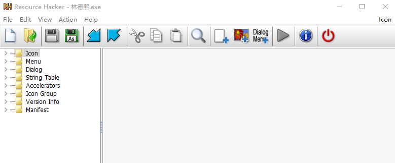
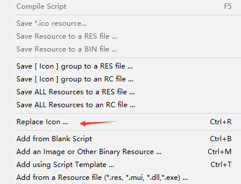
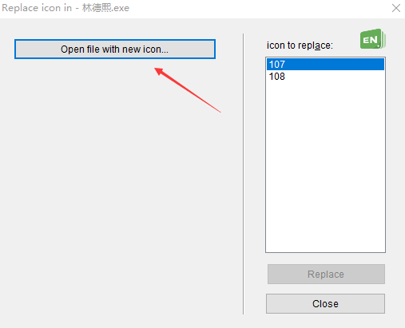
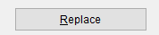
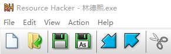

# 如何替换一个 exe 的图标

有小伙伴写了一个诡异的程序，我想要他修改这个程序的图标，但是他觉得我的图标不好看，就不修改。但是我觉得他的图标不好看，我没有他的源代码，我如何拿到他程序修改他的图标

<!--more-->
<!-- CreateTime:2019/2/27 20:33:16 -->

<!-- csdn -->

通过[Resource Hacker](http://www.angusj.com/resourcehacker/ )可以简单修改一个 C++ 编译的 exe 的图标，如下图的程序

<!--  -->

打开 Resource Hacker 软件将需要修改的程序拖进去

<!--  -->

点击 Action 点击修改图标

<!--  -->

选择一个好看的图标

<!--  -->

点击替换

<!--  -->

点击保存就可以修改软件的图标

<!--  -->

 本作品采用<a rel="license" href="http://creativecommons.org/licenses/by-nc-sa/4.0/">知识共享署名-非商业性使用-相同方式共享 4.0 国际许可协议</a>进行许可。欢迎转载、使用、重新发布，但务必保留文章署名[林德熙](http://blog.csdn.net/lindexi_gd)(包含链接:http://blog.csdn.net/lindexi_gd )，不得用于商业目的，基于本文修改后的作品务必以相同的许可发布。如有任何疑问，请与我[联系](mailto:lindexi_gd@163.com)。
