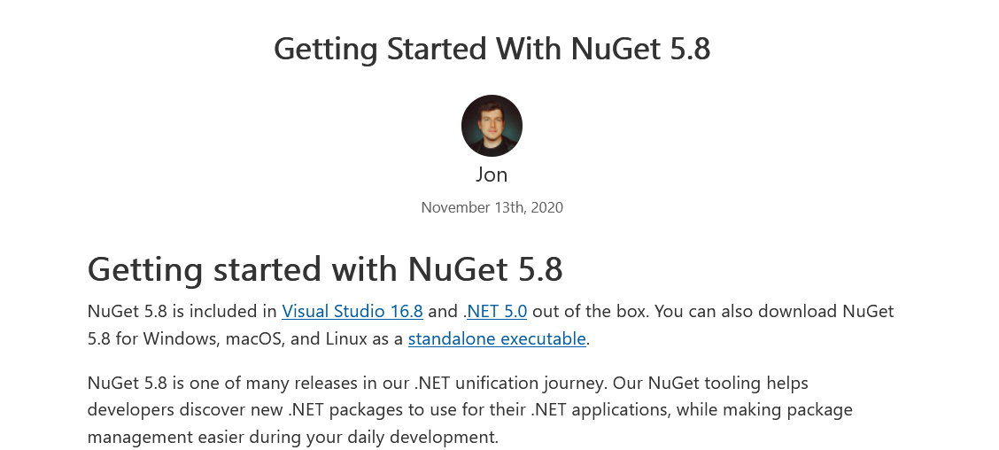

# 如何给 CI CD 服务器搭建上 .NET 5 构建和运行环境

在 2020.11.10 官方正式发布了 .NET 5 正式版。而我花了一周的时间进行踩坑和预研，本文将告诉大家如何在自动化服务器上搭建 dotnet 5 的构建和运行环境

<!--more-->


<!-- CreateTime:2020/11/18 8:36:35 -->


在上一篇博客里面，我因为 NuGet 版本的问题，不得在 2020.11.13 回滚了 CI 服务器。但是刚好就在那天，大法更新了 NuGet 到 5.8 的版本。按照我一个小伙伴的说法，全网首个支持 .NET 5 的 NuGet 已正式发布

这是上次的博客 [刚刚我从服务器回滚了 dotnet 5 的环境](https://blog.lindexi.com/post/%E5%88%9A%E5%88%9A%E6%88%91%E4%BB%8E%E6%9C%8D%E5%8A%A1%E5%99%A8%E5%9B%9E%E6%BB%9A%E4%BA%86-dotnet-5-%E7%9A%84%E7%8E%AF%E5%A2%83.html )

这是 NuGet 5.8 发布页面

<!--  -->


好的，现在进入搭建服务器状态。我有多个不同类型的服务器需要搭建，包括用来跑 GitLab Runner 的虚拟机，以及用来接入运维团队 devops 的 docker 服务器（准确来说 docker 不是服务器）两个不同类型的服务器。这两个不同类型的服务器分别是 Windows 和 Linux 系统

## 虚拟机篇

虚拟机上是跑在 Windows 系统的，毕竟还是 Windows 更加强大，很多东西都依然需要在 Windows 下才能完成

在从官方下载全网首个支持 .NET 5 的 NuGet 版本，官方下载地址是 [https://dist.nuget.org/win-x86-commandline/v5.8.0/nuget.exe](https://dist.nuget.org/win-x86-commandline/v5.8.0/nuget.exe) 如果链接失效，请到 [NuGet Gallery Downloads](https://www.nuget.org/downloads ) 找到最新版本下载

或者从我上传的 CSDN 上下载，地址是 [https://download.csdn.net/download/lindexi_gd/13116888](https://download.csdn.net/download/lindexi_gd/13116888)

这个版本的 NuGet 被包含在 VS 16.8 和 .NET 5 SDK 里面，但是我依然需要独立的 NuGet 执行文件来辅助构建古老的项目

将下载的独立的 NuGet 放在一个文件夹，然后将这个文件夹设置到环境变量的 Path 里面。这一步相对复杂，我也不打算多说…… 因为真不是必要的，除非你也有古老的项目需要支持

下一步就是去下载 VS 了，我使用的是专业版来进行构建，和微软的销售聊了，其实不需要使用企业版来作为构建服务器的构建工具，使用专业版就可以了。但是我团队的规模在这里，依然还是需要购买一定量的企业版，同时也禁止使用社区版

安装完成之后，在服务器上的 VS 登陆构建机器人的账号，这个账号是一个订阅账号，登录了就自动激活了许可了

理论上此时的 dotnet 5 将会被 VS 16.8 自动带入，也就是意味着啥都不用了，部署就此完成，十分简单

## docker

默认官方有将 docker 放在 docker hub 上，请到 [.NET - Docker Hub](https://hub.docker.com/_/microsoft-dotnet ) 拉取最新版本即可

如果和我当前的团队一样，运维小伙伴要求 docker 一定要基于别的 base image 的，才需要进行下面步骤。本来我是想拿着官方的 docker 然后安装运维小伙伴的工具软件，但是看到他的一大堆软件和安装步骤，就把我劝退了。我问，为什么不写个自动化脚本来安装。运维小伙伴说，这东西一年也没更新几次，写个脚本要好几天也不好调试……

于是我就反过来，不是在基于官方的 docker 来做，而是基于运维小伙伴的 docker 来做，在运维小伙伴的 docker 上加上 dotnet 的支持

我需要制作两个不同的 docker 一个用来做构建，一个用来作为运行时

从官方可以找到 docker file 的源代码，请看 [https://github.com/dotnet/dotnet-docker](https://github.com/dotnet/dotnet-docker) 基本只需要找对系统然后抄代码就可以了

只是因为我这边的运营商很小气，很难将文件拉下来，因此就需要在外面将 dotnet 和 PowerShell 拉下来，然后将 curl 远程下载的逻辑替换为使用本地的文件

这里我使用dotnet职业技术学院的下载库制作的下载器进行下载，这是一个在 GitHub 完全开源的仓库，请看 [https://github.com/dotnet-campus/dotnetCampus.FileDownloader](https://github.com/dotnet-campus/dotnetCampus.FileDownloader )

以下是构建服务器的 dcokerfile 内容

先基于团队的基础镜像

```
FROM registry.lindexidoubi.com/foo/dotnet-docker-base:debian
```

然后将本地文件拷贝进入

```
COPY dotnet-sdk-5.0.100-linux-x64.tar.gz dotnet.tar.gz
COPY PowerShell.Linux.x64.7.1.0.nupkg /
```

在拷贝的时候就将 dotnet-sdk-5.0.100-linux-x64.tar.gz 从命名为 dotnet.tar.gz 文件

接着添加一下国内源

```
# 使用国内源
RUN echo "" >> /etc/apt/sources.list \
    && echo "deb http://ftp.cn.debian.org/debian/ buster main contrib non-free" >> /etc/apt/sources.list \
    && echo "deb-src http://ftp.cn.debian.org/debian/ buster main contrib non-free" >> /etc/apt/sources.list \
    && echo "deb http://ftp.cn.debian.org/debian-security/ buster/updates main contrib non-free" >> /etc/apt/sources.list \
    && echo "deb-src http://ftp.cn.debian.org/debian-security/ buster/updates main contrib non-free" >> /etc/apt/sources.list \
    && echo "deb http://ftp.cn.debian.org/debian/ buster-updates main contrib non-free" >> /etc/apt/sources.list \
    && echo "deb-src http://ftp.cn.debian.org/debian/ buster-updates main contrib non-free" >> /etc/apt/sources.list \
    && echo "deb http://ftp.cn.debian.org/debian/ buster-backports main contrib non-free" >> /etc/apt/sources.list \
    && echo "deb-src http://ftp.cn.debian.org/debian/ buster-backports main contrib non-free" >> /etc/apt/sources.list
```

然后加上必备的环境

```
# https://github.com/docker-library/buildpack-deps/blob/b0fc01aa5e3aed6820d8fed6f3301e0542fbeb36/buster/curl/Dockerfile
# FROM debian:buster
RUN apt-get update && apt-get install -y --no-install-recommends \
		ca-certificates \
		curl \
		netbase \
		wget \
	&& rm -rf /var/lib/apt/lists/*

RUN set -ex; \
	if ! command -v gpg > /dev/null; then \
		apt-get update; \
		apt-get install -y --no-install-recommends \
			gnupg \
			dirmngr \
		; \
		rm -rf /var/lib/apt/lists/*; \
	fi

# FROM buildpack-deps:buster-curl
# https://github.com/docker-library/buildpack-deps/blob/99a1c33fda559272e9322b02a5d778bbd04154e7/buster/scm/Dockerfile
# procps is very common in build systems, and is a reasonably small package
RUN apt-get update && apt-get install -y --no-install-recommends \
		git \
		mercurial \
		openssh-client \
		subversion \
		\
		procps \
	&& rm -rf /var/lib/apt/lists/*
```

下面就是从 dotnet 仓库抄配置代码

```
# https://github.com/dotnet/dotnet-docker/blob/0c3cedc7cc5c6679edbba3a0fdf717caeefe02bb/src/sdk/5.0/buster-slim/amd64/Dockerfile
# FROM buildpack-deps:buster-scm
ENV \
    # Unset ASPNETCORE_URLS from aspnet base image
    ASPNETCORE_URLS= \
    DOTNET_SDK_VERSION=5.0.100 \
    # Enable correct mode for dotnet watch (only mode supported in a container)
    DOTNET_USE_POLLING_FILE_WATCHER=true \
    # Skip extraction of XML docs - generally not useful within an image/container - helps performance
    NUGET_XMLDOC_MODE=skip \
    # PowerShell telemetry for docker image usage
    POWERSHELL_DISTRIBUTION_CHANNEL=PSDocker-DotnetSDK-Debian-10

# Install .NET CLI dependencies
RUN apt-get update \
    && apt-get install -y --no-install-recommends \
        libc6 \
        libgcc1 \
        libgssapi-krb5-2 \
        libicu63 \
        libssl1.1 \
        libstdc++6 \
        zlib1g \
    && rm -rf /var/lib/apt/lists/*
```

将原本 dotnet 仓库里面的通过 curl 下载的逻辑替换为使用本地文件，使用本地文件也就是不需要下载就可以了，因为文件在第一步就从本地复制，请看下面

```
# Install .NET SDK
# 不从 https://dotnetcli.azureedge.net 下载，从本地复制
RUN dotnet_sdk_version=5.0.100 \
#    && curl -SL --output dotnet.tar.gz https://dotnetcli.azureedge.net/dotnet/Sdk/$DOTNET_SDK_VERSION/dotnet-sdk-$DOTNET_SDK_VERSION-linux-x64.tar.gz \
    && dotnet_sha512='bec37bfb327c45cc01fd843ef93b22b556f753b04724bba501622df124e7e144c303a4d7e931b5dbadbd4f7b39e5adb8f601cb6293e317ad46d8fe7d52aa9a09' \
    && echo "$dotnet_sha512 dotnet.tar.gz" | sha512sum -c - \
    && mkdir -p /usr/share/dotnet \
    && tar -ozxf dotnet.tar.gz -C /usr/share/dotnet \
    && rm dotnet.tar.gz \
    && ln -s /usr/share/dotnet/dotnet /usr/bin/dotnet \
    # Trigger first run experience by running arbitrary cmd
    && dotnet help

# 不从 https://pwshtool.blob.core.windows.net 下载，从本地复制
# Install PowerShell global tool
RUN powershell_version=7.1.0 \
#    && curl -SL --output PowerShell.Linux.x64.$powershell_version.nupkg https://pwshtool.blob.core.windows.net/tool/$powershell_version/PowerShell.Linux.x64.$powershell_version.nupkg \
#   && powershell_sha512='59abcc11bd43fc8c1938a1854447c762092f03b5e2c6c354a82559eed6852e3920c5543c085fbe6fbe98871f96cd7409bb76b1537d3d8dee4e7432d578ec7603' \
#   && echo "$powershell_sha512  PowerShell.Linux.x64.$powershell_version.nupkg" | sha512sum -c - \
    && mkdir -p /usr/share/powershell \
    && dotnet tool install --add-source / --tool-path /usr/share/powershell --version $powershell_version PowerShell.Linux.x64 \
    && dotnet nuget locals all --clear \
    && rm /PowerShell.Linux.x64.$powershell_version.nupkg \
    && ln -s /usr/share/powershell/pwsh /usr/bin/pwsh \
    && chmod 755 /usr/share/powershell/pwsh \
    # To reduce image size, remove the copy nupkg that nuget keeps.
    && find /usr/share/powershell -print | grep -i '.*[.]nupkg$' | xargs rm
```

这样就完成了构建服务器的 dcokerfile 了，下一步只是需要用这个文件构建 docker image 就可以了

而运行时服务器的搭建也差不多，只是因为运行时的 dotnet 很小，不需要在外面下载，因此可以更愉快的抄代码

```
FROM registry.lindexidoubi.com/foo/dotnet-docker-base:debian-security
USER root
# https://github.com/dotnet/dotnet-docker/blob/master/3.1/runtime-deps/buster-slim/amd64/Dockerfile
RUN yum update -y
RUN yum install -y  \
        ca-certificates \
        \
# .NET Core dependencies
        libc6 \
        libgcc1 \
        libgssapi-krb5-2 \
        libicu63 \
        libssl1.1 \
        libstdc++6 \
        zlib1g \
        # GDI
        libc6-dev \
        libgdiplus \
    && rm -rf /var/lib/apt/lists/*

# Configure web servers to bind to port 8080 when present
# 无管理员权限运行 80 提示 System.Net.Sockets.SocketException (13): Permission denied https://github.com/dotnet/aspnetcore/issues/4699
ENV ASPNETCORE_URLS=http://+:8080 \
    # Enable detection of running in a container
    DOTNET_RUNNING_IN_CONTAINER=true

RUN rpm -Uvh https://packages.microsoft.com/config/centos/7/packages-microsoft-prod.rpm && \
    yum install -y aspnetcore-runtime-5.0

USER cloud
```

我比官方更多的逻辑是额外安装了 GDI+ 的库

可以看到搭建 docker 的步骤比虚拟机的步骤多太多了，但这是因为我不能拉官方的 docker 来用而已，如果能拉官方的，那就只需要两句话就完成了

我在做 docker 服务器的时候，因为本地磁盘空间不足，翻车了，请看 [dotnet 制作 docker 提示 Insufficient space in download directory 磁盘空间不足](https://blog.lindexi.com/post/dotnet-%E5%88%B6%E4%BD%9C-docker-%E6%8F%90%E7%A4%BA-Insufficient-space-in-download-directory-%E7%A3%81%E7%9B%98%E7%A9%BA%E9%97%B4%E4%B8%8D%E8%B6%B3.html )


<a rel="license" href="http://creativecommons.org/licenses/by-nc-sa/4.0/"></a><br />本作品采用<a rel="license" href="http://creativecommons.org/licenses/by-nc-sa/4.0/">知识共享署名-非商业性使用-相同方式共享 4.0 国际许可协议</a>进行许可。欢迎转载、使用、重新发布，但务必保留文章署名[林德熙](http://blog.csdn.net/lindexi_gd)(包含链接:http://blog.csdn.net/lindexi_gd )，不得用于商业目的，基于本文修改后的作品务必以相同的许可发布。如有任何疑问，请与我[联系](mailto:lindexi_gd@163.com)。