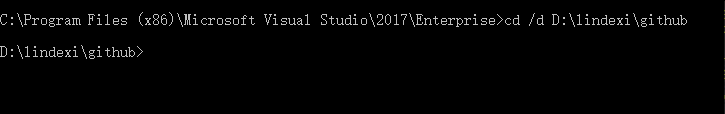
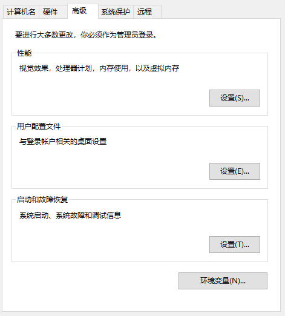
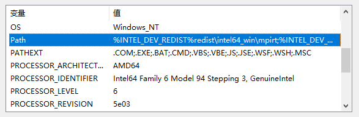

# 如何通过命令行 msbuild 编译项目

本文告诉大家如何通过 msbuild 编译一个项目，通过命令行编译可以输出更多的编译信息，可以用来调试自己写的编译相关方法，可以看到是哪个文件编译失败

<!--more-->
<!-- CreateTime:2019/7/3 19:12:19 -->


<!-- 标签：编译器,VisualStudio,msbuild -->

在开始菜单可以找到 VisualStudio 的安装文件夹，基本上开发者命令行的英文名叫 Developer Command Prompt 中文名是开发者命令行

打开之后默认是 C 盘的一个路径，假如自己的项目所在文件夹是 `D:\lindexi\github` 需要先通过 cd 将命令行的工作路径修改为当前需要编译的路径，通过下面命令可以从 C 盘到代码文件夹

```csharp
> cd /d 代码所在文件夹
```

<!--  -->


对于一个新的仓库，首先需要还原所有安装的 Nuget 包，此时建议将 Nuget 这个程序加入到环境变量，可以从 [官网](https://www.nuget.org/downloads ) 下载最新版本的 Nuget 程序，如我下载了 5.0 的版本，我将下载的 Nuget 程序放在了 `D:\lindexi\` 文件夹，将 Nuget 下载的程序修改文件名是 Nuget.exe 然后将 `D:\lindexi\nuget.exe` 加入到环境变量

在 Windows 将某个文件夹加入到环境变量的方法是右击此电脑属性（如果现在还有开发者使用的是 Windows7 那么请自己百度如何将某个文件夹添加到环境变量）点击高级系统设置

在系统属性页面点击高级，找到环境变量按钮

<!--  -->


在系统变量里面找到 Path 变量，双击就可以编辑，建议只修改用户的变量

<!--  -->


在最后一行空白的地方双击一下，输入需要添加到环境变量的文件夹，如我上面的 `D:\lindexi` 文件夹

添加完成之后如果想要命令行生效，需要先将命令行关闭，再重新打开，进入需要编译的文件夹

通过 Nuget 还原请使用下面代码

```csharp
> nuget restore
```

这个命令可以在 sln 文件所在的文件夹输入，也可以在 nuget.package 文件所在的文件夹里面输入，一个是还原所有项目的 nuget 一个是还原一个项目的

如果有多个 sln 文件，如 a.sln 和 b.sln 请在 Nuget restore 的最后添加上需要还原的文件

```csharp
> nuget restore a.sln
```

然后通过 msbuild 还原新的项目格式的引用，也建议将 msbuild 加入到环境变量

以下是一些版本对应的路径

```
VisualStudio 2017 企业版 ： C:\Program Files (x86)\Microsoft Visual Studio\2017\Enterprise\MSBuild\15.0\Bin

VisualStudio 2019 社区版 ： C:\Program Files (x86)\Microsoft Visual Studio\2019\Community\MSBuild\Current\Bin\
```

设置完成环境变量，打开命令行使用下面代码还原

```csharp
> msbuild -t:restore
```

还原之后通过 msbuild 编译

```csharp
> msbuild 
```

通过 msbuild 编译默认是不需要添加任何参数，因为所有参数都在 sln 文件

如果需要特殊指定，如编译 UWP 项目请看 [win10 uwp 使用 msbuild 命令行编译 UWP 程序](https://lindexi.gitee.io/post/win10-uwp-%E4%BD%BF%E7%94%A8-msbuild-%E5%91%BD%E4%BB%A4%E8%A1%8C%E7%BC%96%E8%AF%91-UWP-%E7%A8%8B%E5%BA%8F.html )

如编译为 release 可以使用 `-p` 修改 configuration 属性为 release 编译

```csharp
msbuild -p:configuration="release"
```

总结一下，对于一个新的项目，需要先还原然后再编译

```csharp
nuget restore
msbuild -t:restore
msbuild
```

下面是 msbuild 的一些常用的命令

 - 编译为 Release 代码 `-p:configuration="release"`
 - 清理项目 `-t:clean`
 - 重新编译 `-t:rebuild`
 - 编译项目 `-t:build` 默认可以忽略这个参数
 - 发布 `-t:Publish`

多个参数之间可以放在一起，如还原代码之后重新编译为 release 的代码

```csharp
msbuild -t:restore -p:configuration="release" -t:rebuild
```

这里的 `-t` 和 `/t` 是相同的，也就是可以将上面代码替换为

```csharp
msbuild /t:restore /p:configuration="release" /t:rebuild
```

这里的 `-t` 就是调用某个 Target 的代码，这里的 `-p` 就是定义一个属性，关于 Target 和属性请看 [理解 C# 项目 csproj 文件格式的本质和编译流程 ](https://walterlv.com/post/understand-the-csproj.html )

更多编译相关请看[手把手教你写 Roslyn 修改编译](https://blog.lindexi.com/post/roslyn.html )

<a rel="license" href="http://creativecommons.org/licenses/by-nc-sa/4.0/"></a><br />本作品采用<a rel="license" href="http://creativecommons.org/licenses/by-nc-sa/4.0/">知识共享署名-非商业性使用-相同方式共享 4.0 国际许可协议</a>进行许可。欢迎转载、使用、重新发布，但务必保留文章署名[林德熙](http://blog.csdn.net/lindexi_gd)(包含链接:http://blog.csdn.net/lindexi_gd )，不得用于商业目的，基于本文修改后的作品务必以相同的许可发布。如有任何疑问，请与我[联系](mailto:lindexi_gd@163.com)。
