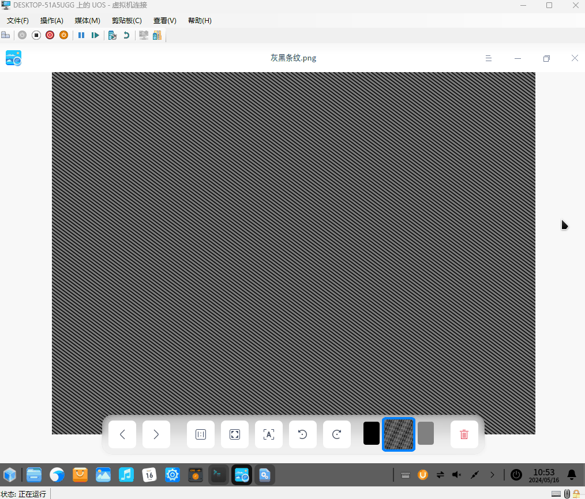

# 学习 Avalonia 框架笔记 设置 X11 窗口从最小化状态还原为正常状态

本文记录在 dotnet 里面如何设置 X11 窗口从最小化状态还原为正常状态

<!--more-->


<!-- CreateTime:2024/05/17 07:23:45 -->

<!-- 发布 -->
<!-- 博客 -->

本文属于学习 Avalonia 框架系列笔记，更多请参阅 [博客导航](https://blog.lindexi.com/post/%E5%8D%9A%E5%AE%A2%E5%AF%BC%E8%88%AA.html )

核心设置方法如下

```csharp
/// <summary>
/// 代码从 Avalonia 抄的 https://github.com/AvaloniaUI/Avalonia/blob/5e323b8fb1e2ca36550ca6fe678e487ff936d8bf/src/Avalonia.X11/X11Window.cs#L692
/// </summary>
unsafe class X11Window
{
    public X11Window(IntPtr windowHandle, IntPtr display, IntPtr rootWindow)
    {
        Display = display;
        RootWindow = rootWindow;
        _handle = windowHandle;
    }

    private readonly IntPtr _handle;

    public IntPtr Display { get; }
    public IntPtr RootWindow { get; }

    //private bool _mapped;

    private IntPtr _NET_WM_STATE => XInternAtom(Display, "_NET_WM_STATE", true);

    public void SetNormal()
    {
        ChangeWMAtoms(false, GetAtom("_NET_WM_STATE_HIDDEN"));
        ChangeWMAtoms(false, GetAtom("_NET_WM_STATE_FULLSCREEN"));
        ChangeWMAtoms(false, GetAtom("_NET_WM_STATE_MAXIMIZED_VERT"),
            GetAtom("_NET_WM_STATE_MAXIMIZED_HORZ"));
        SendNetWMMessage(GetAtom("_NET_ACTIVE_WINDOW"), (IntPtr) 1, 0,
            IntPtr.Zero);

        IntPtr GetAtom(string name) => XInternAtom(Display, name, true);
    }

    private void ChangeWMAtoms(bool enable, params IntPtr[] atoms)
    {
        if (atoms.Length != 1 && atoms.Length != 2)
        {
            throw new ArgumentException();
        }

        //if (!_mapped)
        //{
        //    XGetWindowProperty(Display, _handle, _NET_WM_STATE, IntPtr.Zero, new IntPtr(256),
        //        false, (IntPtr) Atom.XA_ATOM, out _, out _, out var nitems, out _,
        //        out var prop);
        //    var ptr = (IntPtr*) prop.ToPointer();
        //    var newAtoms = new HashSet<IntPtr>();
        //    for (var c = 0; c < nitems.ToInt64(); c++)
        //    {
        //        newAtoms.Add(*ptr);
        //    }

        //    XFree(prop);
        //    foreach (var atom in atoms)
        //    {
        //        if (enable)
        //        {
        //            newAtoms.Add(atom);
        //        }
        //        else
        //        {
        //            newAtoms.Remove(atom);
        //        }
        //    }

        //    XChangeProperty(Display, _handle, _NET_WM_STATE, (IntPtr) Atom.XA_ATOM, 32,
        //        PropertyMode.Replace, newAtoms.ToArray(), newAtoms.Count);
        //}

        SendNetWMMessage(_NET_WM_STATE,
            (IntPtr) (enable ? 1 : 0),
            atoms[0],
            atoms.Length > 1 ? atoms[1] : IntPtr.Zero,
            atoms.Length > 2 ? atoms[2] : IntPtr.Zero,
            atoms.Length > 3 ? atoms[3] : IntPtr.Zero
        );
    }

    private void SendNetWMMessage(IntPtr message_type, IntPtr l0,
        IntPtr? l1 = null, IntPtr? l2 = null, IntPtr? l3 = null, IntPtr? l4 = null)
    {
        var xev = new XEvent
        {
            ClientMessageEvent =
            {
                type = XEventName.ClientMessage,
                send_event = true,
                window = _handle,
                message_type = message_type,
                format = 32,
                ptr1 = l0,
                ptr2 = l1 ?? IntPtr.Zero,
                ptr3 = l2 ?? IntPtr.Zero,
                ptr4 = l3 ?? IntPtr.Zero
            }
        };
        xev.ClientMessageEvent.ptr4 = l4 ?? IntPtr.Zero;
        XSendEvent(Display, RootWindow, false,
            new IntPtr((int) (EventMask.SubstructureRedirectMask | EventMask.SubstructureNotifyMask)), ref xev);
    }
}
```

以上代码没有定义的函数和局部变量等，可以在本文末尾找到完全的代码

为了测试其行为，我额外编写了一些 C# 代码，不断设置让 X11 窗口最小化和还原到正常状态

```csharp
async Task InvokeAsync(Action action)
{
    var taskCompletionSource = new TaskCompletionSource();
    lock (invokeList)
    {
        invokeList.Add(() =>
        {
            action();
            taskCompletionSource.SetResult();
        });
    }

    // 在 Avalonia 里面，是通过循环读取的方式，通过 XPending 判断是否有消息
    // 如果没有消息就进入自旋判断是否有业务消息和判断是否有 XPending 消息
    // 核心使用 epoll_wait 进行等待
    // 整个逻辑比较复杂
    // 这里简单处理，只通过发送 ClientMessage 的方式，告诉消息循环需要处理业务逻辑
    // 发送 ClientMessage 是一个合理的方式，根据官方文档说明，可以看到这是没有明确定义的
    // https://www.x.org/releases/X11R7.5/doc/man/man3/XClientMessageEvent.3.html
    // The X server places no interpretation on the values in the window, message_type, or data members.
    // 在 cpf 里面，和 Avalonia 实现差不多，也是在判断 XPending 是否有消息，没消息则判断是否有业务逻辑
    // 最后再进入等待逻辑。似乎 CPF 这样的方式会导致 CPU 占用略微提升
    var @event = new XEvent
    {
        ClientMessageEvent =
        {
            type = XEventName.ClientMessage,
            send_event = true,
            window = handle,
            message_type = 0,
            format = 32,
            ptr1 = invokeMessageId,
            ptr2 = 0,
            ptr3 = 0,
            ptr4 = 0,
        }
    };
    XSendEvent(display, handle, false, 0, ref @event);

    XFlush(display);

    await taskCompletionSource.Task;
}

_ = Task.Run(async () =>
{
    var x11Window = new X11Window(handle, display, rootWindow);

    while (true)
    {
        await Task.Delay(TimeSpan.FromSeconds(3));

        await InvokeAsync(() =>
        {
            var result = XIconifyWindow(display, handle, screen);
        });

        await Task.Delay(TimeSpan.FromSeconds(2));

        await InvokeAsync(() =>
        {
            x11Window.SetNormal();
        });
    }
});
```

<!--  -->


以上代码放在 [github](https://github.com/lindexi/lindexi_gd/tree/0a1cb0ac238bd809c17059cfa57bcb9528b79c72/DikalehebeekaJaqunicobo) 和 [gitee](https://gitee.com/lindexi/lindexi_gd/tree/0a1cb0ac238bd809c17059cfa57bcb9528b79c72/DikalehebeekaJaqunicobo) 上，可以使用如下命令行拉取代码

先创建一个空文件夹，接着使用命令行 cd 命令进入此空文件夹，在命令行里面输入以下代码，即可获取到本文的代码

```
git init
git remote add origin https://gitee.com/lindexi/lindexi_gd.git
git pull origin 0a1cb0ac238bd809c17059cfa57bcb9528b79c72
```

以上使用的是 gitee 的源，如果 gitee 不能访问，请替换为 github 的源。请在命令行继续输入以下代码，将 gitee 源换成 github 源进行拉取代码

```
git remote remove origin
git remote add origin https://github.com/lindexi/lindexi_gd.git
git pull origin 0a1cb0ac238bd809c17059cfa57bcb9528b79c72
```

获取代码之后，进入 DikalehebeekaJaqunicobo 文件夹，即可获取到源代码

设置 X11 窗口最小化的方法请看 [dotnet 后台线程设置 X11 窗口最小化](https://blog.lindexi.com/post/dotnet-%E5%90%8E%E5%8F%B0%E7%BA%BF%E7%A8%8B%E8%AE%BE%E7%BD%AE-X11-%E7%AA%97%E5%8F%A3%E6%9C%80%E5%B0%8F%E5%8C%96.html )
<!-- [dotnet 后台线程设置 X11 窗口最小化 - lindexi - 博客园](https://www.cnblogs.com/lindexi/p/18192610 ) -->


<a rel="license" href="http://creativecommons.org/licenses/by-nc-sa/4.0/"></a><br />本作品采用<a rel="license" href="http://creativecommons.org/licenses/by-nc-sa/4.0/">知识共享署名-非商业性使用-相同方式共享 4.0 国际许可协议</a>进行许可。欢迎转载、使用、重新发布，但务必保留文章署名[林德熙](http://blog.csdn.net/lindexi_gd)(包含链接:http://blog.csdn.net/lindexi_gd )，不得用于商业目的，基于本文修改后的作品务必以相同的许可发布。如有任何疑问，请与我[联系](mailto:lindexi_gd@163.com)。