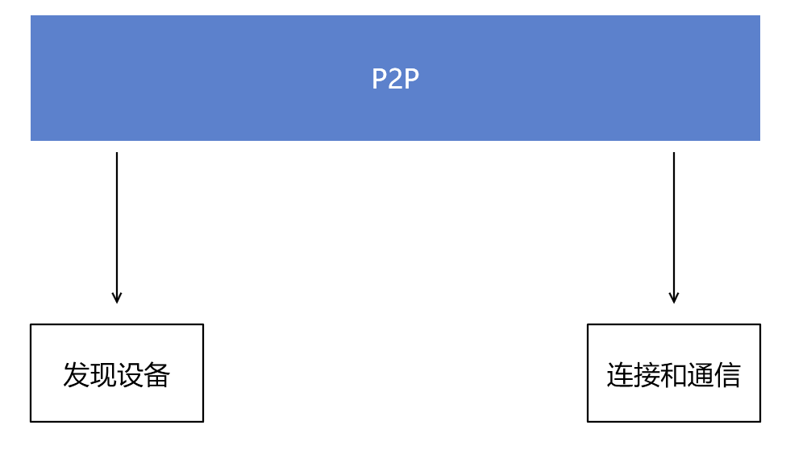
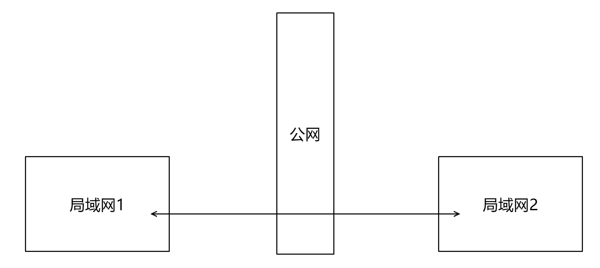
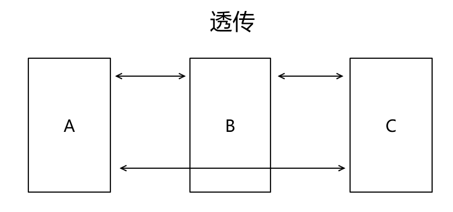
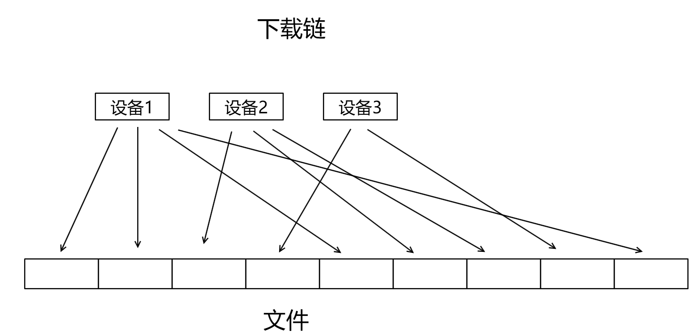

# 完整的 P2P 应用需要包含哪些功能

本文告诉大家一个 P2P 传输的应用程序需要有哪些核心的功能，特别是作为一个下载器需要包含的功能

<!--more-->
<!-- CreateTime:2019/9/11 9:00:55 -->

<!-- csdn -->

<!-- 标签: P2P -->

核心的 P2P 的功能包含了发现设备、连接设备进行通信的功能

<!--  -->

- 核心功能
 - 发现设备
 - 连接和通信

- 基础功能
 - 文件管理
 - 上传
 - 下载

## 发现设备

在 P2P 里面最核心也是最有技术含量的就是发现设备机制，这个机制做的好不好就影响到程序在发现过程的速度

发现机制里面有带中央服务器的发现和不带中央服务器的发现

- 中央发现服务器
- 本地局域网发现
- 广域网发现

### 中央发现服务器

- 上报设备信息
- 获取其他设备
 - 评估最优返回值
 - 优先局域网

所有的 P2P 设备都和中央服务器连接，然后上报自己设备的信息，同时从中央服务器拿到其他的设备的信息，这样就可以做到快速发现其他设备

中央服务器的优点是让 P2P 设备第一次接入的时候的发现其他设备的速度非常快，解决了第一次接入的问题

缺点是中央服务器将会被大量的 P2P 设备连接，需要保存大量 P2P 设备的信息。同时在设备请求其他设备信息的时候，中央服务器应该返回的是哪些设备。因为中央服务器必须保证在返回的设备里面，可以让请求的设备尽可能的连接，这就包括了去掉那些不活跃的设备以及局域网设备优先

### 本地局域网发现

- 组播
- 扫描网段

在 P2P 的应用里面，局域网是应用的最多的，可以通过扫描网段以及使用组播的方式快速发现局域网内的其他设备

### 关系维护

- 介绍
- 心跳

无论是中央服务器发现本地局域网发现都需要在发现之后做关系维护，例如使用中央服务器的发现，在连接上中央服务器之后，需要定时和中央服务器通信，这样中央服务器才能确定这个设备是活跃的，才会将这个设备介绍给其他设备

在设备之间无论是本地局域网还是广域网发现之后，也需要设备之间做心跳这样才可以给后续的网络连接评估应该优先拿哪些设备进行连接

关系维护还包括介绍功能，如果将中央服务器当做广域网的一个 P2P 设备，那么也就是第一次接入 P2P 网络的时候可以有一个设备可以连接，在连接到一台设备的时候，可以询问这台设备有哪些朋友设备。当连接上的设备介绍了他的连接上的设备的时候，也就是本地设备就多发现了其他的设备

很难做到在没有中央服务器的前提下进行广域网发现，因为假设没有一台在广域网固定的设备，也就是 P2P 设备在第一次运行的时候不知道可以从哪里找到其他的设备，这就是P2P里面最难的一部分了。而如果有一台广域网固定的设备，那么这台设备就相当于中央发现服务器

## 网络连接

- 穿透
- 透传

因为 P2P 是每个设备都是作为服务器，而现在很多运营商都不允许个人设备对外提供服务，如果是做广域网的 P2P 应用，那么网络连接将会是极大的难题

### 穿透

- 打洞

从一个局域网连接到另一个局域网

<!--  -->

### 透传

- 中间服务器透传
- 中间设备透传
 + 负载平衡
 + 最短路径
 + 链路发现

透传这个功能是假设我有三个设备，其中 A 和 B 可以相互连接，而 B 和 C 可以相互连接，但是 A 无法连接上 C 此时需要 A 和 C 通信，就需要经过让 A 经过 B 和 C 通信。这个过程就是透传

<!--  -->

在 BTSync 这个工具里面就通过中间服务器作为透传，如果全部的透传都经过中间服务器，那么就是和 花生壳 差不多的原理。使用中间服务器的优点是因为中间服务器具有对外服务，也就是能访问外网的设备就可以连接中间服务器，所以可靠性好。但是缺点是有大量数据会经过中间服务器，将会给中间服务器带来流量和负载的坑

而如果是选定用户设备作为透传的中间设备，此时可以做到内部传输，不需要做中间服务器，但是存在的问题是如果某个设备被作为多个其他设备的中间设备，那么将会让这个设备的资源被一直占用。此时需要有一个负载平衡的算法

有时候的透传不只需要一台设备，此时就需要做到最短路径的评估了

## 基础功能

本文的基础功能指的是一个文件传输的 P2P 需要的基础功能，而不包含一个 P2P 通信软件的基础功能

- 上传
- 下载
- 资源管理

### 上传

- 资源查找
- 分块文件
- 文件夹上传
 + 文件夹标识
 + 内部文件作为相对文件下载
 + 以压缩文件下载
- 性能评估算法
- 上传限速
- 保留资源方法

在接受到其他设备请求资源的时候，需要先从资源管理里面查找本地是否存在此资源，如果存在资源则执行上传资源

上传资源时其实就是提供文件给到其他设备下载，上传功能将需要和下载功能一起做，原因是很多下载的技术都需要用到文件分块，此时需要上传模块支持文件分块下载

而有些下载模块需要下载文件夹，此时就需要有文件夹资源管理的方法同时还有文件夹下载的方式，文件夹下载的方式有很多不同的方式，例如文件夹内部不做校验，如 BTSync 的算法，这个算法将需要做文件冲突处理，参见坚果云的冲突处理。文件夹内部文件作为相对文件下载方法，如 Chrome 的二进制更新算法。文件夹内部每个文件作为独立资源方式，例如迅雷的下载方式。以压缩文件表示的文件夹上传方式，如 Git 的算法，这里说的不是总的 Git 上传算法，或者 FTPServer 和坚果云的文件夹下载算法

而上传过程中，可能存在多个客户端都请求资源下载，如果每次都响应，那么将会影响本机的性能，此时需要有性能评估算法，在本机忙碌的时候拒绝客户端的请求。同时这部分也需要下载模块的配合，如果发现这个资源只有此设备存在，那么在忙碌的时候只能通过限制下载性能的方式提供资源

如何让客户端发现资源仅在本机存在就需要用到保留资源方法，在 UTorrent 的说法是做种，也就是本机下载了一个资源那么就声明本机存在这个资源。至于本机有资源给不给下载就是另一回事了，假如本机很忙，那么只是回应本机存在此资源，但是本机很忙现在不提供下载功能

### 下载

- 下载清单
 - 文件夹下载
- 文件校验
- 下载链技术
- 多端下载
- 远程设备性能评估算法
- 文件管理细节
 + 预先磁盘分配
 + 访问权限
 + 文件重复

下载的时候需要提交下载清单，下载清单就是下载什么样的文件，应该下载到哪等。例如 UTorrent 工具的种子就是下载清单

下载的过程需要经过设备发现找到对应的存在资源的设备进行下载

在下载的时候对单一文件如果有支持多个设备同时下载的性能将会高很多，也就是对一个文件支持从多个设备下载。这个技术是下载链技术，在发现第一个设备的时候就进行下载文件的第一段，在发现第二个设备的时候，就从文件里面还没下载完成的范围进行下载，这样才能做到最大的下载性能

<!--  -->

在下载中下载链技术是关键的技术，同时难度比较大，单这个点能投入很多资源开发。现在对下载链技术处理比较好的有 UTorrent 和比特彗星

因为下载的资源是其他设备传输的，可能存在逗比设备，所以在下载完成之后需要进行校验。如果使用下载链技术那么需要对文件分块进行校验

下载的时候如果连接上了一个下载性能很慢的机器，应该将这个机器去掉，这就是远程设备性能评估算法了。此算法一般都会和下载链技术一起使用

在现代的软件里面下载的过程还需要让用户看到下载进度和下载速度，这部分就不是 P2P 的核心了，但是开发投入将会很大，特别是在加上下载链技术的时候

和普通的下载程序一样，在 P2P 下载模块里面也会遇到磁盘空间不足、下载文件已经存在等细节问题，这部分也是需要有大量投入资源才能解决

### 资源管理

- 单文件管理
- 文件夹管理
- 文件校验
- 文件变更管理
- 资源寻找
- 安全性

资源管理部分主要是上传模块的支持，管理本机包含的资源，也就是在客户端请求的时候可以回应哪些资源是本机存在的

在支持文件夹上传里面还需要有文件夹的管理

对于文件的管理最大的问题在于如何识别本地文件的变更，如果用户只是删除还好，重要的是用户可能对文件进行修改，此时的资源就进行了变动，如果此时对文件进行校验，那么性能将会很差，这部分就需要有很多开发投入优化

通常下载的内容都是其他设备给的，这部分下载内容以及提供上传的内容都涉及安装性，好在下载部分可以让第三方安全软件扫描，也就是需要有接入第三方的安全软件。而上传功能则是不能提供用户关键信息给上传，我见过学校的 P2P 软件用来管理教室的软件就可以做到上传任意的文件，这样做是不安全的

本文主要提供给大家如果需要开发一个 P2P 下载程序的时候可以参考的点，可以用来评估开发的时间。如果做一个完整的 P2P 程序，想要做的很好用需要的投入将会十分可怕，参见迅雷或比特彗星或 BT 团队的开发。但是如果只是做一个简单版本的，那么只做核心功能，同时不对细节进行优化，那么开发的速度还是能做到很快的

 本作品采用<a rel="license" href="http://creativecommons.org/licenses/by-nc-sa/4.0/">知识共享署名-非商业性使用-相同方式共享 4.0 国际许可协议</a>进行许可。欢迎转载、使用、重新发布，但务必保留文章署名[林德熙](http://blog.csdn.net/lindexi_gd)(包含链接:http://blog.csdn.net/lindexi_gd )，不得用于商业目的，基于本文修改后的作品务必以相同的许可发布。如有任何疑问，请与我[联系](mailto:lindexi_gd@163.com)。
