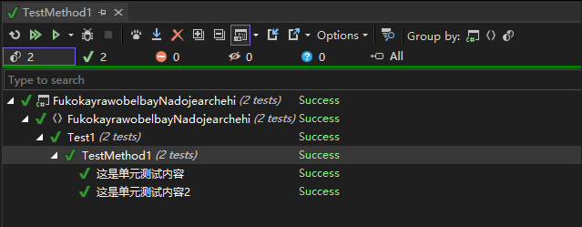

# 定制 MSTest 单元测试框架 让一个 TestMethod 包含多个测试用例

在默认的 MSTest 单元测试框架里面，每个标记了 TestMethodAttribute 特性的方法，都只有一个测试用例。本文通过 ITestDataSource 接口辅助实现让一个 TestMethod 包含多个测试用例

<!--more-->
<!-- CreateTime:2025/07/20 07:06:08 -->

<!-- 发布 -->
<!-- 博客 -->

具体而言，本文的目标就是实现在一个标记了 TestMethodAttribute 特性的方法里面，包含一个测试用例组，测试用例组包含了多个测试用例方法。每个测试用例方法都有自己的展示名和用例测试内容

本文是我所在的团队开源的 <https://github.com/dotnet-campus/CUnit> 单元测试框架的具体实现原理博客。使用了此科技之后的单元测试可以这么写

```csharp
[TestClass]
public sealed class Test1
{
    [ContractTestCase]
    public void TestMethod1()
    {
        "这是单元测试内容".Test(() =>
        {
            var a = 1;
            var b = 2;
            var c = a + b;
            Assert.AreEqual(3, c);
        });

        "这是单元测试内容2".Test(() =>
        {
            // 另一个单元测试
        });
    }
}
```

跑起来的效果如下图所示

<!--  -->


用这样的方式写可以减少单元测试方法的命名，尽量多用自然语言组织用例说明。我所在的团队现在非常多有单元测试的项目都采用 <https://github.com/dotnet-campus/CUnit> 这个库

了解了用法之后，咱来看看底层的实现机制

在 MSTest 里面，通过编写一个特性，继承自 Microsoft.VisualStudio.TestTools.UnitTesting.TestMethodAttribute 特性，即可获得其可重写的 Execute 方法，示例代码如下

```csharp
public class ContractTestCaseAttribute : TestMethodAttribute
{
    public override TestResult[] Execute(ITestMethod testMethod)
    {
    	...
    }
}
```

细心的伙伴也许发现了上文一开始的演示代码里面，在 TestMethod1 上标记的就是 ContractTestCaseAttribute 特性。由于 ContractTestCaseAttribute 继承了 TestMethodAttribute 特性，聪明的 Visual Studio 还是能够认识的，于是愉快地正常作为单元测试方法处理

每次执行单元测试方法时，将会调入 Execute 方法。方法里面的 `ITestMethod testMethod` 就是当前正在执行的测试方法。这个 ITestMethod 接口里面会包含当前正在执行的方法的元数据（反射数据） MethodInfo 和参数 `object?[]? Arguments` 等属性。简单而言，此 Execute 方法的默认实现代码如下，直接就调用了 ITestMethod 提供的 Invoke 方法，获取其返回值，包装成数组进行返回

```csharp
    public override TestResult[] Execute(ITestMethod testMethod)
    {
        TestResult testResult = testMethod.Invoke(null);
        return new TestResult[] { testResult };
    }
```

按照此设计，可以看到 MSTest 单元测试框架是允许返回多结果的。只不过呢，本文不使用返回多结果这个科技，核心原因是直接返回多结果无法很好的和 IDE 合作，让 IDE 正确显示用例名。为了能够让一个单元测试方法包含多个用例，且能够和 IDE 更好合作，咱将让 ContractTestCaseAttribute 继承 ITestDataSource 接口

继承 ITestDataSource 接口之后，表示当前特性将提供单元测试的数据。按照约定，每个数据提供都可以额外给出展示名内容。于是根据这个原理，将一个单元测试方法里面的多个用例，每个用例都作为一个单元测试参数数据提供出去，且每个数据的展示名就是用例说明内容

```csharp
public class ContractTestCaseAttribute : TestMethodAttribute, ITestDataSource
{
    public IEnumerable<object?[]> GetData(MethodInfo methodInfo)
    {
        // 返回单元测试方法的所有测试用例，将测试用例当成数据
    }

    public string? GetDisplayName(MethodInfo methodInfo, object?[]? data)
    {
        // 这里的 data 就是 GetData 方法返回的每个测试用例，返回测试用例的描述信息当成展示名
    }
}
```

核心思路就是这么简单

很快咱就遇到下一个问题，那就是应该如何收集单元测试里面的用例。按照本文一开始的示例写法，其语法格式如下

```csharp
        "这是单元测试内容".Test(() =>
        {
            var a = 1;
            var b = 2;
            var c = a + b;
            Assert.AreEqual(3, c);
        });
```

这里用到了一个 C# 的基础语法功能，扩展方法。在扩展方法里面传入了委托，委托内容就是测试用例。于是很棒地，字符串本身就构成了用例说明，委托的测试用例本体就可以关联上用例说明

```csharp
public static class ContractTest
{
    public static void Test(this string contract, Action testCase)
    {
    }

    public static void Test(this string contract, Func<Task> testCase)
    {
    }
}
```

想明白了这一点之后，收集工作就非常简单了。在 ITestDataSource 的 GetData 里面，传入的参数是 `MethodInfo methodInfo` 表示当前的测试方法。那将其跑一下，不就能够让此单元测试方法里面的各个用例都触发一次 ContractTest.Test 方法了

这个过程都是顺序调用的，只需要简单一个静态属性就可以完成收集。担心可能存在的上下文问题，咱也可以使用 `AsyncLocal` 机制来辅助。在本文示例里面，采用 `AsyncLocal` 机制，还是直接使用一个静态属性，其效果都是等同的

```csharp
public static class ContractTest
{
    public static void Test(this string contract, Action testCase)
    {
        if (TestCaseCollection.Value is {} collection)
        {
            collection.Add(new ContractTestCase(contract, () =>
            {
                testCase();
                return Task.CompletedTask;
            }));
        }
    }

    public static void Test(this string contract, Func<Task> testCase)
    {
        if (contract == null) throw new ArgumentNullException(nameof(contract));
        if (testCase == null) throw new ArgumentNullException(nameof(testCase));

        if (TestCaseCollection.Value is { } collection)
        {
            collection.Add(new ContractTestCase(contract, testCase));
        }
    }

    internal static AsyncLocal<TestCaseCollection?> TestCaseCollection { get; } = new AsyncLocal<TestCaseCollection?>();
}

internal class TestCaseCollection : List<ContractTestCase>
{
}

public record ContractTestCase(string Contract, Func<Task> TestCase);
```

可以看到，修改之后的代码是在 ContractTest 静态类里面放入一个 TestCaseCollection 的属性。属性里面的内容是一个 ContractTestCase 列表。每次调用 Test 时，都将其放入到此 ContractTestCase 列表里面

为了方便我的日常调试，我习惯写一个类型继承公共的列表泛型，如上面代码所示，我就创建了 TestCaseCollection 类型用于继承 `List<ContractTestCase>` 类型

回到 ContractTestCaseAttribute 的 GetData 方法，有了 ContractTest 提供的基础设施，就可以通过反射执行单元测试方法。执行之前先给 ContractTest 的 TestCaseCollection 赋值用于收集，反射执行完之后再清空，代码如下

```csharp
public class ContractTestCaseAttribute : TestMethodAttribute, ITestDataSource
{
    public IEnumerable<object?[]> GetData(MethodInfo methodInfo)
    {
        if (!ContractTest.Method.TestMethodDictionary.TryGetValue(methodInfo,out var testCaseCollection))
        {
            // 单元测试方法是一个实例方法，需要创建一个对象才能调用到
            var type = methodInfo.DeclaringType!;
            var testInstance = Activator.CreateInstance(type);

            testCaseCollection = new TestCaseCollection();
            ContractTest.TestCaseCollection.Value = testCaseCollection;
            methodInfo.Invoke(testInstance, null);
            ContractTest.TestCaseCollection.Value = null;

            testCaseCollection = new TestCaseCollection(testCaseCollection);

            // 收集起来
            ContractTest.Method.TestMethodDictionary[methodInfo] = new TestCaseCollection(testCaseCollection);
        }

        foreach (ContractTestCase contractTestCase in testCaseCollection)
        {
            yield return [contractTestCase];
        }
    }
}
```

为了防止重复 GetData 方法调用导致用例被重复收集，我这里还在 ContractTest 里面添加一个新的名为 Method 的属性，其代码如下

```csharp
public static class ContractTest
{
    internal static TestCaseIndexer Method { get; } = new TestCaseIndexer();
}

internal class TestCaseIndexer
{
    public Dictionary<MethodInfo /*TestMethod*/, TestCaseCollection> TestMethodDictionary { get; } = [];
}
```

于是在运行单元测试的时候，在 MSTest 单元测试框架里面将会发现标记了的 ContractTestCaseAttribute 特性继承了 ITestDataSource 接口。就会去调用 ITestDataSource 接口的 GetData 方法，用于收集单元测试参数数据。此时将会被返回单元测试方法里面包含的各个用例内容。接下来 MSTest 单元测试框架就会按照 GetData 返回的参数枚举数量，依次调用 GetDisplayName 和 Execute 方法

在 GetDisplayName 方法里面，咱知道了参数是从 GetData 返回的 ContractTestCase 对象，里面就包含了用例说明，只需将用例说明返回即可，代码如下

```csharp
    public string? GetDisplayName(MethodInfo methodInfo, object?[]? data)
    {
        if (data is [ContractTestCase contractTestCase])
        {
            return contractTestCase.Contract;
        }

        return methodInfo.Name;
    }
```

以上的 `if (data is [ContractTestCase contractTestCase])` 是一句 C# 模式匹配代码，知识落下的伙伴如看不懂的话，还请自行充电补充知识

在 Execute 方法里面，可以从 `ITestMethod testMethod` 参数里面的 Arguments 获取到参数内容，判断参数是 ContractTestCase 类型则执行里面的用例委托，代码如下

```csharp
    public override TestResult[] Execute(ITestMethod testMethod)
    {
        if (testMethod.Arguments is [ContractTestCase contractTestCase])
        {
            try
            {
                var task = contractTestCase.TestCase();
                task.Wait();

                return
                [
                    new TestResult()
                    {
                        DisplayName = contractTestCase.Contract,
                        Outcome = UnitTestOutcome.Passed,
                    }
                ];
            }
            catch (Exception e)
            {
                return
                [
                    new TestResult()
                    {
                        DisplayName = contractTestCase.Contract,
                        Outcome = UnitTestOutcome.Failed,
                        TestFailureException = e,
                    }
                ];
            }
        }

        var result = testMethod.Invoke(testMethod.Arguments!);

        return [result];
    }
```

如此简单的逻辑就可以实现让 MSTest 单元测试框架在一个单元测试方法里面返回多个用例，且给每个用例添加各自的用例说明

我所在的团队开源的 <https://github.com/dotnet-campus/CUnit> 单元测试框架，我已经用了很久了，在很多个项目使用。相对来说这是我用的比较爽的一个写法，正常开发模式就是写一个对应的类型的单元测试类，再列举将要测试的方法，在对应的方法里面直接用自然语言写测试用例说明，以及编写实际的测试用例代码。这个过程比我去编写一个个自己和别人都看不懂的长长的单元测试方法名好得多

整个 <https://github.com/dotnet-campus/CUnit> 单元测试框架项目相对来说还是复杂得多，如果大家只是对这部分科技感兴趣，可以单独拉取我的示例项目

本文代码放在 [github](https://github.com/lindexi/lindexi_gd/tree/1b177273fbca8e6588bc5c20ab20c6c1388d1373/Workbench/FukokayrawobelbayNadojearchehi) 和 [gitee](https://gitee.com/lindexi/lindexi_gd/blob/1b177273fbca8e6588bc5c20ab20c6c1388d1373/Workbench/FukokayrawobelbayNadojearchehi) 上，可以使用如下命令行拉取代码。我整个代码仓库比较庞大，使用以下命令行可以进行部分拉取，拉取速度比较快

先创建一个空文件夹，接着使用命令行 cd 命令进入此空文件夹，在命令行里面输入以下代码，即可获取到本文的代码

```
git init
git remote add origin https://gitee.com/lindexi/lindexi_gd.git
git pull origin 1b177273fbca8e6588bc5c20ab20c6c1388d1373
```

以上使用的是国内的 gitee 的源，如果 gitee 不能访问，请替换为 github 的源。请在命令行继续输入以下代码，将 gitee 源换成 github 源进行拉取代码。如果依然拉取不到代码，可以发邮件向我要代码

```
git remote remove origin
git remote add origin https://github.com/lindexi/lindexi_gd.git
git pull origin 1b177273fbca8e6588bc5c20ab20c6c1388d1373
```

获取代码之后，进入 Workbench/FukokayrawobelbayNadojearchehi 文件夹，即可获取到源代码

更多技术博客，请参阅 [博客导航](https://blog.lindexi.com/post/%E5%8D%9A%E5%AE%A2%E5%AF%BC%E8%88%AA.html )