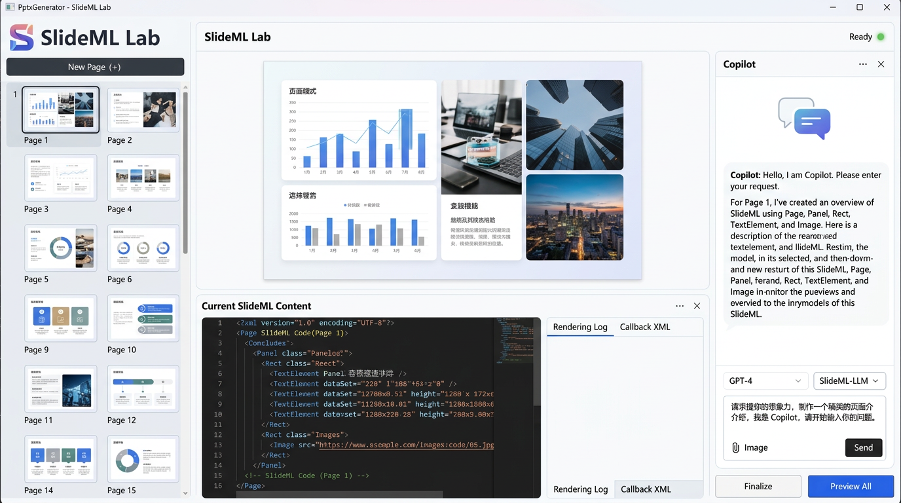
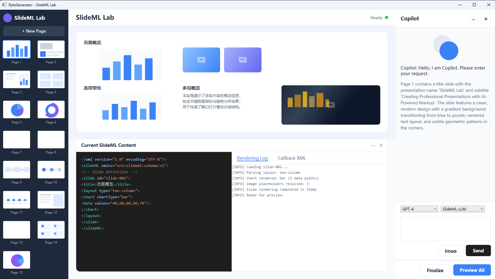

# 实验千问 3.7 Plus 在 VS Copilot 里撰写 XAML 的能力

本文将记录我实验千问 Qwen 3.7 Plus 在 Visual Studio Copilot 里面，根据视觉稿编写 WPF 应用的 XAML 代码的能力

<!--more-->


<!-- CreateTime:2026/06/30 07:04:51 -->

<!-- 发布 -->
<!-- 博客 -->

实际测试效果不错，我用的是 OllamaHub 将 Qwen 3.7 Plus 与 Visual Studio Copilot 进行对接，直接给他视觉稿，视觉稿也是 AI 生成的。要求 Qwen 3.7 Plus 用 XAML 代码将视觉稿实现，先不用管逻辑

视觉稿：

<!--  -->


界面效果：

<!--  -->


整个界面都用 XAML 编写，没有图片引用。还自动拆分了多个控件，添加了各项资源，看起来效果不错。创建出来的文件结构如下

```
C:\lindexi\WPFDemo\CheawuchewalYicheredurlakearja
│  App.xaml
│  App.xaml.cs
│  AssemblyInfo.cs
│  CheawuchewalYicheredurlakearja.csproj
│  CheawuchewalYicheredurlakearja.slnx
│  MainWindow.xaml
│  MainWindow.xaml.cs
│
└─Views
        CopilotPanel.xaml
        CopilotPanel.xaml.cs
        LeftSidebarPanel.xaml
        LeftSidebarPanel.xaml.cs
        MainContentPanel.xaml
        MainContentPanel.xaml.cs
```

这是一次性跑出来的效果，没有经过任何人类加工

提示词： 请根据视觉稿内容，帮忙画出 XAML 界面。你现在做的是原型，不需要考虑实际的运行逻辑。你应该将任务分派给多个子智能体去执行，完成之后再分派子智能体比较实际渲染出来的界面图和视觉稿的差别做评估。

如对千问创建的这个项目的代码感兴趣，请使用如下方式拉取代码： 先创建一个空文件夹，用 git 导航到这个文件夹，然后输出以下命令拉取代码

```
git init
git remote add origin https://github.com/lindexi/lindexi_gd.git
git pull origin 90759935dc6bd5cda686b427551a1d288a9b7816
```

以上使用的是国内的 gitee 的源，如果 gitee 不能访问，请替换为 github 的源。请在命令行继续输入以下代码，将 gitee 源换成 github 源进行拉取代码。如果依然拉取不到代码，可以发邮件向我要代码

```
git remote remove origin
git remote add origin https://github.com/lindexi/lindexi_gd.git
git pull origin 90759935dc6bd5cda686b427551a1d288a9b7816
```

拉取代码完成之后，进入到 WPFDemo/CheawuchewalYicheredurlakearja 文件夹即可看到本文的代码

本文用的 OllamaHub 与 Visual Studio Copilot 进行对接的方法：[用 OllamaHub 让 Visual Studio Copilot 可以对接任意模型](https://blog.lindexi.com/post/%E7%94%A8-OllamaHub-%E8%AE%A9-Visual-Studio-Copilot-%E5%8F%AF%E4%BB%A5%E5%AF%B9%E6%8E%A5%E4%BB%BB%E6%84%8F%E6%A8%A1%E5%9E%8B.html )
<!-- [用 OllamaHub 让 Visual Studio Copilot 可以对接任意模型 - lindexi - 博客园](https://www.cnblogs.com/lindexi/p/20687205 ) -->

更多技术博客，请参阅 [博客导航](https://blog.lindexi.com/post/%E5%8D%9A%E5%AE%A2%E5%AF%BC%E8%88%AA.html )


<a rel="license" href="http://creativecommons.org/licenses/by-nc-sa/4.0/"></a><br />本作品采用<a rel="license" href="http://creativecommons.org/licenses/by-nc-sa/4.0/">知识共享署名-非商业性使用-相同方式共享 4.0 国际许可协议</a>进行许可。欢迎转载、使用、重新发布，但务必保留文章署名[林德熙](http://blog.csdn.net/lindexi_gd)(包含链接:http://blog.csdn.net/lindexi_gd )，不得用于商业目的，基于本文修改后的作品务必以相同的许可发布。如有任何疑问，请与我[联系](mailto:lindexi_gd@163.com)。