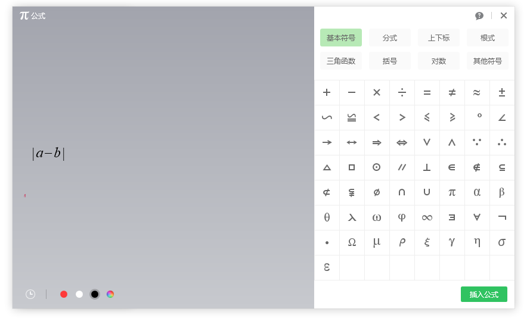

# 希沃白板如何在公式里面输入绝对值符号

在希沃白板中，可以很方便使用学科工具里面的公式工具，在希沃白板画布中插入公式元素。本文来告诉大家如何在希沃白板的公式工具中，插入带绝对值符号的公式

<!--more-->

<!-- CreateTime:2021/4/13 9:36:59 -->

<!-- 发布 -->

在希沃白板的公式工具里面，默认会显示很多基础符号，但是在基础符号里面，没有绝对值符号 `|` 符号，因为这个符号可以通过键盘输入

<!--  -->

在默认的标准键盘里面，可以在键盘找到 `|\` 这个按键符号，如下图。默认按下是 `\` 符号，在键盘中按住 `Shift` 键之后，按下 `|\` 这个按键，即可输入绝对值符号 `|` 符号

<!--  -->

 本作品采用<a rel="license" href="http://creativecommons.org/licenses/by-nc-sa/4.0/">知识共享署名-非商业性使用-相同方式共享 4.0 国际许可协议</a>进行许可。欢迎转载、使用、重新发布，但务必保留文章署名[林德熙](http://blog.csdn.net/lindexi_gd)(包含链接:http://blog.csdn.net/lindexi_gd )，不得用于商业目的，基于本文修改后的作品务必以相同的许可发布。如有任何疑问，请与我[联系](mailto:lindexi_gd@163.com)。