# 开源实战

本文记录我参与的开源项目

<!--more-->
<!-- CreateTime:2020/8/15 12:51:33 -->

## dotnet runtime

- [Add logger to cache entry to catch exception by lindexi · Pull Request #37292 · dotnet/runtime](https://github.com/dotnet/runtime/pull/37292 )
- [Use Array.Empty in CompositeFileProvider by lindexi · Pull Request #38086 · dotnet/runtime](https://github.com/dotnet/runtime/pull/38086 )

### 日志库减少不必要的对象创建和静态对象

- [Reduce creation of static objects by lindexi · Pull Request #36867 · dotnet/runtime](https://github.com/dotnet/runtime/pull/36867 )

### 修复 MAC 下删除应用程序，然后调用 Process Start 失败

详细请看 [dotnet core 在 MAC 系统下删除应用程序自己后调 Process Start 方法将会抛出 Win32 异常](https://blog.lindexi.com/post/dotnet-core-%E5%9C%A8-MAC-%E7%B3%BB%E7%BB%9F%E4%B8%8B%E5%88%A0%E9%99%A4%E5%BA%94%E7%94%A8%E7%A8%8B%E5%BA%8F%E8%87%AA%E5%B7%B1%E5%90%8E%E8%B0%83-Process-Start-%E6%96%B9%E6%B3%95%E5%B0%86%E4%BC%9A%E6%8A%9B%E5%87%BA-Win32-%E5%BC%82%E5%B8%B8.html )

[Ignore the executable file be deleted in Process Start by lindexi · Pull Request #40748 · dotnet/runtime](https://github.com/dotnet/runtime/pull/40748 )

### 文档

- [Set memory cache logger field as readonly by lindexi · Pull Request #37289 · dotnet/runtime](https://github.com/dotnet/runtime/pull/37289 )
- [Fix comment in XmlStreamConfigurationProvider by lindexi · Pull Request #38084 · dotnet/runtime](https://github.com/dotnet/runtime/pull/38084 )
- [Fix comment by lindexi · Pull Request #38322 · dotnet/runtime](https://github.com/dotnet/runtime/pull/38322 )
- [Fix link in covariant-return-methods.md by lindexi · Pull Request #49356 · dotnet/runtime](https://github.com/dotnet/runtime/pull/49356#event-4427525186 )

### 代码审查

#### [Nullability annotations for HttpListener by pgovind](https://github.com/dotnet/runtime/pull/41189 )

链接 [Nullability annotations for HttpListener by pgovind · Pull Request #41189 · dotnet/runtime](https://github.com/dotnet/runtime/pull/41189 )

有多余的判断逻辑，使用 `s!.Length` 不如使用原先拿到的 `l` 判断

<!--  -->

有优化的写法，有两个小伙伴给我点赞

<!--  -->

## [SourceYard](https://github.com/dotnet-campus/SourceYard)

主要开发者

制作 NuGet 源代码包的工具，使用 NuGet 将源代码分发给小伙伴，可以直接安装此 NuGet 获取源代码

## [WPF](https://github.com/dotnet/wpf)

水到非官方开发者了，但大部分都是修改文档和注释

<!--  -->

<!--  -->

<!--  -->

[Replace IsAssignableFrom to is pattern by lindexi · Pull Request #101 · dotnet/wpf](https://github.com/dotnet/wpf/pull/101 )

[We use language keywords instead of BCL types by lindexi · Pull Request #102 · dotnet/wpf](https://github.com/dotnet/wpf/pull/102 )

[Update the docs link by lindexi · Pull Request #3078 · dotnet/wpf](https://github.com/dotnet/wpf/pull/3078 )

[Remove special vs version on the link by lindexi · Pull Request #3160 · dotnet/wpf](https://github.com/dotnet/wpf/pull/3160 )

<!--  -->

[Remove the custom HashSet class by lindexi · Pull Request #3738 · dotnet/wpf](https://github.com/dotnet/wpf/pull/3738 )

[Use Array.Empty instead of creating list in ResourceDictionaryDiagnostics by lindexi · Pull Request #3851 · dotnet/wpf](https://github.com/dotnet/wpf/pull/3851 )

[Add clearer win32 exception information in SplashScreen CreateWindow by lindexi · Pull Request #3923 · dotnet/wpf](https://github.com/dotnet/wpf/pull/3923)

[Make CustomGuids as readonly by lindexi · Pull Request #3907 · dotnet/wpf](https://github.com/dotnet/wpf/pull/3907)

[Set the lock object as readonly by lindexi · Pull Request #939 · dotnet/wpf](https://github.com/dotnet/wpf/pull/939 )

<!-- 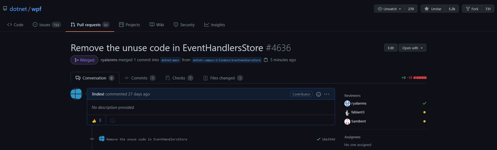 -->

[Remove the unuse code in EventHandlersStore by lindexi · Pull Request #4636 · dotnet/wpf](https://github.com/dotnet/wpf/pull/4636 )

### 表扬

[Latest Community Issues addressed and PRs merged. · Issue #4302 · dotnet/wpf](https://github.com/dotnet/wpf/issues/4302 )

<!--  -->

### 优化启动性能 使用调用方法代替反射

预计能提升 0.0001 纳秒的启动性能

[Calling AppContext.TryGetSwitch without Reflection in LocalAppContext.cs by lindexi · Pull Request #5522 · dotnet/wpf](https://github.com/dotnet/wpf/pull/5522 )

### 优化橡皮擦性能

优化橡皮擦百分之二十的性能，通过缓存预先计算提升性能

<!--  -->

[Using Per-computed bounds in ErasingStroke by lindexi · Pull Request #4111 · dotnet/wpf](https://github.com/dotnet/wpf/pull/4111 )

### XAML 创建对象性能优化

最多可以提升3倍的 XAML 创建对象性能

[Add XamlObjectCreationFactory to improve the performance of XAML creation of objects by lindexi · Pull Request #4026 · dotnet/wpf](https://github.com/dotnet/wpf/pull/4026 )

### 笔迹性能优化

使用 readonly 方法，可以减少 WPF 方法调用的时候，拷贝结构体，可以提升笔迹的性能

[Using readonly struct in WPF Ink module by lindexi · Pull Request #3908 · dotnet/wpf](https://github.com/dotnet/wpf/pull/3908 )

### Replace the Dictionary with HashSet in AppDomainShutdownMonitor

替换字典为 HashSet 用于减少内存和提升一点性能，详细请看性能测试

<!--  -->

<!--  -->

[Replace the Dictionary with HashSet in AppDomainShutdownMonitor by lindexi · Pull Request #3932 · dotnet/wpf](https://github.com/dotnet/wpf/pull/3932 )

### Reduce memory usage by Array.Empty

使用 Array.Empty 可以减少内存分配，和提升创建对象的性能

<!-- 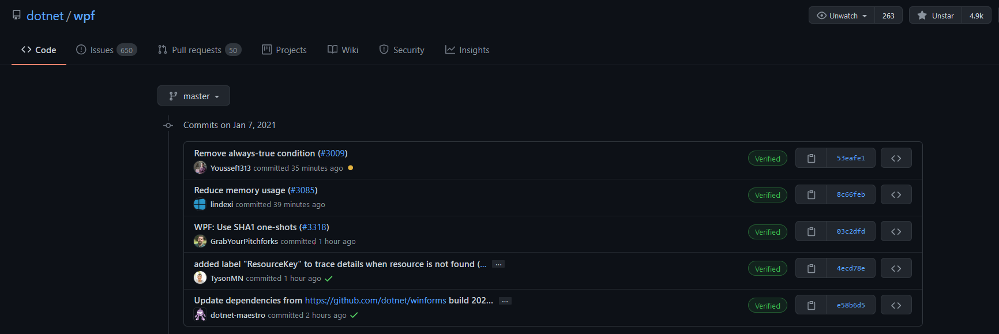 -->

[Reduce memory usage by Array.Empty by lindexi · Pull Request #3085 · dotnet/wpf](https://github.com/dotnet/wpf/pull/3085 )

### Remove unused local variable 'selfStyle' and related conditionals in System.Windows.StyleHelper.GetThemeStyle

<!--  -->

[Remove the unuse code. by lindexi · Pull Request #4010 · dotnet/wpf](https://github.com/dotnet/wpf/pull/4010 )

给 Style 里面提升几乎可以忽略的性能

### 修改 MimeObjectFactory 集合容量

在 MimeObjectFactory 类里面将会包含一个默认的集合，但是这个集合给定的容量和实际运行时的容量不符合，默认给的是 5 的容量，但实际运行时给的是 9 个元素，这就意味着需要一次内存申请和拷贝。我就将默认的容量更改了，设置为 9 提升性能

这个更改将会在每次 WPF 启动的时候都会用到，因此本次更改虽然优化量很小，但能影响每次 WPF 应用启动

<!--  -->

<!--  -->

[Fix the MimeObjectFactory field capacity by lindexi · Pull Request #4493 · dotnet/wpf](https://github.com/dotnet/wpf/pull/4493 )

### 修复路径包含井号找不到资源

如果放在了路径包含 `#` 号的文件夹下，那么有些 WPF 资源将会找不到

<!-- 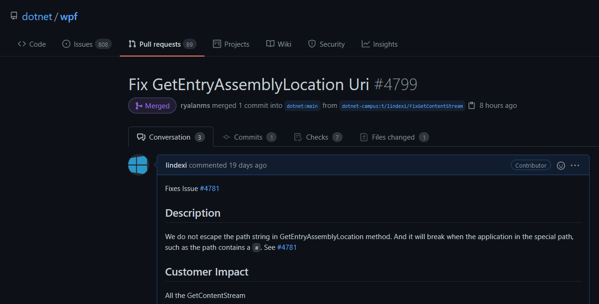 -->

[Fix GetEntryAssemblyLocation Uri by lindexi · Pull Request #4799 · dotnet/wpf](https://github.com/dotnet/wpf/pull/4799 )

### 代码审查

[https://github.com/dotnet/wpf/pull/3092#issuecomment-640955984](https://github.com/dotnet/wpf/pull/3092#issuecomment-640955984)

<!-- 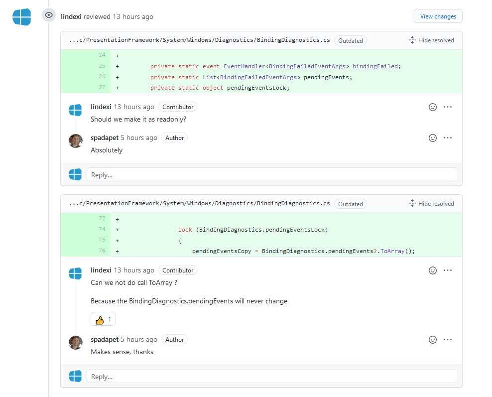 -->

[Add BindingFailed event for diagnostics of binding failures by spadapet · Pull Request #3505 · dotnet/wpf](https://github.com/dotnet/wpf/pull/3505 )

<!--  -->

[[release/5.0] Support Source Generators in WPF projects by ryalanms · Pull Request #3846 · dotnet/wpf](https://github.com/dotnet/wpf/pull/3846 )

<!--  -->

[loc updates by cristianosuzuki77 · Pull Request #3947 · dotnet/wpf](https://github.com/dotnet/wpf/pull/3947 )

<!--  -->

[Using a stopwatch and timespan instead of DateTime and uint by batzen · Pull Request #1171 · dotnet/wpf](https://github.com/dotnet/wpf/pull/1171 )

<!--  -->

[Update WPF to build against newest released version of the SDK (.NET 6.0 Preview1) by ryalanms · Pull Request #4123 · dotnet/wpf](https://github.com/dotnet/wpf/pull/4123 )

<!-- 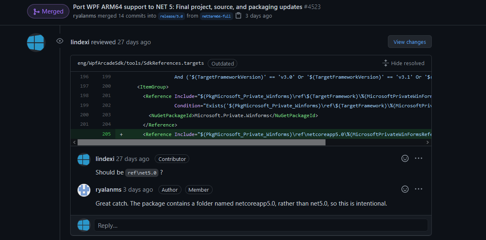 -->

[Port WPF ARM64 support to NET 5: Final project, source, and packaging updates by ryalanms · Pull Request #4523 · dotnet/wpf](https://github.com/dotnet/wpf/pull/4523 )

<!-- 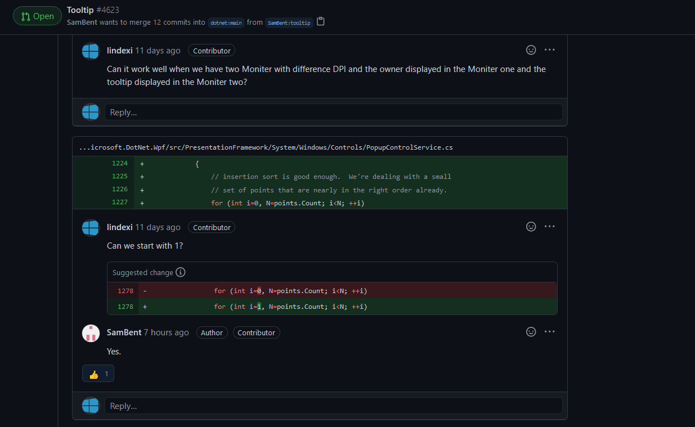 -->

[Tooltip by SamBent · Pull Request #4623 · dotnet/wpf](https://github.com/dotnet/wpf/pull/4623 )

## 修文档注释

<!--  -->

[Fix comment typo in MarkupCompilePass2.cs by lindexi · Pull Request #4408 · dotnet/wpf](https://github.com/dotnet/wpf/pull/4408 )

[Fix comment typo in MarkupCompilePass2.cs by lindexi · Pull Request #4282 · dotnet/wpf](https://github.com/dotnet/wpf/pull/4282 )

[Fix comment typo in DragDrop.cs by lindexi · Pull Request #4249 · dotnet/wpf](https://github.com/dotnet/wpf/pull/4249 )

[Fix comment typo in DataObjectCopyingEventArgs.cs by lindexi · Pull Request #4072 · dotnet/wpf](https://github.com/dotnet/wpf/pull/4072 )

[Fix Style.cs comment by lindexi · Pull Request #4004 · dotnet/wpf](https://github.com/dotnet/wpf/pull/4004 )

[Fix Grid SetFinalSize method comment by lindexi · Pull Request #3909 · dotnet/wpf](https://github.com/dotnet/wpf/pull/3909 )

<!--  -->

[Fix XmlNsInfo comment typo by lindexi · Pull Request #3742 · dotnet/wpf](https://github.com/dotnet/wpf/pull/3742 )

<!-- 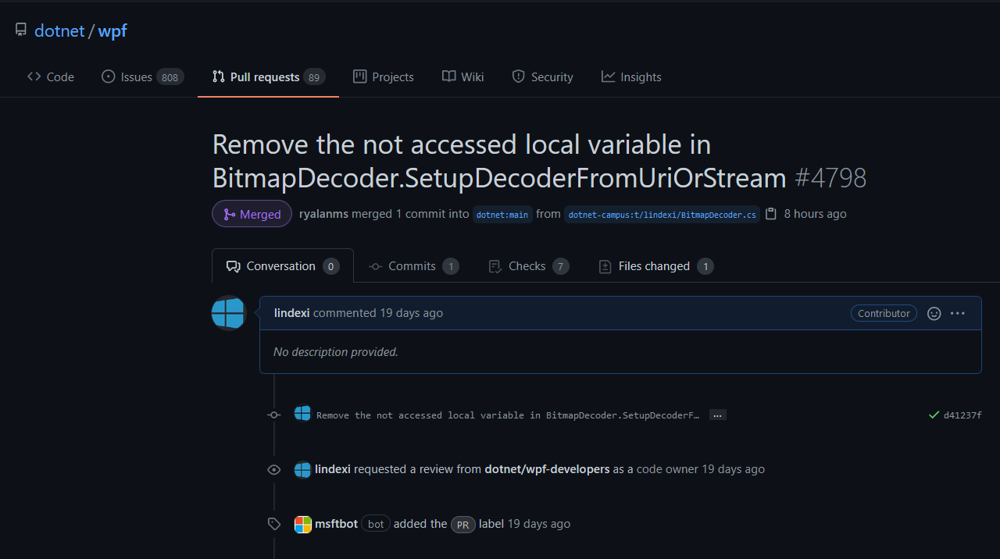 -->

[Remove the not accessed local variable in BitmapDecoder.SetupDecoderFromUriOrStream by lindexi · Pull Request #4798 · dotnet/wpf](https://github.com/dotnet/wpf/pull/4798 )

<!-- 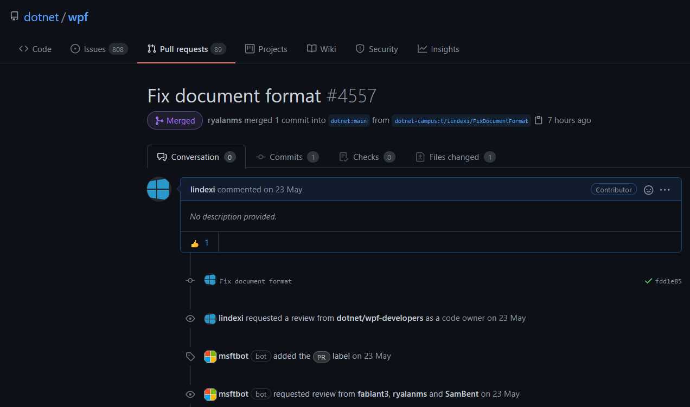 -->

[Fix document format by lindexi · Pull Request #4557 · dotnet/wpf](https://github.com/dotnet/wpf/pull/4557 )

<!-- 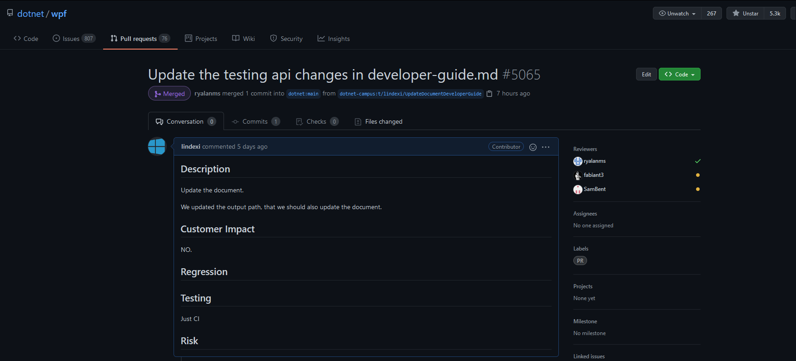 -->

[Update the testing api changes in developer-guide.md by lindexi · Pull Request #5065 · dotnet/wpf](https://github.com/dotnet/wpf/pull/5065)

<!-- 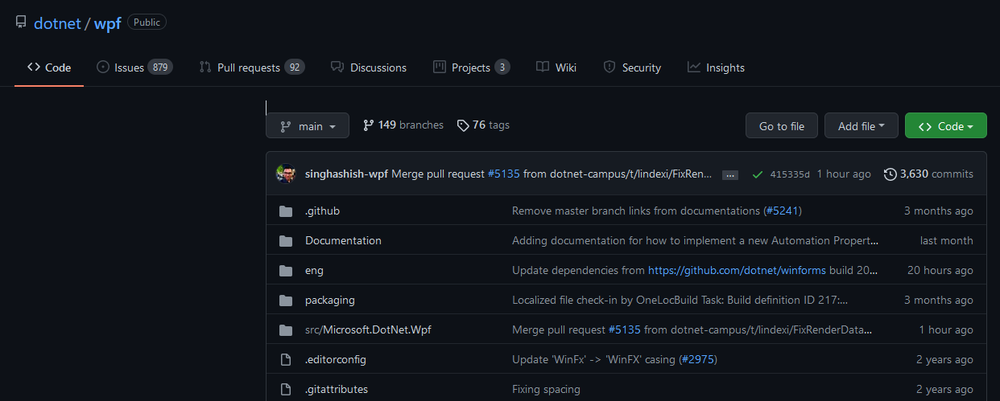 -->

[Fix typo in RenderDataDrawingContext comment by lindexi · Pull Request #5135 · dotnet/wpf](https://github.com/dotnet/wpf/pull/5135 )

只是修复注释的语法

## OpenXML SDK

水到非官方开发者了

### API

[Add TryGetPartById by lindexi · Pull Request #714 · OfficeDev/Open-XML-SDK](https://github.com/OfficeDev/Open-XML-SDK/pull/714 )

### 性能优化

[Use Cache.ReadOnlyCollection for OpenXmlDomReader.Attributes by lindexi · Pull Request #705 · OfficeDev/Open-XML-SDK](https://github.com/OfficeDev/Open-XML-SDK/pull/705 )

[Add Benchmark for create metadata by lindexi · Pull Request #764 · OfficeDev/Open-XML-SDK](https://github.com/OfficeDev/Open-XML-SDK/pull/764 )

[Reduce property acquisition and repeated call methods by lindexi · Pull Request #788 · OfficeDev/Open-XML-SDK](https://github.com/OfficeDev/Open-XML-SDK/pull/788 )

[Small performance improvements for AddNamespaceDeclaration by lindexi · Pull Request #789 · OfficeDev/Open-XML-SDK](https://github.com/OfficeDev/Open-XML-SDK/pull/789 )

### 文档

[Remove unnecessary code by lindexi · Pull Request #742 · OfficeDev/Open-XML-SDK](https://github.com/OfficeDev/Open-XML-SDK/pull/742 )

[Remove unused ElementLookup.Contains method by lindexi · Pull Request #757 · OfficeDev/Open-XML-SDK](https://github.com/OfficeDev/Open-XML-SDK/pull/757 )

[Fix typo by lindexi · Pull Request #769 · OfficeDev/Open-XML-SDK](https://github.com/OfficeDev/Open-XML-SDK/pull/769 )

[Fix comment typo by lindexi · Pull Request #775 · OfficeDev/Open-XML-SDK](https://github.com/OfficeDev/Open-XML-SDK/pull/775 )

[Fix the typo in comment. by lindexi · Pull Request #785 · OfficeDev/Open-XML-SDK](https://github.com/OfficeDev/Open-XML-SDK/pull/785 )

<!-- 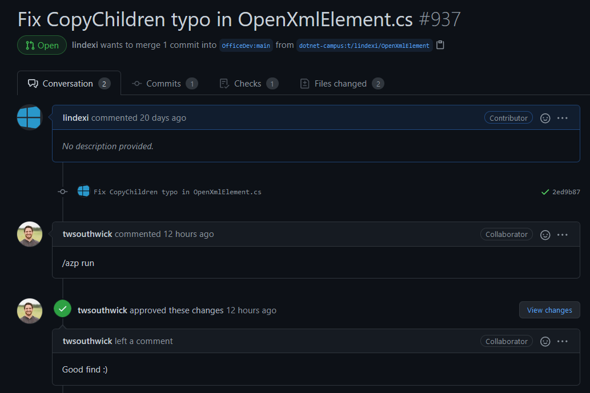 -->

[Fix CopyChildren typo in OpenXmlElement.cs by lindexi · Pull Request #937 · OfficeDev/Open-XML-SDK](https://github.com/OfficeDev/Open-XML-SDK/pull/937 )

<!-- 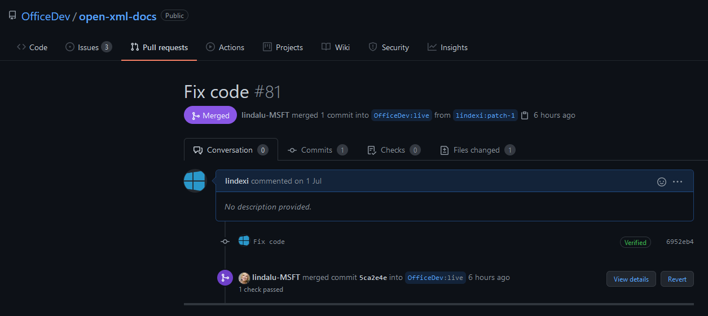 -->

[Fix code by lindexi · Pull Request #81 · OfficeDev/open-xml-docs](https://github.com/OfficeDev/open-xml-docs/pull/81 )

## Xamarin Forms

### 修坑

[Fix the memory leak problem of ListViewRenderer headerRenderer by lindexi · Pull Request #11699 · xamarin/Xamarin.Forms](https://github.com/xamarin/Xamarin.Forms/pull/11699 )

## samples

https://github.com/dotnet/samples/pull/299

https://github.com/dotnet/samples/pull/308

https://github.com/dotnet/samples/pull/516

https://github.com/dotnet/samples/pull/517

https://github.com/dotnet/samples/pull/518

https://github.com/dotnet/samples/pull/524

https://github.com/dotnet/samples/pull/539

https://github.com/dotnet/samples/pull/541

https://github.com/dotnet/samples/pull/542

https://github.com/dotnet/samples/pull/561

https://github.com/dotnet/samples/pull/602

https://github.com/dotnet/samples/pull/634

https://github.com/dotnet/samples/pull/745

[Fix compile by lindexi · Pull Request #741 · dotnet/samples](https://github.com/dotnet/samples/pull/741 )

[Fix align by lindexi · Pull Request #654 · dotnet/samples](https://github.com/dotnet/samples/pull/654 )

[Fix code format by lindexi · Pull Request #696 · dotnet/samples](https://github.com/dotnet/samples/pull/696 )

[Fix code format by lindexi · Pull Request #854 · dotnet/samples](https://github.com/dotnet/samples/pull/854 )

[Environment.FailFast Method (System)](https://docs.microsoft.com/en-us/dotnet/api/system.environment.failfast)

[Fix code format by lindexi · Pull Request #1011 · dotnet/samples](https://github.com/dotnet/samples/pull/1011 )

[Fix code format by lindexi · Pull Request #1065 · dotnet/samples](https://github.com/dotnet/samples/pull/1065 )

[Assembly.GetType Method (System.Reflection)](https://docs.microsoft.com/en-us/dotnet/api/system.reflection.assembly.gettype?view=netframework-4.8 )

## dotnet docs

[Update inheritance.md by lindexi · Pull Request #10669 · dotnet/docs](https://github.com/dotnet/docs/pull/10669 )

[Fix typo by lindexi · Pull Request #9499 · dotnet/docs](https://github.com/dotnet/docs/pull/9499 )

## nuget

[Update nuspec.md by lindexi · Pull Request #1316 · NuGet/docs.microsoft.com-nuget](https://github.com/NuGet/docs.microsoft.com-nuget/pull/1316 )

## visualstudio-docs

[Fix code by lindexi · Pull Request #2309 · MicrosoftDocs/visualstudio-docs](https://github.com/MicrosoftDocs/visualstudio-docs/pull/2309 )

[Fix code by lindexi · Pull Request #2503 · MicrosoftDocs/visualstudio-docs](https://github.com/MicrosoftDocs/visualstudio-docs/pull/2503 )

## winrt-api

[Fix code format by lindexi · Pull Request #773 · MicrosoftDocs/winrt-api](https://github.com/MicrosoftDocs/winrt-api/pull/773 )

[Fix code format by lindexi · Pull Request #772 · MicrosoftDocs/winrt-api](https://github.com/MicrosoftDocs/winrt-api/pull/772 )

## windows-uwp

[Fix align by lindexi · Pull Request #1357 · MicrosoftDocs/windows-uwp](https://github.com/MicrosoftDocs/windows-uwp/pull/1357 )

[Fix format by lindexi · Pull Request #1423 · MicrosoftDocs/windows-uwp](https://github.com/MicrosoftDocs/windows-uwp/pull/1423 )

## [xamarin-docs.zh-cn](https://github.com/MicrosoftDocs/xamarin-docs.zh-cn/commits/live)

- [Update database.md by lindexi · Pull Request #73 · MicrosoftDocs/xamarin-docs.zh-cn](https://github.com/MicrosoftDocs/xamarin-docs.zh-cn/pull/73 )
- [Update styling.md by lindexi · Pull Request #74 · MicrosoftDocs/xamarin-docs.zh-cn](https://github.com/MicrosoftDocs/xamarin-docs.zh-cn/pull/74 )
- [Update deepdive.md by lindexi · Pull Request #75 · MicrosoftDocs/xamarin-docs.zh-cn](https://github.com/MicrosoftDocs/xamarin-docs.zh-cn/pull/75 )

## HandyControl

[Improve Deque initialization performance by lindexi · Pull Request #435 · HandyOrg/HandyControl](https://github.com/HandyOrg/HandyControl/pull/435 )

[Add InputClickHelper by lindexi · Pull Request #414 · HandyOrg/HandyControl](https://github.com/HandyOrg/HandyControl/pull/414 )

[Make the locker as readonly by lindexi · Pull Request #413 · HandyOrg/HandyControl](https://github.com/HandyOrg/HandyControl/pull/413 )

[Use const replace magic number by lindexi · Pull Request #412 · HandyOrg/HandyControl](https://github.com/HandyOrg/HandyControl/pull/412 )

[加上给 Grid 行列命名绑定的辅助方法 by lindexi · Pull Request #770 · HandyOrg/HandyControl](https://github.com/HandyOrg/HandyControl/pull/770 )

## Avalonia

[Fix 1533 Avoid throwing exception in TryReadDouble by lindexi · Pull Request #1534 · AvaloniaUI/Avalonia](https://github.com/AvaloniaUI/Avalonia/pull/1534 )

[Improve tiny performance by lindexi · Pull Request #1472 · AvaloniaUI/Avalonia](https://github.com/AvaloniaUI/Avalonia/pull/1472 )

[Dispatcher's InvokeAsync check action is null #1400 by lindexi · Pull Request #1401 · AvaloniaUI/Avalonia](https://github.com/AvaloniaUI/Avalonia/pull/1401 )

[add some comment by lindexi · Pull Request #1396 · AvaloniaUI/Avalonia](https://github.com/AvaloniaUI/Avalonia/pull/1396 )

## JasonStein Notepads

[Added zh-CN translation by lindexi · Pull Request #32 · JasonStein/Notepads](https://github.com/JasonStein/Notepads/pull/32 )

## [Orleans.MultiClient](https://github.com/OrleansContrib/Orleans.MultiClient)

[https://github.com/OrleansContrib/Orleans.MultiClient/pull/3](https://github.com/OrleansContrib/Orleans.MultiClient/pull/3)

## Castle.Core 

[Update date by lindexi · Pull Request #523 · castleproject/Core](https://github.com/castleproject/Core/pull/523 )

## NewLife.RocketMQ

### 文档

[加上 PackageProjectUrl 链接 by lindexi · Pull Request #14 · NewLifeX/NewLife.RocketMQ](https://github.com/NewLifeX/NewLife.RocketMQ/pull/14 )

## MultiTouchVista

[Format doc by lindexi · Pull Request #2 · nesherhh/MultiTouchVista](https://github.com/nesherhh/MultiTouchVista/pull/2 )

[Format doc by lindexi · Pull Request #1 · nesherhh/MultiTouchVista](https://github.com/nesherhh/MultiTouchVista/pull/1 )

## JitBench 

[Fix the link by lindexi · Pull Request #93 · aspnet/JitBench](https://github.com/aspnet/JitBench/pull/93 )

## [dotnet iot](https://github.com/dotnet/iot)

代码审查 [Fixing DHT issues, adding and adjusting documentation by Ellerbach · Pull Request #1164 · dotnet/iot](https://github.com/dotnet/iot/pull/1164 )

<!--  -->

## 鸿蒙的文档

<!--  -->

[相机开发 示例开发2 链接失效 · Issue #I1UW33 · OpenHarmony/docs - Gitee.com](https://gitee.com/openharmony/docs/issues/I1UW33 )