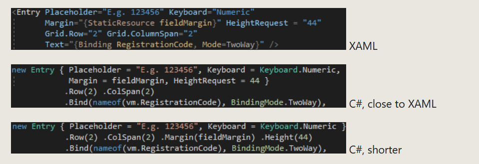

# 开源项目

这是我收藏的开源项目

<!--more-->
<!-- CreateTime:2020/2/29 11:32:39 -->

<!-- csdn -->
<div id="toc"></div>

## 无需代码的代码级调试工具

[0xd4d/dnSpy: .NET debugger and assembly editor](https://github.com/0xd4d/dnSpy )

无需代码的代码级调试工具，打开简直就是一个只带有调试器的VS


附加现有的.NET程序，然后自己反编译出需要调试的代码。隐约觉得，这个可以成为远程调试客户问题的大杀器


## 如何检查一个pdb是否匹配一个dll 

[MetadataTools/Pdb at master · KirillOsenkov/MetadataTools](https://github.com/KirillOsenkov/MetadataTools/tree/master/Pdb )


## UI 界面

### DirectX12GameEngine

[Aminator/DirectX12GameEngine: DirectX 12 .NET game engine](https://github.com/Aminator/DirectX12GameEngine )

### MPF

[sunnycase/MPF: A GUI Framework for .Net Core / 运行于 .Net Core 的 GUI 框架](https://github.com/sunnycase/MPF )

### nuklear

使用 C98 写的小型的 GUI 开发库，使用纯 C 语言开发，所有代码都写在一个头文件里，没有依赖库

[vurtun/nuklear: A single-header ANSI C gui library](https://github.com/vurtun/nuklear )


### GuiLite

GuiLite（超轻量UI框架）是6千行代码的全平台UI框架，可以完美运行在iOS，Android，Windows（包含VR），Mac，单片机和市面所有的 ARM Linux物联网终端设备上

[idea4good/GuiLite: Build UI framework for all platform with 5,000 lines code](https://github.com/idea4good/GuiLite )

### LCUI

面向 C 的图形界面开发库，可借助 XML 和 CSS 构建简单的跨平台桌面应用

[lc-soft/LCUI: A small C library for building user interfaces with C, XML and CSS.](https://github.com/lc-soft/LCUI ) 

### veldrid

[mellinoe/veldrid: A low-level, portable graphics and compute library for .NET.](https://github.com/mellinoe/veldrid )

### FlysEngine

[sdcb/FlysEngine: Real-time 2D rendering utilities based on SharpDX/Direct2D](https://github.com/sdcb/FlysEngine )

### CPF

[造轮子了！NETCore跨平台UI框架，CPF - DSkin - 博客园](https://www.cnblogs.com/dskin/archive/2019/10/25/11740751.html )

### DirectX12GameEngine

[Aminator/DirectX12GameEngine: DirectX 12 .NET game engine](https://github.com/Aminator/DirectX12GameEngine )

## JustinXinLiu 的项目

[Continuity/Sample.KlivaDesign at master · JustinXinLiu/Continuity](https://github.com/JustinXinLiu/Continuity/tree/master/Sample.KlivaDesign )


## P2P 库

[johnynek/brunet: a P2P library developed at the University of Florida](https://github.com/johnynek/brunet )

[RevenantX/LiteNetLib: Lite reliable UDP library for Mono and .NET](https://github.com/RevenantX/LiteNetLib )


## WPF 界面库

### EASkins

[EASkins: .NET WinForm 和 WPF 的UI界面库，收集整合多个优秀库及示例。](https://gitee.com/airscrat/EASkins )

### MahApps.Metro

[MahApps/MahApps.Metro: A toolkit for creating Metro / Modern UI styled WPF apps.](https://github.com/MahApps/MahApps.Metro )

### HandyControl

[HandyOrg/HandyControl: Contains some simple and commonly used WPF controls](https://github.com/HandyOrg/HandyControl )


QQ 群 714704041

### Panuon UI

[Panuon/PanuonUI.Silver: Panuon.UI optimized version. A beautiful wpf ui library using templates & attached properties.](https://github.com/Panuon/PanuonUI.Silver )


QQ 群 718778191

### Fluent.Ribbon

就像 Office 的按钮

[fluentribbon/Fluent.Ribbon: WPF Ribbon control like in Office](https://github.com/fluentribbon/Fluent.Ribbon )

### WPFTOOLS

[WPFTOOLS: 基于NET4使用WPF开发界面库控件](https://gitee.com/chenhome/WPFTOOLS )

### WPF 控件

[lvaleriu/Virtualization: Data virtualization in WPF, UI virtualization - Credits go to Bea Stollnitz, Paul McClean and Vincent Van Den Berghe for their implementations](https://github.com/lvaleriu/Virtualization ) 数据虚拟化

[jiaze.li/RadarControl WPF 雷达扫描图控件、雷达属性图控件](https://gitee.com/jiaze.li/RadarControl )

### mui

[firstfloorsoftware/mui: Modern UI for WPF](https://github.com/firstfloorsoftware/mui )

### SuggestBoxLib


[Dirkster99/SuggestBoxLib: A WPF Dark/Light AutoComplete TextBox that can easily handle 20.000+ entries.](https://github.com/Dirkster99/SuggestBoxLib )

### InteractiveDataDisplay

轻松绘制图表

[microsoft/InteractiveDataDisplay.WPF: Interactive Data Display for WPF is a set of controls for adding interactive visualization of dynamic data to your application. It allows to create line graphs, bubble charts, heat maps and other complex 2D plots which are very common in scientific software. Interactive Data Display for WPF integrates well with Bing Maps control to show data on a geographic map in latitude/longitude coordinates. The controls can also be operated programmatically.](https://github.com/microsoft/InteractiveDataDisplay.WPF )

### 屏幕软键盘

[sketchpunk/openkeyboard: Virtual keyboard with dynamic user defined layouts](https://github.com/sketchpunk/openkeyboard )

## UWP 控件

### 图片裁剪

[[UWP]如何实现UWP平台最佳图片裁剪控件 - HHChaos - 博客园](https://www.cnblogs.com/hhchaos/archive/2018/11/26/10021952.html )

[UWP 图片剪切旋转工具 - 法的空间 - 博客园](https://www.cnblogs.com/FaDeKongJian/p/5571386.html?tdsourcetag=s_pctim_aiomsg )

## UWP dump 文件

[Wunkolo/UWPDumper: DLL and Injector for dumping UWP applications at run-time to bypass encrypted file system protection.](https://github.com/Wunkolo/UWPDumper )


## XAML

### CSharpForMarkup

[VincentH-Net/CSharpForMarkup: Use declarative style C# instead of XAML for Xamarin Forms UI](https://github.com/VincentH-Net/CSharpForMarkup )

<!--  -->


### AmmyUI

[AmmyUI/AmmyUI: Ammy language repository](https://github.com/AmmyUI/AmmyUI )

```csharp
Window "MyApp.MainWindow" 
{
  Title: "My first Application"

  Grid 
  {
    TextBlock { "Hello, World!" }
  }
}
```


## dotnet

### dotnet 高级数据结构和算法库

包含 Avl tree 平衡二叉查找树，大量排序算法，红黑树，和 B 树等，还有图计算

[justcoding121/Advanced-Algorithms: 100+ algorithms & data structures generically implemented in C#.](https://github.com/justcoding121/Advanced-Algorithms )

### MailKit 邮件相关

[jstedfast/MailKit: A cross-platform .NET library for IMAP, POP3, and SMTP.](https://github.com/jstedfast/MailKit )

### 轻容器

[seesharper/LightInject: An ultra lightweight IoC container](https://github.com/seesharper/LightInject )

```csharp
container.Register<IFoo, Foo>();
var instance = container.GetInstance<IFoo>();
Assert.IsInstanceOfType(instance, typeof(Foo));
```

### 中文解析通用工具

[zmjack/Chinese: 中文解析通用工具。包括拼音，简繁转换，数字读法，货币读法。](https://github.com/zmjack/Chinese )

## Windows 代码

[markjandrews/wrk-v1.2: Windows Research Kernel](https://github.com/markjandrews/wrk-v1.2 )


## 博客

[Django搭建个人博客](https://www.dusaiphoto.com/article/detail/2/ )

[《Effective Modern C++》翻译](https://github.com/kelthuzadx/EffectiveModernCppChinese )

[FancyVin/fun-with-graphics: 这里整理了图形学相关的高校课程、书籍、教程、文章、博客、资源、开源项目。](https://github.com/FancyVin/fun-with-graphics )


## 项目

[microsoft/PowerToys: Windows system utilities to maximize productivity](https://github.com/microsoft/PowerToys )

### Smobiler

[Smobiler-.Net移动开发平台](https://www.smobiler.com/ ) 只需一个.NET开发人员即可独立完成整个企业移动应用 
从开发、打包、部署的整个生命周期 

### 调试工具

[Hero3821/HttpTool: 一款简约的Http请求工具](https://github.com/Hero3821/HttpTool?tdsourcetag=s_pctim_aiomsg )


### 集成开发环境

[PandaX Studio: WPF + C#开发的php集成开发环境](https://gitee.com/aboutlong/pandaxstudio )

### 聊天工具

[DuckChat官网 独立部署的聊天系统](https://duckchat.akaxin.com/ )

### 图片库

[DataDink/Bumpkit: A .NET imaging library that extends System.Drawing functionality](https://github.com/DataDink/Bumpkit )

### nps

[cnlh/nps: 一款轻量级、功能强大的内网穿透代理服务器。支持tcp、udp流量转发，支持内网http代理、内网socks5代理，同时支持snappy压缩、站点保护、加密传输、多路复用、header修改等。支持web图形化管理，集成多用户模式。](https://github.com/cnlh/nps )

### v2rayN

[2dust/v2rayN](https://github.com/2dust/v2rayN )

### MathewSachin Captura

[MathewSachin/Captura: Capture Screen, Audio, Cursor, Mouse Clicks and Keystrokes](https://github.com/MathewSachin/Captura )

### URL 缩短器

使用 Azure Function 部署

[FBoucher/AzUrlShortener: An simple and easy Url Shortener](https://github.com/FBoucher/AzUrlShortener )

## RayTracing

[pg7go/RayTracing: C# RayTracing，一个基于.Net Core 的光线追踪项目，Ray Tracing in One Weekend 实践](https://github.com/pg7go/RayTracing )

## 日志

[Cysharp/ZLogger: Zero Allocation Text/Strcutured Logger for .NET Core and Unity, built on top of a Microsoft.Extensions.Logging.](https://github.com/Cysharp/ZLogger/ )

<a rel="license" href="http://creativecommons.org/licenses/by-nc-sa/4.0/"></a><br />本作品采用<a rel="license" href="http://creativecommons.org/licenses/by-nc-sa/4.0/">知识共享署名-非商业性使用-相同方式共享 4.0 国际许可协议</a>进行许可。欢迎转载、使用、重新发布，但务必保留文章署名[林德熙](http://blog.csdn.net/lindexi_gd)(包含链接:http://blog.csdn.net/lindexi_gd )，不得用于商业目的，基于本文修改后的作品务必以相同的许可发布。如有任何疑问，请与我[联系](mailto:lindexi_gd@163.com)。  