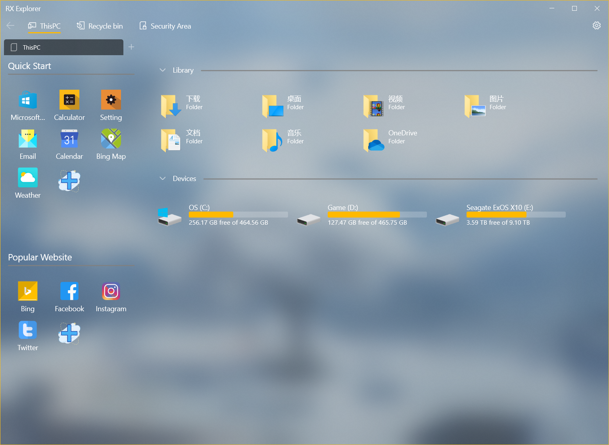
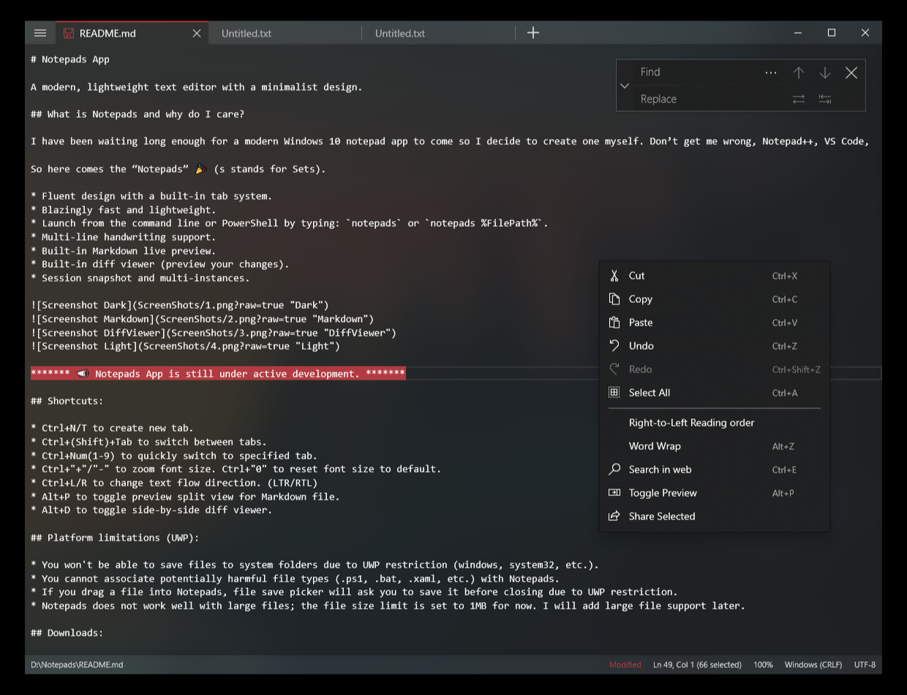
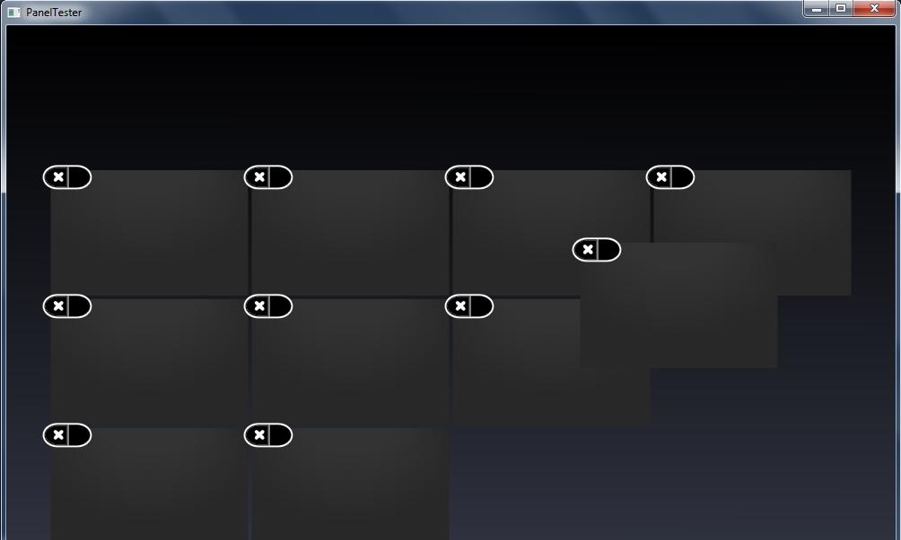
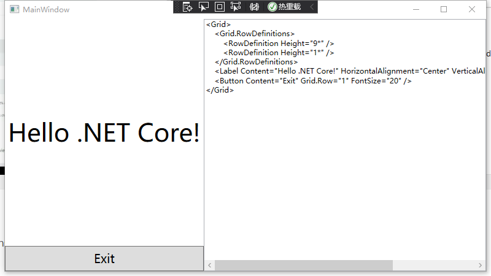
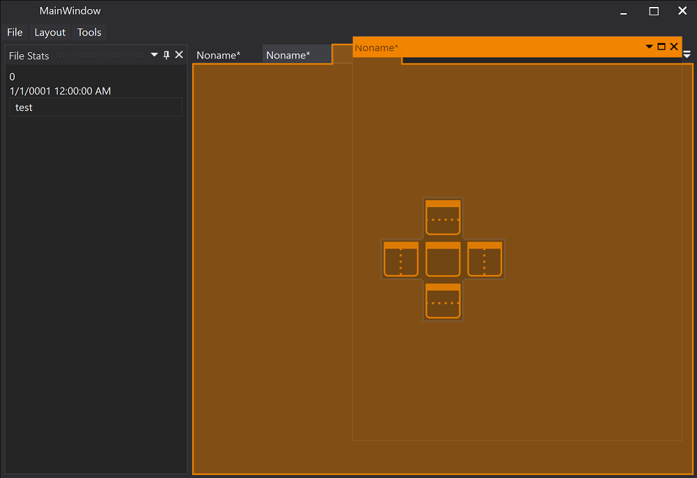
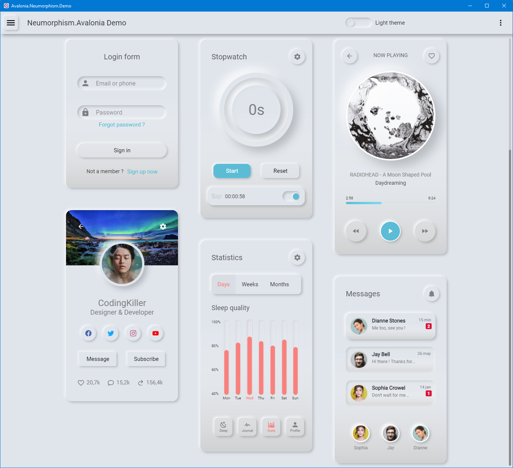
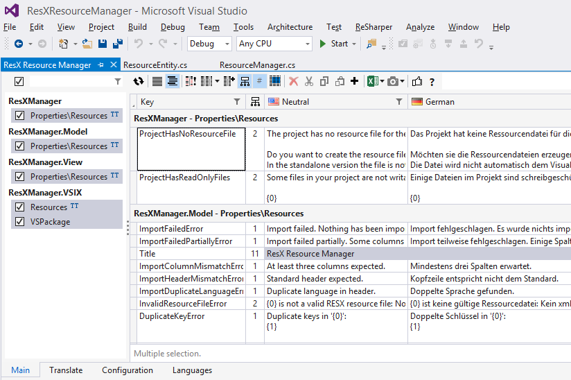
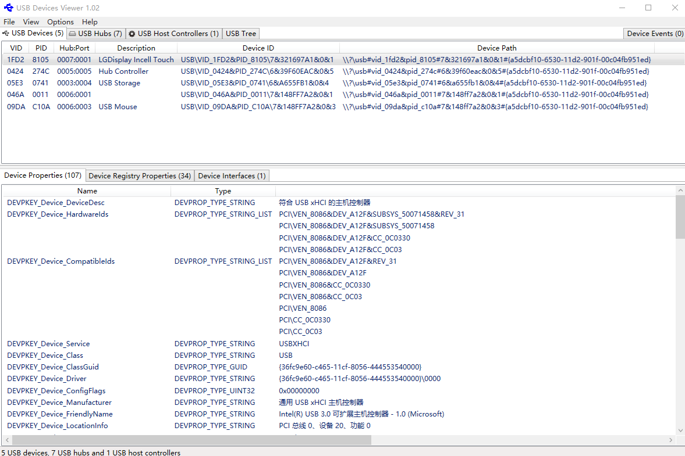
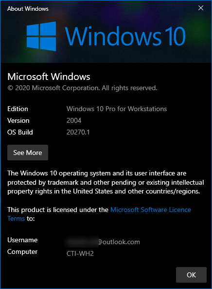

# 开源项目

这是我收藏的开源项目

<!--more-->
<!-- CreateTime:2020/2/29 11:32:39 -->

<!-- csdn -->
<div id="toc"></div>

## 强力推荐

以下都是可以用的软件和工具

### 无需代码的代码级调试工具

[0xd4d/dnSpy: .NET debugger and assembly editor](https://github.com/0xd4d/dnSpy )

无需代码的代码级调试工具，打开简直就是一个只带有调试器的 VS 神器


附加现有的.NET程序，然后自己反编译出需要调试的代码。隐约觉得，这个可以成为远程调试客户问题的大杀器

### RX-Explorer

<!--  -->


[zhuxb711/RX-Explorer: 一款轻量的UWP文件管理器](https://github.com/zhuxb711/RX-Explorer )

### Notepads

特别漂亮也特别清真的编辑器

<!--  -->


[JasonStein/Notepads: A modern, lightweight text editor with a minimalist design.](https://github.com/JasonStein/Notepads )

### v2rayN

[2dust/v2rayN](https://github.com/2dust/v2rayN )

### osu

漂亮的音乐游戏

[ppy/osu: rhythm is just a *click* away!](https://github.com/ppy/osu )

### NETworkManager

网络工具箱


[BornToBeRoot/NETworkManager: A powerful tool for managing networks and troubleshoot network problems!](https://github.com/BornToBeRoot/NETworkManager )


## UI 框架

### Windows Forms

[dotnet/winforms: Windows Forms is a .NET UI framework for building Windows desktop applications.](https://github.com/dotnet/winforms )

### WPF

[dotnet/wpf: WPF is a .NET Core UI framework for building Windows desktop applications.](https://github.com/dotnet/wpf/ )

### MAUI

[dotnet/maui: .NET MAUI is the .NET Multi-platform App UI, a framework for building native device applications spanning mobile, tablet, and desktop.](https://github.com/dotnet/maui )

### MAUI Linux

[jsuarezruiz/maui-linux: .NET MAUI is the .NET Multi-platform App UI, a framework for building native device applications spanning mobile, tablet, and desktop.](https://github.com/jsuarezruiz/maui-linux )


### CPF

[造轮子了！NETCore跨平台UI框架，CPF - DSkin - 博客园](https://www.cnblogs.com/dskin/archive/2019/10/25/11740751.html )

### Wice

一个纯 C# 实现的 UI 框架，完全自己实现，无依赖

非 WPF 和 WinForms 和 UWP 框架，完全自己实现的 UI 框架

[aelyo-softworks/Wice: Windows Interface Composition Engine is a .NET C# UI engine for creating Windows application.](https://github.com/aelyo-softworks/Wice )

### Eto

[picoe/Eto: Cross platform GUI framework for desktop and mobile applications in .NET](https://github.com/picoe/Eto )

### Core2D

基于 Avalonia 实现的跨平台 2D 图形编辑应用，基于 MIT 协议完全开源

[wieslawsoltes/Core2D: A multi-platform data driven 2D diagram editor.](https://github.com/wieslawsoltes/Core2D )


## 渲染框架

### DirectX12GameEngine

[Aminator/DirectX12GameEngine: DirectX 12 .NET game engine](https://github.com/Aminator/DirectX12GameEngine )

<!-- ### MPF

[sunnycase/MPF: A GUI Framework for .Net Core / 运行于 .Net Core 的 GUI 框架](https://github.com/sunnycase/MPF ) -->

### nuklear

使用 C98 写的小型的 GUI 开发库，使用纯 C 语言开发，所有代码都写在一个头文件里，没有依赖库

[Immediate-Mode-UI/Nuklear: A single-header ANSI C immediate mode cross-platform GUI library](https://github.com/Immediate-Mode-UI/Nuklear )


### GuiLite

GuiLite（超轻量UI框架）是6千行代码的全平台UI框架，可以完美运行在iOS，Android，Windows（包含VR），Mac，单片机和市面所有的 ARM Linux物联网终端设备上

[idea4good/GuiLite: Build UI framework for all platform with 5,000 lines code](https://github.com/idea4good/GuiLite )

### LCUI

面向 C 的图形界面开发库，可借助 XML 和 CSS 构建简单的跨平台桌面应用

[lc-soft/LCUI: A small C library for building user interfaces with C, XML and CSS.](https://github.com/lc-soft/LCUI ) 

### veldrid

[mellinoe/veldrid: A low-level, portable graphics and compute library for .NET.](https://github.com/mellinoe/veldrid )

### FlysEngine

[sdcb/FlysEngine: Real-time 2D rendering utilities based on SharpDX/Direct2D](https://github.com/sdcb/FlysEngine )


## 基础图形渲染

### Microsoft.Maui.Graphics

[dotnet/Microsoft.Maui.Graphics](https://github.com/dotnet/Microsoft.Maui.Graphics )

此仓库已合入到 MAUI 主分支

### Silk.NET

[dotnet/Silk.NET: The high-speed OpenGL, OpenCL, OpenAL, OpenXR, GLFW, SDL, Vulkan, Assimp, and DirectX bindings library your mother warned you about.](https://github.com/dotnet/Silk.NET )

### DirectX12GameEngine

[Aminator/DirectX12GameEngine: DirectX 12 .NET game engine](https://github.com/Aminator/DirectX12GameEngine )

### SharpDX

[sharpdx/SharpDX: SharpDX GitHub Repository](https://github.com/sharpdx/SharpDX )

### Vortice.Windows

[amerkoleci/Vortice.Windows: Windows and UWP libraries](https://github.com/amerkoleci/Vortice.Windows )

这是一个从 SharpDx 拿出来的库，将会支持 Win32 和 UWP 平台，现在只有一个主力开发者

### DirectN

[smourier/DirectN: Direct interop Code for .NET Framework, .NET Core and .NET 5+ : DXGI, WIC, DirectX 9 to 12, Direct2D, Direct Write, Direct Composition, Media Foundation, WASAPI, CodecAPI, GDI, Spatial Audio, DVD, Windows Media Player, UWP DXInterop, etc.](https://github.com/smourier/DirectN )

### veldrid

[mellinoe/veldrid: A low-level, portable graphics library for .NET.](https://github.com/mellinoe/veldrid )

### SharpGL

[dwmkerr/sharpgl: Use OpenGL in .NET applications. SharpGL wraps all modern OpenGL features and offers a powerful scene graph to aid development.](https://github.com/dwmkerr/sharpgl)

### TerraFX.Interop.Windows

似乎这个库的完成度很低

[https://github.com/terrafx/terrafx.interop.windows](https://github.com/terrafx/terrafx.interop.windows)


## WPF 界面库

这里有大佬收藏的很多 WPF 库和 UI 控件的项目

[Carlos487/awesome-wpf: A collection of awesome WPF resources, libraries and UI controls.](https://github.com/Carlos487/awesome-wpf )

### HandyControl

[HandyOrg/HandyControl: Contains some simple and commonly used WPF controls](https://github.com/HandyOrg/HandyControl )


QQ 群 714704041

### EASkins

[EASkins: .NET WinForm 和 WPF 的UI界面库，收集整合多个优秀库及示例。](https://gitee.com/airscrat/EASkins )

### MahApps.Metro

[MahApps/MahApps.Metro: A toolkit for creating Metro / Modern UI styled WPF apps.](https://github.com/MahApps/MahApps.Metro )


### Panuon UI

[Panuon/PanuonUI.Silver: Panuon.UI optimized version. A beautiful wpf ui library using templates & attached properties.](https://github.com/Panuon/PanuonUI.Silver )


QQ 群 718778191

### Fluent.Ribbon

就像 Office 的按钮

[fluentribbon/Fluent.Ribbon: WPF Ribbon control like in Office](https://github.com/fluentribbon/Fluent.Ribbon )

### MaterialDesignExtensions

[spiegelp/MaterialDesignExtensions: Material Design Extensions is based on Material Design in XAML Toolkit to provide additional controls and features for WPF apps](https://github.com/spiegelp/MaterialDesignExtensions )

细节请看 [WPF开源控件扩展库 - MaterialDesignExtensions - Dotnet9个人博客 - 博客园](https://www.cnblogs.com/Dotnet9-com/archive/2020/10/15/13823736.html )

### WPFLocalizeExtension

LocalizationExtension is a the easy way to localize any type of DependencyProperties or native Properties on DependencyObjects 

[XAMLMarkupExtensions/WPFLocalizeExtension: LocalizationExtension is a the easy way to localize any type of DependencyProperties or native Properties on DependencyObjects](https://github.com/XAMLMarkupExtensions/WPFLocalizeExtension )


### XamlFlair

非常强大的 WPF 动画库，使用非常方便

[XamlFlair/XamlFlair: XamlFlair is an animation library for UWP, WPF, and Uno, built to facilitate Xaml animations using only attached properties.](https://github.com/XamlFlair/XamlFlair )

### WPFTOOLS

[WPFTOOLS: 基于NET4使用WPF开发界面库控件](https://gitee.com/chenhome/WPFTOOLS )

### waf

[jbe2277/waf: Win Application Framework (WAF) is a lightweight Framework that helps you to create well structured XAML Applications.](https://github.com/jbe2277/waf )

### WPF 控件

[lvaleriu/Virtualization: Data virtualization in WPF, UI virtualization - Credits go to Bea Stollnitz, Paul McClean and Vincent Van Den Berghe for their implementations](https://github.com/lvaleriu/Virtualization ) 数据虚拟化

[jiaze.li/RadarControl WPF 雷达扫描图控件、雷达属性图控件](https://gitee.com/jiaze.li/RadarControl )

[a44281071/SunTaiLibrary: 三台辅助类库](https://github.com/a44281071/SunTaiLibrary )

自动补全的文本框

[quicoli/WPF-AutoComplete-TextBox: An autocomplete TextBox for WPF](https://github.com/quicoli/WPF-AutoComplete-TextBox )

[ratishphilip/wpfspark: A rich UserControl library to enhance the look and feel of WPF applications.](https://github.com/ratishphilip/wpfspark )

[rulyotano/wpf-drag-animated-panel: Panel for WPF that re-order elements when dragging items.](https://github.com/rulyotano/wpf-drag-animated-panel )

<!--  -->


[samhocevar/emoji.wpf: 😸 Emoji support for WPF](https://github.com/samhocevar/emoji.wpf )

### wpfui 提供 Win11 的 UI 风格

这个库的 UI 不错，但是库设计上有些粗糙，性能也有些糟心。作为小工具项目使用不错


[lepoco/wpfui: A simple way to make your application written in WPF keep up with modern design trends.](https://github.com/lepoco/wpfui )

### NodeNetwork


[GitHub - Wouterdek/NodeNetwork: A C# library with a WPF node editor component based on ReactiveUI](https://github.com/Wouterdek/NodeNetwork)

### Math 公式

[ForNeVeR/wpf-math: .NET library for rendering mathematical formulae using the LaTeX typsetting style, for the WPF framework](https://github.com/ForNeVeR/wpf-math )

### 适合 WPF 项目的自动更新

[WELL-E/AutoUpdater: WPF AutoUpdater](https://github.com/WELL-E/AutoUpdater )

### AutoUpdater.NET

[ravibpatel/AutoUpdater.NET: AutoUpdater.NET is a class library that allows .NET developers to easily add auto update functionality to their classic desktop application projects.](https://github.com/ravibpatel/AutoUpdater.NET )


### GeneralUpdate

[GeneralUpdate: GeneralUpdate寓意为通用更新，力致于成为全平台更新组件。](https://gitee.com/Juster-zhu/GeneralUpdate )

### mui

[firstfloorsoftware/mui: Modern UI for WPF](https://github.com/firstfloorsoftware/mui )

### SuggestBoxLib


[Dirkster99/SuggestBoxLib: A WPF Dark/Light AutoComplete TextBox that can easily handle 20.000+ entries.](https://github.com/Dirkster99/SuggestBoxLib )

### InteractiveDataDisplay

轻松绘制图表

[microsoft/InteractiveDataDisplay.WPF: Interactive Data Display for WPF is a set of controls for adding interactive visualization of dynamic data to your application. It allows to create line graphs, bubble charts, heat maps and other complex 2D plots which are very common in scientific software. Interactive Data Display for WPF integrates well with Bing Maps control to show data on a geographic map in latitude/longitude coordinates. The controls can also be operated programmatically.](https://github.com/microsoft/InteractiveDataDisplay.WPF )

### RealTimeGraphX

高性能实时图表库

[royben/RealTimeGraphX: High performance real-time graph for WPF & UWP](https://github.com/royben/RealTimeGraphX )

### ScottPlot


[ScottPlot/ScottPlot: Interactive Plotting Library for .NET](https://github.com/ScottPlot/ScottPlot )

### 屏幕软键盘

[sketchpunk/openkeyboard: Virtual keyboard with dynamic user defined layouts](https://github.com/sketchpunk/openkeyboard )

屏幕键盘

<!--  -->


### wif

wif 一个基础设施框架，可帮助您快速开发WPF应用程序

[LeoYang-Chuese/wif: WPF Infrastructure Framework（WIF）is an infrastructure framework that helps you develop WPF applications quickly.](https://github.com/LeoYang-Chuese/wif )

### 显示XAML代码库

<!--  -->


[dotnet 使用 ShowMeTheXAML 显示 WPF 的 XAML 控件内容](https://blog.lindexi.com/post/dotnet-%E4%BD%BF%E7%94%A8-ShowMeTheXAML-%E6%98%BE%E7%A4%BA-WPF-%E7%9A%84-XAML-%E6%8E%A7%E4%BB%B6%E5%86%85%E5%AE%B9.html )

[https://github.com/Keboo/ShowMeTheXAML](https://github.com/Keboo/ShowMeTheXAML)

### 和 VisualStudio 一样的吸附功能

<!--  -->


[Dirkster99/AvalonDock: Our own development branch of the well known WPF document docking library](https://github.com/Dirkster99/AvalonDock )

### 做和 VisualStudio 一样的吸附容器

[dockpanelsuite/dockpanelsuite: DockPanel Suite - The Visual Studio inspired docking library for .NET WinForms](https://github.com/dockpanelsuite/dockpanelsuite )

### ComputeSharp

[Sergio0694/ComputeSharp: A .NET 5 library to run C# code in parallel on the GPU through DX12 and dynamically generated HLSL compute shaders, with the goal of making GPU computing easy to use for all .NET developers! 🚀](https://github.com/Sergio0694/ComputeSharp )

### WaveFunctionCollapse

相似图形生成


[mxgmn/WaveFunctionCollapse: Bitmap & tilemap generation from a single example with the help of ideas from quantum mechanics](https://github.com/mxgmn/WaveFunctionCollapse )

### 图论控件

[KeRNeLith/GraphShape: GraphShape is a graph layout framework containing several layout algorithms. It also has a customizable module for visualization in WPF applications.](https://github.com/KeRNeLith/GraphShape)

[KeRNeLith/QuikGraph: Generic Graph Data Structures and Algorithms for .NET](https://github.com/KeRNeLith/QuikGraph)

[微软提供布局库 Microsoft Automatic Graph Layout](https://github.com/microsoft/automatic-graph-layout)  

[panthernet/GraphX: GraphX for .NET](https://github.com/panthernet/GraphX)

### ControlzEx

包含一些控件

[ControlzEx/ControlzEx: Shared Controlz for WPF and ... more](https://github.com/ControlzEx/ControlzEx )

### NodeNetwork

提供拖动编辑能力


[Wouterdek/NodeNetwork: A C# library with a WPF node editor component based on ReactiveUI](https://github.com/Wouterdek/NodeNetwork )

### Computator.NET

提供输入的数学公式解析以及图表处理功能，可惜是 GPL 协议


[PawelTroka/Computator.NET: Computator.NET is a special kind of numerical software that is fast and easy to use but not worse than others feature-wise. It's features include: - Real and complex functions charts - Real and complex calculator - Real functions numerical calculations including different methods - Over 107 Elementary functions - Over 141 Special functions - Over 21 Matrix functions and operations - Scripting language with power to easy computations including matrices - You can declare your own custom functions with scripting language](https://github.com/PawelTroka/Computator.NET )

### WPF 框架库 QuickFramework.Wpf 库

Quick框架原则之一是要上手简单，快速开发，尽可能的提供轮子解决WPF开发中的痛点。原则之二是要求开发者遵循框架，但不会将方方面面框死，应该给使用者留有很大自由度，因此不会像领域驱动那样，强迫开发者去用DDD。这个框架不会满足所有人的需求，希望理解它，愿意用的人用之，欢迎提出宝贵意见，不喜欢用的人也不要喷，每个框架的关注重点不一样，还是我上面说的众口难调。即使像Abp框架这样看似强大的框架，也有很多人不买账，它的缺点恰恰就是过于强大，过于解耦，太重了，忽视了开发的便利性

[Quick.Framework: A rapid development framework for WPF.](https://gitee.com/cvbox/Quick.Framework )

QQ交流群：196554374

### MdXaml

MdXaml is a modify version of Markdown.Xaml. It can convert Markdown to FlowDocument of WPF.

```xml
<Window x:Class="HeredocSample.MainWindow"
        xmlns="http://schemas.microsoft.com/winfx/2006/xaml/presentation"
        xmlns:x="http://schemas.microsoft.com/winfx/2006/xaml"
        xmlns:mdxam="clr-namespace:MdXaml;assembly=MdXaml"
        Title="MainWindow" Height="450" Width="800">

    <mdxam:MarkdownScrollViewer xml:space="preserve">
        # sample title
        * document1
            * two
            * three
        * document2
    </mdxam:MarkdownScrollViewer>
</Window>
```

[whistyun/MdXaml: Markdown for WPF - alternate version of Markdown.Xaml](https://github.com/whistyun/MdXaml )

### Neumorphism.Avalonia

提供给 Avalonia 的界面库

<!--  -->


[flarive/Neumorphism.Avalonia: Neumorphism UI theme for Avalonia apps](https://github.com/flarive/Neumorphism.Avalonia )

[kikipoulet/SukiUI: UI Theme for AvaloniaUI](https://github.com/kikipoulet/SukiUI )

### Notifications.Wpf

提供通知功能，任务栏通知功能


[Federerer/Notifications.Wpf: Toast notifications for WPF](https://github.com/Federerer/Notifications.Wpf )

### DiffPlex 文本比较库

提供找不同的功能，支持中文英文日文，支持单词找不同和行找不同

界面效果请看 [文本比较组件DiffPlex - 挖穿地球😁 - 博客园](https://www.cnblogs.com/dreamos/p/15245469.html)

[https://github.com/mmanela/diffplex](https://github.com/mmanela/diffplex)


## MAUI 界面库

[enisn/UraniumUI: Uranium is a Free & Open-Source UI Kit for MAUI.](https://github.com/enisn/UraniumUI )

[enisn/Xamarin.Forms.InputKit: CheckBox, Radio Button, Labeled Slider, Dropdowns etc.](https://github.com/enisn/Xamarin.Forms.InputKit )

## UI 测试库

### FlaUI

可以如以下代码方式进行界面测试

```csharp
using FlaUI.Core.AutomationElements;
using FlaUI.UIA3;

// Note: Works only pre-Windows 8 with the legacy calculator
var app = FlaUI.Core.Application.Launch("calc.exe");
using (var automation = new UIA3Automation())
{
  var window = app.GetMainWindow(automation);
  var button1 = window.FindFirstDescendant(cf => cf.ByText("1"))?.AsButton();
  button1?.Invoke();
}
```

[FlaUI/FlaUI: UI automation library for .Net](https://github.com/FlaUI/FlaUI )

### 支持中文用例的界面单元测试框架

dotnetCampus.UITest.WPF 一个支持中文用例的界面单元测试框架

```csharp
    [TestClass]
    public class DemoTest
    {
        [UIContractTestCase]
        public void TestAsyncLoad()
        {
            "等待窗口显示出来，可以成功进行异步等待，不会锁主线程".Test(async () =>
            {
                var mainWindow = new MainWindow();
                var taskCompletionSource = new TaskCompletionSource();
                mainWindow.Loaded += (sender, args) => taskCompletionSource.SetResult();
                await mainWindow.Dispatcher.InvokeAsync(mainWindow.Show);
                await taskCompletionSource.Task;
            });
        }
    }
```

[dotnetCampus.UITest.WPF 一个支持中文用例的界面单元测试框架](https://blog.lindexi.com/post/dotnetCampus.UITest.WPF-%E4%B8%80%E4%B8%AA%E6%94%AF%E6%8C%81%E4%B8%AD%E6%96%87%E7%94%A8%E4%BE%8B%E7%9A%84%E7%95%8C%E9%9D%A2%E5%8D%95%E5%85%83%E6%B5%8B%E8%AF%95%E6%A1%86%E6%9E%B6.html )

[dotnet-campus/CUnit: CUnit is short for Contracted Unit Test which means you only specify the contracts of a method then you can get the unit test results of the contracts. (或者你也可以称 Chinese Unit Test)](https://github.com/dotnet-campus/CUnit/ )


## 多语言管理

<!--  -->


[dotnet/ResXResourceManager: Manage localization of all ResX-Based resources in one central place.](https://github.com/dotnet/ResXResourceManager )


## UWP 控件

### 图片裁剪

[[UWP]如何实现UWP平台最佳图片裁剪控件 - HHChaos - 博客园](https://www.cnblogs.com/hhchaos/archive/2018/11/26/10021952.html )

[UWP 图片剪切旋转工具 - 法的空间 - 博客园](https://www.cnblogs.com/FaDeKongJian/p/5571386.html?tdsourcetag=s_pctim_aiomsg )

## UWP dump 文件

[Wunkolo/UWPDumper: DLL and Injector for dumping UWP applications at run-time to bypass encrypted file system protection.](https://github.com/Wunkolo/UWPDumper )


## XAML

### CSharpForMarkup

[VincentH-Net/CSharpForMarkup: Use declarative style C# instead of XAML for Xamarin Forms UI](https://github.com/VincentH-Net/CSharpForMarkup )

<!--  -->


### AmmyUI

[AmmyUI/AmmyUI: Ammy language repository](https://github.com/AmmyUI/AmmyUI )

```csharp
Window "MyApp.MainWindow" 
{
  Title: "My first Application"

  Grid 
  {
    TextBlock { "Hello, World!" }
  }
}
```

### [DingpingZhang WpfExtensions](https://github.com/DingpingZhang/WpfExtensions )

```xml
<Element Command={markup:Command Execute} />
<Element Command={markup:Command ExecuteWithArgumentAsync, CanExecute}
         CommandParameter={Binding Argument} />

<Button Command="{markup:If {Binding BoolProperty},
                            {Binding OkCommand},
                            {Binding CancelCommand}}" />

<UserControl>
    <markup:If Condition="{Binding IsLoading}">
        <markup:If.True>
            <views:LoadingView />
        </markup:If.True>
        <markup:If.False>
            <views:LoadedView />
        </markup:If.False>
    </markup:If>
</UserControl>


<Image Source="{markup:Switch {Binding FileType},
                              {Case {x:Static res:FileType.Music}, {StaticResource MusicIcon}},
                              {Case {x:Static res:FileType.Video}, {StaticResource VideoIcon}},
                              {Case {x:Static res:FileType.Picture}, {StaticResource PictureIcon}},
                              ...
                              {Case {StaticResource UnknownFileIcon}}}" />
```

[DingpingZhang/WpfExtensions: Some common custom markup extensions for WPF.](https://github.com/DingpingZhang/WpfExtensions )

### XamlFlair

用在 XAML 的动画库，通过附加属性实现动画

[XamlFlair/XamlFlair: XamlFlair is an animation library for UWP, WPF, and Uno, built to facilitate Xaml animations using only attached properties.](https://github.com/XamlFlair/XamlFlair )

详细请看 [牛逼的WPF动画库：XamlFlair](https://mp.weixin.qq.com/s?__biz=MzkxMjIwODA3Mw==&mid=2247492062&idx=1&sn=4f6e0962b463e316ebdefaba45d0ced1&chksm=c112d878f665516eac082c48b36a862b867624372fbb794496b98ac0a0192dd3a19e692469cb&mpshare=1&scene=23&srcid=0701Pe8gS2AHCPK4u7WkXoe2&sharer_sharetime=1625131938875&sharer_shareid=a2ea06923be789c363beb6e7d5b42e53#rd )


### XAMLTools

支持将多个 XAML 文件合为一个，同于提升性能

```xml
<XAMLCombineItems Include="Themes/Controls/*.xaml">
  <TargetFile>Themes/Generic.xaml</TargetFile>
</XAMLCombineItems>
```

[batzen/XAMLTools](https://github.com/batzen/XAMLTools )

### ControlzEx

详细请看 [[译]WPF开源控件扩展库ControlzEx Dotnet9](https://dotnet9.com/18500.html )

[ControlzEx/ControlzEx: Shared Controlz for WPF and ... more](https://github.com/ControlzEx/ControlzEx )


### QuickConverter

```xml
<Control Visibility="{qc:Binding '$P ? Visibility.Visible : Visibility.Collapsed', P={Binding ShowElement}}" />
<Control FontSize="{qc:Binding 'new Dictionary\[string, int\]() { { \\'Sml\\', 16 }, { \\'Lrg\\', 32 } }\[$P\]', P={Binding TestIndex}}" />
```

[JohannesMoersch/QuickConverter: QuickConverter provides you with WPF markup that allows you to write inline converters, multi-bindings, and event handlers using a C# like language directly in your xaml.](https://github.com/JohannesMoersch/QuickConverter )

### CompiledBindings

在 WPF 使用和 UWP 一样的 `x:bind` 功能，提供编译时支持

[levitali/CompiledBindings](https://github.com/levitali/CompiledBindings )


## dotnet

### ComputeSharp

[Sergio0694/ComputeSharp: A .NET 5 library to run C# code in parallel on the GPU through DX12 and dynamically generated HLSL compute shaders, with the goal of making GPU computing easy to use for all .NET developers! 🚀](https://github.com/Sergio0694/ComputeSharp )

### dotnet 高级数据结构和算法库

包含 Avl tree 平衡二叉查找树，大量排序算法，红黑树，和 B 树等，还有图计算

[justcoding121/Advanced-Algorithms: 100+ algorithms & data structures generically implemented in C#.](https://github.com/justcoding121/Advanced-Algorithms )

不过这个库的代码写的垃圾

### MailKit 邮件相关

[jstedfast/MailKit: A cross-platform .NET library for IMAP, POP3, and SMTP.](https://github.com/jstedfast/MailKit )

### 轻容器

[seesharper/LightInject: An ultra lightweight IoC container](https://github.com/seesharper/LightInject )

```csharp
container.Register<IFoo, Foo>();
var instance = container.GetInstance<IFoo>();
Assert.IsInstanceOfType(instance, typeof(Foo));
```

### 中文解析通用工具

[zmjack/Chinese: 中文解析通用工具。包括拼音，简繁转换，数字读法，货币读法。](https://github.com/zmjack/Chinese )

### pinvoke

提供 gdi32.dll 和 user32.dll 这些库的调用方法

[dotnet/pinvoke: A library containing all P/Invoke code so you don't have to import it every time. Maintained and updated to support the latest Windows OS.](https://github.com/dotnet/pinvoke )

### CsWin32

通过生成代码的方式提供 Win32 方法的调用


[microsoft/CsWin32: A source generator to add a user-defined set of Win32 P/Invoke methods and supporting types to a C# project.](https://github.com/microsoft/CsWin32 )

### TerraFX.Interop.Windows

Interop bindings for Windows. 提供 Win32 函数绑定代码

[terrafx/terrafx.interop.windows: Interop bindings for Windows.](https://github.com/terrafx/terrafx.interop.windows )

### dotnet releaser

[xoofx/dotnet-releaser: Easily build, run tests and coverage, cross-compile, package and publish your .NET library or application to NuGet and GitHub.](https://github.com/xoofx/dotnet-releaser )


### FlubuCore 跨平台的构建与部署自动化系统

[FlubuCore/lang/chinese at master · dotnetcore/FlubuCore](https://github.com/dotnetcore/FlubuCore/tree/master/lang/chinese )

### WeihanLi

[WeihanLi/WeihanLi.Common: common tools,methods,extension methods etc... .net 常用工具类，公共方法，常用扩展方法等，基础类库](https://github.com/WeihanLi/WeihanLi.Common )

### Algorithms

[ikesnowy/Algorithms-4th-Edition-in-Csharp: 算法（第四版）习题题解 C# 版](https://github.com/ikesnowy/Algorithms-4th-Edition-in-Csharp )

### impromptu-interface

动态代理的方法

```csharp
    using ImpromptuInterface;
    using Dynamitey;

    public interface IMyInterface
    {

        string Prop1 { get;  }

        long Prop2 { get; }

        Guid Prop3 { get; }

        bool Meth1(int x);
   }

    var anon = new 
    {
             Prop1 = "Test",
             Prop2 = 42L,
             Prop3 = Guid.NewGuid(),
             Meth1 = Return<bool>.Arguments<int>(it => it > 5)
    }

    var myInterface = anon.ActLike<IMyInterface>();
```

[ekonbenefits/impromptu-interface: Static interface to dynamic implementation (duck casting). Uses the DLR combined with Reflect.Emit.](https://github.com/ekonbenefits/impromptu-interface )

### MimeTypeMap

包含了比较全的 MimeType 仓库

[samuelneff/MimeTypeMap: Provides a huge dictionary of file extensions to mime types.](https://github.com/samuelneff/MimeTypeMap )


### Leo

[night-moon-studio/Leo: A library based on NCC Natasha to quickly and easily read/write instance fields or properties.](https://github.com/night-moon-studio/Leo )

### sharpshell

[dwmkerr/sharpshell: SharpShell makes it easy to create Windows Shell Extensions using the .NET Framework.](https://github.com/dwmkerr/sharpshell )

### Nautilus

异步的防火墙库

[Orlys/Nautilus: Fully-asynchronous programmable dynamic firewall API for Windows platform written in C#.](https://github.com/Orlys/Nautilus )

### WindowsTemplateStudio

[microsoft/WindowsTemplateStudio: Windows Template Studio quickly builds a UWP app, using a wizard-based UI to turn your needs into a foundation of Windows 10 patterns and best practices.](https://github.com/Microsoft/WindowsTemplateStudio )

### MathSharp

[john-h-k/MathSharp: A vector and matrix library written in C# using hardware intrinsics](https://github.com/john-h-k/MathSharp )

### Vertex

[RayTale/Vertex: Vertex is a distributed, ultimately consistent, event traceable cross platform framework based on Orleans, which is used to build high-performance, high throughput, low latency, scalable distributed applications](https://github.com/RayTale/Vertex )

### openmcdf

读取 OLE 格式文件工具

[ironfede/openmcdf: Microsoft Compound File .net component - pure C# - NET Standard 2.0](https://github.com/ironfede/openmcdf )

### MvsSln

读写 .sln 文件的库

[3F/MvsSln: 🧩 Customizable VisualStudio .sln parser, Complex support of the projects (.vcxproj, .csproj., …), Pluginable lightweight r/w handlers at runtime, and more …](https://github.com/3F/MvsSln )

### VisualStudio 强力插件

[microsoft/VS-PPT: Productivity Power Tools - a set of Visual Studio extensions improving developer productivity.](https://github.com/microsoft/VS-PPT )

介绍： [Boost your productivity with Productivity Power Tools Extensions in Visual Studio 2022](https://devblogs.microsoft.com/visualstudio/boost-your-productivity-with-productivity-power-tools-extensions-in-visual-studio-2022/ )

### CoreWCF

[CoreWCF/CoreWCF: Main repository for the Core WCF project](https://github.com/CoreWCF/CoreWCF )

### DeskBand

[musli/DeskBand: 将你的应用程序作为Windows任务栏的一部分运行](https://github.com/musli/DeskBand )

### WinD

[musli/WinD: 在桌面里运行你的程序](https://github.com/musli/WinD )

### dotnet packaging

打包工具，可以打出 deb 包，和 tar.gz 包等

[quamotion/dotnet-packaging: Extensions for the .NET Core CLI which help packaging and publishing .NET Core applications](https://github.com/quamotion/dotnet-packaging )

### DiscUtils

DiscUtils is a .NET library to read and write ISO files and Virtual Machine disk files (VHD, VDI, XVA, VMDK, etc). DiscUtils is developed in C# with no native code (or P/Invoke).

Implementation of the ISO, UDF, FAT and NTFS file systems is now fairly stable. VHD, XVA, VMDK and VDI disk formats are implemented, as well as read/write Registry support. The library also includes a simple iSCSI initiator, for accessing disks via iSCSI and an NFS client implementation.

[DiscUtils/DiscUtils: Utility libraries to interact with discs, filesystem formats and more](https://github.com/discutils/discutils )

### ExtremeDumper

.NET程序集Dump工具

特性：

- 列举所有进程并且高亮.NET进程
- 列举进程中所有模块并且高亮.NET模块
- 通过遍历内存页以Dump进程中全部有效的.NET程序集
- 在模块视图中Dump指定的模块
- 注入.NET程序集到任意进程
- 增强的反反Dump模式
- .NET程序集加载器Hook
- 反标题关键词检测
- 单个可执行文件

[wwh1004/ExtremeDumper: .NET Assembly Dumper](https://github.com/wwh1004/ExtremeDumper )

## 安装包工具

### CookPopularInstaller


[CookPopularInstaller: 基于Wix与WPF的自定义安装包(msi/exe)、安装包生成工具 https://gitee.com/cook-csharp/CookPopularInstaller](https://gitee.com/cook-csharp/CookPopularInstaller )

## 应用

### 强力删除器

可以帮忙找到有哪些软件卸载残留

[Klocman/Bulk-Crap-Uninstaller: Remove large amounts of unwanted applications quickly.](https://github.com/Klocman/Bulk-Crap-Uninstaller )

### 显示鼠标点击坐标圈圈工具

效果如下图


[cuiliang/ClickShow: 查看鼠标点击](https://github.com/cuiliang/ClickShow )

### FairPlayTube

基于 Blazor 的视频播放站

[efonsecab/FairPlayTube: The Next Generation of Video Sharing Portals. A 100% Open Source Project created with the best technologies there are: Microsoft .NET & Azure. It is not only designed as an educational tool for developers to learn Blazor, but it is also designed so people can build their own business.](https://github.com/efonsecab/FairPlayTube )

### MathewSachin Captura

[MathewSachin/Captura: Capture Screen, Audio, Cursor, Mouse Clicks and Keystrokes](https://github.com/MathewSachin/Captura )

### bitwarden 移动端

这是使用 Xamarin 开发的 bitwarden 移动端。这是一个密码管理工具

[bitwarden/mobile: The mobile app vault (iOS and Android).](https://github.com/bitwarden/mobile )

### GitTrends

基于 Xamarin 的不错的项目，我现在就在用这个工具

[brminnick/GitTrends: A iOS and Android app to monitor the views and clones of your GitHub repos](https://github.com/brminnick/GitTrends )

### 全平台的比特币钱包

基于 Avalonia 实现全平台

[zkSNACKs/WalletWasabi: Open-source, non-custodial, privacy focused Bitcoin wallet for Windows, Linux, and Mac. Built-in Tor, CoinJoin, and coin control features.](https://github.com/zkSNACKs/WalletWasabi )


### mpv.net


[stax76/mpv.net: 🎞 mpv.net is a modern media player for Windows that works just like mpv.](https://github.com/stax76/mpv.net )


### Jvedio

[hitchao/Jvedio: Windows desktop application to manage local video;Support baidu AI, youdao translation;Support FFMPEG video processing;Support multi-database management and statistics;Support skin switching](https://github.com/hitchao/Jvedio )

### UsbDevicesViewer

基于 WPF 开发的获取本机 USB 设备工具，方便进行调试的工具。也可以从源代码获取拿到 USB 设备的方法

<!--  -->


[vurdalakov/usbdevices: .NET library and UI tool that list all USB devices attached to local computer](https://github.com/vurdalakov/usbdevices )

### netch

提供本机对接远程服务器提供代理的客户端

[netchx/netch: A simple proxy client](https://github.com/netchx/netch)

## 工具库

[ldqk/Masuit.Tools: 包含一些常用的操作类，大都是静态类，加密解密，反射操作，动态编译，权重随机筛选算法，简繁转换，分布式短id，表达式树，linq扩展，文件压缩，多线程下载和FTP客户端，硬件信息，字符串扩展方法，日期时间扩展操作，中国农历，大文件拷贝，图像裁剪，验证码，断点续传，实体映射、集合扩展等常用封装](https://github.com/ldqk/Masuit.Tools )

[WeihanLi/WeihanLi.Common: common tools,methods,extension methods etc... .net 常用工具类，公共方法，常用扩展方法等，基础类库](https://github.com/WeihanLi/WeihanLi.Common )


## 用 C# 写操作系统

 [nifanfa/MOOS: C# x64 operating system programming with the .NET native ahead-of-time compilation technology.](https://github.com/nifanfa/MOOS )

 


## JustinXinLiu 的项目

[Continuity/Sample.KlivaDesign at master · JustinXinLiu/Continuity](https://github.com/JustinXinLiu/Continuity/tree/master/Sample.KlivaDesign )


## P2P 库

[johnynek/brunet: a P2P library developed at the University of Florida](https://github.com/johnynek/brunet )

[RevenantX/LiteNetLib: Lite reliable UDP library for Mono and .NET](https://github.com/RevenantX/LiteNetLib )

[GameBelial/BTTrackerDemo: Simple BT Tracker developed using .NET Core.(使用 .NET Core 开发的简单 BT Tracker 服务器)](https://github.com/GameBelial/BTTrackerDemo )


## 网络库

 - TCP communication
 - UDP communication
 - Factories to ensure the most easy setup
 - Server and Client Wrappers (Auto-Reconnect, Auto-Join)
 - Object oriented. Don't worry about bits and bytes. Send and receive objects
 - Optional RSA encryption for TCP and UDP
 - Use lambdas, delegates or even async operations to send and receive objects
 - Useful helpers to quickly send small information, without creating an object
 - Logging for debugging or traffic inspection
 - No magic numbers, identifiers or configurations required
 - Very fast and relieable (6-10ms RTT)
 - Highly customizable

[Toemsel/Network: C# Network Library](https://github.com/Toemsel/Network )


## Windows 代码

[markjandrews/wrk-v1.2: Windows Research Kernel](https://github.com/markjandrews/wrk-v1.2 )


## 开发者工具

### 如何检查一个pdb是否匹配一个dll 

[MetadataTools/Pdb at master · KirillOsenkov/MetadataTools](https://github.com/KirillOsenkov/MetadataTools/tree/master/Pdb )


## 博客

[Django搭建个人博客](https://www.dusaiphoto.com/article/detail/2/ )

[Meowv/Blog: 阿星Plus⭐⭐⭐ - 此版本个人博客项目底层基于 abp vNext (不完全依赖)搭建，和免费开源跨平台的 .NET Core 3.1 开发，支持各种主流数据库(SqlServer、MySQL、PostgreSql、Sqlite)一键切换，遵循 RESTful 接口规范，前端使用 Blazor 开发，可作为 .NET Core 入门项目进行学习。If you liked `Blog` project or if it helped you, please give a star ⭐️ for this repository. 👍👍👍](https://github.com/Meowv/Blog )

[《Effective Modern C++》翻译](https://github.com/kelthuzadx/EffectiveModernCppChinese )

[FancyVin/fun-with-graphics: 这里整理了图形学相关的高校课程、书籍、教程、文章、博客、资源、开源项目。](https://github.com/FancyVin/fun-with-graphics )


## 项目

[microsoft/PowerToys: Windows system utilities to maximize productivity](https://github.com/microsoft/PowerToys )

### Fur

Fur 是 .NET 5 平台下企业应用开发最佳实践框架

[https://gitee.com/monksoul/Fur](https://gitee.com/monksoul/Fur )

### Hawk

[ferventdesert/Hawk: visualized crawler & ETL IDE written with C#/WPF](https://github.com/ferventdesert/Hawk )

### ModernWinver

使用 WPF 编写的一个漂亮的系统版本界面应用

<!--  -->


[torchgm/ModernWinver: A modern replacement for the About Windows screen relying on ModernWPF and FluentWPF](https://github.com/torchgm/ModernWinver )

### Smobiler

Hawk的含义为“鹰”，能够高效，准确地捕杀猎物

特点如下：

 - 智能分析网页内容，无需编程
 - 所见即所得，可视化拖拽，快地实现转换和过滤等数据清洗操作
 - 能从各类数据库和文件实现导入导出
 - 任务可以被保存和复用
 - 其最适合的领域是爬虫和数据清洗，但其威力远超于此。


[Smobiler-.Net移动开发平台](https://www.smobiler.com/ ) 只需一个.NET开发人员即可独立完成整个企业移动应用 
从开发、打包、部署的整个生命周期 

### 调试工具

[Hero3821/HttpTool: 一款简约的Http请求工具](https://github.com/Hero3821/HttpTool?tdsourcetag=s_pctim_aiomsg )


### 集成开发环境

[PandaX Studio: WPF + C#开发的php集成开发环境](https://gitee.com/aboutlong/pandaxstudio )

### 聊天工具

[DuckChat官网 独立部署的聊天系统](https://duckchat.akaxin.com/ )

### 图片库

[DataDink/Bumpkit: A .NET imaging library that extends System.Drawing functionality](https://github.com/DataDink/Bumpkit )

### nps

[cnlh/nps: 一款轻量级、功能强大的内网穿透代理服务器。支持tcp、udp流量转发，支持内网http代理、内网socks5代理，同时支持snappy压缩、站点保护、加密传输、多路复用、header修改等。支持web图形化管理，集成多用户模式。](https://github.com/cnlh/nps )

### URL 缩短器

使用 Azure Function 部署

[FBoucher/AzUrlShortener: An simple and easy Url Shortener](https://github.com/FBoucher/AzUrlShortener )


### KernelSharp

[VollRagm/KernelSharp: C# Kernel Mode Driver example using NativeAOT](https://github.com/VollRagm/KernelSharp )


### PDFPatcher

[wmjordan/PDFPatcher: PDF补丁丁——PDF工具箱，可以编辑书签、剪裁旋转页面、解除限制、提取或合并文档，探查文档结构，提取图片、转成图片等等](https://github.com/wmjordan/PDFPatcher )


### AgileConfig

这是一个基于.net core开发的轻量级配置中心

[https://github.com/kklldog/AgileConfig](https://github.com/kklldog/AgileConfig)

[AgileConfig-轻量级配置中心 1.1.0 发布，支持应用间配置继承 - Agile.Zhou - 博客园](https://www.cnblogs.com/kklldog/p/agileconfig_110_publish.html )

### mustachio

模版引擎

```csharp
// Parse the template:
var sourceTemplate = "Dear {{name}}, this is definitely a personalized note to you. Very truly yours, {{sender}}"
var template = Mustachio.Parser.Parse(sourceTemplate);

// Create the values for the template model:
dynamic model = new ExpandoObject();
model.name = "John";
model.sender = "Sally";

// Combine the model with the template to get content:
var content = template(model);
```

[wildbit/mustachio: Lightweight, powerful, flavorful, template engine.](https://github.com/wildbit/mustachio )

### ScheduleMaster

但是很久没有更新

[hey-hoho/ScheduleMasterCore: This is a distributed task management system base on .Net Core platform .](https://github.com/hey-hoho/ScheduleMasterCore )

### MassTransit

生产者消费者任务调度分发项目

[MassTransit/MassTransit: Distributed Application Framework for .NET](https://github.com/MassTransit/MassTransit)


### CZGL.SystemInfo


[whuanle/CZGL.SystemInfo: 一个.NET Core监控系统CPU内存等信息的工具](https://github.com/whuanle/CZGL.SystemInfo )


### ResizetizerNT

[Redth/ResizetizerNT: Add SVG's and PNG's to your shared Xamarin Project](https://github.com/Redth/ResizetizerNT )

### Sharpnado.Shadows

[roubachof/Sharpnado.Shadows: Add as many custom shadows (Color, Offset, Blur, Neumorphism) as you like to any Xamarin.Forms view (Android, iOS, UWP).](https://github.com/roubachof/Sharpnado.Shadows )

### 喜马拉雅专辑免费音频下载器

[zxyao145/XmlyDownloader: 喜马拉雅专辑免费音频下载器，使用Avalonia UI。](https://github.com/zxyao145/XmlyDownloader )

### 内生安全建模工具

[LauZyHou/sbid-ava: 🔮内生安全建模工具，基于.Net Core 3.0的Avalonia跨平台桌面应用。](https://github.com/LauZyHou/sbid-ava )

### 任务调度


[.NET Core下的开源分布式任务调度平台ScheduleMaster—快速上手 - balahoho - 博客园](https://www.cnblogs.com/hohoa/p/12197518.html )

### ET

ET是一个开源的游戏客户端（基于unity3d）服务端双端框架，服务端是使用C# .net core开发的分布式游戏服务端，其特点是开发效率高，性能强，双端共享逻辑代码，客户端服务端热更机制完善，同时支持可靠udp tcp websocket协议，支持服务端3D recast寻路等等

QQ群 : 474643097

[egametang/ET: Unity3D Client And C# Server Framework](https://github.com/egametang/ET/ )

## RayTracing

[pg7go/RayTracing: C# RayTracing，一个基于.Net Core 的光线追踪项目，Ray Tracing in One Weekend 实践](https://github.com/pg7go/RayTracing )

## 日志

[Cysharp/ZLogger: Zero Allocation Text/Strcutured Logger for .NET Core and Unity, built on top of a Microsoft.Extensions.Logging.](https://github.com/Cysharp/ZLogger/ )

## 开源组织

[新生命开发团队 https://github.com/NewLifeX](https://github.com/NewLifeX )

[Dapplo](https://github.com/dapplo )

[WildGums](https://github.com/WildGums )

## 工具

[一些好用的 dotnet tool 工具](https://blog.lindexi.com/post/%E4%B8%80%E4%BA%9B%E5%A5%BD%E7%94%A8%E7%9A%84-dotnet-tool-%E5%B7%A5%E5%85%B7.html )

[在 Windows 下那些好用的调试软件](https://blog.lindexi.com/post/%E5%9C%A8-Windows-%E4%B8%8B%E9%82%A3%E4%BA%9B%E5%A5%BD%E7%94%A8%E7%9A%84%E8%B0%83%E8%AF%95%E8%BD%AF%E4%BB%B6.html )

### mRemoteNG

[GitHub - mRemoteNG/mRemoteNG: mRemoteNG is the next generation of mRemote, open source, tabbed, multi-protocol, remote connections manager.](https://github.com/mRemoteNG/mRemoteNG)

<a rel="license" href="http://creativecommons.org/licenses/by-nc-sa/4.0/"></a><br />本作品采用<a rel="license" href="http://creativecommons.org/licenses/by-nc-sa/4.0/">知识共享署名-非商业性使用-相同方式共享 4.0 国际许可协议</a>进行许可。欢迎转载、使用、重新发布，但务必保留文章署名[林德熙](http://blog.csdn.net/lindexi_gd)(包含链接:http://blog.csdn.net/lindexi_gd )，不得用于商业目的，基于本文修改后的作品务必以相同的许可发布。如有任何疑问，请与我[联系](mailto:lindexi_gd@163.com)。  