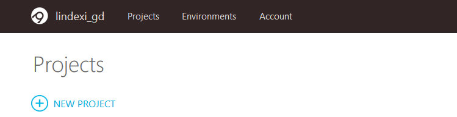
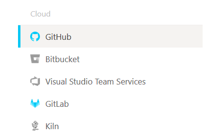
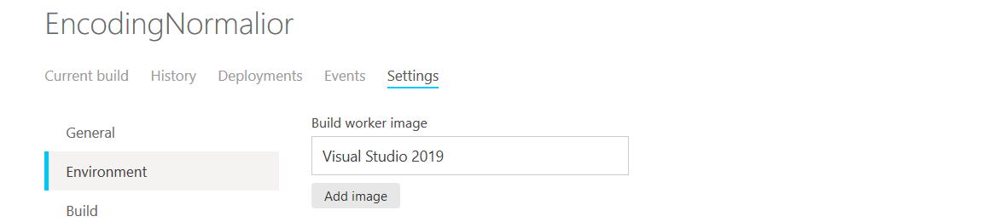
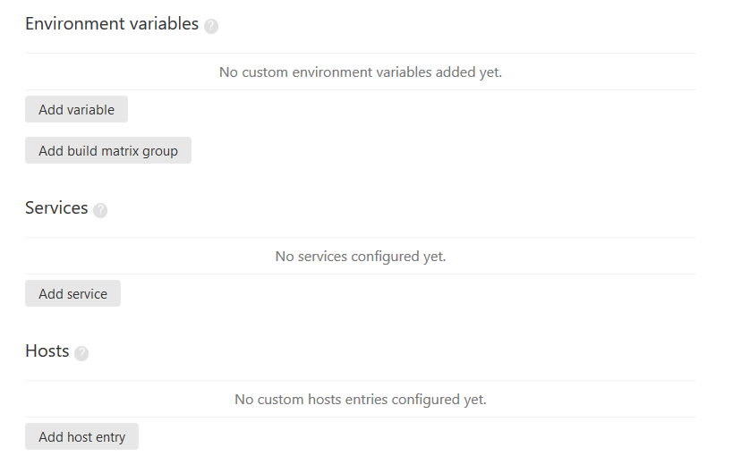
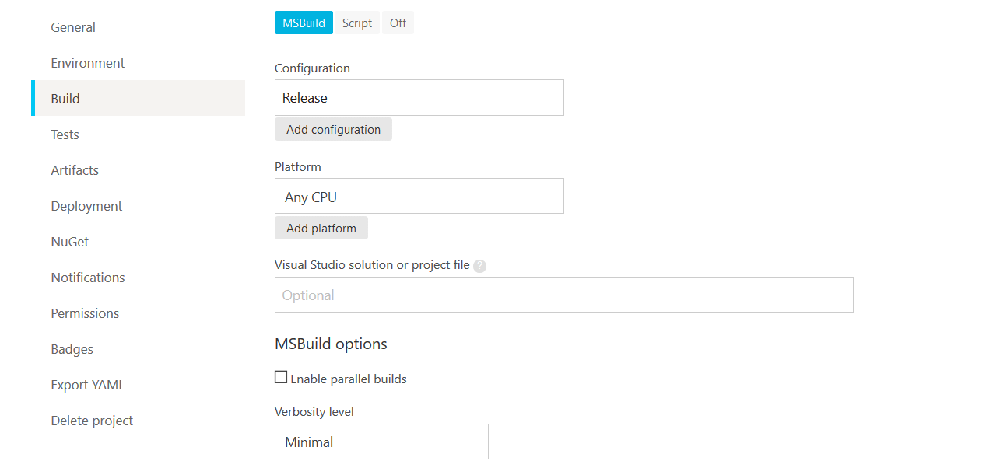
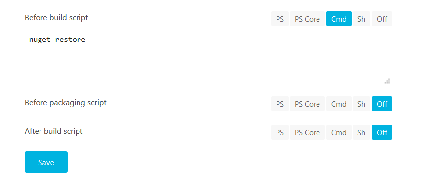
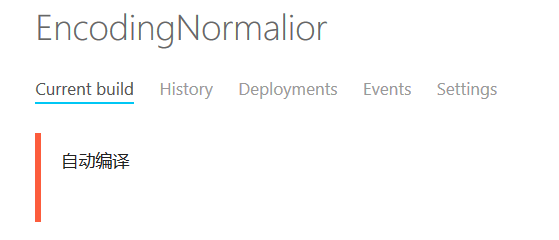
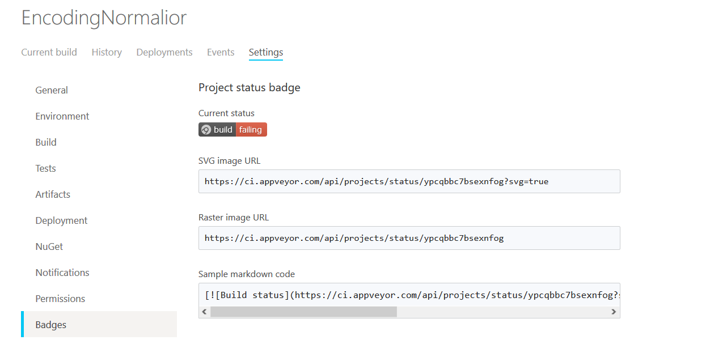
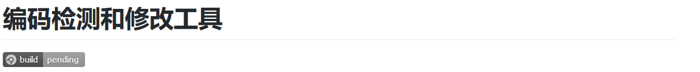

# 开源项目使用 appveyor 自动构建

我写了几个开源项目，我想要有小伙伴提交的时候自动运行单元测试，自动运行编译，这样可以保证小伙伴提交清真的代码

本文将会告诉大家如何接入 appveyor 自动构建方案，在 Github 上给自己的开源项目进行自动构建

<!--more-->
<!-- CreateTime:2019/6/23 11:47:40 -->

在开源项目可以发现很多都有 `appveyor.yml` 文件，这个文件就是用来做自动构建的

此时有小伙伴 玩命夜狼 告诉我 “我没写过，但我觉得我能写” 我就吓到了，难道这个文件是需要手写的？我看到 [官方文档](https://www.appveyor.com/docs/build-configuration/ ) 发现内容超级多，也就是在开始写之前，我需要学很久？

我可不是一个会学东西的金鱼因为我很快就不记得我看了什么

好在 [appveyor](https://ci.appveyor.com/projects) 提供了网页配置方案，首先是通过 Github 登陆

在登陆之后点击新建项目

<!--  -->

从 Github 上找到自己期望接入的开源项目

<!--  -->

在这个页面的右边将会列出你的所有项目，鼠标移动到项目上可以看到 Add 按钮，点击就可以添加

添加完成返回页面，点击对应项目的设置选项，在设置选项里面提供了很多编译的设置，在设置完成之后，可以看到 Export YAML 的标签，在这个标签里面就可以下载 `appveyor.yml` 文件，也就是说这个配置文件可以不手写，可以在网页上经过配置自动创建

接下来使用我的编码规范工具作为例子告诉大家如何做设置

按照标签提供的方向，一个个进入，第一项是总的配置，一般不需要做更改

第二项是环境，用于配置编译需要的环境，如编译使用的镜像，我默认选择了 VisualStudio 2019 作为镜像。在编译的时候将会通过 Docker 下载 VisualStudio 2019 的镜像，也就是一个 Windows 的系统上包含了 VisualStudio 2019 安装的镜像，将会在这个镜像里面进行编译

<!--  -->

在这个环境标签还可以设置编译时的环境变量和 HOST 等

<!--  -->

在准备完成了环境，下一步就是 Build 了，在开始选择了自己的项目之后，在自动构建里面将会自动识别这是一个 .NET 的程序，可以使用 msbuild 编译，于是很多预设的配置就已经写好

<!--  -->

在 Configuration 上可以配置以什么方式编译，如 DEBUG 还是 RELEASE 编译，在 Platform 上可以选择编译平台，这些选项都支持多选

在 Build 页面最下可以找到编译前执行命令，我使用的是之前版本的 csproj 格式，需要通过 NuGet 命令行还原。此时需要点击添加脚本命令，可以看到提供的脚本有 PowerShell 和 .NET Core 版本的 PowerShell 和 Cmd 等脚本方式，我这里选择使用 Cmd 脚本

<!--  -->

在使用的 VisualStudio 2019 镜像已经添加了很多环境变量和安装了很多程序，这里可以直接写 NuGet 而不需要先下载

其他的配置项都是不重要的，小伙伴可以自己去玩一下

在设置完成之后，点击 Export YAML 页面，可以下载刚才的配置，将下载的配置放在自己仓库的根文件夹，然后提交到 Github 上，返回 Current build 页面，可以看到正在编译

<!--  -->

自动构建完成是不是需要和小伙伴炫耀一下？在 [ci.appveyor.com](https://ci.appveyor.com) 提供了好看的图标，可以用来放在项目的首页

<!--   -->

点击设置在 Badges 页面将 markdown code 复制放在自己开源项目的首页文档里面，这样就可以看到下图效果

<!--  -->

嗯，上图是因为我写了逗比代码，没有编译成功。小伙伴一看这个项目就知道这个项目的作者是不是逗比了，一个编译不通过的项目都敢放在这

还是回到主题，通过自动构建可以在每次提交和修改的时候自动跑一下编译，因为有些小伙伴会在提交的时候忘记添加一些文件，或者依赖自己本地的某些文件才能编译成功，此时提交上去将会编译不通过。在提交的时候自动构建，可以快速告诉开发当前的提交是否会让项目编译不通过，在刚做出逗比代码的时候发现是哪里逗比需要的时间很短，这样会比我随意提交一些代码到仓库，然后其他小伙伴拉代码发现编译不通过时需要找到逗比代码的时间短很多

对于复杂项目需要定制的，还是需要阅读稳定自己写配置。另外 [ci.appveyor.com](https://ci.appveyor.com) 不仅提供给开源项目的自动构建，还可以购买本地版部署在自己的服务器

本文提到的 玩命夜狼 是在做 [The complete WPF tutorial](https://wpf-tutorial.com/zh/1/%E5%85%B3%E4%BA%8Ewpf/%E4%BB%80%E4%B9%88%E6%98%AFwpf/ ) 文档翻译的大佬，这部分文章很适合新手入门

 本作品采用<a rel="license" href="http://creativecommons.org/licenses/by-nc-sa/4.0/">知识共享署名-非商业性使用-相同方式共享 4.0 国际许可协议</a>进行许可。欢迎转载、使用、重新发布，但务必保留文章署名[林德熙](http://blog.csdn.net/lindexi_gd)(包含链接:http://blog.csdn.net/lindexi_gd )，不得用于商业目的，基于本文修改后的作品务必以相同的许可发布。如有任何疑问，请与我[联系](mailto:lindexi_gd@163.com)。
