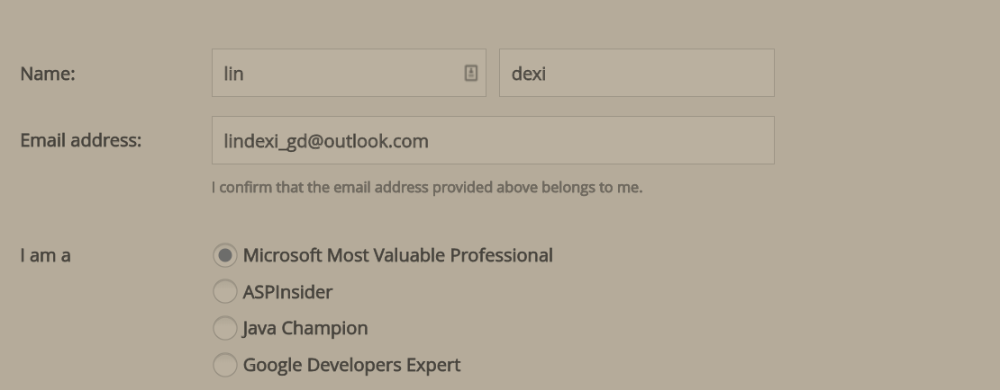
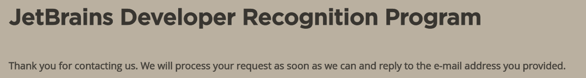

# 微软最具价值专家 MVP 如何获得 Resharper 的免费功能

很多的开发工具都欢迎微软最具价值专家 MVP 使用这些工具，为了吸引更多的用户，会有各种活动

小伙伴都知道 Resharper 是太阳系 IDE 的最好插件，但是这个插件是比较贵的，虽然我的团队买了一堆

为了在自己的设备上体验 Resharper 强大的功能，于是我就通过 MVP 的福利注册了 Resharper 的账号，这样就可以免费使用，但是有一个义务就是给 Resharper 多加宣传。

<!--more-->
<!-- CreateTime:2018/12/21 11:29:00 -->

<!-- csdn -->

打开 Resharper 的这个页面 [https://www.jetbrains.com/shop/eform/devrecognition](https://www.jetbrains.com/shop/eform/devrecognition) 在这里填写个人的信息

<!--  -->

这里有链接是 Verification link 要求写自己的链接，在 [MVP](https://mvp.microsoft.com/en-us/MvpSearch?sc=s) 网站找到自己的信息，如我的信息 [Dexi Lin](https://mvp.microsoft.com/en-us/PublicProfile/5003260?fullName=Dexi%20Lin ) 复制链接填写，填写完成就点击接受

<!--  -->

当前还可以点击一下看一下协议有什么，我看了一遍，和普通的软件的协议差不多

点击之后就会在 Resharper 的后台进行判断是否信息是真的，如果是的就会发邮件给你

<!--  -->

所以作为微软最具价值专家 MVP 的福利还是很多的，最近微软修改了成为 MVP 的条件，暂时不支持个人的申请，想要申请 MVP 需要由现在的 MVP 推荐，刚好我现在就是 MVP 可以推荐。

如果需要推荐的小伙伴欢迎联系我

 本作品采用<a rel="license" href="http://creativecommons.org/licenses/by-nc-sa/4.0/">知识共享署名-非商业性使用-相同方式共享 4.0 国际许可协议</a>进行许可。欢迎转载、使用、重新发布，但务必保留文章署名[林德熙](http://blog.csdn.net/lindexi_gd)(包含链接:http://blog.csdn.net/lindexi_gd )，不得用于商业目的，基于本文修改后的作品务必以相同的许可发布。如有任何疑问，请与我[联系](mailto:lindexi_gd@163.com)。
